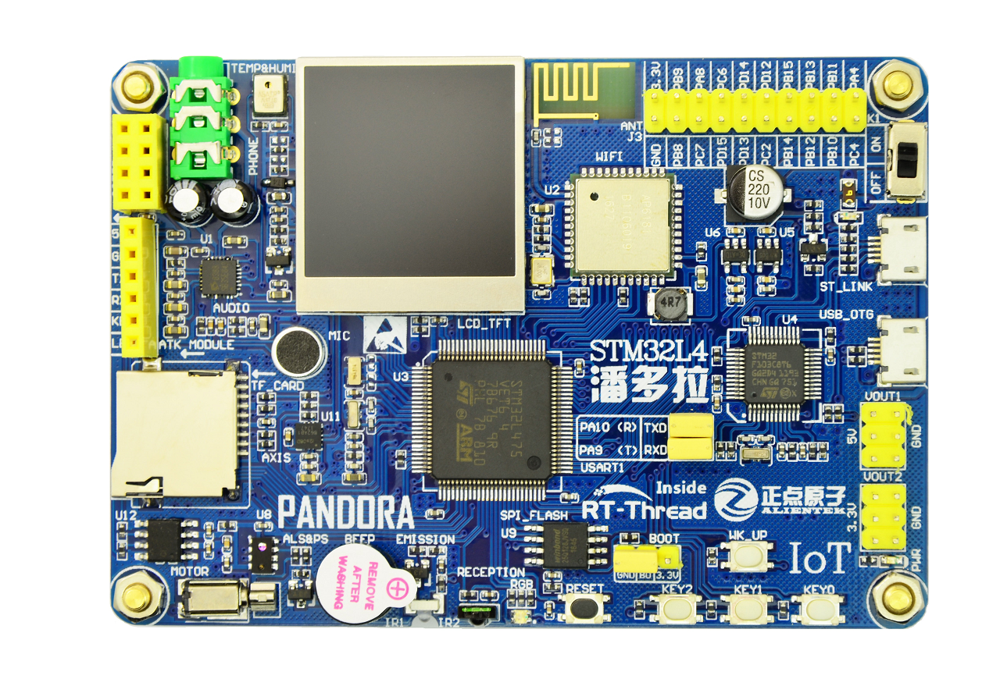

# RT-Thread IoT-Board SDK 说明
## ⚠️注意

最新源码在[此处维护](https://github.com/RT-Thread/rt-thread/tree/master/bsp/stm32/stm32l475-atk-pandora)，您可以结合[本仓库的文档](https://github.com/RT-Thread/IoT_Board/tree/master/docs)并体验最新的源码。

## 内容简介

RT-Thread IoT SDK 由开发平台 IoT Board 的详细介绍和丰富的软件资源组成。

随着物联网的兴起，新的开发需求不断涌现，越来越多的设备需要添加联网功能。此时使用传统的开发方式已经不足以应对日益丰富的需求，为了提高开发效率，需要使用更多的通用组件。因此在 IoT SDK 中，不仅有对开发板资源使用方式的内容，还会介绍 RT-Thread 中的通用组件以及丰富的面向物联网应用的软件包。有了这些软件包助力，会给开发者在开发过程中带来极大的便利。

## IoT Board 开发板资源简介

### 硬件资源说明

IoT Board 开发板如下图所示：

IoT Board 开发板核心芯片资源如下：

具有 128KB SRAM 、512KB FLASH、9 个 16 位定时器、2 个 32 定时器、2 个 DMA 控制器（共 14 个通道）、3 个 SPI、2 个 SAI、3 个 IIC、5 个串口、一个低功耗串口、一个全速 USB OTG、一个 CAN 接口、3 个 12 位 ADC、2 个 12 位 DAC、一个 RTC（带日历功能）、一个 SDIO 接口、一个 FSMC 接口、一个硬件随机数生成器、以及 82 个通用 IO 口、芯片主频为 80MHz。

### 软件资源说明

本节我们将介绍 IoT SDK 的软件资源，IoT SDK 提供的例程多达 30 个，每个例程都有非常详细的注释，代码风格统一，按照基本例程到高级例程的方式编排，方便初学者由浅入深逐步学习。每个例程都提供 MDK 和 IAR 工程，并且支持 GCC 开发环境，开发者拿到工程后经过简单的编译和下载即可看到实验现象。

这些例程为 RT-Thread 原创例程，包括四个类别：基本类、驱动类、组件类和物联网类。不仅包括了硬件资源的应用，更是提供了丰富的物联网领域的应用示例，帮助物联网开发者更好更快地进行开发。

例程列表如下所示：

| 编号 | 类别   | 例程名           | 说明                                                         |
| ---- | ------ | ---------------- | ------------------------------------------------------------ |
| 01   | 基础   | led_blink        | 红色 LED 不间断闪烁                                          |
| 02   | 基础   | rgb_led          | RGB LED 变色                                                 |
| 03   | 基础   | key              | 板载按键                                                     |
| 04   | 基础   | beep_motor       | 使用按键控制蜂鸣器和电机                                     |
| 05   | 基础   | ir               | 模拟红外线遥控器                                             |
| 06   | 驱动   | lcd              | LCD 显示文字和图片                                           |
| 07   | 驱动   | temp_humi        | 驱动温湿度传感器 AHT10                                       |
| 08   | 驱动   | als_ps           | 驱动光强/接近传感器 AP3216C                                  |
| 09   | 驱动   | axis             | 驱动 6 轴陀螺仪 ICM-20608                                    |
| 10   | 组件   | usb_mouse        | 模拟 USB 鼠标                                                |
| 11   | 组件   | fs_tf_card       | 基于 TF 卡的文件系统例程                                     |
| 12   | 组件   | pm               | 低功耗例程                                                   |
| 13   | 组件   | fal              | 使用 Flash 抽象层组件（FAL）管理 Flash 及 分区               |
| 14   | 组件   | kv               | 使用 EasyFlash 完成 KV 参数存储                              |
| 15   | 组件   | fs_flash         | 基于 SPI Flash 的文件系统例程                                |
| 16   | 物联网 | wifi_manager     | 使用 WiFi Manager 管理、操作 WiFi 网络                       |
| 17   | 物联网 | at_wifi_8266     | 通过外接的 ESP8266 AT 指令 WiFi 模块接入网络                 |
| 18   | 物联网 | spi_eth_enc28j60 | 通过外接的 ENC28J60 以太网模块接入网络                       |
| 19   | 物联网 | mqtt             | 使用 Paho-MQTT 软件包实现 MQTT 协议通信                      |
| 20   | 物联网 | http_client      | 使用 Web Client 软件包实现 HTTP Client                       |
| 21   | 物联网 | tls              | 使用 mbedtls 软件包完成 TLS 通信                             |
| 22   | 物联网 | ota_ymodem       | 通过串口 Ymodem 协议完成 OTA 固件升级                        |
| 23   | 物联网 | ota_http         | 通过 HTTP 协议完成 OTA 固件升级                              |
| 24   | 物联网 | netutils         | 网络小工具集使用例程                                         |
| 25   | 物联网 | cloud_rtt        | 接入 RT-Thread 设备维护云平台，实现 OTA 固件升级、远程 Shell 控制以及远程 log 存储功能 |
| 26   | 物联网 | cloud_onenet     | 接入中国移动 OneNET 云平台                                   |
| 27   | 物联网 | cloud_ali_iotkit | 接入阿里云物联网平台                                         |
| 28   | 物联网 | cloud_ms_azure   | 接入微软 Azure 物联网平台                                    |
| 29   | 物联网 | web_server       | 创建一个 Web 服务器                                          |
| 30   | 综合   | demo             | 综合性示例演示                                               |
| 31   |        | micropython      | MicroPython 例程                                             |

## 文档说明

docs 文件夹下的文档列表如下所示：

| 文档名称                                         | 说明                                     |
| ------------------------------------------------ | ---------------------------------------- |
| board 文件夹                                        | 开发板相关说明文档，如原理图、数据手册等 |
| AN0001-RT-Thread-串口设备应用笔记.pdf               | 串口驱动笔记                             |
| AN0002-RT-Thread-通用 GPIO 设备应用笔记.pdf         | 通用 GPIO 设备应用笔记                   |
| AN0003-RT-Thread-I2C 设备应用笔记.pdf               | I2C 设备应用笔记                         |
| AN0004-RT-Thread-SPI 设备应用笔记.pdf               | SPI 设备应用笔记                         |
| AN0006-RT-Thread-使用 QEMU 进行仿真调试.pdf         | 使用 QEMU 调试 RT-Thread                 |
| AN0009-RT-Thread_使用 SystemView 分析工具.pdf       | 使用 SystemView 调试                     |
| AN0010-RT-Thread-网络协议栈驱动移植笔记.pdf         | lwip 驱动移植                            |
| AN0011-RT-Thread-网络开发应用笔记.pdf               | 网络开发应用笔记                         |
| AN0012-RT-Thread-文件系统应用笔记.pdf               | RT-Thread 文件系统应用笔记               |
| AN0014-RT-Thread-AT 组件应用笔记-客户端篇.pdf       | RT-Thread AT 组件应用笔记 - 客户端篇     |
| AN0017-RT-Thread-创建标准的工程.pdf                 | 创建 RT-Thread 标准工程                  |
| AN0018-RT-Thread-网络工具集应用笔记.pdf             | RT-Thread 网络工具集 (NETUTILS)应用笔记  |
| AN0020-RT-Thread-使用 Eclipse + QEMU 调试.pdf       | 使用Eclipse + QEMU 调试 RT-Thread        |
| AN0021-RT-Thread-使用 VS Code + QEMU 调试.pdf       | 使用VS Code + QEMU 调试 RT-Thread        |
| AN0022-RT-Thread-ulog 日志组件应用笔记 - 基础篇.pdf | RT-Thread ulog 日志组件应用笔记- 基础篇  |
| AN0023-RT-Thread-使用 QEMU 运行动态模块.pdf         | 使用QEMU 运行 RT-Thread动态模块          |
| AN0024-RT-Thread-ulog 日志组件应用笔记 - 进阶篇.pdf | RT-Thread ulog 日志组件应用笔记- 进阶篇  |
| AN0025-RT-Thread-电源管理组件应用笔记.pdf           | 电源管理应用笔记                         |
| RT-Thread 编程指南.pdf                              | RT-Thread 编程指南                       |
| UM1001-RT-Thread-WebClient 用户手册.pdf             | WEBCLIENT 用户手册                       |
| UM1002-RT-Thread-ali-iotkit 用户手册.pdf            | RT-Thread ALI-IOTKIT 用户手册            |
| UM1003-RT-Thread-OneNET 用户手册.pdf                | RT-Thread ONENET 用户手册                |
| UM1004-RT-Thread-OTA 用户手册.pdf                   | RT-Thread OTA 用户手册                   |
| UM1005-RT-Thread-Paho-MQTT 用户手册.pdf             | PAHO-MQTT 用户手册                       |
| UM1006-RT-Thread-MbedTLS 用户手册.pdf               | RT-Thread MBEDTLS 用户手册               |
| UM1007-RT-Thread-Azure-IoT-SDK 用户手册.pdf         | AZURE-IOT-SDK 用户手册                   |
| UM1008-RT-Thread-设备维护云平台用户手册.pdf         | RT-Thread 云平台用户手册                 |
| UM1009-RT-Thread-电源管理组件用户手册.pdf           | POWER MANAGEMENT 用户手册                |
| UM1010-RT-Thread-Web 服务器(WebNet)用户手册.pdf     | RT-Thread WEBNET 用户手册                |
| UM3001-RT-Thread-IoT Board WIFI 模块固件下载手册.pdf| IOT-BOARD WIFI 模块下载固件              |
| UM3002-RT-Thread-IoT Board 发布说明.pdf             | RT-Thread IOT-BOARD SDK 发布说明         |
| UM3003-RT-Thread-IoT Board 介绍.pdf                 | RT-Thread IOT-BOARD SDK 说明             |
| UM3004-RT-Thread-IoT Board 快速上手.pdf             | RT-Thread IOT-BOARD SDK 快速入门         |
| UM3005-RT-Thread-IoT Board 开发手册.pdf             | RT-Thread IOT-BOARD SDK 开发手册         |

## 预备知识

使用 IoT SDK 需要的预备知识如下所示：

- RT-Thread 基本知识
- RT-Thread 开发环境

学习 RT-Thread 基本知识可以从文档中心的 [《RT-Thread 入门指南》](https://www.RT-Thread.org/document/site/rtthread-tutorial/gd0001-rtthread-introducing/) 开始，深入开发 RT-Thread 可以阅读 [《RT-Thread 开发指南》](https://www.RT-Thread.org/document/site/rtthread-development-guide/README/) 。

