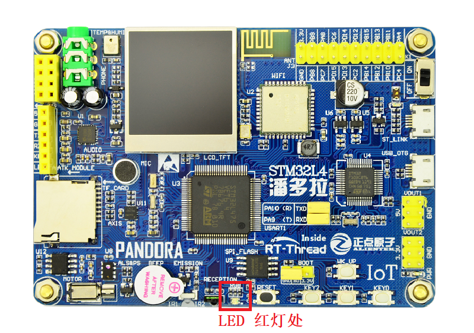
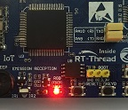

# LED 闪烁例程

## 简介

本例程作为 SDK 的第一个例程，也是最简单的例程，类似于程序员接触的第一个程序 Hello World 一样简洁。

它的主要功能是让板载的 RGB-LED 中的红色 LED 不间断闪烁。

## 硬件说明


如上图所示，RBG-LED 属于共阳 LED ，**阴极** 分别与单片机的引脚连接，其中红色 LED 对应 **PE7** 引脚。单片机引脚输出低电平即可点亮 LED ，输出高电平则会熄灭 LED。

LED 在开发板中的位置如下图所示：



## 软件说明

闪灯的源代码位于 `/examples/01_basic_led_blink/applications/main.c` 中。首先定义了一个宏 `LED_PIN` ，代表闪灯的 LED 引脚编号，然后与 `PIN_LED_R`（**PE7**）对应：

```c
/* 配置 LED 灯引脚 */
#define LED_PIN              PIN_LED_R
```

在 main 函数中，将该引脚配置为输出模式，并在下面的 while 循环中，周期性（500毫秒）开关 LED，同时输出一些日志信息。

```c
int main(void)
{
    unsigned int count = 1;

    /* 设置 LED 引脚为输出模式 */
    rt_pin_mode(LED_PIN, PIN_MODE_OUTPUT);

    while (count > 0)
    {
        /* LED 灯亮 */
        rt_pin_write(LED_PIN, PIN_LOW);
        LOG_D("led on, count: %d", count);
        rt_thread_mdelay(500);

        /* LED 灯灭 */
        rt_pin_write(LED_PIN, PIN_HIGH);
        LOG_D("led off");
        rt_thread_mdelay(500);

        count++;
    }

    return 0;
}
```

## 运行

### 编译&下载

- **MDK**：双击 `project.uvprojx` 打开 MDK5 工程，执行编译。
- **IAR**：双击 `project.eww` 打开 IAR 工程，执行编译。

编译完成后，将开发板的 ST-Link USB 口与 PC 机连接，然后将固件下载至开发板。

### 运行效果

按下复位按键重启开发板，观察开发板上 RBG-LED 的实际效果。正常运行后，红色 LED 会周期性闪烁，如下图所示：



此时也可以在 PC 端使用终端工具打开开发板的 ST-Link 提供的虚拟串口，设置 115200 8 1 N 。开发板的运行日志信息即可实时输出出来。

```shell
[D/main] led on, count: 1
[D/main] led off
[D/main] led on, count: 2
[D/main] led off
[D/main] led on, count: 3
[D/main] led off
[D/main] led on, count: 4
[D/main] led off
[D/main] led on, count: 5
[D/main] led off
[D/main] led on, count: 6
[D/main] led off
[D/main] led on, count: 7
[D/main] led off
[D/main] led on, count: 8
```

## 注意事项

如果想要修改`LED_PIN` 宏定义，可以参考 `/drivers/drv_gpio.h` 文件，该文件中里有定义单片机的其他引脚编号。

## 引用参考

- 《通用GPIO设备应用笔记》: docs/AN0002-RT-Thread-通用 GPIO 设备应用笔记.pdf
- 《RT-Thread 编程指南》: docs/RT-Thread 编程指南.pdf