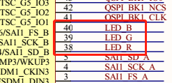
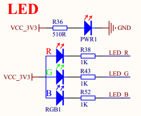
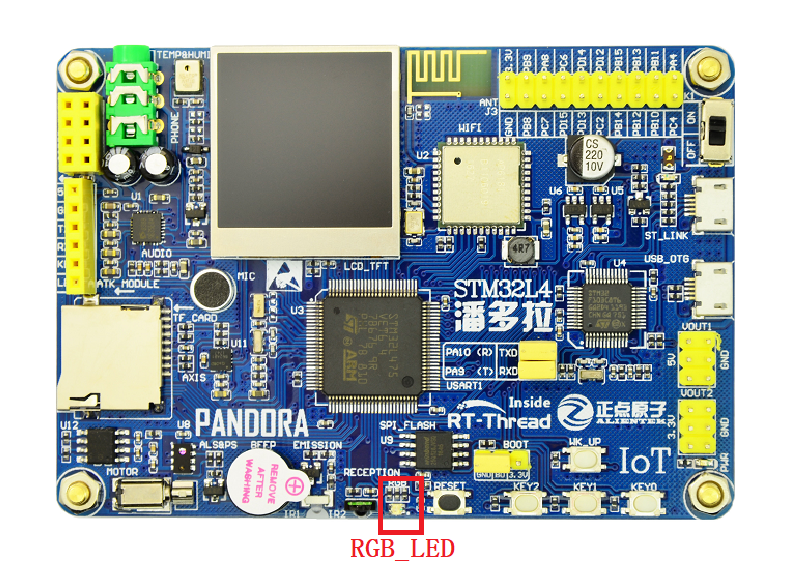
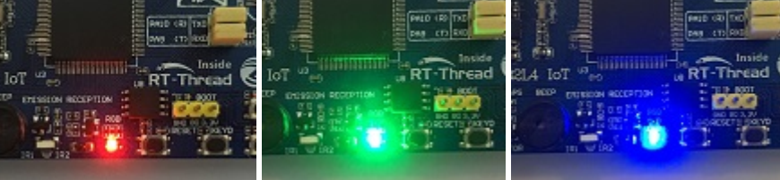

# RGB LED 例程

## 简介

本例程主要功能是让板载的 RGB-LED 灯周期性地变换颜色。

## 硬件说明





如上图所示，RGB-LED 属于共阳 LED ，**阴极** 分别与单片机的引脚连接，其中红色 LED 对应 **PE7** 号引脚，蓝色 绿色 LED 对应 **PE8** 号引脚，LED 对应 **PE9** 号引脚。单片机对应的引脚输出低电平即可点亮对应的 LED ，输出高电平则会熄灭对应的 LED。

RGB-LED 在开发板中的位置如下图所示：



## 软件说明

RGB-LED 对应的单片机引脚定义可以通过查阅头文件 `/drivers/drv_gpio.h` 获知。

```c
#define PIN_LED_R       GET_PIN(E, 7)      // PE7 :  LED_R        --> LED
#define PIN_LED_G       GET_PIN(E, 8)      // PE8 :  LED_B        --> LED
#define PIN_LED_B       GET_PIN(E, 9)      // PE9 :  LED_G        --> LED
```

RGB-LED 灯变换的源代码位于 `/examples/02_basic_rgb_led/applications/main.c` 中。

在 main 函数中，将三个引脚配置为输出模式，并在下面的 while 循环中，每500毫秒变化一次 RGB 颜色，同时输出一些日志信息，一共有 8 组变化。

```c
int main(void)
{
    unsigned int count = 1;
    unsigned int group_num = sizeof(_blink_tab)/sizeof(_blink_tab[0]);
    unsigned int group_current;

    /* 设置 RGB 灯引脚为输出模式 */
    rt_pin_mode(PIN_LED_R, PIN_MODE_OUTPUT);
    rt_pin_mode(PIN_LED_G, PIN_MODE_OUTPUT);
    rt_pin_mode(PIN_LED_B, PIN_MODE_OUTPUT);

    while (count > 0)
    {
        /* 获得组编号 */
        group_current = count % group_num;

        /* 控制 RGB 灯 */
        rt_pin_write(PIN_LED_R, _blink_tab[group_current][0]);
        rt_pin_write(PIN_LED_G, _blink_tab[group_current][1]);
        rt_pin_write(PIN_LED_B, _blink_tab[group_current][2]);

        /* 输出 LOG 信息 */
        LOG_D("group: %d | red led [%-3.3s] | green led [%-3.3s] | blue led [%-3.3s]",
            group_current,
            _blink_tab[group_current][0] == LED_ON ? "ON" : "OFF",
            _blink_tab[group_current][1] == LED_ON ? "ON" : "OFF",
            _blink_tab[group_current][2] == LED_ON ? "ON" : "OFF");

        /* 延时一段时间 */
        rt_thread_mdelay(500);
        count++;
    }
    return 0;
}
```

## 运行

### 编译&下载

- **MDK**：双击 `project.uvprojx` 打开 MDK5 工程，执行编译。
- **IAR**：双击 `project.eww` 打开 IAR 工程，执行编译。

编译完成后，将开发板的 ST-Link USB 口与 PC 机连接，然后将固件下载至开发板。

### 运行效果

按下复位按键重启开发板，观察开发板上 RBG-LED 的实际效果。正常运行后，RGB 会周期性变化，如下图所示：



此时也可以在 PC 端使用终端工具打开开发板的 ST-Link 提供的虚拟串口，设置 115200 8 1 N 。开发板的运行日志信息即可实时输出出来。

```shell
[D/main] group: 0 | red led [ON ] | green led [ON ] | blue led [ON ]
[D/main] group: 1 | red led [OFF] | green led [ON ] | blue led [ON ]
[D/main] group: 2 | red led [ON ] | green led [OFF] | blue led [ON ]
[D/main] group: 3 | red led [ON ] | green led [ON ] | blue led [OFF]
[D/main] group: 4 | red led [OFF] | green led [OFF] | blue led [ON ]
[D/main] group: 5 | red led [ON ] | green led [OFF] | blue led [OFF]
[D/main] group: 6 | red led [OFF] | green led [ON ] | blue led [OFF]
[D/main] group: 7 | red led [OFF] | green led [OFF] | blue led [OFF]
```

## 注意事项

暂无。

## 引用参考

- 《通用GPIO设备应用笔记》: docs/AN0002-RT-Thread-通用 GPIO 设备应用笔记.pdf
- 《RT-Thread 编程指南》: docs/RT-Thread 编程指南.pdf