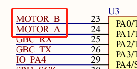
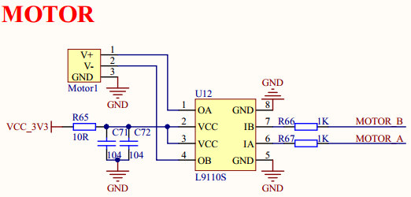
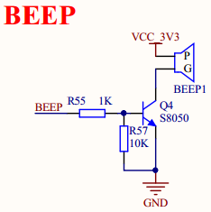
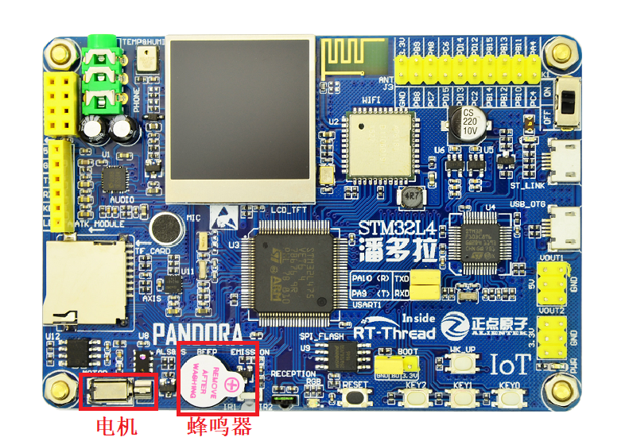

# 蜂鸣器和电机控制例程

## 简介

本例程主要功能为使用按键控制蜂鸣器和电机，当按下 KEY0 后电机左转，当按下 KEY1 后电机右转，当按下 KEY2 后电机停止，当按住 WK_UP 时蜂鸣器鸣叫，松开 WK_UP 后蜂鸣器关闭。其中 KEY0 KEY1 KEY2 三个按键会触发中断，通过 pin 设备的中断回调函数控制电机， WK_UP 按键通过轮询的方式控制蜂鸣器鸣叫。

## 硬件说明





如上图所示，`MOTOR_A` PA1，`MOTOR_B` PA0 分别连接电机驱动芯片 `L9110S` 的控制引脚，控制逻辑如下表格所示。

|IA|IB|OA|OB|电机动作|
|--|--|--|--|--|
|H|L|H|L|右转|
|L|H|L|H|左转|
|L|L|L(刹车)|L（刹车）|停止|
|H|H|Z（高阻）|Z（高阻）|停止|




如上图所示，`BEEP` PB0 引脚控制板载蜂鸣器。

电机与蜂鸣器在开发板中的位置如下图所示：




## 软件说明

按键控制蜂鸣器和电机的源代码位于 `/examples/04_basic_beep_motor/applications/main.c` 中。

1. 查对应原理图可知， KEY0 、 KEY1 、KEY2 按下为低电平，松开为高电平， WK_UP 按下为高电平，松开为低电平。所以在 main 函数中，首先将 KEY0 、 KEY1 、KEY2 三个按键引脚配置为上拉输入模式，WK_UP 按键设置为下拉输入模式，将`PIN_MOTOR_A` `PIN_MOTOR_B` `PIN_BEEP` 引脚设置为输出模式。
2. 然后使用 `rt_pin_attach_irq` 函数分别设置 KEY0 、 KEY1 、KEY2 按键中断为下降沿触发中断并且绑定回调函数、设置回调函数相应的入参,使用 `rt_pin_irq_enable` 函数使能这三个按键中断。
3. 最后在 while 循环里轮询 WK_UP 的按键状态，当成功判断 WK_UP 按键按下时调用 `beep_ctrl(1)` 蜂鸣器鸣叫，否则调用 `beep_ctrl(0)` 蜂鸣器关闭。


```c
int main(void)
{
    unsigned int count = 1;

    /* 设置按键引脚为输入模式 */
    rt_pin_mode(PIN_KEY0, PIN_MODE_INPUT_PULLUP);
    rt_pin_mode(PIN_KEY1, PIN_MODE_INPUT_PULLUP);
    rt_pin_mode(PIN_KEY2, PIN_MODE_INPUT_PULLUP);
    rt_pin_mode(PIN_WK_UP, PIN_MODE_INPUT_PULLDOWN);

    /* 设置电机控制引脚为输入模式 */
    rt_pin_mode(PIN_MOTOR_A, PIN_MODE_OUTPUT);
    rt_pin_mode(PIN_MOTOR_B, PIN_MODE_OUTPUT);

    /* 设置蜂鸣器引脚为输出模式 */
    rt_pin_mode(PIN_BEEP, PIN_MODE_OUTPUT);

    /* 设置按键中断模式与中断回调函数 */
    rt_pin_attach_irq(PIN_KEY0, PIN_IRQ_MODE_FALLING, irq_callback, (void *)PIN_KEY0);
    rt_pin_attach_irq(PIN_KEY1, PIN_IRQ_MODE_FALLING, irq_callback, (void *)PIN_KEY1);
    rt_pin_attach_irq(PIN_KEY2, PIN_IRQ_MODE_FALLING, irq_callback, (void *)PIN_KEY2);

    /* 使能中断 */
    rt_pin_irq_enable(PIN_KEY0, PIN_IRQ_ENABLE);
    rt_pin_irq_enable(PIN_KEY1, PIN_IRQ_ENABLE);
    rt_pin_irq_enable(PIN_KEY2, PIN_IRQ_ENABLE);

    while (count > 0)
    {
        if (rt_pin_read(PIN_WK_UP) == PIN_HIGH)
        {
            rt_thread_mdelay(50);
            if (rt_pin_read(PIN_WK_UP) == PIN_HIGH)
            {
                LOG_D("WK_UP pressed. beep on.");
                beep_ctrl(1);
            }
        }
        else
        {
            beep_ctrl(0);
        }
        rt_thread_mdelay(10);
        count++;
    }
    return 0;
}
```

在中断回调函数中判断入参，根据不同入参进行相应的操作。

```c
/* 中断回调函数 */
void irq_callback(void *args)
{
    rt_uint32_t sign = (rt_uint32_t)args;
    switch (sign)
    {
    case PIN_KEY0:
        motor_ctrl(MOTOR_LEFT);
        LOG_D("KEY0 interrupt. motor turn left.");
        break;
    case PIN_KEY1:
        motor_ctrl(MOTOR_RIGHT);
        LOG_D("KEY1 interrupt. motor turn right.");
        break;
    case PIN_KEY2:
        motor_ctrl(MOTOR_STOP);
        LOG_D("KEY2 interrupt. motor stop.");
        break;
    default:
        LOG_D("error sign= %d !", sign);
        break;
    }
}
```

## 运行

### 编译&下载

- **MDK**：双击 `project.uvprojx` 打开 MDK5 工程，执行编译。
- **IAR**：双击 `project.eww` 打开 IAR 工程，执行编译。

编译完成后，将开发板的 ST-Link USB 口与 PC 机连接，然后将固件下载至开发板。

### 运行效果

按下复位按键重启开发板，按下 KEY0 后电机左转，按下 KEY1 后电机右转，按下 KEY2 后电机停止，最后按住 WK_UP 后蜂鸣器鸣叫，松开 WK_UP 后蜂鸣器关闭。

|按键|功能|
|----|---|
|KEY0|电机左转|
|KEY1|电机右转|
|KEY2|电机停止|
|WK_UP|蜂鸣器鸣叫|

此时也可以在 PC 端使用终端工具打开开发板的 ST-Link 提供的虚拟串口，设置 115200 8 1 N 。开发板的运行日志信息即可实时输出出来。

```shell
[D/main] KEY0 interrupt. motor turn left.
[D/main] KEY1 interrupt. motor turn right.
[D/main] KEY2 interrupt. motor stop.
[D/main] KEY2 interrupt. motor stop.
[D/main] WK_UP pressed. beep on.
```

## 注意事项

暂无。

## 引用参考

- 《通用GPIO设备应用笔记》: docs/AN0002-RT-Thread-通用 GPIO 设备应用笔记.pdf
- 《RT-Thread 编程指南》: docs/RT-Thread 编程指南.pdf