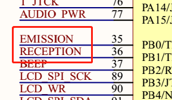
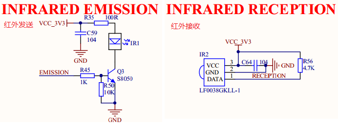
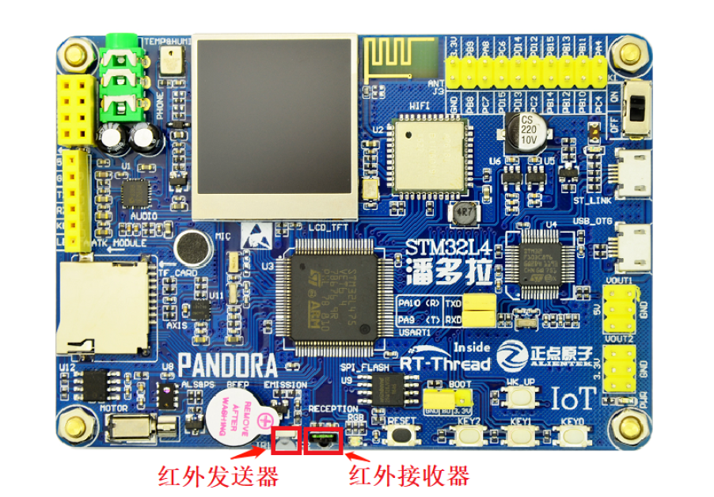

# 红外遥控例程

## 简介

本例程主要功能是通过板载的红外接收头接收红外遥控器信号以及通过板载的红外发射头发送红外信号。

## 硬件说明





如上图所示，红外发射脚 EMISSION 接单片机引脚 PB0，红外接收头引脚 RECEPTION 接单片机引脚 PB1（TIM3_CH4 通道）。

红外传感器在开发板中的位置如下图所示：



## 软件说明

红外例程的示例代码位于 `/examples/05_basic_ir/applications/main.c` 中，主要流程：选择 NEC 解码器，初始化 GPIO 引脚。然后在 while 循环中扫描按键、打印输出接收到的红外数据，当 KEY0 按下后将会把最近一次接收到的红外数据通过红外发射头发送出去。

```c
int main(void)
{
    unsigned int count = 1;
    rt_int16_t key;
    struct infrared_decoder_data infrared_data;

    /* 选择 NEC 解码器 */
    ir_select_decoder("nec");

    /* 设置按键引脚为输入模式 */
    rt_pin_mode(PIN_KEY0, PIN_MODE_INPUT);

    /* 设置 RGB 引脚为输出模式*/
    rt_pin_mode(PIN_LED_R, PIN_MODE_OUTPUT);
    rt_pin_mode(PIN_LED_B, PIN_MODE_OUTPUT);

    rt_pin_write(PIN_LED_R, PIN_HIGH);
    rt_pin_write(PIN_LED_B, PIN_HIGH);

    while (count > 0)
    {
        /* 按键扫描 */
        key = key_scan();
        if(key == PIN_KEY0)
        {
            /* 有按键按下，蓝灯亮起 */
            rt_pin_write(PIN_LED_B, PIN_LOW);
            infrared_data.data.nec.repeat = 0;
            /* 发送红外数据 */
            infrared_write("nec",&infrared_data);
            rt_thread_mdelay(200);
            LOG_I("SEND    OK: addr:0x%02X key:0x%02X repeat:%d",
                infrared_data.data.nec.addr, infrared_data.data.nec.key, infrared_data.data.nec.repeat);
        }
        else if(infrared_read("nec",&infrared_data) == RT_EOK)  
        {
            /* 读取到红外数据，红灯亮起 */
            rt_pin_write(PIN_LED_R, PIN_LOW);
            LOG_I("RECEIVE OK: addr:0x%02X key:0x%02X repeat:%d",
                infrared_data.data.nec.addr, infrared_data.data.nec.key, infrared_data.data.nec.repeat);
        }
        rt_thread_mdelay(10);

        /* 熄灭蓝灯 */
        rt_pin_write(PIN_LED_B, PIN_HIGH);
        /* 熄灭红灯 */
        rt_pin_write(PIN_LED_R, PIN_HIGH);
        count++;
    }
    return 0;
}
```

本例程的实现主要使用了红外软件包的以下三个函数：

```c
/* 选择解码器 */
rt_err_t ir_select_decoder(const char* name);
/* 读取红外数据。 */
rt_err_t infrared_read(const char* decoder_name,struct infrared_decoder_data* data);
/* 接收红外数据。 */
rt_err_t infrared_write(const char* decoder_name, struct infrared_decoder_data* data);
```

## 运行

### 编译&下载

- **MDK**：双击 `project.uvprojx` 打开 MDK5 工程，执行编译。
- **IAR**：双击 `project.eww` 打开 IAR 工程，执行编译。

编译完成后，将开发板的 ST-Link USB 口与 PC 机连接，然后将固件下载至开发板。

### 运行效果

按下复位按键重启开发板，观察板载 RGB 灯，用户可以使用红外遥控器对准板载红外接收头发送红外信号。在接收红外信号的时候，RGB 红灯闪烁。按下 KEY0 键，开发板将会通过红外发射头发送最近一次接收到的红外数据，发送红外数据时 RGB 蓝灯亮起。

此时也可以在 PC 端使用终端工具打开开发板的 ST-Link 提供的虚拟串口，设置波特率： 115200 ，数据位： 8 ，停止位： 1 N 。开发板的运行日志信息即可实时输出来。

```shell
 \ | /
- RT -     Thread Operating System
 / | \     4.0.1 build Apr  3 2019
 2006 - 2019 Copyright by rt-thread team
msh >[I/main] RECEIVE OK: addr:0x00 key:0x02 repeat:0
[I/main] RECEIVE OK: addr:0x00 key:0x02 repeat:1
[I/main] RECEIVE OK: addr:0x00 key:0xA8 repeat:0
[I/main] RECEIVE OK: addr:0x00 key:0xA8 repeat:1
[I/main] RECEIVE OK: addr:0x00 key:0xA8 repeat:0
[I/main] RECEIVE OK: addr:0x00 key:0x68 repeat:0
[I/main] RECEIVE OK: addr:0x00 key:0x68 repeat:1
[I/main] RECEIVE OK: addr:0x00 key:0x98 repeat:0
[I/main] SEND    OK: addr:0x00 key:0x98 repeat:0
[I/main] RECEIVE OK: addr:0x00 key:0x98 repeat:0
```

## 注意事项

请使用 38KHZ 载波的红外遥控器实验。

## 引用参考

- 《通用GPIO设备应用笔记》: docs/AN0002-RT-Thread-通用 GPIO 设备应用笔记.pdf
- 《RT-Thread 编程指南》: docs/RT-Thread 编程指南.pdf