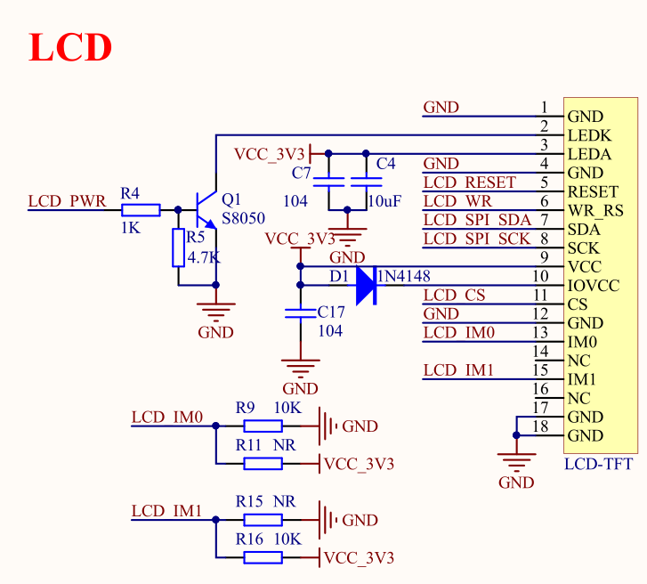
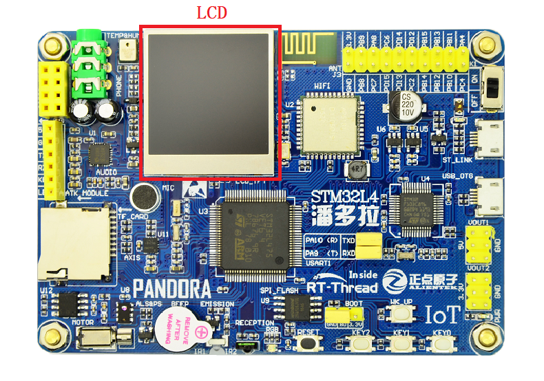
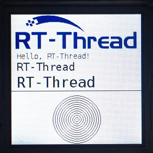

# LCD 显示例程

## 简介

本例程主要介绍了如何在 LCD 上显示文字和图片。

## 硬件说明

IOT Board 板载一块 1.3 寸，分辨率为 240*240 的 LCD 显示屏，显示效果十分细腻。显示屏的驱动芯片是 ST7789，通过 4-line SPI 接口和单片机进行通讯。因为只需要往 LCD 写数据而不需要读取，所以，可以不接 MISO 引脚。



如上图所示，单片机通过以下管脚来控制 LCD：

| 名称         | 管脚  | 作用  |
| ----------- | ---- | ---- |
| LCD_SPI_SCK | PB3  |SPI 时钟线|
| LCD_WR      | PB4  |SPI 命令数据选择|
| LCD_SPI_SDA | PB5  |SPI 数据线|
| LCD_RESET   | PB6  |LCD 复位|
| LCD_PWR     | PB7  |背光控制|
| LCD_CS      | PD7  |SPI 片选信号|

LCD 在开发板中的位置如下图所示：



## 软件说明

显示图片和文字的源代码位于 `/examples/06_driver_lcd/applications/main.c` 中。

在 main 函数中，通过调用已经封装好的 LCD API 函数，首先执行的是清屏操作，将 LCD 全部刷成白色。然后设置画笔的颜色为黑色，背景色为白色。接着显示 RT-Thread 的 LOGO。最后会显示一些信息，包括 16\*16 像素，24*24 像素和 32\*32 像素的三行英文字符，一条横线和一个同心圆。

```c
int main(void)
{    
    /* 清屏 */
    lcd_clear(WHITE);

    /* 显示 RT-Thread logo */
    lcd_show_image(0, 0, 240, 69, image_rttlogo);
    
    /* 设置背景色和前景色 */
    lcd_set_color(WHITE, BLACK);

    /* 在 LCD 上显示字符 */
    lcd_show_string(10, 69, 16, "Hello, RT-Thread!");
    lcd_show_string(10, 69+16, 24, "RT-Thread");
    lcd_show_string(10, 69+16+24, 32, "RT-Thread");
    
    /* 在 LCD 上画线 */
    lcd_draw_line(0, 69+16+24+32, 240, 69+16+24+32);
    
    /* 在 LCD 上画一个同心圆 */
    lcd_draw_point(120, 194);
    for (int i = 0; i < 46; i += 4)
    {
        lcd_draw_circle(120, 194, i);
    }

    return 0;
}
```

## 运行

### 编译&下载

- **MDK**：双击 `project.uvprojx` 打开 MDK5 工程，执行编译。
- **IAR**：双击 `project.eww` 打开 IAR 工程，执行编译。

编译完成后，将开发板的 ST-Link USB 口与 PC 机连接，然后将固件下载至开发板。

### 运行效果

按下复位按键重启开发板，观察开发板上 LCD 的实际效果。正常运行后，LCD上会显示 RT-Thread LOGO，下面会显示 3 行大小为 16、24、32 像素的文字，文字下面是一行直线，直线的下方是一个同心圆。如下图所示：



## 注意事项

屏幕的分辨率是240*240，输入位置参数时要注意小于240，不然会出现无法显示的现象。

图像的取模方式为自上而下，自左向右，高位在前，16位色（RGB-565）。

本例程未添加中文字库，不支持显示中文。

## 引用参考

- 《SPI 设备应用笔记 》: docs/AN0004-RT-Thread-SPI 设备应用笔记.pdf
- 《RT-Thread 编程指南 》: docs/RT-Thread 编程指南.pdf