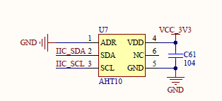
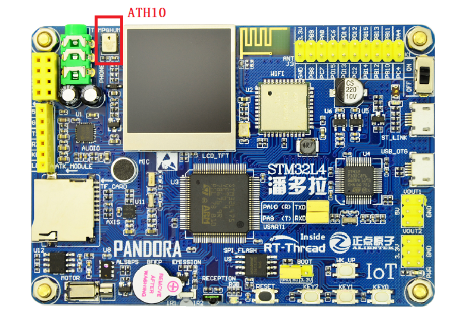

# AHT10 温湿度传感器例程

## 简介

本例程主要功能是利用 RT-Thread 的 AHT10 软件包的读取传感器 `aht10` 所测量的温度（temperature）与湿度（humidity）。

## AHT10 软件包简介

AHT10 软件包提供了使用温度与湿度传感器 `aht10` 基本功能，并且提供了软件平均数滤波器可选功能，如需详细了解该软件包，请参考 AHT10 软件包中的 [README](https://github.com/RT-Thread-packages/aht10/blob/master/README.md)。

## 硬件说明

`aht10` 硬件原理图如下所示：



如上图所示，单片机通过 IIC_SDA(PC1)、IIC_SCL2(PD6) 对传感器 `aht10` 发送命令、读取数据等。

温度与湿度传感器在开发板中的位置如下图所示：



该传感器输入电压范围为 `1.8v - 3.3v`，测量温度与湿度的量程、精度如下表所示：

| 功能     |   量程    |  精度   |  单位  |
| -------- | --------- | ------- |------- |
| 温度     | -40 - 85  | ±0.5    | 摄氏度 |
| 相对湿度 | 0 - 100   |  ±3     |   %    |

## 软件说明

温度与湿度传感器的示例代码位于 `/examples/07_driver_temp_humi/applications/main.c` 中，主要流程：初始化传感器 `aht10`，传入参数 `i2c2` 为该传感器挂载的 `i2c` 总线的名称；初始化若失败，则返回空，程序不会被执行，若成功，则返回传感器设备对象；然后将返回的设备对象分别传入读取湿度与温度的函数，获取测量的湿度与温度值（详细的 API 介绍参考 [`aht10`软件包](https://github.com/RT-Thread-packages/aht10)读取温度与湿度章节，源码参考 [aht10.c](https://github.com/RT-Thread-packages/aht10/blob/master/aht10.c) ）。示例代码如下：

```c
int main(void)
{
    float humidity, temperature;
    aht10_device_t dev;

    /* 总线名称 */
    const char *i2c_bus_name = "i2c2";
    int count = 0;

    /* 等待传感器正常工作 */
    rt_thread_mdelay(2000);

    /* 初始化 aht10 */
    dev = aht10_init(i2c_bus_name);
    if (dev == RT_NULL)
    {
        LOG_E(" The sensor initializes failure");
        return 0;
    }

    while (count++ < 100)
    {
        /* 读取湿度 */
        humidity = aht10_read_humidity(dev);
        LOG_D("humidity   : %d.%d %%", (int)humidity, (int)(humidity * 10) % 10);

        /* 读取温度 */
        temperature = aht10_read_temperature(dev);
        LOG_D("temperature: %d.%d", (int)temperature, (int)(temperature * 10) % 10);

        rt_thread_mdelay(1000);
    }
    return 0;
}
```

### 编译&下载

- **MDK**：双击 `project.uvprojx` 打开 MDK5 工程，执行编译。
- **IAR**：双击 `project.eww` 打开 IAR 工程，执行编译。

编译完成后，将开发板的 ST-Link USB 口与 PC 机连接，然后将固件下载至开发板。

### 运行效果

烧录完成后，此时可以在 PC 端使用终端工具打开开发板的 ST-Link 提供的虚拟串口，设置串口波特率为 115200，数据位 8 位，停止位 1 位，无流控，开发板的运行日志信息即可实时输出出来，显示如下所示：

```shell
 \ | /                                                                                                                              
- RT -     Thread Operating System
 / | \     4.0.1 build Mar 28 2019
 2006 - 2019 Copyright by rt-thread team
msh >[D/main] humidity   : 48.2 %
[D/main] temperature: 24.3
[D/main] humidity   : 48.2 %
[D/main] temperature: 24.4
[D/main] humidity   : 48.2 %
[D/main] temperature: 24.4
[D/main] humidity   : 48.2 %
[D/main] temperature: 24.4 
```

## 注意事项

暂无。

## 引用参考

- 《RT-Thread 编程指南》: docs/RT-Thread 编程指南.pdf
- 《I2C 设备应用笔记》: docs/AN0003-RT-Thread-I2C 设备应用笔记
- 《aht10 软件包介绍》：[https://github.com/RT-Thread-packages/aht10](https://github.com/RT-Thread-packages/aht10)