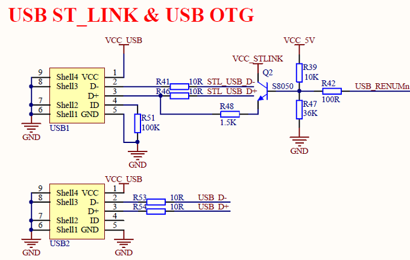
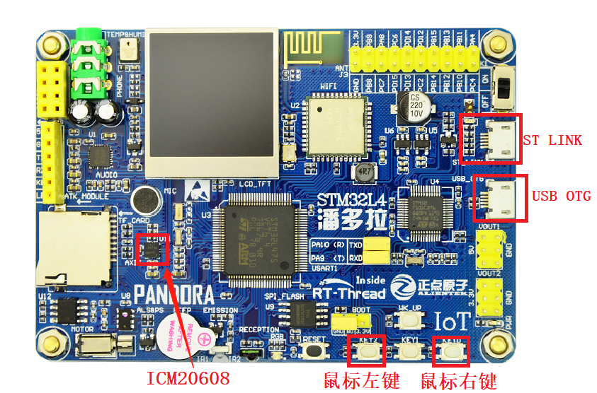
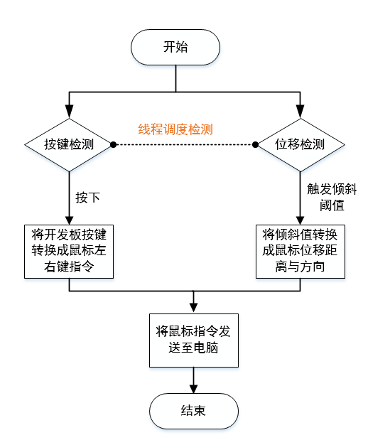
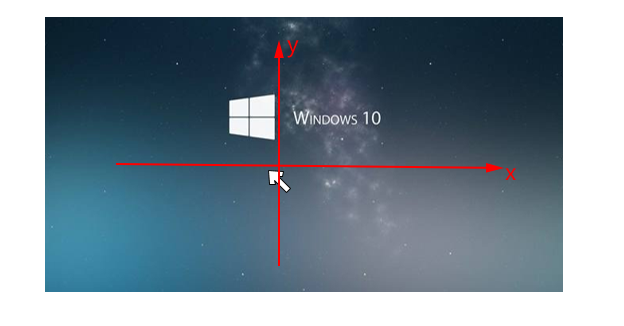
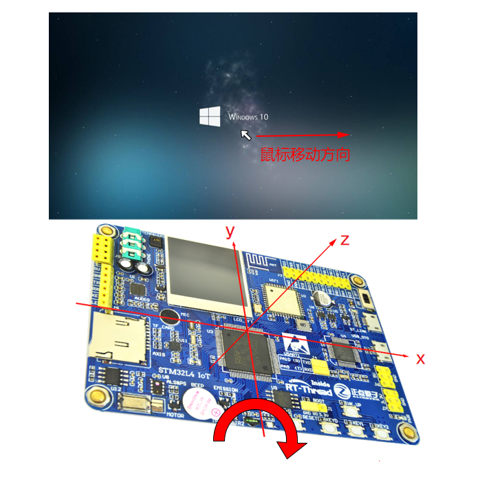
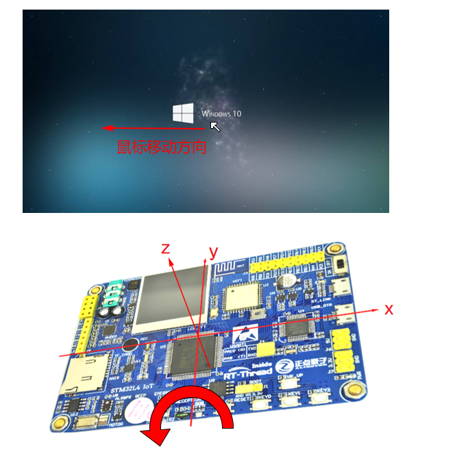
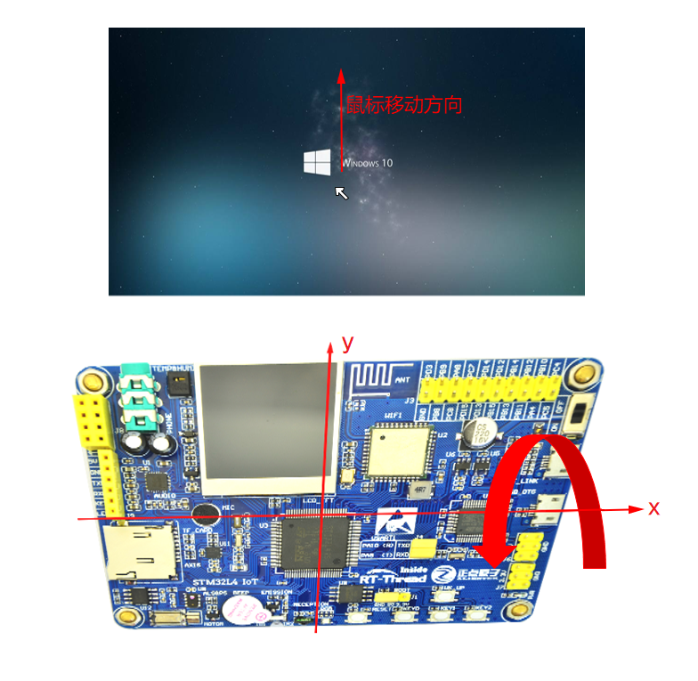
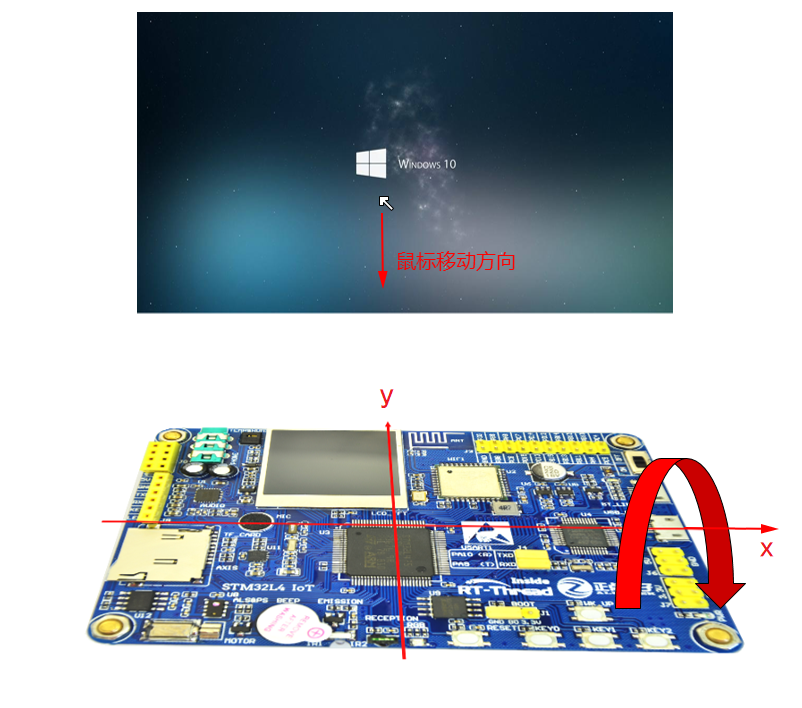

# USB 鼠标例程

## 例程简介

本例程使用板载的六轴传感器 `icm20608` 获取开发板的旋转方向及角度，然后转换为鼠标的位移信息。同时使用板载按键实现鼠标的左右键，最后将这些鼠标信息通过 RT-Thread 的 USB 组件发送至电脑，从而实现开发板模拟 USB 鼠标的功能。

## 相关组件与软件包简介

### RT-Thread USB 组件

该组件位于`/rt-thread/components/drivers/usb`，是 RT-Thread 依据 USB2.0 协议规范将 USB 协议栈逻辑高度抽象，支持 `host`（主机）模式、`device`（从机）模式。

该组件允许用户通过宏 RT_USB_DEVICE_COMPOSITE 开启复合功能，无需额外的代码即可对多个设备类型进行复合，虚拟串口、以太网卡、人体学输入设备、大容量存储设备、微软通用 USB 等。

该组件在驱动移植方面提供了非常友好的移植接口，用户可将厂商 SDK（软件开发工具包） 中 PCD（端口连接检测）驱动直接接入到 RT-Thread，实现 0 代码使用 USB。

### ICM20608 软件包

该软件包位于`/examples/10_component_usb_mouse/packages/icm20608-v1.0.0` 中，是 RT-Thread 针对六轴传感器 icm20608 功能使用的实现，使用这个软件包，可以让该传感器在 RT-Thread 上非常方便使用 icm20608 的基本功能，包括读取三轴加速度（3-axis accelerometer）、三轴陀螺仪（3-axis gyroscope）、零值校准等功能，如需详细了解该软件包，请参考 ICM20608 软件包中的 [README](https://github.com/RT-Thread-packages/icm20608/blob/master/README.md)。

## 硬件说明

IoT Board 的整体原理图位于： `/docs/board/STM32L4_IOT_Board_V2.2_Sch.pdf`，本例程主要用到的是 USB OTG，其原理图如下图所示：



如 USB 原理图所示：

- USB1 为 ST-Link 主要用于程序的下载与调试
- USB2 是本例程使用的 USB OTG 接口，其中 USB_D-(PA11) 、USB_D+(PA12) 为 USB 主机与从机的数据交互接口，本例程中开发板作为从机，电脑作为主机。

USB 接口、鼠标按键与传感器 `icm20608` 在开发板中的位置如下图所示 



上文提到的 USB1 对应硬件位置图中的 ST LINK 接口，USB2 对应 USB OTG 接口，鼠标左键为 KEY2,鼠标右键 KEY0。

## 软件说明

USB 鼠标例程位于 `/examples/10_component_usb_mouse` 目录下，重要文件摘要说明如下所示：

| 文件                     | 说明                     |
| ------------------------ | ------------------------ |
| **applications**         | 应用                     |
| applications/main.c      | app 入口                 |
| applications/joytick.c   | USB 鼠标应用主要文件     |
| **packages**             | 内含简易好用的官方软件包 |
| packages/icm20608-v1.0.0 | 六轴传感器               |

例程主要流程如下：

1. 初始化设备或者查找设备

   查找设备名称为 `hidd` 的 `hid` 设备，初始化 `icm20608` 传感器，初始化鼠标按键。

2. 打开设备

   打开查找到的 `hid` 设备。

3. 创建线程

   分别创建鼠标数据发送处理线程、传感器数据读取与处理线程、按键检测线程，并且启动这些创建的线程。

### USB 鼠标功能指标定义 

```c
const static float mouse_rang_scope = 6.0f;   /* 变动识别值 */   
```
这个值设定开发板上下、左右移动变动识别值，可以自定义，值越小，鼠标越灵敏，越大鼠标越迟钝，但是应该大于 0，小于 45。

```c
const static float mouse_angle_range = 80.0f;     /* 读取角度有效角度 */
```
这个值决定了六轴传感器 `icm20608` 读取角度控制值，范围为 0 - 90 度。

```c
const static float mouse_move_range = 127.0f;  /* 移动值的最大值 */
```
这个值决定了开发板倾斜角度转换成鼠标移动值的最大值，默认为最大值。

```c
#define mouse_ratio  (mouse_move_range / mouse_angle_range) /* 角度移动比 */
```
这个值由上面两个值决定，是将传感器读到的角度值转换成鼠标移动距离的比率。在角度一定的情况下，值越大，鼠标移动的距离越大，值越小，鼠标移动距离就小。

```c
const static rt_uint8_t mouse_pixel_len = 5; /* 移动步长 */
```
这个值决定了每次鼠标移动的步长，值越小，鼠标单次移动的就小，鼠标指针精度就越高，取值范围0 - 127。

```c
const static rt_uint32_t mouse_sample_times = 0; /* 鼠标响应时间 */
```
这个值决定了鼠标响应时间，默认立即响应程序调度。初次使用，可以调大，便于观察日志。

### 原理性介绍

USB HID 鼠标实现流程图如下所示：



开发板开始正常运行后，RT-Thread 操作系统的线程调度函数，管理程序的运行，调度检测过程如下：

传感器数据读取与处理线程负责读取三轴加速度与三轴陀螺仪的测量值，在将测量值超过设置的上下、左右移动变动识别值，将读取到测量值，也就是倾斜值，转换成鼠标位移信息，其中倾斜值的正负号对应鼠标位移的方向，倾斜值的大小对应鼠标位移的大小，处理完成后将数据发送至电脑，完成鼠标位移操作。

按键检测线程负责检测开发板上按键是否被按下，若被按下，将响应的按键转换成鼠标的左键或者右键指令，处理完成后将数据发送至电脑，完成鼠标按键操作。

### **USB 数据例程程序入口**

```c
static int application_usb_init(void)
{
    /* 查找名称为 hidd 的设备 */
    rt_device_t device = rt_device_find("hidd"); 
    /* 初始化六轴传感器设备 */
    icm_device = mouse_init_icm(); 
    /* 初始化按键 */ 
    mouse_init_key();

    RT_ASSERT(device != RT_NULL);
    RT_ASSERT(icm_device != RT_NULL);

    /*打开查找到的 hid 设备 */
    rt_device_open(device, RT_DEVICE_FLAG_WRONLY);

    /* 初始化 USB 线程*/
    rt_thread_init(&usb_thread,
                   "hidd",
                   usb_thread_entry, device,
                   usb_thread_stack, sizeof(usb_thread_stack),
                   10, 20);
    rt_thread_startup(&usb_thread);

    /* 初始化六轴传感器线程 */
    rt_thread_init(&icm_thread,
                   "icm20608",
                   icm_thread_entry, RT_NULL,
                   icm_thread_stack, sizeof(icm_thread_stack),
                   10, 20);
    rt_thread_startup(&icm_thread);

    /* 初始化按键线程 */
    rt_thread_init(&key_thread,
                   "key",
                   key_thread_entry, device,
                   key_thread_stack, sizeof(key_thread_stack),
                   10, 20);
    rt_thread_startup(&key_thread);

    return 0;
}
```


### 编译&下载

- **MDK**：双击`project.uvprojx`打开 MDK5 工程，执行编译。
- **IAR**：双击`project.eww`打开 IAR 工程，执行编译。

编译完成后，将开发板的 ST-Link USB 口与 PC 机连接，然后将固件下载至开发板。

### 运行效果

烧写程序之后，并将开发板的 USB OTG 接口与电脑连接，电脑通过设备管理器查询，可以发现多了一个鼠标设备，如下图所示：


打开串口，重启后，分别进行相关操作即可显示响应的日志，具体解释如下：

```shell
 \ | /
- RT -     Thread Operating System
 / | \     4.0.1 build Mar 28 2019
 2006 - 2019 Copyright by rt-thread team
[D/3D_mouse] The 3D mouse initializes success                          #鼠标初始化成功
msh >[D/3D_mouse] left down                                            #左键按下
[D/3D_mouse] left down
[D/3D_mouse] left down
[D/3D_mouse] right down                                                #右键按下
[D/3D_mouse] right down
[D/3D_mouse] right down
[D/3D_mouse] right down
[D/3D_mouse] move_max :   5, x:    0, y :   5                          #鼠标移动
[D/3D_mouse] move_max :   7, x:    3, y :   7
[D/3D_mouse] move_max :   7, x:    0, y :   7
[D/3D_mouse] move_max :  14, x:    0, y :  14
[D/3D_mouse] move_max :  14, x:    0, y :  14
[D/3D_mouse] move_max :  21, x:    0, y :  21
```

## 使用说明

本节定义鼠标演示使用方向与使用规则，详细说明鼠标移动方向，以及开发板倾斜方向与鼠标移动方向的关系。

### 鼠标移动方向说明

电脑显示界面移动方向如下图所示：



移动方向定义如下： `x` 轴箭头所指的正方向为向右移动，箭头所指的反方向为向左移动；`y` 轴上箭头所指的正方向为向上移动，`y` 轴上箭头所指的反方向为向下移动。

### 开发板倾斜方向说明

1. 向右移动

   鼠标向右移动方向，如下图所示：

   

   如果想要鼠标向右移动，可以如向上图所示，沿 `y` 向右旋转，即可实现电脑界面中鼠标的移动方向，即向右移动。

2. 向左移动

   鼠标向左移动方向，如下图所示：

   

   如果想要鼠标向左移动，可以如上图所示，沿 `y` 向左旋转，即可实现电脑界面中鼠标的移动方向，即向左移动。

3. 向上移动

   鼠标向上移动方向，如下图所示：

   

   如果想要鼠标向上移动，可以如上图所示，沿 `x` 向后旋转，即可实现电脑界面中鼠标的移动方向，即向上移动。
   
4. 向下移动

   标向下移动方向，如下图所示：

   

   如果想要鼠标向下移动，可以如上图所示，沿 `x` 向下旋转，即可实现电脑界面中鼠标的移动方向，即向下移动。


## 注意事项

1. 开机或者重启之后，需要水平放置两秒钟左右，让程序自动进行水平校准。
2. 由于传感器抖动等原因，测量值有一定的误差。
3. 当开发板处于倾斜状态，如果其倾斜变动范围没有超过设置的变动识别值，鼠标不会移动。

## 引用参考

- 《RT-Thread 编程指南》: docs/RT-Thread 编程指南.pdf
- 《I2C 设备应用笔记》: docs/AN0003-RT-Thread-I2C 设备应用笔记
- 《icm20608 软件包介绍》：[https://github.com/RT-Thread-packages/icm20608](https://github.com/RT-Thread-packages/icm20608)