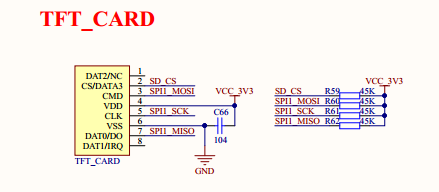
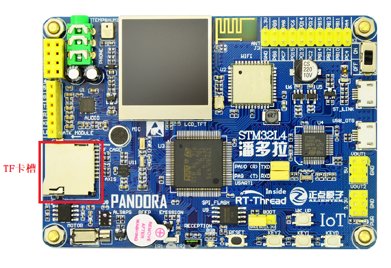

# TF 卡文件系统例程

## 简介

本例程使用开发板上 TF 卡槽中的 TF 卡作为文件系统的存储设备，展示如何在 TF 卡上创建文件系统（格式化卡），并挂载文件系统到 rt-thread 操作系统中。

文件系统挂载成功后，展示如何使用文件系统提供的功能对目录和文件进行操作。

## 硬件说明

本次示例和存储器连接通过 SPI 接口，使用的是硬件的 SPI1，原理图如下所示：



TF 卡的卡槽在开发板中的位置如下图所示：



## 软件说明

### 挂载操作代码说明
挂载文件系统的源代码位于 `/examples/11_component_fs_tf_card/applications/main.c` 中。在示例代码中会将块设备 `sd0` 中的文件系统以 fatfs 文件系统格式挂载到根目录 `/` 上。

```c
int main(void)
{
#ifdef BSP_USING_TF_CARD
    /* 挂载 TF 卡中的文件系统，参数 elm 表示挂载的文件系统类型为 elm-fat 文件系统*/
    if (dfs_mount("sd0", "/", "elm", 0, 0) == 0)
    {
        LOG_I("Filesystem initialized!");
    }
    else
    {
        LOG_E("Failed to initialize filesystem!");
    }
#endif /*BSP_USING_TF_CARD*/
    return 0;
}
```

### 创建块设备代码说明
在上面的挂载操作中所用的块设备 `sd0` 是基于 `spi10` 设备而创建的，创建块设备的代码在 `drivers/drv_spi_tfcard.c` 文件中。`spi10` 设备是挂载在硬件 SPI1 总线上的第一个 SPI 设备，因此命名为 `spi10`，该设备就是本次挂载的 SD 卡。`msd_init` 函数会在 `spi10` 设备上进行探测，并基于该设备创建名为 `sd0` 的块设备，用于文件系统的挂载，代码如下所示：

```c
static int rt_hw_spi1_tfcard(void)
{
    return msd_init("sd0", "spi10");
}
```

## 运行

### 编译&下载

- **MDK**：双击 `project.uvprojx` 打开 MDK5 工程，执行编译。
- **IAR**：双击 `project.eww` 打开 IAR 工程，执行编译。

编译完成后，将开发板的 ST-Link USB 口与 PC 机连接，然后将固件下载至开发板。

### 运行效果

1、在 PC 端使用终端工具打开开发板的 ST-Link 提供的虚拟串口，设置 115200 8 1 N 。

2、向开发板的 TF 卡槽里插入 TF 卡。

3、按下复位按键重启开发板，如果看到提示 `"Failed to initialize filesystem!`，这是因为 TF 卡中还没有创建文件系统。

4、该步骤可选，如果确定自己的卡是 fat 格式，可以忽略。在 msh 中使用命令 `mkfs -t elm sd0` 可以在块设备 `sd0` 中创建 elm-fat 类型的文件系统，即对 TF 卡执行格式化。**注意： mkfs 操作会清空存储设备中的数据，请谨慎操作。**

5、此时按下复位按键重启开发板，可以看到提示 `"Filesystem initialized!"`，表明文件系统挂载成功。打印信息如下所示：

```shell
 \ | /
- RT -     Thread Operating System
 / | \     4.0.1 build Mar 28 2019
 2006 - 2019 Copyright by rt-thread team
[I/main] Filesystem initialized!
msh />
```

### 常用功能展示
### ls: 查看当前目录信息
```shell
msh />ls                          # 使用 ls 命令查看文件系统目录信息              
Directory /:                      # 可以看到已经存在根目录 /
```

### mkdir: 创建文件夹
```shell
msh />mkdir rt-thread             # 创建 rt-thread 文件夹
msh />ls                          # 查看目录信息如下
Directory /:
rt-thread           <DIR>
```

### echo: 将输入的字符串输出到指定输出位置
```shell
msh />echo "hello rt-thread!!!"            # 将字符串输出到标准输出
hello rt-thread!!!
msh />echo "hello rt-thread!!!" hello.txt  # 将字符串出输出到 hello.txt 
msh />ls
Directory /:
rt-thread           <DIR>                    
hello.txt           18                       
msh />
```

### cat: 查看文件内容
```shell
msh />cat hello.txt                     # 查看 hello.txt 文件的内容并输出
hello rt-thread!!!
```

### rm: 删除文件夹或文件
```shell
msh />ls                                # 查看当前目录信息
Directory /:
rt-thread           <DIR>                    
hello.txt           18                       
msh />rm rt-thread                      # 删除 rt-thread 文件夹
msh />ls
Directory /:
hello.txt           18                       
msh />rm hello.txt                      # 删除 hello.txt 文件
msh />ls
Directory /:
msh />
```

更多文件系统功能展示可以参考[《文件系统应用笔记》](https://www.rt-thread.org/document/site/rtthread-application-note/components/dfs/AN0012-RT-Thread-文件系统应用笔记/)。

## 注意事项

挂载文件系统之前一定要确认 TF 卡被格式化为 Fat 文件系统，否则会挂载失败。

## 引用参考

- 《文件系统应用笔记》: docs/AN0012-RT-Thread-文件系统应用笔记.pdf
- 《SPI 设备应用笔记》: docs/AN0004-RT-Thread-SPI 设备应用笔记.pdf