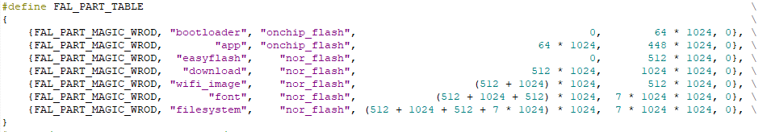

# Flash 分区管理例程

本例程演示如何通过 RT-Thread 提供的 FAL 软件包对 Flash 进行分区管理操作。例程中，通过调用 FAL 接口完成了对指定分区的测试工作，完成了对 Flash 读、写、擦的测试，同时也通过该例程完成了对 Flash 驱动的基本测试。

## FAL 简介

FAL (Flash Abstraction Layer) Flash 抽象层，是 RT-Thread 的一个软件包，是对 Flash 及基于 Flash 的分区进行管理、操作的抽象层，对上层统一了 Flash 及分区操作的 API ，并具有以下特性：

- 支持静态可配置的分区表，并可关联多个 Flash 设备；
- 分区表支持 **自动装载** 。避免在多固件项目，分区表被多次定义的问题；
- 代码精简，对操作系统 **无依赖** ，可运行于**裸机平台**，比如对资源有一定要求的 bootloader；
- 统一的操作接口。保证了文件系统、OTA、NVM 等对 Flash 有一定依赖的组件，底层 Flash 驱动的可重用性；
- 自带基于 Finsh/MSH 的测试命令，可以通过 Shell 按字节寻址的方式操作（读写擦） Flash 或分区，方便开发者进行调试、测试；

本例程旨在演示如何使用 **fal** 管理多个 Flash 设备，指导用户通过 fal 分区表操作 Flash 设备。该例程将是后续 OTA、easyflash 等例程的基础。

通过本例程指导用户学习使用 fal 处理以下问题：

- 使用 fal 管理多个 Flash 设备
- 创建分区表
- 使用 fal 操作分区表

## 硬件说明

本例程使用到的硬件资源如下所示：

- UART1 (Tx: PA9; Rx: PA10)
- 片内 FLASH (512KBytes)
- 片外 Nor Flash (16MBytes)

## 软件说明

**fal 例程**位于 `/examples/13_component_fal` 目录下，重要文件摘要说明如下所示：

| 文件                               | 说明                                                               |
| :--------------------------------- | :----------------------------------------------------------------- |
| applications/main.c                | app 入口（fal 例程程序）                                           |
| ports                              | fal 移植文件                                                       |
| ports/fal/fal_cfg.h                | fal 配置文件（Flash 设备配置 和 分区表配置）                       |
| ports/fal/fal_flash_sfud_port.c    | fal 操作片外 Nor Flash 的移植文件（将 Flash 读写擦接口注册到 fal） |
| ports/fal/fal_flash_stm32l4_port.c | fal 操作片内 Flash 的移植文件（将 Flash 读写擦接口注册到 fal）     |
| packages/fal                       | fal 软件包（fal 源码实现）                                         |
| packages/fal/inc/fal.h             | fal 软件包对外提供的操作接口                                       |

从上表中可以看到，如果要使用 fal 软件包需要进行必要的移植工作，移植文件存放在 **ports** 目录下。本 stm32l4 平台已经完成相关的移植工作。

### fal 配置说明

fal 配置存放在 `/examples/13_component_fal/ports/fal_cfg.h` 文件中，主要包括 Flash 设备的配置、分区表的配置。

**Flash 设备配置**

fal 中使用**Flash 设备列表**管理多个 Flash 设备。本例程中涉及到两个 Flash 设备，STM32L4 芯片内的 Flash 和片外的 QSPI Flash（Nor Flash）。

本例程的 Flash 设备列表定义如下所示：

```c
extern const struct fal_flash_dev stm32l4_onchip_flash;
extern const struct fal_flash_dev nor_flash0;

/* flash device table */
#define FAL_FLASH_DEV_TABLE    \
{                              \
    &stm32l4_onchip_flash,     \
    &nor_flash0,               \
}
```

- **stm32l4_onchip_flash** 是 STM32L4 片内 Flash 设备，定义在 **/examples/13_component_fal/ports/fal_flash_stm32l4_port.c** 文件中，参考 **Flash 设备对接说明** 章节
- **nor_flash0** 是外部扩展的 Nor FLASH 设备，定义在 **/examples/13_component_fal/ports/fal_flash_sfud_port.c** 文件中，参考 **Flash 设备对接说明** 章节

### 分区表配置

分区表存放在 `/examples/13_component_fal/ports/fal_cfg.h` 文件中，如下所示：



这里有一个宏定义 `FAL_PART_HAS_TABLE_CFG`，如果定义，则表示应用程序使用 `fal_cfg.h` 文件中定义的分区表。

是否使用 `fal_cfg.h` 文件中定义的分区表，有这样一个准则：

- 如果使用 `bootloader` 则不定义 `FAL_PART_HAS_TABLE_CFG` 宏，而使用 bootloader 中定义的分区表
- 如果不使用 `bootloader` 则需要用户定义 `FAL_PART_HAS_TABLE_CFG` 宏，从而使用 `fal_cfg.h` 文件中定义的分区表

`fal_cfg.h` 文件中定义的分区表最终会注册到 `struct fal_partition` 结构体数组中。

`fal_partition` 结构体定义如下所示：

```c
struct fal_partition
{
    uint32_t magic_word;

    /* FLASH 分区名称 */
    char name[FAL_DEV_NAME_MAX];
    /* FLASH 分区所在的 FLASH 设备名称 */
    char flash_name[FAL_DEV_NAME_MAX];

    /* FLASH 分区在 FLASH 设备的偏移地址 */
    long offset;
    size_t len;

    uint8_t reserved;
};
```

`fal_partition` 结构体成员简要介绍如下所示：

| 成员变量    | 说明 |
| :-----     | :----- |
| magic_word | 魔法数，系统使用，用户无需关心 |
| name       | 分区名字，最大 23 个ASCII字符 |
| flash_name | 分区所属的 Flash 设备名字，最大 23 个ASCII字符 |
| offset     | 分区起始地址相对 Flash 设备起始地址的偏移量 |
| len        | 分区大小，单位字节 |
| reserved   | 保留项 |

### Flash 设备对接说明

fal 是 Flash 抽象层，要操作 Flash 设备必然要将 Flash 的读、写、擦接口对接到 fal 抽象层中。在 fal 中，使用 `struct fal_flash_dev` 结构体来让用户注册该 Flash 设备的操作接口。

`fal_flash_dev` 结构体定义如下所示：

```c
struct fal_flash_dev
{
    char name[FAL_DEV_NAME_MAX];

    /* FLASH 设备的起始地址 */
    uint32_t addr;
    size_t len;
    /* FLASH 设备最小擦除的块大小 */
    size_t blk_size;

    struct
    {
        int (*init)(void);
        int (*read)(long offset, uint8_t *buf, size_t size);
        int (*write)(long offset, const uint8_t *buf, size_t size);
        int (*erase)(long offset, size_t size);
    } ops;
};
```

`fal_flash_dev` 结构体成员简要介绍如下所示：

| 成员变量  | 说明 |
| :-----   | :----- |
| name     | Flash 设备名字，最大 23 个ASCII字符 |
| addr     | Flash 设备的起始地址（片内 Flash 为 0x08000000，片外 Flash 为 0x00） |
| len      | Flash 设备容量，单位字节 |
| blk_size | Flash 设备最小擦除单元的大小，单位字节 |
| ops.init | Flash 设备的初始化函数，会在 **fal_init** 接口中调用 |
| ops.read | Flash 设备数据读取接口 |
| ops.write| Flash 设备数据写入接口 |
| ops.erase| Flash 设备数据擦除接口 |

**片内 Flash 对接说明**

片内 Flash 设备实例定义在 **/examples/13_component_fal/ports/fal_flash_stm32l4_port.c** 文件中，如下所示：

```c
const struct fal_flash_dev stm32l4_onchip_flash = { \
        "onchip_flash",                             \
        0x08000000,                                 \
        (512 * 1024),                               \
        2048,                                       \
        {NULL, read, write, erase}                  \
        };
```

Flash 设备名称为 `onchip_flash`，设备容量为 512K，最小擦除单元为 2K，无初始化接口。

**片外 Nor Flash 对接说明**

片外 Nor Flash 设备实例定义在 **/examples/13_component_fal/ports/fal_flash_sfud_port.c** 文件中，使用了 RT-Thread 内置的 **SFUD 框架**。

    SFUD 是一款开源的串行 SPI Flash 通用驱动库，覆盖了市面上绝大多数串行 Flash 型号，无需软件开发就能驱动。

Nor Flash 设备实例如下所示：

```c
const struct fal_flash_dev nor_flash0 = {      \
        "nor_flash",                           \
        0,                                     \
        (16 * 1024 * 1024),                    \
        4096,                                  \
        {fal_sfud_init, read, write, erase}    \
        };
```

Flash 设备名称为 `nor_flash`，设备容量为 16M，最小擦除单元为 4K。这里使用的 read、write、erase接口最终调用 SFUD 框架中的接口，无需用户进行驱动开发。

### 例程使用说明

**fal 例程** 代码位于 `/examples/13_component_fal/application/main.c` 文件中。例程中封装了一个分区测试函数 `fal_test`，如下所示：

```c
static int fal_test(const char *partiton_name);
```

`fal_test` 函数输入参数为 Flash 分区的名字，功能是对输入分区进行完整的擦、读、写测试，覆盖整个分区。

注意，fal 在使用前，务必使用 **fal_init** 函数完成 fal 功能组件的初始化。

以擦除为例，对代码进行简要说明：

**1. 擦除整个分区**

```c
/* 擦除 `partition` 分区上的全部数据 */
ret = fal_partition_erase_all(partition);
```

使用 `fal_partition_erase_all` API 接口将 `download` 分区完整擦除，擦除后 `download` 分区内的数据全为 **0xFF**。

**2. 校验擦除操作是否成功**

```c
/* 循环读取整个分区的数据，并对内容进行检验 */
for (i = 0; i < partition->len;)
{
    rt_memset(buf, 0x00, BUF_SIZE);
    len = (partition->len - i) > BUF_SIZE ? BUF_SIZE : (partition->len - i);

    /* 从 Flash 读取 len 长度的数据到 buf 缓冲区 */
    ret = fal_partition_read(partition, i, buf, len);
    if (ret < 0)
    {
        LOG_E("Partition (%s) read failed!", partition->name);
        ret = -1;
        return ret;
    }
    for(j = 0; j < len; j++)
    {
        /* 校验数据内容是否为 0xFF */
        if (buf[j] != 0xFF)
        {
            LOG_E("The erase operation did not really succeed!");
            ret = -1;
            return ret;
        }
    }
    i += len;
}
```

通过上面的代码，循环读取整个分区的数据，并对数据内容进行校验，判断是否为 **0xFF**，校验通过则说明擦除操作正常。

**3. 写整个分区**

```c
/* 把 0 写入指定分区 */
for (i = 0; i < partition->len;)
{
    /* 设置写入的数据 0x00 */
    rt_memset(buf, 0x00, BUF_SIZE);
    len = (partition->len - i) > BUF_SIZE ? BUF_SIZE : (partition->len - i);

    /* 写入数据 */
    ret = fal_partition_write(partition, i, buf, len);
    if (ret < 0)
    {
        LOG_E("Partition (%s) write failed!", partition->name);
        ret = -1;
        return ret;
    }
    i += len;
}
LOG_I("Write (%s) partition finish! Write size %d(%dK).", partiton_name, i, i / 1024);
```

通过上面的代码，循环写入数据 `0x00` 到整个分区。

**4. 校验写操作是否成功**

```c
/* 从指定的分区读取数据并校验数据 */
for (i = 0; i < partition->len;)
{
    /* 清空读缓冲区，以 0xFF 填充 */
    rt_memset(buf, 0xFF, BUF_SIZE);
    len = (partition->len - i) > BUF_SIZE ? BUF_SIZE : (partition->len - i);

    /* 读取数据到 buf 缓冲区 */
    ret = fal_partition_read(partition, i, buf, len);
    if (ret < 0)
    {
        LOG_E("Partition (%s) read failed!", partition->name);
        ret = -1;
        return ret;
    }
    for(j = 0; j < len; j++)
    {
        /* 校验读取的数据是否为步骤 3 中写入的数据 0x00 */
        if (buf[j] != 0x00)
        {
            LOG_E("The write operation did not really succeed!");
            ret = -1;
            return ret;
        }
    }
    i += len;
}
```

通过上面的代码，循环读取整个分区的数据，并对数据内容进行校验，判断是否为步骤3 写入的数据 **0x00**，校验通过则说明写操作正常。

## 运行

### 编译&下载

- **MDK**：双击 `project.uvprojx` 打开 MDK5 工程，执行编译。
- **IAR**：双击 `project.eww` 打开 IAR 工程，执行编译。

编译完成后，将开发板的 ST-Link USB 口与 PC 机连接，然后将固件下载至开发板。

### all.bin 运行效果

```shell
 \ | /
- RT -     Thread Operating System
 / | \     4.0.1 build Mar 28 2019
 2006 - 2019 Copyright by rt-thread team
[SFUD] Find a Winbond flash chip. Size is 16777216 bytes.
[SFUD] w25q128 flash device is initialize success.
[D/FAL] (fal_flash_init:61) Flash device |             onchip_flash | addr: 0x08000000 | len: 0x00080000 | blk_size: 0x00000800 |ini
tialized finish.
[D/FAL] (fal_flash_init:61) Flash device |                nor_flash | addr: 0x00000000 | len: 0x01000000 | blk_size: 0x00001000 |ini
tialized finish.
[I/FAL] ==================== FAL partition table ====================
[I/FAL] | name       | flash_dev    |   offset   |    length  |
[I/FAL] -------------------------------------------------------------
[I/FAL] | app        | onchip_flash | 0x00000000 | 0x00060000 |
[I/FAL] | param      | onchip_flash | 0x00060000 | 0x00020000 |
[I/FAL] | easyflash  | nor_flash    | 0x00000000 | 0x00080000 |
[I/FAL] | download   | nor_flash    | 0x00080000 | 0x00100000 |
[I/FAL] | wifi_image | nor_flash    | 0x00180000 | 0x00080000 |
[I/FAL] | font       | nor_flash    | 0x00200000 | 0x00700000 |
[I/FAL] | filesystem | nor_flash    | 0x00900000 | 0x00700000 |
[I/FAL] =============================================================
[I/FAL] RT-Thread Flash Abstraction Layer (V0.2.0) initialize success.
[I/main] Flash device : onchip_flash   Flash size : 512K   Partition : param   Partition size: 128K
[I/main] Erase (param) partition finish!
[I/main] Write (param) partition finish! Write size 131072(128K).
[I/main] Fal partition (param) test success!
[I/main] Flash device : nor_flash   Flash size : 16384K   Partition : download   Partition size: 1024K
msh >[I/main] Erase (download) partition finish!
[I/main] Write (download) partition finish! Write size 1048576(1024K).
[I/main] Fal partition (download) test success!
```

## SHELL 命令

为了方便用户验证 fal 功能是否正常，以及 Flash 驱动是否正确工作，分区表配置是否合理，RT-Thread 为 fal 提供了一套测试命令。

fal 测试命令如下所示：

```shell
msh >fal
Usage:
fal probe [dev_name|part_name]   - probe flash device or partition by given name
fal read addr size               - read 'size' bytes starting at 'addr'
fal write addr data1 ... dataN   - write some bytes 'data' starting at 'addr'
fal erase addr size              - erase 'size' bytes starting at 'addr'
fal bench <blk_size>             - benchmark test with per block size
```

- 使用 `fal probe [dev_name|part_name]` 命令探测指定的 Flash 设备或者 Flash 分区

    当探测到指定的 Flash 设备或 分区后，会显示其属性信息，如下所示：

    ```c
    msh >fal probe nor_flash
    Probed a flash device | nor_flash | addr: 0 | len: 16777216 |.
    msh >fal probe download 
    Probed a flash partition | download | flash_dev: nor_flash | offset: 524288 | len: 1048576 |.
    msh >
    ```

- 擦除数据

    首先选择要擦除数据的分区，演示使用的是 `download` 分区，然后使用 `fal erase` 命令擦除，如下所示：

    ```c
    msh >fal probe download
    Probed a flash partition | download | flash_dev: nor_flash | offset: 524288 |     len: 1048576 |.
    msh >fal erase 0 4096
    Erase data success. Start from 0x00000000, size is 4096.
    msh >
    ```

    其中，使用擦除命令时，addr 为相应探测 Flash 分区的**偏移地址**，size 为不超过该分区的值，以下写入数据、读取数据与此类似。

- 写入数据

    在完成擦除操作后，才能在已擦除区域写入数据，先输入 `fal write` ，后面跟着 N 个待写入的数据，并以空格隔开（能写入的数据数量取决与 MSH 命令行的配置）。

    演示从地址 `0x00000008` 的位置开始写入数据 `1 2 3 4 5 6 7`，共 7 个数据，如下所示：

    ```c
    msh >fal write 8 1 2 3 4 5 6 7
    Write data success. Start from 0x00000008, size is 7.
    Write data: 1 2 3 4 5 6 7 .
    ```

- 读取数据

    先输入 `fal read` ，后面跟着待读取数据的起始地址以及长度。演示从 0 地址开始读取 64 字节数据，读取前面写入的数据，如下所示：

    ```c
    msh >fal read 0 64
    Read data success. Start from 0x00000000, size is 64. The data is:
    Offset (h) 00 01 02 03 04 05 06 07 08 09 0A 0B 0C 0D 0E 0F
    [00000000] FF FF FF FF FF FF FF FF 01 02 03 04 05 06 07 FF
    [00000010] FF FF FF FF FF FF FF FF FF FF FF FF FF FF FF FF
    [00000020] FF FF FF FF FF FF FF FF FF FF FF FF FF FF FF FF
    [00000030] FF FF FF FF FF FF FF FF FF FF FF FF FF FF FF FF
    ```

    从日志上可以看到，在 0x00000008 地址处开始就是演示所写入的 7 个数据。

    - 注：Offset (h) 00 01 02 03 04 05 06 07 08 09 0A 0B 0C 0D 0E 0F 作为读取数据的行号标记。

- 性能测试

    性能测试将会测试 Flash 的擦除、写入及读取速度，同时将会测试写入及读取数据的准确性，保证整个 Flash 或整个分区的 写入与读取 数据的一致性。

    先输入 `fal bench`，后面跟着待测试 Flash 的扇区大小（请查看对应的 Flash 手册，SPI Nor Flash 一般为 4096）。由于性能测试将会让整个 Flash 或者整个分区的数据丢失，所以命令最后必须跟 yes 。

    ```c
    msh >fal bench 4096 yes
    Erasing 1048576 bytes data, waiting...
    Erase benchmark success, total time: 2.314S.
    Writing 1048576 bytes data, waiting...
    Write benchmark success, total time: 4.097S.
    Reading 1048576 bytes data, waiting...
    Read benchmark success, total time: 0.926S.
    ```

    从日志上可以看到，`fal bench` 命令将 `download` 分区 1048576 字节大小的区域进行了擦、写、读测试，并给出了测试时间。

## 注意事项

- 如果要修改分区表，请正确配置起始地址和分区大小，不要有分区重叠
- 在使用 fal 测试命令的时候，请先使用 `fal probe` 命令选择一个 Flash 分区

## 引用参考

- 《RT-Thread 编程指南 》: docs/RT-Thread 编程指南.pdf
- 《FAL 软件包介绍》     : https://github.com/RT-Thread-packages/fal
