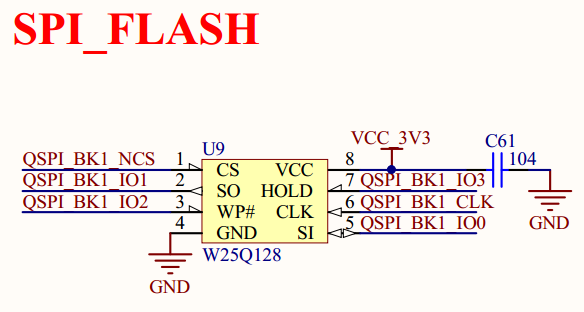
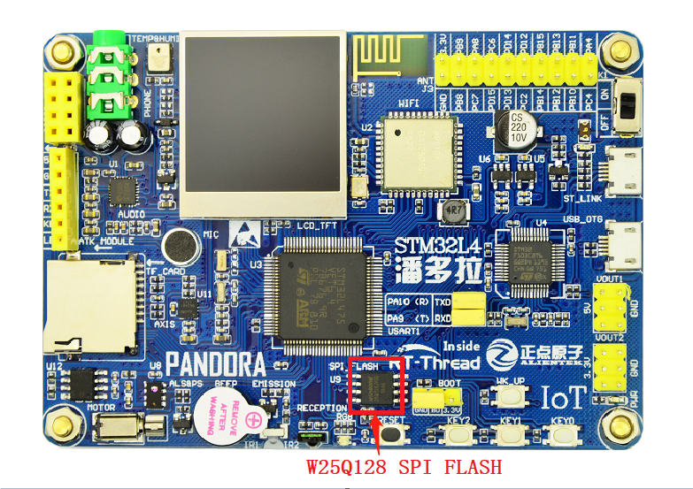

# SPI Flash 文件系统例程

## 简介

本例程使用板载的 SPI Flash 作为文件系统的存储设备，展示如何在 Flash 的指定分区上创建文件系统，并挂载文件系统到 rt-thread 操作系统中。文件系统挂载成功后，展示如何使用文件系统提供的功能对目录和文件进行操作。

本例程中使用的是 FAT 文件系统，也支持 Littlefs 文件系统。Littlefs 文件系统的使用可以参考[《在 STM32L4 上应用 littlefs 文件系统》](https://www.rt-thread.org/document/site/application-note/components/dfs/an0027-littlefs/)。

由于本例程需要使用 fal 组件对存储设备进行分区等操作，所以在进行本例程的实验前，需要先进行 fal 例程的实验，对 fal 组件的使用有一定的了解。

## 硬件说明

本次示例和存储器连接通过 QSPI 接口，使用的硬件接口是 QSPI1，原理图如下所示：



SPI FLASH 在开发板中的位置如下图所示：



## 软件说明

### 挂载操作代码说明
挂载文件系统的源代码位于 `/examples/15_component_fs_flash/main.c` 中。

在示例代码中会执行如下操作：

1. 使用 `fal_blk_device_create()` 函数在 spi flash 中名为 "filesystem" 的分区上创建一个块设备，作为文件系统的存储设备。
2. 使用 `dfs_mount()` 函数将该块设备中的文件系统挂载到根目录 `/` 上。

```c
#define FS_PARTITION_NAME  "filesystem"

int main(void)
{
    /* 初始化 fal 功能 */
    fal_init();

    /* 在 spi flash 中名为 "filesystem" 的分区上创建一个块设备 */
    struct rt_device *flash_dev = fal_blk_device_create(FS_PARTITION_NAME);
    if (flash_dev == NULL)
    {
        LOG_E("Can't create a block device on '%s' partition.", FS_PARTITION_NAME);
    }
    else
    {
        LOG_D("Create a block device on the %s partition of flash successful.", FS_PARTITION_NAME);
    }

    /* 挂载 spi flash 中名为 "filesystem" 的分区上的文件系统 */
    if (dfs_mount(flash_dev->parent.name, "/", "elm", 0, 0) == 0)
    {
        LOG_I("Filesystem initialized!");
    }
    else
    {
        LOG_E("Failed to initialize filesystem!");
        LOG_D("You should create a filesystem on the block device first!");
    }

    return 0;
}
```

## 运行

### 编译&下载

- **MDK**：双击 `project.uvprojx` 打开 MDK5 工程，执行编译。
- **IAR**：双击 `project.eww` 打开 IAR 工程，执行编译。

编译完成后，将开发板的 ST-Link USB 口与 PC 机连接，然后将固件下载至开发板。

### 运行效果

1、在 PC 端使用终端工具打开开发板的 ST-Link 提供的虚拟串口，设置 115200 8 1 N 。

2、按下复位按键重启开发板，如果看到提示`"Failed to initialize filesystem!`，这是因为指定的挂载设备中还没有创建文件系统。

3、在 msh 中使用命令 `mkfs -t elm filesystem` 可以在名为 “filesystem” 的块设备上创建 elm-fat 类型的文件系统。

4、此时按下复位按键重启开发板，可以看到提示`"FileSystem initialized!"`，表明文件系统挂载成功。打印信息如下所示：

```shell
 \ | /
- RT -     Thread Operating System
 / | \     4.0.1 build Mar 28 2019
 2006 - 2019 Copyright by rt-thread team
[SFUD] Find a Winbond flash chip. Size is 16777216 bytes.
[SFUD] w25q128 flash device is initialize success.
[D/FAL] (fal_flash_init:61) Flash device |             onchip_flash | addr: 0x08000000 | len: 0x00080000 | blk_size: 0x00000800 |ini
tialized finish.
[D/FAL] (fal_flash_init:61) Flash device |                nor_flash | addr: 0x00000000 | len: 0x01000000 | blk_size: 0x00001000 |ini
tialized finish.
[I/FAL] ==================== FAL partition table ====================
[I/FAL] | name       | flash_dev    |   offset   |    length  |
[I/FAL] -------------------------------------------------------------
[I/FAL] | app        | onchip_flash | 0x00000000 | 0x00060000 |
[I/FAL] | param      | onchip_flash | 0x00060000 | 0x00020000 |
[I/FAL] | easyflash  | nor_flash    | 0x00000000 | 0x00080000 |
[I/FAL] | download   | nor_flash    | 0x00080000 | 0x00100000 |
[I/FAL] | wifi_image | nor_flash    | 0x00180000 | 0x00080000 |
[I/FAL] | font       | nor_flash    | 0x00200000 | 0x00700000 |
[I/FAL] | filesystem | nor_flash    | 0x00900000 | 0x00700000 |
[I/FAL] =============================================================
[I/FAL] RT-Thread Flash Abstraction Layer (V0.2.0) initialize success.
[I/FAL] The FAL block device (filesystem) created successfully
[D/main] Create a block device on the filesystem partition of flash successful.     # 在 flash 的文件系统分区上创建块设备成功
[I/main] Filesystem initialized!                                                    # 文件系统初始化成功
msh />
```

### 常用功能展示
### ls: 查看当前目录信息
```shell
msh />ls                          # 使用 ls 命令查看文件系统目录信息              
Directory /:                      # 可以看到已经存在根目录 /
```

### mkdir: 创建文件夹
```shell
msh />mkdir rt-thread             # 创建 rt-thread 文件夹
msh />ls                          # 查看目录信息如下
Directory /:
rt-thread           <DIR>
```

### echo: 将输入的字符串输出到指定输出位置
```shell
msh />echo "hello rt-thread!!!"             # 将字符串输出到标准输出
hello rt-thread!!!
msh />echo "hello rt-thread!!!" hello.txt   # 将字符串出输出到 hello.txt
msh />ls
Directory /:
rt-thread           <DIR>                    
hello.txt           18                       
msh />
```

### cat: 查看文件内容
```shell
msh />cat hello.txt                     # 查看 hello.txt 文件的内容并输出
hello rt-thread!!!
```

### rm: 删除文件夹或文件
```shell
msh />ls                                # 查看当前目录信息
Directory /:
rt-thread           <DIR>                    
hello.txt           18                       
msh />rm rt-thread                      # 删除 rt-thread 文件夹
msh />ls
Directory /:
hello.txt           18                       
msh />rm hello.txt                      # 删除 hello.txt 文件
msh />ls
Directory /:
msh />
```

更多文件系统功能展示可以参考[《文件系统应用笔记》](https://www.rt-thread.org/document/site/rtthread-application-note/components/dfs/AN0012-RT-Thread-文件系统应用笔记/)。

## 注意事项

挂载文件系统之前一定要先在存储设备中创建相应类型的文件系统，否则会挂载失败。

## 引用参考

- 《文件系统应用笔记》: docs/AN0012-RT-Thread-文件系统应用笔记.pdf
- 《SPI 设备应用笔记 》: docs/AN0004-RT-Thread-SPI 设备应用笔记.pdf
- 《FAL 软件包介绍》    : https://github.com/RT-Thread-packages/fal