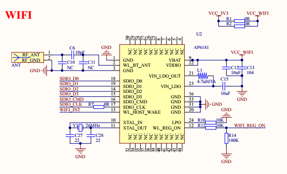
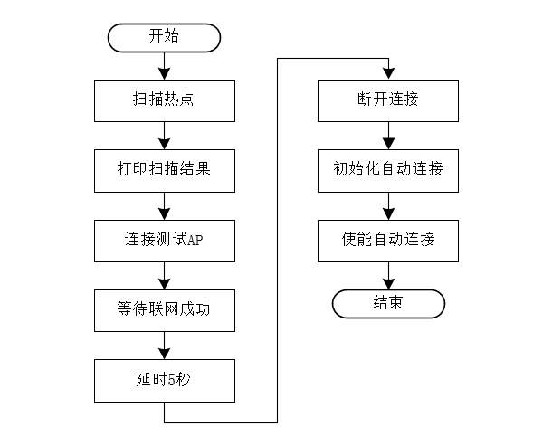

# WiFi 管理例程

## 简介

本例程使用 RT-Thread Wlan Manager 对 WiFi 网络管理，展示 WiFi 热点扫描， Join 网络， WiFi 自动连接以及 WiFi Event 处理等功能。

## 硬件说明



本例程用到正基公司的 AP6181 WiFi 模组，该模组集成了 IEEE 802.11 b/g/n MAC 、基带、射频以及功率放大器、电源管理装置、 SDIO 2.0。原理图如上图所示。

## 软件说明

**Wlan Manager** 位于 `/examples/16_iot_wifi_manager` 目录下，WiFi 模组的部分代码以库文件的形式提供， 重要文件摘要说明如下表所示：

| 文件                          | 说明                                                      |
| :---------------------------  | :-------------------------------------------------------- |
| applications/main.c           | app 入口（wifi manager 例程程序）                         |
| ports/wifi                    | Wlan 配置信息储存的移植文件(将已连接AP 信息存储至 Flash)  |
| ../../drivers/drv_wlan.c      | 初始化 Wlan 驱动，提供读写 WiFi 模组固件的接口            |
| ../../libraries/wifi          | WiFi 模组库文件                                           |

该用例的主要流程如下图所示，首先调用 Scan 接口扫描周围环境中的 AP(Access Point ，即无线访问热点) ，并打印扫描结果；然后连接一个测试用的 AP (名字: test_ssid ,密码: 12345678 )，并等待联网成功，打印网络信息；接着在等待 5 秒之后，断开和AP的连接；最后，调用接口初始化自动连接的相关配置，开启自动连接功能。在开启自动连接之后，Wlan Manager 会根据存储介质中的历史记录进行AP连接。

**注意**：请在 main.c 根据实际情况修改 `WLAN_SSID` 和 `WLAN_PASSWORD` 两个宏（分别定义了 AP 的名字和密码），否则将无法联网成功。  



### 热点扫描

下面代码段展示热点扫描功能，为同步式扫描，扫描的结果会通过接口直接返回。  

```c
    /* 扫描热点 */
    LOG_D("start to scan ap ...");
    /* 执行同步扫描 */
    scan_result = rt_wlan_scan_sync();
    if (scan_result)
    {
        LOG_D("the scan is complete, results is as follows: ");
        /* 打印扫描结果 */
        print_scan_result(scan_result);
        /* 清除扫描结果 */
        rt_wlan_scan_result_clean();
    }
    else
    {
        LOG_E("not found ap information ");
        return -1;
    }
```

### Join 网络

RT-Thread Wlan Manager 提供极简的接口进行 WiFi 联网操作，仅需要输入 ssid 和 password 即可。另外， Wlan Manager 也提供事件通知机制，RT_WLAN_EVT_READY 事件标志着 WiFi 联网成功，可以使用 Network 进行通信；RT_WLAN_EVT_STA_DISCONNECTED 用于 Network 断开的事件。
下面代码片段展示了 WiFi 联网的操作。  

```c
    /* 热点连接 */
    LOG_D("start to connect ap ...");
    rt_sem_init(&net_ready, "net_ready", 0, RT_IPC_FLAG_FIFO);

    /* 注册 wlan ready 回调函数 */
    rt_wlan_register_event_handler(RT_WLAN_EVT_READY, wlan_ready_handler, RT_NULL);
    /* 注册 wlan 断开回调函数 */
    rt_wlan_register_event_handler(RT_WLAN_EVT_STA_DISCONNECTED, wlan_station_disconnect_handler, RT_NULL);
    result = rt_wlan_connect(WLAN_SSID, WLAN_PASSWORD);
    if (result == RT_EOK)
    {
        rt_memset(&info, 0, sizeof(struct rt_wlan_info));
        /* 获取当前连接热点信息 */
        rt_wlan_get_info(&info);
        LOG_D("station information:");
        print_wlan_information(&info);
        /* 等待成功获取 IP */
        result = rt_sem_take(&net_ready, NET_READY_TIME_OUT);
        if (result == RT_EOK)
        {
            LOG_D("networking ready!");
            msh_exec("ifconfig", rt_strlen("ifconfig"));
        }
        else
        {
            LOG_D("wait ip got timeout!");
        }
        /* 回收资源 */
        rt_wlan_unregister_event_handler(RT_WLAN_EVT_READY);
        rt_sem_detach(&net_ready);
    }
    else
    {
        LOG_E("The AP(%s) is connect failed!", WLAN_SSID);
    }
```

此处通过 `rt_wlan_register_event_handler` 接口注册 `RT_WLAN_EVT_READY` （网络准备就绪）事件，当 WiFi Join AP 成功，且 IP 分配成功，会触发该事件的回调，标志着可以正常使用网络接口进行通信。

### 自动连接

打开自动连接功能后，Wlan Manager 会在 WiFi Join 网络成功后，保存该 AP 的信息至存储介质（默认保存最近 3 次的连接信息）。当系统重启或者网络异常断开后，自动读取介质中的信息，进行 WiFi 联网。  
下面代码片段展示 自动连接功能的使用。

```c
    /* 自动连接 */
    LOG_D("start to autoconnect ...");
    /* 初始化自动连接配置 */
    wlan_autoconnect_init();
    /* 使能 wlan 自动连接 */
    rt_wlan_config_autoreconnect(RT_TRUE);
```

自动连接功能需要用户实现参数信息存取的接口，本例中采用KV的方式进行存储，实现代码位于``/examples/16_iot_wifi_manager/ports/wifi/wifi_config.c``。  

```
static int read_cfg(void *buff, int len);
static int get_len(void);
static int write_cfg(void *buff, int len);

static const struct rt_wlan_cfg_ops ops =
{
    read_cfg,
    get_len,
    write_cfg
};
```

- auto_connect 移植接口说明

| 接口      | 描述                               |
| --------- | ---------------------------------- |
| read_cfg  | 从存储介质中读取配置信息           |
| get_len   | 从存储介质中读取配置信息长度       |
| write_cfg | 写入wlan配置信息至存储介质         |

##  Shell操作WiFi

wifi相关的shell命令如下：

```shell
wifi                                       ：打印帮助
wifi help                                  ：查看帮助
wifi join SSID [PASSWORD]                  ：连接wifi，SSDI为空，使用配置自动连接
wifi ap   SSID [PASSWORD]                  ：建立热点
wifi scan                                  ：扫描全部热点
wifi disc                                  ：断开连接
wifi ap_stop                               ：停止热点
wifi status                                ：打印wifi状态 sta + ap
wifi smartconfig                           ：启动配网功能
```

### WiFi扫描

- wifi 扫描命令格式如下

```shell
 wifi scan
```

命令说明  

| 字段 | 描述                     |
| ---- | ------------------------ |
| wifi | 有关wifi命令都以wifi开头 |
| scan | wifi执行扫描动作         |

在调试工具中输入该命令，即可进行 wifi 命令扫描，扫描结果如下所示：

```shell
msh />wifi scan
SSID                      MAC            security    rssi chn Mbps
------------------------------- -----------------  -------------- ---- --- ----
rtt_test_ssid_1                 c0:3d:46:00:3e:aa  OPEN           -14    8  300
test_ssid                       3c:f5:91:8e:4c:79  WPA2_AES_PSK   -18    6   72
rtt_test_ssid_2                 ec:88:8f:88:aa:9a  WPA2_MIXED_PSK -47    6  144
rtt_test_ssid_3                 c0:3d:46:00:41:ca  WPA2_MIXED_PSK -48    3  300
msh />
```

### WiFi连接

- wifi 连接命令格式如下

```shell
wifi join [SSID PASSWORD]
```

- 命令解析

| 字段      | 描述                               |
| --------- | ---------------------------------- |
| wifi      | 有关wifi命令都以wifi开头          |
| join      | wifi执行连接动作                  |
| SSID      | 热点的名字                        |
| PASSWORD | 热点的密码，没有密码可不输入这一项  |

- 连接成功后，将在终端上打印获得的IP地址，如下图所示  

```
msh />
msh />wifi join test_ssid 12345678
join ssid:test_ssid
[I/WLAN.mgnt] wifi connect success ssid:test_ssid
msh />[I/WLAN.lwip] Got IP address : 192.168.43.6

msh />

小技巧：如果已经存储Join 成功的AP历史记录，可直接输入 `wifi join`进行网络连接，忽略 'SSID' 和 'PASSWORD'子弹。
```

### WiFi断开

- wifi 断开命令格式如下

```shell
wifi disc
```

- 命令解析

| 字段      | 描述                               |
| --------- | ---------------------------------- |
| wifi      | 有关wifi命令都以wifi开头          |
| disc      | wifi执行断开动作                  |

- 断开成功后，将在终端上打印如下信息，如下图所示

```
msh />wifi disc
wifi link down
[I/main] disconnect from the network!
[I/WLAN.mgnt] disconnect success!
```

## 运行

### 编译&下载

- **MDK**：双击 `project.uvprojx` 打开 MDK5 工程，执行编译。
- **IAR**：双击 `project.eww` 打开 IAR 工程，执行编译。

编译完成后，将开发板的 ST-Link USB 口与 PC 机连接，然后将固件下载至开发板。

### 运行效果

按下复位按键重启开发板，正常运行后，会依次执行扫描、联网、开启自动连接等功能，终端输出信息如下：

```shell
 \ | /
- RT -     Thread Operating System
 / | \     4.0.1 build Mar 28 2019
 2006 - 2019 Copyright by rt-thread team
lwIP-2.0.2 initialized!
[SFUD] Find a Winbond flash chip. Size is 16777216 bytes.
[SFUD] w25q128 flash device is initialize success.
msh />[I/FAL] RT-Thread Flash Abstraction Layer (V0.2.0) initialize success.
[I/OTA] RT-Thread OTA package(V0.1.3) initialize success.
[I/OTA] Verify 'wifi_image' partition(fw ver: 1.0, timestamp: 1529386280) success.
[I/WICED] wifi initialize done. wiced version 3.3.1
[I/WLAN.dev] wlan init success
[I/WLAN.lwip] eth device init ok name:w0
[D/main] start to scan ap ...
[D/main] the scan is complete, results is as follows:
             SSID                      MAC            security    rssi chn Mbps
------------------------------- -----------------  -------------- ---- --- ----
test_ssid                       ec:88:8f:88:aa:9a  WPA2_MIXED_PSK -41   13  300
phicomm                         8c:ab:8e:73:1c:50  WPA2_AES_PSK   -45    1  300
modou-430A                      c0:3d:46:00:43:0a  WPA2_MIXED_PSK -61    9  300
cisco1                          10:bd:18:08:8e:19  WPA2_AES_PSK   -72    6  144
SSID-A                          02:bd:18:08:8e:1b  WPA2_AES_PSK   -72    6  144
kongzhong_guest                 34:96:72:b6:8d:51  WPA2_AES_PSK   -74    1  450
SSID-B                          02:bd:18:08:8e:1a  WPA2_AES_PSK   -77    6  144
YST2016                         88:25:93:c6:67:d1  WPA2_TKIP_PSK  -79    4   54

[D/main] start to connect ap ...
join ssid:test_ssid
[I/WLAN.mgnt] wifi connect success ssid:test_ssid
[D/main] station information:
[D/main] SSID : test_ssid
[D/main] MAC Addr: ec:88:8f:88:aa:9a
[D/main] Channel: 13
[D/main] DataRate: 300Mbps
[D/main] RSSI: -25
[D/main] networking ready!
network interface: w0 (Default)
MTU: 1500
MAC: 98 3b 16 53 12 d6
FLAGS: UP LINK_UP ETHARP BROADCAST IGMP
ip address: 192.168.43.6
gw address: 192.168.43.1
net mask  : 255.255.255.0
dns server #0: 192.168.43.1
dns server #1: 0.0.0.0
[I/WLAN.lwip] Got IP address : 192.168.43.6
[D/main] ready to disconect from ap ...
wifi link down
[I/main] disconnect from the network!
[I/WLAN.mgnt] disconnect success!
[D/main] start to autoconnect ...
[Flash] EasyFlash V3.2.1 is initialize success.
[Flash] You can get the latest version on https://github.com/armink/EasyFlash .
join ssid:test_ssid
[I/WLAN.mgnt] wifi connect success ssid:test_ssid
[I/WLAN.lwip] Got IP address : 192.168.43.6 
```

## 其他

### WiFi 模组库及驱动介绍  ###

- WiFi 库

本例中的 AP6181 WiFi 模组使用 Cypress 公司的  WICED 软件包，该部分代码已经在RT-Thread 上完成移植和适配，以库文件的形式提供。用户仅需调用 RT-Thread Wlan Manager 层 API 即可轻松操作 WiFi，无需关注底层， WiFi 库文件位于 ``libraries\wifi`` 目录下。

- WiFi 驱动

WiFi 驱动位于 ``/drivers/drv_wlan.c`` 中，主要完成 WiFi 库的初始化，以及 WiFi 固件的读取。本例中 WiFi 固件存储于外部 NorFlash 的 wifi_imager 分区，程序启动时从 Flash 读取固件，然后通过 SDIO 传输至 AP6181 WiFi 模组。

``drv_wlan.c``中实现了两个重要的接口，完成 WiFi 固件的读取，并在 WiFi 库中被调用。

```
int wiced_platform_resource_size(int resource)
```
该接口用于获取 WiFi 固件的大小。

```
int wiced_platform_resource_read(int resource, uint32_t offset, void *buffer, uint32_t buffer_size)
```
该接口用于从偏移位置读取指定大小的固件到 buffer 中，返回值为实际读取的固件大小。

### 更新 WiFi 模块固件

本例程用到的 AP6181 WiFi 模组，需要配合专用 WiFi 固件使用。开发板在出厂前已经烧录过 WiFi 固件，默认存储在外部 Flash。如果固件被不慎擦除，请参考《IoT-Board WiFi 固件下载》(docs/UM3001-RT-Thread-IoT Board WIFI 模块固件下载手册.pdf)，进行重新烧录。

下面为检测不到 WiFi 固件时的错误信息：

```shell
msh />[I/FAL] RT-Thread Flash Abstraction Layer (V0.2.0) initialize success.
[I/OTA] RT-Thread OTA package(V0.1.3) initialize success.
[E/OTA] (get_fw_hdr:144) Get firmware header occur CRC32(calc.crc: aa577802 != hdr.info_crc32: 55555555) error on 'wifi_image' partition!
[E/WLAN] wlan image transfer failed!!!
Could not initialize bus
[E/WICED] wifi library initialize failed: -8!
[I/WLAN.dev] wlan init failed
To initialize device:wlan0 failed. The error code is -8
[E/WLAN.dev] L:61 wlan init failed
[E/WLAN.mgnt] F:rt_wlan_set_mode L:797 F:rt_wlan_set_mode L:797 wlan init failed
[E/OTA] (get_fw_hdr:144) Get firmware header occur CRC32(calc.crc: aa577802 != hdr.info_crc32: 55555555) error on 'wifi_image' partition!
[E/WLAN] wlan image transfer failed!!!
Could not initialize bus
[E/WICED] wifi library initialize failed: -8!
[I/WLAN.dev] wlan init failed
To initialize device:wlan0 failed. The error code is -8
[E/WLAN.lwip] F:rt_wlan_lwip_protocol_register L:372 open wlan failed
```

### 联网失败处理

正常连接 WiFi 时，在连接成功后会打印分配到的 IP 信息，如 ``[I/WLAN.lwip] Got IP address : 192.168.12.115``。当 AP 不存在或者密码错误，上述信息将不会打印，此时，请检查 SSID 、 密码是否正确，以及网络配置。
下面为 AP 不存在和密码错误时的信息：

```shell
/* AP不存在 */
msh />wifi join test_ssid 12345678
[W/WLAN.mgnt] F:rt_wlan_connect L:979 not find ap! ssid:test_ssid
msh />
msh />
/* 密码错误 */
msh />wifi join test_ssid 1234567890
join ssid:test_ssid
...
```

## 注意事项

执行例程之前，需先设置一个名字为 'test_ssid'，密码为 '12345678' 的 WiFi 热点。

## 引用参考

- 《WLAN框架应用笔记》: docs/AN0026-RT-Thread-WLAN 框架应用笔记.pdf
- 《RT-Thread 编程指南》: docs/RT-Thread 编程指南.pdf
