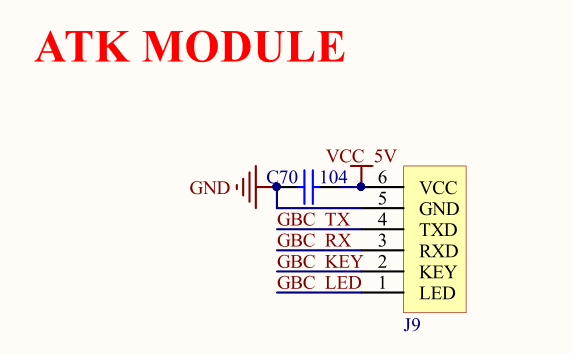
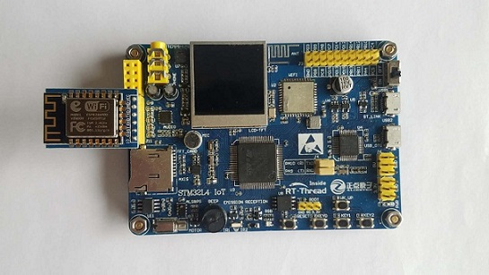
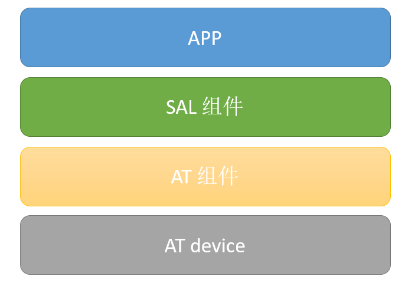

# ESP8266 WiFi 模块例程

## 简介

本例程的主要功能是让 IOT BOARD 通过 AT 组件完成对 ESP8266 AT 命令和数据的收发的，并且通过 AT 命令连接互联网。

## 硬件说明

ESP8266 是一款集成 32 位 MCU 的 WiFi 芯片，内置 AT 指令。通过 AT 指令，用户能快速的开发网络应用，而无需关心具体的网络协议栈的内容。 

本次示例所使用的 ESP8266（正点原子的 ATK-ESP8266 模块）通过 ATK MODULE 接口连接开发板，利用 UART2 和单片机进行通讯。原理图和实物图如下所示：





## 软件说明

在 RT-Thread 上进行网络编程推荐使用 BSD Socket API，RT-Thread 提供了数量众多的网络软件包，都是用 BSD Socket API 编写的，开发者可以利用这些软件包可以快速的完成自己的网络应用开发。RT-Thread 提供的 SAL 组件和 AT 组件则可以帮助开发者非常方便的将带有 AT 命令的网络模块对接到 RT-Thread 上来。

### AT 组件

AT 组件是基于 RT-Thread 系统的 `AT Server` 和 `AT Client` 的实现，组件完成 AT 命令的发送、命令格式及参数判断、命令的响应、响应数据的接收、响应数据的解析、URC 数据处理等整个 AT 命令数据交互流程。关于 AT 组件的详细介绍请查阅文末引用参考处的资料。

### SAL 组件

RT-Thread 系统提供了 SAL（套接字抽象层）组件，该组件完成对不同网络协议栈或网络实现接口的抽象并对上层提供一组标准的 BSD Socket API，这样开发者只需要关心和使用网络应用层提供的网络接口，而无需关心底层具体网络协议栈类型和实现，极大的提高了系统的兼容性，方便开发者完成协议栈的适配和网络相关的开发。关于 SAL 组件的详细介绍请查阅文末引用参考处编程指南的第 13 章。

### 框架介绍

在介绍例程代码前，我们先来介绍下本例程的框架。



通过上图，我们可以看到本例程主要分成 4 层：

- **APP 层**

    开发者只需要使用标准的 BSD Socket API 开发应用即可，无需关心底层的实现。同时应用代码还拥有非常强的移植性。当底层改变时，只要将新的底层驱动对接到 SAl 组件里即可，无需改变应用层代码。

- **SAL 组件层**

    SAL 组件层对上层提供了 BSD Socket API ，对下层提供了协议簇注册接口。

- **AT 组件层**

    AT 组件层对内运行 AT 框架，对上层提供了基于 AT 的 Socket 接口，对下层提供了移植接口。AT device(本例程为 ESP8266) 在初始化完成后会被作为一个 AT Socket 设备注册到 SAL 组件中，当上层应用调用 BSD Socket API 时，会通过注册的接口调用底层的 AT device 驱动，完成数据的传输。

- **AT device层**

    利用 AT 组件对 AT device（本例程为 ESP8266）做的移植，主要是利用 AT 组件提供的接口完成了 ESP8266 的初始化工作。同时还对 ESP8266 的 AT 命令做了适配，实现了 AT Socket 需要的一些底层函数，例如 esp8266_socket_connect()、esp8266_socket_send()、esp8266_socket_close() 等。RT-Thread 完成了对于 ESP8266 的移植工作，详细信息可以查看 [AT device](https://github.com/RT-Thread-packages/at_device) 软件包。

### 例程使用说明

本例程使用前务必**修改 WiFi 名称和密码**。打开 `/examples/17_iot_at_wifi_8266/rtconfig.h` 文件，找到宏定义 AT_DEVICE_WIFI_SSID 和 AT_DEVICE_WIFI_PASSWORD，将后面的值修改为自己的 WiFi 名称和密码。然后再编译下载。

ESP8266 初始化的源代码位于 `/examples/17_iot_at_wifi_8266/packages/at_device-v1.2.0/at_socket_esp8266.c` 中。主要是利用 AT 组件完成了复位 ESP8266，设置 ESP8266为 Wi-Fi station 模式，按照 rtconfig 里配置的 WiFi 名称和密码来连接 WiFi 等初始化工作。等 ESP8266  初始化完成后，会将 ESP8266 作为一个 AT Socket 设备注册到 SAL组件中。这样，通过 BSD Socket 开发的应用就可以利用 ESP8266 来连接网络了。

`/examples/17_iot_at_wifi_8266/applications/main.c` 实现了 5S 定时 ping www.rt-thread.org，成功则退出的功能。

代码如下所示：

```c
#include <rtthread.h>

int main(void)
{
    extern int esp8266_ping(int argc, char **argv);

    char *cmd[] = { "esp8266_ping", "www.rt-thread.org" };

    while (1)
    {
        if (esp8266_ping(2, cmd) == RT_EOK)
        {
            break;
        }
        else
        {
            rt_thread_mdelay(5000);
        }
    }

    return 0;
}
```

## 运行

### 编译&下载

- **MDK**：双击 `project.uvprojx` 打开 MDK5 工程，执行编译。
- **IAR**：双击 `project.eww` 打开 IAR 工程，执行编译。

编译完成后，将开发板的 ST-Link USB 口与 PC 机连接，然后将固件下载至开发板。

### 运行效果

按下复位按键重启开发板，可以看到板子会打印出如下信息：

```shell
 \ | /
- RT -     Thread Operating System
 / | \     4.0.1 build Mar 28 2019
 2006 - 2019 Copyright by rt-thread team
[I/SAL_SKT] Socket Abstraction Layer initialize success.
[I/at.clnt] AT client(V1.2.0) on device uart2 initialize success.
[I/at.esp8266] ESP8266 WIFI is connected.
[I/at.esp8266] AT network initialize success!
msh >32 bytes from www.rt-thread.org icmp_seq=1 time=10 ms
32 bytes from www.rt-thread.org icmp_seq=2 time=10 ms
32 bytes from www.rt-thread.org icmp_seq=3 time=9 ms
32 bytes from www.rt-thread.org icmp_seq=4 time=10 ms
```

能显示响应时间（time=xx ms）的就表示网络已经准备初始化成功，可以和外网进行通讯了。

联网成功后，开发者可以通过 BSD Socket API 进行网络开发了，也可以通过 ENV 选择 RT-Thread 提供的网络软件包来加速应用开发。

## 注意事项

编译工程并下载前务必**修改 WiFi 名称和密码**。

## 引用参考

- 《RT-Thread AT 组件应用笔记 - 客户端篇》: AN0014-RT-Thread-AT 组件应用笔记-客户端篇.pdf
- 《RT-Thread 编程指南 》: docs/RT-Thread 编程指南.pdf