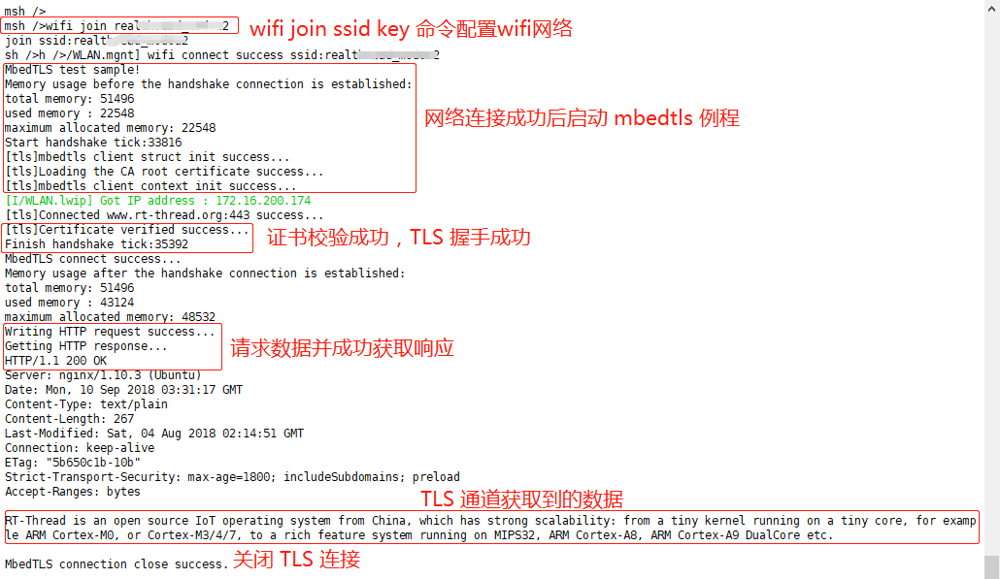

# TLS 安全连接例程

本例程介绍如何使用 mbedTLS 软件包与 HTTPS 服务器建立安全的通讯连接。

## 简介

**mbedTLS**（前身 PolarSSL）是一个由 ARM 公司开源和维护的 SSL/TLS 算法库。其使用 C 编程语言以最小的编码占用空间实现了 SSL/TLS 功能及各种加密算法，易于理解、使用、集成和扩展，方便开发人员轻松地在嵌入式产品中使用 SSL/TLS 功能。该软件包已经被移植到了 RT-Thread 操作系统上，开发者可以方便地在任何使用 RT-Thread OS 的平台上直接使用 mbedTLS 软件包建立 TLS 安全连接。

## 硬件说明

mbedTLS 例程需要依赖 IoTBoard 板卡上的 WiFi 模块完成网络通信，因此请确保硬件平台上的 WiFi 模组可以正常工作。

## 软件说明

**fal 例程**位于 `/examples/21_iot_mbedtls` 目录下，重要文件摘要说明如下所示：

| 文件                         | 说明   |
| :-----                       | :-----    |
| applications/main.c     | app 入口 |
| applications/tls_test.c | mbedTLS 例程程序 |
| ports                   | 移植文件 |
| packages/mbedtls             | mbedTLS 软件包（tls 源码实现）|
| packages/mbedtls/certs  | TLS 证书存放目录 |

### 例程使用说明

**mbedTLS 例程** 代码位于 `/examples/21_iot_mbedtls/application/` 文件夹中，其中 main.c 主要完成 wlan 网络初始化配置，并等待设备联网成功，程序如下所示：

```c
int main(void)
{
    int result = RT_EOK;

    /* 初始化 wlan 自动连接功能 */
    wlan_autoconnect_init();

    /* 使能 wlan 自动连接功能 */
    rt_wlan_config_autoreconnect(RT_TRUE);

    /* 创建 'net_ready' 信号量 */
    result = rt_sem_init(&net_ready, "net_ready", 0, RT_IPC_FLAG_FIFO);
    if (result != RT_EOK)
    {
        return -RT_ERROR;
    }

    /* 注册 wlan 连接网络成功的回调，wlan 连接网络成功后释放 'net_ready' 信号量 */
    rt_wlan_register_event_handler(RT_WLAN_EVT_READY, wlan_ready_handler, RT_NULL);
    /* 注册 wlan 网络断开连接的回调 */
    rt_wlan_register_event_handler(RT_WLAN_EVT_STA_DISCONNECTED, wlan_station_disconnect_handler, RT_NULL);

    /* 等待 wlan 连接网络成功 */
    result = rt_sem_take(&net_ready, RT_WAITING_FOREVER);
    if (result != RT_EOK)
    {
        rt_sem_detach(&net_ready);
        LOG_E("Wait net ready failed!");
        return -RT_ERROR;
    }

    /* 网络连接成功，启动 mbedTLS 客户端 */
    mbedtls_client_start();

    return 0;
}
```

设备成功接入网络后，会自动执行 `mbedtls_client_start()` 以启动 mbedTLS 客户端程序。

mbedTLS 客户端程序位于 `/examples/21_iot_mbedtls/application/tls_test.c` 中，核心代码说明如下：

**1. HTTPS 服务器设置**

本例程中使用 HTTP **GET** 方法请求 TLS 服务器 `www.rt-thread.org` 中的 `rt-thread.txt` 文本文件。文件路径为 `/download/rt-thread.txt`，默认端口为 443，程序配置如下所示：

```c
// https://www.rt-thread.org/download/rt-thread.txt
#define MBEDTLS_WEB_SERVER  "www.rt-thread.org"
#define MBEDTLS_WEB_PORT    "443"

static const char *REQUEST = "GET /download/rt-thread.txt HTTP/1.1\r\n"
    "Host: www.rt-thread.org\r\n"
    "User-Agent: rtthread/3.1 rtt\r\n"
    "\r\n";
```

**2. 启动 mbedTLS 客户端**

```c
int mbedtls_client_start(void)
{
    rt_thread_t tid;

    tid = rt_thread_create("tls_c", mbedtls_client_entry, RT_NULL, 6 * 1024, RT_THREAD_PRIORITY_MAX / 3 - 1, 5);
    if (tid)
    {
        rt_thread_startup(tid);
    }

    return RT_EOK;
}
```

通过 mbedtls_client_start API 创建 mbedTLS 线程，启动 mbedTLS 客户端。

**3. 创建 mbedTLS 上下文**

```c
MbedTLSSession *tls_session = RT_NULL;
tls_session = (MbedTLSSession *) tls_malloc(sizeof(MbedTLSSession));
if (tls_session == RT_NULL)
{
    rt_kprintf("No memory for MbedTLS session object.\n");
    return;
}

tls_session->host = tls_strdup(MBEDTLS_WEB_SERVER);
tls_session->port = tls_strdup(MBEDTLS_WEB_PORT);
tls_session->buffer_len = 1024;
tls_session->buffer = tls_malloc(tls_session->buffer_len);
if (tls_session->buffer == RT_NULL)
{
    rt_kprintf("No memory for MbedTLS buffer\n");
    tls_free(tls_session);
    return;
}
```

`MbedTLSSession` 数据结构存在于整个 TLS 连接的生命周期内，存储着 TLS 连接所必要的属性信息，需要用户在进行 TLS 客户端上下文初始化前完成配置。

**4. 初始化 mbedTLS 客户端**


应用程序使用 `mbedtls_client_init` 函数初始化 TLS 客户端。

初始化阶段按照 API 参数定义传入相关参数即可，主要用来初始化网络接口、证书、SSL 会话配置等 SSL 交互必须的一些配置，以及设置相关的回调函数。

示例代码如下所示：

```c
char *pers = "hello_world"; // 设置随机字符串种子
if((ret = mbedtls_client_init(tls_session, (void *)pers, strlen(pers))) != 0)
{
    rt_kprintf("MbedTLSClientInit err return : -0x%x\n", -ret);
    goto __exit;
}
```

**5. 初始化 mbedTLS 客户端上下文**

应用程序使用 `mbedtls_client_context` 函数配置客户端上下文信息，包括证书解析、设置主机名、设置默认 SSL 配置、设置认证模式（默认 MBEDTLS_SSL_VERIFY_OPTIONAL）等。

```c
if ((ret = mbedtls_client_context(tls_session)) < 0)
{
    rt_kprintf("MbedTLSCLlientContext err return : -0x%x\n", -ret);
    goto __exit;
}
```

**6. 建立 SSL/TLS 连接**

使用 `mbedtls_client_connect` 函数为 SSL/TLS 连接建立通道。这里包含整个的握手连接过程，以及证书校验结果。

示例代码如下所示：

```c
if((ret = mbedtls_client_connect(tls_session)) != 0)
{
    rt_kprintf("MbedTLSCLlientConnect err return : -0x%x\n", -ret);
    goto __exit;
}
```

**7. 读写数据**

通过前面的操作，TLS 客户端已经与服务器成功建立了 TLS 握手连接，然后就可以通过加密的连接进行 socket 读写。

**向 SSL/TLS 中写入数据**

示例代码如下所示：

```c
static const char *REQUEST = "GET /download/rt-thread.txt HTTP/1.1\r\n"
    "Host: www.rt-thread.org\r\n"
    "User-Agent: rtthread/3.1 rtt\r\n"
    "\r\n";

while((ret = mbedtls_client_write(tls_session, (const unsigned char *)REQUEST,strlen(REQUEST))) <= 0)
{
    if(ret != MBEDTLS_ERR_SSL_WANT_READ && ret != MBEDTLS_ERR_SSL_WANT_WRITE)
    {
        rt_kprintf("mbedtls_ssl_write returned -0x%x\n", -ret);
        goto __exit;
    }
}
```

**从 SSL/TLS 中读取数据**

示例代码如下所示：

```c
rt_memset(tls_session->buffer, 0x00, MBEDTLS_READ_BUFFER);
ret = mbedtls_client_read(tls_session, (unsigned char *) tls_session->buffer, MBEDTLS_READ_BUFFER);
if (ret == MBEDTLS_ERR_SSL_WANT_READ || ret == MBEDTLS_ERR_SSL_WANT_WRITE
        || ret == MBEDTLS_ERR_SSL_PEER_CLOSE_NOTIFY)
    goto __exit;
if (ret < 0)
{
    rt_kprintf("Mbedtls_ssl_read returned -0x%x\n", -ret);
    goto __exit;
}
if (ret == 0)
{
    rt_kprintf("TCP server connection closed.\n");
    goto __exit;
}
```

注意，如果读写接口返回了一个错误，必须关闭连接。

## 运行

### 编译&下载

- **MDK**：双击 `project.uvprojx` 打开 MDK5 工程，执行编译。
- **IAR**：双击 `project.eww` 打开 IAR 工程，执行编译。

编译完成后，将开发板的 ST-Link USB 口与 PC 机连接，然后将固件下载至开发板。

程序运行日志如下所示：

```shell
 \ | /
- RT -     Thread Operating System
 / | \     4.0.1 build Mar 27 2019
 2006 - 2019 Copyright by rt-thread team
lwIP-2.0.2 initialized!
[I/SAL_SKT] Socket Abstraction Layer initialize success.
[SFUD] Find a Winbond flash chip. Size is 16777216 bytes.
[SFUD] w25q128 flash device is initialize success.
msh />[I/FAL] RT-Thread Flash Abstraction Layer (V0.2.0) initialize success.
[I/OTA] RT-Thread OTA package(V0.1.3) initialize success.
[I/OTA] Verify 'wifi_image' partition(fw ver: 1.0, timestamp: 1529386280) success.
[I/WICED] wifi initialize done. wiced version 3.3.1
[I/WLAN.dev] wlan init success
[I/WLAN.lwip] eth device init ok name:w0
[Flash] EasyFlash V3.2.1 is initialize success.
[Flash] You can get the latest version on https://github.com/armink/EasyFlash .

msh />
```

如果用户在此例程前已经为设备配置过网络，并且开启了自动连接网络功能，设备上电后，会自动连接网络，网络连接成功后，直接执行 mbedTLS 例程。

如果用户没有为设备配置过网络，请继续阅读下面章节，为设备配置网络。

### 连接无线网络

程序运行后会进行 MSH 命令行，等待用户配置设备接入网络。使用 MSH 命令 `wifi join <ssid> <password>` 配置网络（ssid 和 password 分别为设备连接的 WIFI 用户名和密码），网络连接成功后会自动执行 mbedTLS 例程，如下所示：



## 注意事项

- **如需修改例程 TLS 服务器**

    如果用户修改例程中指定的 HTTPS 测试服务器，请使用 menuconfig 配置证书，详细请参考 [《mbedTLS 用户手册》](https://www.rt-thread.org/)。配置新证书后，请使用 scons 命令重新生成工程，scons 会自动将证书文件添加到程序中。

- **如需优化 RAM&ROM 资源占用**

    本例程使用标准的 mbedTLS 配置文件（config.h 文件），该配置文件未对 RAM 和 ROM 资源占用做深度优化，如果用户想要进行资源优化，请参考[《mbedTLS 用户手册》](https://www.rt-thread.org/)。

- **如需修改 TLS 配置文件**

    mbedTLS 默认使用的配置文件为 `mbedtls/config.h`，文件位置 `/examples/21_iot_mbedtls/mbedtls-v2.6.0/mbedtls/include/mbedtls/config.h`。

    如果用户不使用 scons 重新生成 IAR 或 MDK 工程，用户可以直接修改该文件进行自定义配置。

    如果用户需要使用 scons 编译或者生成工程，请修改 `mbedtls-v2.6.0/ports/inc/tls_config.h` 文件，scons 会自动将该文件内容拷贝到 `mbedtls/config.h` 文件。

## 引用参考

- 《RT-Thread 编程指南 》: docs/RT-Thread 编程指南.pdf
- 《mbedTLS 用户手册》: docs/UM1006-RT-Thread-MbedTLS 用户手册.pdf
- 已支持 TLS 加密连接的软件包

    RT-Thread 提供的与网络通讯相关的软件包大多都已经支持 TLS 加密连接，如 [HTTP 客户端](https://github.com/RT-Thread-packages/webclient)、[MQTT 客户端 paho-mqtt](https://github.com/RT-Thread-packages/paho-mqtt)、 [阿里云 iotkit](https://github.com/RT-Thread-packages/ali-iotkit)、[微软云 Azure](https://github.com/RT-Thread-packages/azure-iot-sdk)等，如有需要请访问 [RT-Thread 软件包主页](https://github.com/RT-Thread-packages)获取。
