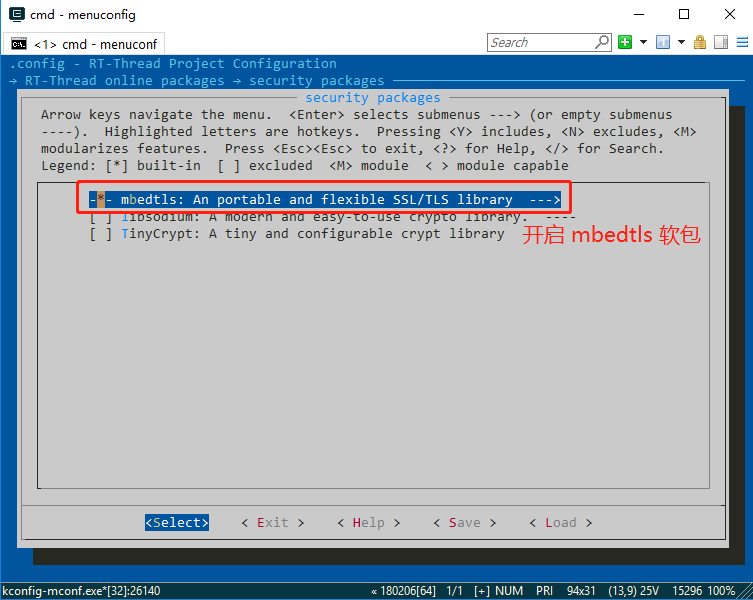
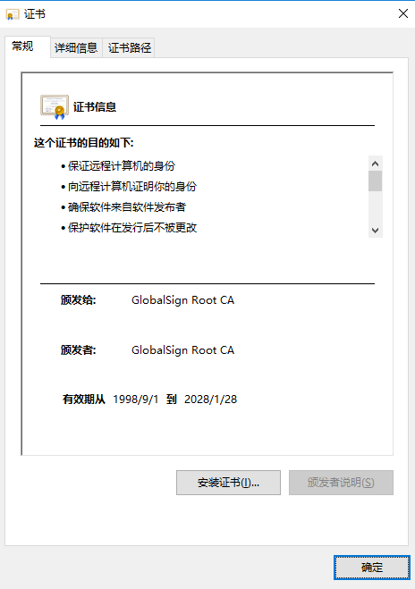
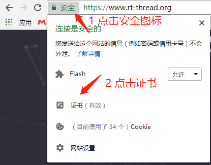
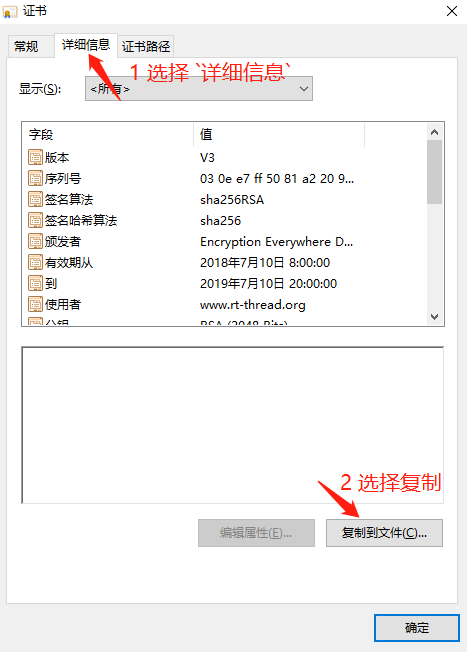
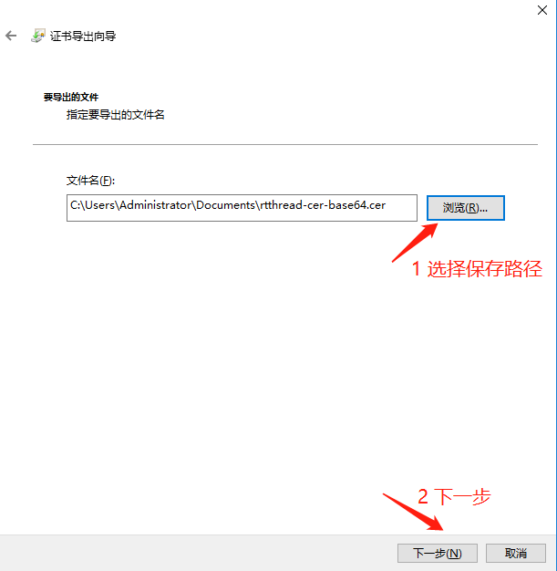

# 使用指南

这里主要介绍 mbedtls 程序的基本使用流程，并针对使用过程中经常涉及到的结构体和重要 API 进行简要说明。

mbedtls 的基本工作流程如下所示：

- 初始化 SSL/TLS 上下文
- 建立 SSL/TLS 握手
- 发送、接收数据
- 交互完成，关闭连接

## menuconfig 配置说明

获取 mbedtls 软件包或者修改用户配置都需要使用 `menuconfig`。需要用户打开 ENV 工具，并将目录切换到您所用的 BSP 目录，使用 `menuconfig` 命令打开配置界面。

在 `RT-Thread online packages → security packages` 中选择 **mbedtls** 软件包，操作界面如下图所示：



详细的配置介绍如下所示：

```shell
RT-Thread online packages --->
    security packages  --->
            Select Root Certificate  --->      # 选择证书文件
        [*] mbedtls: An portable and flexible SSL/TLS library  ---  # 打开 mbedtls 软件包
        [*]   Store the AES tables in ROM      # 将 AES 表存储在 ROM 中，优化内存占用
        (2)   Maximum window size used         # 用于点乘的最大“窗口”大小（2-7，该值越小内存占用也越小）
        (3584) Maxium fragment length in bytes # 配置数据帧大小（0x7200 错误可尝试增加该大小）
        [*]   Enable a mbedtls client example  # 开启 mbedtls 测试例程
        [ ]   Enable Debug log output          # 开启调试 log 输出
              version (latest)  --->           # 选择软件包版本，默认为最新版本
```

- `Using all default CA` 配置选项会将 `certs/default` 目录下的所有预置证书加入编译，将占用很大的内存
- `Using user CA` 配置选项允许用户将自己需要的证书文件加入编译，需要用户将证书文件拷贝到 `certs` 根目录

选择合适的配置项后，使用 `pkgs --update` 命令下载软件包并更新用户配置。

## 功能配置说明

> mbedtls 功能模块的开启与关闭定义在 mbedtls/config.h 和 ports/inc/tls_config.h 文件中

`mbedtls/config.h` 是 mbedtls 源码里提供的配置文件，`ports/inc/tls_config.h` 是 RT-Thread 基于 mbedtls 源码中的配置文件进行的裁剪和适配。

最终，用户使用的是 RT-Thread 提供的配置文件 **`ports/inc/tls_config.h`**。

用户可以通过文件中的宏来使能或失能部分不需要使用的功能模块，从而将 mbedtls 配置到合适的尺寸。


## 证书配置说明

- 预置的 CA 证书文件存放在 `certs/default` 目录中
- 用户增加的 CA 证书文件存放在 `certs` 根目录中

`certs/default` 目录中已经包含了大多数 CA 根证书，如果您使用的根证书不在该文件夹内，需要用户将自己的 **PEM 格式**的 CA 证书拷贝 `certs` 根目录下。（仅支持 **PEM 格式**证书，不支持 **DER 格式**证书）。

该证书文件中已经包含了大多数 CA 根证书，，参考后边的 **`添加新证书`** 章节。

## 初始化 TLS 会话

```c
typedef struct MbedTLSSession
{
    char* host;
    char* port;

    unsigned char *buffer;               // 公用数据缓冲区
    size_t buffer_len;                   // 缓冲区大小

    mbedtls_ssl_context ssl;             // 保存 ssl 基本数据
    mbedtls_ssl_config conf;             // 保存 ssl 配置信息
    mbedtls_entropy_context entropy;     // 保存 ssl 熵配置
    mbedtls_ctr_drbg_context ctr_drbg;   // 保存随机字节发生器配置
    mbedtls_net_context server_fd;       // 保存文件描述符
    mbedtls_x509_crt cacert;             // 保存认证信息
} MbedTLSSession;
```

`MbedTLSSession` 用于保存建立 TLS 会话连接时的配置信息，在 TLS 上下文中传递使用。用户在使用建立 TLS 会话前，必须定义一个存储会话内容的结构体，如下所示：

```c
static MbedTLSSession *tls_session = RT_NULL;
tls_session = (MbedTLSSession *)malloc(sizeof(MbedTLSSession));

tls_session->host = strdup(MBEDTLS_WEB_SERVER);
tls_session->port = strdup(MBEDTLS_WEB_PORT);
tls_session->buffer_len = MBEDTLS_READ_BUFFER;
tls_session->buffer = malloc(tls_session->buffer_len);
```

这里需要设置 SSL/TLS 服务器的 host 和 port，以及数据接收 buffer 等配置。

## 初始化 SSL/TLS 客户端

应用程序使用 `mbedtls_client_init` 函数初始化 TLS 客户端。

初始化阶段按照 API 参数定义传入相关参数即可，主要用来初始化网络接口、证书、SSL 会话配置等 SSL 交互必须的一些配置，以及设置相关的回调函数。

示例代码如下所示：

```c
char *pers = "hello_world"; // 设置随机字符串种子
if((ret = mbedtls_client_init(tls_session, (void *)pers, strlen(pers))) != 0)
{
    rt_kprintf("MbedTLSClientInit err return : -0x%x\n", -ret);
    goto __exit;
}
```

实际调用的 mbedtls 库函数如下所示：

## 初始化 SSL/TLS 客户端上下文

应用程序使用 `mbedtls_client_context` 函数配置客户端上下文信息，包括证书解析、设置主机名、设置默认 SSL 配置、设置认证模式（默认 MBEDTLS_SSL_VERIFY_OPTIONAL）等。

示例代码如下所示：

```c
if((ret = mbedtls_client_context(tls_session)) < 0)
{
    rt_kprintf("MbedTLSCLlientContext err return : -0x%x\n", -ret);
    goto __exit;
}
```

## 建立 SSL/TLS 连接

使用 `mbedtls_client_connect` 函数为 SSL/TLS 连接建立通道。这里包含整个的握手连接过程，以及证书校验结果。

示例代码如下所示：

```c
if((ret = mbedtls_client_connect(tls_session)) != 0)
{
    rt_kprintf("MbedTLSCLlientConnect err return : -0x%x\n", -ret);
    goto __exit;
}
```

## 读写数据

**向 SSL/TLS 中写入数据**

示例代码如下所示：

static const char *REQUEST = "GET https://www.howsmyssl.com/a/check HTTP/1.0\r\n"
    "Host: www.howsmyssl.com\r\n"
    "User-Agent: rtthread/3.1 rtt\r\n"
    "\r\n";

```c
while((ret = mbedtls_client_write(tls_session, (const unsigned char *)REQUEST,strlen(REQUEST))) <= 0)
{
    if(ret != MBEDTLS_ERR_SSL_WANT_READ && ret != MBEDTLS_ERR_SSL_WANT_WRITE)
    {
        rt_kprintf("mbedtls_ssl_write returned -0x%x\n", -ret);
        goto __exit;
    }
}
```

**从 SSL/TLS 中读取数据**

示例代码如下所示：

```c
memset(tls_session->buffer, 0x00, tls_session->buffer_len);
ret = mbedtls_client_read(tls_session, (unsigned char *)tls_session->buffer,len);
if(ret == MBEDTLS_ERR_SSL_WANT_READ || ret ==MBEDTLS_ERR_SSL_WANT_WRITE)
        continue;

if(ret == MBEDTLS_ERR_SSL_PEER_CLOSE_NOTIFY)
    break;
if(ret < 0)
{
    rt_kprintf("mbedtls_ssl_read returned -0x%x\n", -ret);
    break;
}
if(ret == 0)
{
    rt_kprintf("connection closed\n");
    break;
}
```

注意，如果读写接口返回了一个错误，必须关闭连接。

## 关闭 SSL/TLS 客户端连接

客户端主动关闭连接或者因为异常错误关闭连接，都需要使用 `mbedtls_client_close` 关闭连接并释放资源。

示例代码如下所示：

```c
mbedtls_client_close(tls_session);
```

## mbedtls 使用范式

参考示例程序 `samples/tls_app_test.c`。

## 添加新证书

CA 证书有两种常用格式 **PEM 格式** 和 **DER** 格式，目前 RT-Thread mbedtls 仅支持 **PEM 格式** 的证书文件。

- `PEM 格式证书`

    **PEM 格式证书** 通常是以 **.pem** 和 **.cer** 后缀名结尾的文件。

    使用文本编辑器打开后，文件内容以 `-----BEGIN CERTIFICATE-----` 开头，以 `-----END CERTIFICATE-----` 结尾。
- `DER 格式证书`

    **DER 格式证书** 是二进制文件类型。

### 根证书样式

双击 **.cer** 后缀名结尾的 CA 文件（Windows系统）可以看到证书的签发机构和有效期，如下图所示：



**PEM 格式** 格式的证书文件内容内容样式如下所示：

```
-----BEGIN CERTIFICATE-----
MIIDdTCCAl2gAwIBAgILBAAAAAABFUtaw5QwDQYJKoZIhvcNAQEFBQAwVzELMAkG
A1UEBhMCQkUxGTAXBgNVBAoTEEdsb2JhbFNpZ24gbnYtc2ExEDAOBgNVBAsTB1Jv
b3QgQ0ExGzAZBgNVBAMTEkdsb2JhbFNpZ24gUm9vdCBDQTAeFw05ODA5MDExMjAw
MDBaFw0yODAxMjgxMjAwMDBaMFcxCzAJBgNVBAYTAkJFMRkwFwYDVQQKExBHbG9i
YWxTaWduIG52LXNhMRAwDgYDVQQLEwdSb290IENBMRswGQYDVQQDExJHbG9iYWxT
aWduIFJvb3QgQ0EwggEiMA0GCSqGSIb3DQEBAQUAA4IBDwAwggEKAoIBAQDaDuaZ
jc6j40+Kfvvxi4Mla+pIH/EqsLmVEQS98GPR4mdmzxzdzxtIK+6NiY6arymAZavp
xy0Sy6scTHAHoT0KMM0VjU/43dSMUBUc71DuxC73/OlS8pF94G3VNTCOXkNz8kHp
1Wrjsok6Vjk4bwY8iGlbKk3Fp1S4bInMm/k8yuX9ifUSPJJ4ltbcdG6TRGHRjcdG
snUOhugZitVtbNV4FpWi6cgKOOvyJBNPc1STE4U6G7weNLWLBYy5d4ux2x8gkasJ
U26Qzns3dLlwR5EiUWMWea6xrkEmCMgZK9FGqkjWZCrXgzT/LCrBbBlDSgeF59N8
9iFo7+ryUp9/k5DPAgMBAAGjQjBAMA4GA1UdDwEB/wQEAwIBBjAPBgNVHRMBAf8E
BTADAQH/MB0GA1UdDgQWBBRge2YaRQ2XyolQL30EzTSo//z9SzANBgkqhkiG9w0B
AQUFAAOCAQEA1nPnfE920I2/7LqivjTFKDK1fPxsnCwrvQmeU79rXqoRSLblCKOz
yj1hTdNGCbM+w6DjY1Ub8rrvrTnhQ7k4o+YviiY776BQVvnGCv04zcQLcFGUl5gE
38NflNUVyRRBnMRddWQVDf9VMOyGj/8N7yy5Y0b2qvzfvGn9LhJIZJrglfCm7ymP
AbEVtQwdpf5pLGkkeB6zpxxxYu7KyJesF12KwvhHhm4qxFYxldBniYUr+WymXUad
DKqC5JlR3XC321Y9YeRq4VzW9v493kHMB65jUr9TU/Qr6cf9tveCX4XSQRjbgbME
HMUfpIBvFSDJ3gyICh3WZlXi/EjJKSZp4A==
-----END CERTIFICATE-----
```

### 获取根证书

- 直接向服务商索取

  向服务商索取 **`base64 编码 X.509`** 编码的 **PEM 格式** 证书文件。

- 从服务商网站导出

    - 浏览器打开服务商网站，以 `https://www.rt-thread.org/` 为例
    - 点击浏览器地址栏的 **`安全`**，然后点击证书

    

    - 查看证书详细信息

    

    - 根证书导出向导

    

    - 选择导出 Base64 编码证书

    

    - 选择证书存储位置

    

    - 完成证书文件导出

    

    完成证书导出，假设证书文件名为 **USER_ROOT_CA.cer**。

### 导入证书

- 使用文本编辑器打开上个步骤导出的根证书文件 **USER_ROOT_CA.cer**
- 拷贝 **USER_ROOT_CA.cer** 文件到 `certs` 根目录
- 使用 `scons` 命令重新编译

**注：**

`scons` 命令编译后，会自动将证书文件拷贝到 `const char mbedtls_root_certificate[]` 数组中。

## 常见问题

### 证书验证失败  

    [tls]verification info: ! The CRL is not correctly signed by the trusted CA

- 原因

    mbedtls 包中支持多种主流 CA 机构根证书，部分 CA 机构未支持

- 解决方法

    若测试其他 TLS 网站证书验证失败，手动获取测试网站根证书（Root Cerificate）添加到`mbedtls/tls_cerificate.c`文件中

### 证书时间错误

    [tls]verify peer certificate fail....
    [tls]verification info:   ! The certificate validity starts in the future

- 原因

    TLS 握手是证书验证需要时间的验证，本地时间获取有误导致

- 解决方式

    检查 RTC 设备是否支持，检查 `RT_USING_RTC` 宏是否打开，校准设备时间。建议使用 NTP 同步本地时间。

### 证书 CN 错误

    verification info: ! The certificate Common Name (CN) does not match with the expected CN

- 原因

    测试其他 TLS 网站时，若输入域名不符合证书的 Common Name（CN）出现 CN 验证失败问题

- 解决方法

    检查输入域名和证书中 CN 是否匹配或输入 IP 地址

### 0x7200 错误

- 原因

    部分原因是因为 mbedTls 收到了大于缓冲区大小的数据包  

- 解决方法

    `menuconfig` 配置增加数据帧大小 ( `Maxium fragment length in bytes` )

```shell
RT-Thread online packages --->
    security packages  --->
            Select Root Certificate  --->      # 选择证书文件
        [*] mbedtls: An portable and flexible SSL/TLS library  ---
        [*]   Store the AES tables in ROM
        (2)   Maximum window size used
        (6144) Maxium fragment length in bytes # 配置数据帧大小（0x7200 错误可尝试增加该大小）
        [*]   Enable a mbedtls client example
              version (latest)  --->
```

## 参考

- mbedTLS官方网站：https://tls.mbed.org/
- ARMmbed GitHub：[mbedtls](https://github.com/ARMmbed/mbedtls/tree/72ea31b026e1fc61b01662474aa5125817b968bc)
