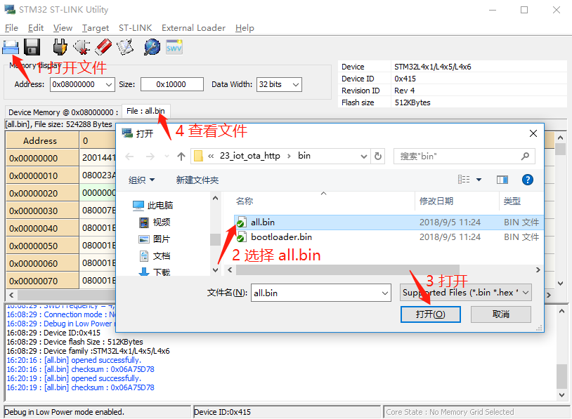
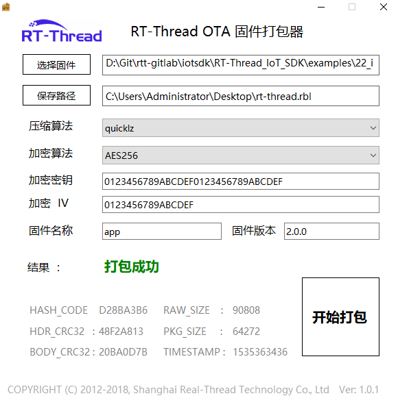
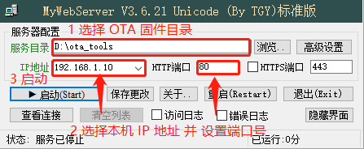
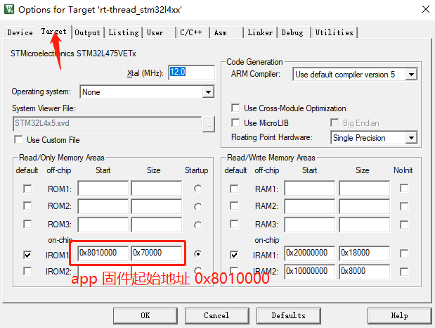

# HTTP 协议固件升级例程

## 例程说明

HTTP 是一种超文本传输协议，采用请求应答的通讯模式，可以基于通用 socket 实现极简客户端程序，广泛应用在互联网上。HTTP 请求应答的方式，及其很小的客户端代码量，也使其很方便地应用在物联网设备中，用于与服务器进行数据交互，以及 OTA 固件下载。

本例程基于 HTTP 客户端实现 **HTTP OTA 固件下载器**，通过 HTTP 协议从 HTTP 服务器下载升级固件到设备。HTTP 客户端代码参考 RT-Thread [**WebClient 软件包**](https://github.com/RT-Thread-packages/webclient) 。

在该例程中用到的 bootloader 程序以 bin 文件的形式提供，文件位于 `/examples/23_iot_ota_http/bin/bootloader.bin`。

该例程中，为了方便用户操作，特提供了 all.bin 供用户使用，all.bin 中已经集成了 HTTP OTA 固件下载器，用户仅需要关心如何使用该例程打包具有 HTTP 升级功能的升级固件即可。all.bin 文件位于 `/examples/23_iot_ota_http/bin/all.bin` 中。

## 背景知识

参考 Ymodem 固件升级例程。

## 硬件说明

本例程使用到的硬件资源如下所示：

- UART1 (Tx: PA9; Rx: PA10)
- 片内 FLASH (512KBytes)
- 片外 Nor Flash (16MBytes)

本例程中，**bootloader 程序**和 **app 程序**存放在 STM32L4 MCU 的内部 FLASH 中，**download** 下载区域存放在外部扩展的 **Nor FLASH** 中。

## 分区表

| 分区名称    | 存储位置   | 起始地址 | 分区大小 | 结束地址 | 说明 |
| :-----     | :-----    | :----- | :---- | :----- | :------ |
| bootloader | 片内 FLASH | 0x08000000 | 64K  | 0x08010000 | bootloader 程序存储区 |
| app        | 片内 FLASH | 0x08010000 | 448K | 0x08080000 | app 应用程序存储区 |
| easyflash  | 片外 Nor FLASH | 0x00000000 | 512K | 0x00080000 | easyflash 存储区 |
| download   | 片外 Nor FLASH | 0x00080000 | 1M   | 0x00180000 | download 下载存储区 |
| wifi_image | 片外 Nor FLASH | 0x00180000 | 512K | 0x00200000 | wifi 固件存储区 |
| font | 片外 Nor FLASH | 0x00200000 | 7M | 0x00900000 | font 字库分区 |
| filesystem | 片外 Nor FLASH | 0x00900000 | 7M  | 0x01000000 | filesystem 文件系统区 |

分区表定义在 **`bootloader 程序`** 中，如果需要修改分区表，则需要修改 bootloader 程序。目前不支持用户自定义 bootloader，如果有商用需求，请联系 **RT-Thread** 获取支持。

## 软件说明

**http 例程**位于 `/examples/23_iot_ota_http` 目录下，重要文件摘要说明如下所示：

| 文件                      | 说明   |
| :-----                    | :-----    |
| applications/main.c  | app 入口 |
| applications/ota_http.c | http ota 应用，基于 HTTP 协议实现 OTA 固件下载业务 |
| bin                       | bootloader 程序 |
| bin/all.bin          | 需要烧录到 0x08000000 地址 |
| ports/fal | Flash 抽象层软件包（fal）的移植文件 |
| packages/fal              | fal 软件包 |
| packages/webclient        | webclient 软件包，实现 HTTP 客户端 |

HTTP 固件升级流程如下所示：

1. 打开 **tools/MyWebServer** 软件，并配置本机 IP 地址和端口号，选择存放升级固件的目录
2. 在 MSH 中使用 `http_ota` 命令下载固件到 download 分区
3. bootloader 对 OTA 升级固件进行校验、解密和搬运（搬运到 app 分区）
4. 程序从 bootloader 跳转到 app 分区执行新的固件

### 程序说明

HTTP OTA 固件下载器程序代码在 `/examples/23_iot_ota_http/applications/ota_http.c` 文件中，仅有三个 API 接口，介绍如下：

**print_progress 函数**

```c
static void print_progress(size_t cur_size, size_t total_size);
```

该函数用于打印文件的下载进度。

**http_ota_fw_download 函数**

```c
static int http_ota_fw_download(const char* uri);
```

http_ota_fw_download 函数基于 webclient API 实现了从指定的 **uri** 下载文件的功能，并将下载的文件存储到 **download 分区**。

**uri** 格式示例： `http://192.168.1.10:80/rt-thread.rbl`。非 80 端口需要用户指定。如果使用了 TLS 加密连接，请使用 `https://192.168.1.10:80/rt-thread.rbl`。

**http_ota 函数**

```c
void http_ota(uint8_t argc, char **argv);
MSH_CMD_EXPORT(http_ota, OTA by http client: http_ota [url]);
```
HTTP OTA 入口函数，使用 `MSH_CMD_EXPORT` 函数将其导出为 `http_ota` 命令。

`http_ota` 命令需要传入固件下载地址，示例：`http_ota http://192.168.1.10:80/rt-thread.rbl`。

## 运行

为了方便用户操作，本例程预先提供了带 HTTP OTA 功能的 all.bin 固件，all.bin 固件包含了 bootloader 程序和 v1.0.0 版本的 app 程序。本例程先下载 all.bin 固件，然后演示使用 HTTP OTA 功能烧录 v2.0.0 版本的 app 程序。

### 烧录 all.bin

**ST-LINK Utility 烧录**

1. 解压 `/tools/ST-LINK Utility.rar` 到当前目录（解压后有 **/tools/ST-LINK Utility** 目录）

2. 打开 **/tools/ST-LINK Utility** 目录下的 **STM32 ST-LINK Utility.exe** 软件

3. 点击菜单栏的 **Target** --> **Connect** 连接到开发板，如下图所示：

    

4. 打开 **/examples/23_iot_ota_http/bin/all.bin** 文件

    

- 注：如果该工具默认已经选择了 all.bin 文件，需要点击鼠标右键后，再鼠标左键选择 `close file` ，最后鼠标右键点击 `binary file`，添加 `23_iot_ota_http` 的 `all.bin`。

5. 烧录

    

    

### all.bin 运行效果

烧录完成后，此时可以在 PC 端使用终端工具打开开发板的 ST-Link 提供的虚拟串口，设置 115200 8 1 N 。开发板的运行日志信息即可实时输出出来。

烧录后程序会自动运行（或按下复位按键重启开发板查看日志），设备打印日志如下所示：

```shell
[SFUD]Find a Winbond W25Q128 flash chip. Size is 16777216 bytes.
[SFUD]norflash0 flash device is initialize success.

RT-Thread Bootloader Starting...
[D/FAL] (fal_flash_init:61) Flash device |             onchip_flash | addr: 0x08000000 | len: 0x00080000 | blk_size: 0x00000800 |ini
tialized finish.
[D/FAL] (fal_flash_init:61) Flash device |                nor_flash | addr: 0x00000000 | len: 0x01000000 | blk_size: 0x00001000 |ini
tialized finish.
[I/FAL] ==================== FAL partition table ====================
[I/FAL] | name         | flash_dev    |   offset   |    length  |
[I/FAL] -------------------------------------------------------------
[I/FAL] | bootloader   | onchip_flash | 0x00000000 | 0x00010000 |                                  # 用户分区表
[I/FAL] | app          | onchip_flash | 0x00010000 | 0x00070000 |
[I/FAL] | easyflash    | nor_flash    | 0x00000000 | 0x00080000 |
[I/FAL] | download     | nor_flash    | 0x00080000 | 0x00100000 |
[I/FAL] | wifi_image   | nor_flash    | 0x00180000 | 0x00080000 |
[I/FAL] | font         | nor_flash    | 0x00200000 | 0x00700000 |
[I/FAL] | filesystem   | nor_flash    | 0x00900000 | 0x00700000 |
[I/FAL] =============================================================
[I/FAL] RT-Thread Flash Abstraction Layer (V0.2.0) initialize success.
[I/OTA] RT-Thread OTA package(V0.2.1) initialize success.
[I/OTA] Verify 'bootloader' partition(fw ver: 1.3, timestamp: 1545134551) success.
[E/OTA] (get_fw_hdr:149) Get firmware header occur CRC32(calc.crc: c2b526e7 != hdr.info_crc32: 00000000) error on 'download' partiti
on!
[E/OTA] (get_fw_hdr:149) Get firmware header occur CRC32(calc.crc: c2b526e7 != hdr.info_crc32: 00000000) error on 'download' partiti
on!
[E/OTA] (rt_ota_check_upgrade:464) Get OTA download partition firmware header failed!
[I/OTA] Verify 'app' partition(fw ver: 1.0, timestamp: 1544495892) success.
Find user application success.
The Bootloader will go to user application now.

 \ | /
- RT -     Thread Operating System
 / | \     4.0.0 build Dec 11 2018
 2006 - 2018 Copyright by rt-thread team
lwIP-2.0.2 initialized!
[SFUD] Find a Winbond flash chip. Size is 16777216 bytes.
[SFUD] w25q128 flash device is initialize success.
msh />[I/FAL] RT-Thread Flash Abstraction Layer (V0.2.0) initialize success.
[I/OTA] RT-Thread OTA package(V0.1.3) initialize success.
[I/OTA] Verify 'wifi_image' partition(fw ver: 1.0, timestamp: 1529386280) success.
[I/WICED] wifi initialize done. wiced version 3.3.1
[I/WLAN.dev] wlan init success                                                                     # WIFI 初始化成功    
[I/WLAN.lwip] eth device init ok name:w0
[Flash] EasyFlash V3.2.1 is initialize success.
[Flash] You can get the latest version on https://github.com/armink/EasyFlash .
The current version of APP firmware is 1.0.0                                                       # 升级前版本号
join ssid:aptest
[I/WLAN.mgnt] wifi connect success ssid:aptest
[I/WLAN.lwip] Got IP address : 192.168.12.71                                                       # 获取到 IP 地址
```

从以上日志里可以看到前半部分是 **bootloader 固件**打印的日志，后半部分是 **app 固件**打印的日志，输出了 app 固件的版本号，并成功进入了 RT-Thread MSH 命令行。

如果串口终端提示对 `download` 分区校验失败，这是因为设备初次烧录固件，位于片外 Flash 的 download 分区内没有数据或者数据被破坏导致的，属于正常现象，下次使用 OTA 升级后就不会再出现该提示现象。

### 制作升级固件

以 **23_iot_ota_http** 例程为基础，制作用于 HTTP 升级演示所用到的 **app 固件**。

1. **MDK**：双击 `project.uvprojx` 打开 MDK5 工程
2. **IAR**：双击 `project.eww` 打开 IAR 工程
3. 修改 `/examples/23_iot_ota_http/application/main.c` 中的版本号 `#define APP_VERSION  "1.0.0"` 为 `#define APP_VERSION  "2.0.0"`
4. 编译得到 `rt-thread.bin`，文件位置 `/examples/23_iot_ota_http/rt-thread.bin`

编译器编译出来的应用程序 `rt-thread.bin` 属于原始 app 固件，并不能用于 RT-Thread OTA 的升级固件，需要用户使用 `RT-Thread OTA 固件打包器` 打包生成 `.rbl` 后缀名的固件，然后才能进行 OTA 升级。

使用 **/tools/ota_packager** 目录下的 OTA 打包工具制作 OTA 升级固件（**`.rbl`** 后缀名的文件）。

`RT-Thread OTA 固件打包器` 如下图所示：



用户可以根据需要，选择是否对固件进行加密和压缩，提供多种压缩算法和加密算法支持，基本操作步骤如下：

1. 选择待打包的固件（`/examples/23_iot_ota_http/rt-thread.bin`）
2. 选择生成固件的位置
3. 选择压缩算法（不压缩则留空）
4. 选择加密算法（不加密则留空）
5. 配置加密密钥（不加密则留空）
6. 配置加密 IV （不加密则留空）
7. 填写固件名称（对应分区名称，这里为 app）
8. 填写固件版本（填写 `/examples/23_iot_ota_http/application/main.c` 中的版本号 2.0.0）
9. 开始打包

通过以上步骤制作完成的 `rt-thread.rbl` 文件即可用于后续的升级文件。

**Note：**

- **加密密钥** 和 **加密 IV** 必须与 bootloader 程序中的一致，否则无法正确加解密固件

    默认提供的 bootloader.bin 支持加密压缩，使用的 **加密密钥** 为 `0123456789ABCDEF0123456789ABCDEF`，使用的 **加密 IV** 为 `0123456789ABCDEF`。

- 固件打包过程中有 **`固件名称`** 的填写，这里注意需要填入 Flash 分区表中对应分区的名称，不能有误

    如果要升级 **app** 程序，则填写 `app`；如果升级 **WiFi 固件**，则填写 `wifi_image`。

- 使用 **OTA 打包工具**制作升级固件 `rt-thread.rbl`

    正确填写固件名称为 **app**，版本号填写 `main.c` 中定义的版本号 `2.0.0`。

- 如果要制作其他例程的 APP 升级固件，请基于本例程工程进行修改

### 启动 HTTP OTA 升级

1. 解压 `/tools/MyWebServer.zip` 到当前目录（解压后有 **/tools/MyWebServer** 目录）
2. 打开 **/tools/MyWebServer** 目录下的 **MyWebServer.exe** 软件

    配置 MyWebServer 软件，选择 OTA 固件（rbl 文件）的路径，设置本机 IP 和 端口号，并启动服务器，如下图所示：

    

3. 连接开发板串口，复位开发板，进入 MSH 命令行
4. 在设备的命令行里输入 **`http_ota http://192.168.1.10:80/rt-thread.rbl`** 命令启动 HTTP OTA 升级

    根据您的 MyWebServer 软件的 IP 和端口号配置修改 `http_ota` 命令。

5. 设备升级过程

    输入命令后，会擦除 download 分区，下载升级固件。下载过程中会打印下载进度条。

```
msh />http_ota http://192.168.1.10:80/rt-thread.rbl
[I/http_ota] Start erase flash (download) partition!
[I/http_ota] Erase flash (download) partition success!
[I/http_ota] Download: [============================================================] 100%
```

**HTTP OTA** 下载固件完成后，会自动重启，并在串口终端打印如下log：

```shell
[I/http_ota] Download firmware to flash success.
[I/http_ota] System now will restart...
```

设备重启后，**bootloader** 会对升级固件进行合法性和完整性校验，验证成功后将升级固件从**download** 分区搬运到目标分区（这里是 **app** 分区）。

升级成功后设备状态如下所示：

```
[SFUD]Find a Winbond W25Q128 flash chip. Size is 16777216 bytes.
[SFUD]norflash0 flash device is initialize success.

RT-Thread Bootloader Starting...
[D/FAL] (fal_flash_init:61) Flash device |             onchip_flash | addr: 0x08000000 | len: 0x00080000 | blk_size: 0x00000800 |ini
tialized finish.
[D/FAL] (fal_flash_init:61) Flash device |                nor_flash | addr: 0x00000000 | len: 0x01000000 | blk_size: 0x00001000 |ini
tialized finish.
[I/FAL] ==================== FAL partition table ====================
[I/FAL] | name         | flash_dev    |   offset   |    length  |
[I/FAL] -------------------------------------------------------------
[I/FAL] | bootloader   | onchip_flash | 0x00000000 | 0x00010000 |
[I/FAL] | app          | onchip_flash | 0x00010000 | 0x00070000 |
[I/FAL] | easyflash    | nor_flash    | 0x00000000 | 0x00080000 |
[I/FAL] | download     | nor_flash    | 0x00080000 | 0x00100000 |
[I/FAL] | wifi_image   | nor_flash    | 0x00180000 | 0x00080000 |
[I/FAL] | font         | nor_flash    | 0x00200000 | 0x00700000 |
[I/FAL] | filesystem   | nor_flash    | 0x00900000 | 0x00700000 |
[I/FAL] =============================================================
[I/FAL] RT-Thread Flash Abstraction Layer (V0.2.0) initialize success.
[I/OTA] RT-Thread OTA package(V0.2.1) initialize success.
[I/OTA] Verify 'bootloader' partition(fw ver: 1.3, timestamp: 1545134551) success.
[I/OTA] Verify 'download' partition(fw ver: 2.0.0, timestamp: 1553831056) success.
[I/OTA] OTA firmware(app) upgrade(1.0->2.0.0) startup.
[I/OTA] The partition 'app' is erasing.
[I/OTA] The partition 'app' erase success.
[I/OTA] OTA Write: [============================================================] 100%
[I/OTA] Verify 'app' partition(fw ver: 2.0.0, timestamp: 1553831056) success.
Find user application success.
The Bootloader will go to user application now.

 \ | /                                                                                                                              
- RT -     Thread Operating System
 / | \     4.0.1 build Mar 29 2019
 2006 - 2019 Copyright by rt-thread team
lwIP-2.0.2 initialized!
[SFUD] Find a Winbond flash chip. Size is 16777216 bytes.
[SFUD] w25q128 flash device is initialize success.
msh />[I/FAL] RT-Thread Flash Abstraction Layer (V0.2.0) initialize success.
[I/OTA] RT-Thread OTA package(V0.1.3) initialize success.
[I/OTA] Verify 'wifi_image' partition(fw ver: 1.0, timestamp: 1529386280) success.
[I/WICED] wifi initialize done. wiced version 3.3.1
[I/WLAN.dev] wlan init success
[I/WLAN.lwip] eth device init ok name:w0
[Flash] EasyFlash V3.2.1 is initialize success.
[Flash] You can get the latest version on https://github.com/armink/EasyFlash .
[D/main] The current version of APP firmware is 2.0.0
join ssid:aptest
[I/WLAN.mgnt] wifi connect success ssid:aptest
[I/WLAN.lwip] Got IP address : 192.168.12.71
```

设备升级完成后会自动运行新的固件，从上图中的日志上可以看到，app 固件已经从 **1.0.0 版本**升级到了 **2.0.0 版本**。

**2.0.0 版本**的固件同样是支持 HTTP OTA 下载功能的，因此可以一直使用 HTTP 进行 OTA 升级。用户如何需要增加自己的业务代码，可以基于该例程进行修改。

## 注意事项

- 在运行该例程前，请务必先将 **all.bin** 固件烧录到设备
- 必须使用 **.rbl** 格式的升级固件
- 打包 OTA 升级固件时，分区名字必须与分区表中的名字相同（升级 app 固件对应 app 分区），参考分区表章节
- MyWebServer 软件可能会被您的防火墙限制功能，使用前请检查 Windows 防火墙配置
- 串口波特率 115200，无奇偶校验，无流控
- app 固件必须从 0x08010000 地址开始链接，否则应用 bootloader 会跳转到 app 失败

    app 固件存储在 app 分区内，起始地址为 0x08010000，如果用户需要升级其他 app 程序，请确保编译器从 0x08010000 地址链接 app 固件。

    MDK 工程设置如下图所示：

    

- app 应用重新设置中断向量（使用 bootloader 的时候需要）

    使用 bootloader 的时候，app 固件从 0x08010000 地址开始链接，因此需要将中断向量重新设置到 0x08010000 地址，程序如下所示：

    ```c
    /* 将中断向量表起始地址重新设置为 app 分区的起始地址 */
    static int ota_app_vtor_reconfig(void)
    {
        #define NVIC_VTOR_MASK   0x3FFFFF80
        #define RT_APP_PART_ADDR 0x08010000
        SCB->VTOR = RT_APP_PART_ADDR & NVIC_VTOR_MASK;

        return 0;
    }
    INIT_BOARD_EXPORT(ota_app_vtor_reconfig); // 使用自动初始化
    ```

- 如果要升级其他 APP 例程，请先将原 APP 例程移植到该例程工程，然后编译除 APP 固件，再进行升级操作

## 引用参考

- 《RT-Thread 编程指南 》: docs/RT-Thread 编程指南.pdf
- 《RT-Thread OTA 用户手册》: docs/UM1004-RT-Thread-OTA 用户手册.pdf
- OTA 说明请参考 **Ymodem 固件升级**章节
- WiFi使用说明请参考 **使用 WiFi Manager 管理、操作 WiFi 网络**章节
