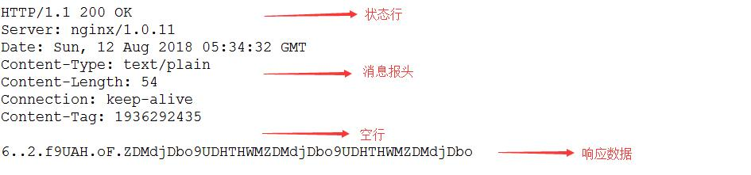

# 软件包介绍

WebClient 软件包是 RT-Thread 自主研发的，基于 HTTP 协议的客户端的实现，它提供设备与 HTTP Server 的通讯的基本功能。

## 软件包目录结构

WebClient 软件包目录结构如下所示：

```shell
webclient
+---docs 
│   +---figures                     // 文档使用图片
│   │   api.md                      // API 使用说明
│   │   introduction.md             // 介绍文档
│   │   principle.md                // 实现原理
│   │   README.md                   // 文档结构说明
│   │   samples.md                  // 软件包示例
│   │   user-guide.md               // 使用说明
│   +---version.md                  // 版本
+---inc                             // 头文件
+---src                             // 源文件
+---samples                         // 示例代码
│   │   webclient_get_sample        // GET 请求示例代码
│   +---webclient_post_sample       // POST 请求示例代码
│   LICENSE                         // 软件包许可证
│   README.md                       // 软件包使用说明
+---SConscript                      // RT-Thread 默认的构建脚本
```

## 软件包功能特点

WebClient 软件包功能特点：

- 支持 IPV4/IPV6 地址

    WebClient 软件包会自动根据传入的 URI 地址的格式判断是 IPV4 地址或 IPV6 地址，并且从其中解析出连接服务器需要的信息，提高代码兼容性。

- 支持 GET/POST 请求方法

    HTTP 有多种请求方法（GET、POST、PUT、DELETE等），目前 WebClient 软件包支持 GET 和 POST 请求方法，这也是嵌入式设备最常用到的两个命令类型，满足设备开发需求。

- 支持文件的上传和下载功能

    WebClient 软件包提供文件上传和下载的接口函数，方便用户直接通过 GET/POST 请求方法上传本地文件到服务器或者下载服务器文件到本地，文件操作需要文件系统支持，使用前需开启并完成文件系统的移植。

- 支持 HTTPS 加密传输

    HTTPS 协议（HyperText Transfer Protocol over Secure Socket Layer）和 HTTP 协议一样是基于 TCP 实现的，实际上是在原有的 HTTP 数据外部添加一层 TLS 加密的封装，从而达到加密传输数据的目的。HTTPS 协议地址区别于 HTTP 地址，是以 `https` 开头的。WebClient 软件包中的 TLS 加密方式依赖 [mbedtls 软件包](https://github.com/RT-Thread-packages/mbedtls) 实现。

- 完善的头部数据添加和处理方式

    HTTP 头部信息用于确定当前请求或响应的数据和状态信息，在发送 GET/POST 请求时头部的拼接成为用户操作的一大难题，正常的做法是手动逐行输入或使用字符串拼接方式，WebClient 软件包中提供简单的添加发送请求头部信息的方式，方便用户使用。对于请求返回的头部信息，往往用户需要获取头部字段数据，WebClient 软件包同样提供了 `通过字段名获取字段数据的方式`，方便获取需要的数据。

## HTTP 协议介绍

### HTTP 协议简述

HTTP （Hypertext Transfer Protocol）协议， 即超文本传输协议，是互联网上应用最为广泛的一种网络协议，由于其简捷、快速的方式，适用于分布式和合作式超媒体信息系统。HTTP 协议是基于 TCP/IP 协议的网络应用层协议。默认端口为 80 端口。协议最新版本是 HTTP 2.0，目前是用最广泛的是 HTTP 1.1。

HTTP 协议是一种请求/响应式的协议。一个客户端与服务器建立连接之后，发送一个请求给服务器。服务器接收到请求之后，通过接收到的信息判断响应方式，并且给予客户端相应的响应，完成整个 HTTP 数据交互流程。

浏览器网页是 HTTP 的主要应用方式，但这不代表 HTTP 只能应用于网页，实际上只要通信的双方遵循 HTTP 协议数据传输合适就可以进行数据交互，比如嵌入式领域设备通过 HTTP 协议与服务器连接。

### HTTP 协议特点

- 无状态协议

    HTTP 协议是`无状态协议`。无状态是指协议对于事件的处理没有记忆能力。这意味着如果后续处理需要前面的信息，则必须重传，这可能导致每次连接传送的数据量增大。这样的好处在于，在服务器不需要先前信息时它的应答就较快。

- 灵活的数据传输

    HTTP 允许传输任意类型的数据对象，传输的数据类型由 Content-Type 加以标记区分。

- 简单快速

    客户端向服务器发送请求时，只需要传送请求方式和路径。由于HTTP协议简单，使得HTTP服务器的程序规模小，因而通信速度很快。

- 支持 B/S 和 C/S 模式

    C/S 结构，即 Client/Server (客户机/服务器)结构。B/S 结构，即 Browser/Server (浏览器/服务器)结构。

### HTTP 协议请求信息 Request

 客户端发送一个HTTP请求到服务器的请求消息包括： **请求行**、**请求头部**、**空行**和**请求数据**四个部分组成。

 - 请求行：用于说明请求类型，用来说明请求类型,要访问的资源以及所使用的HTTP版本；

 - 请求头部：紧接着请求行（即第一行）之后的部分，用来说明服务器要使用的附加信息；

 - 空行：请求头部后面的空行是必须的，区分头部和请求数据；

 - 请求数据：请求数据也叫主体，可以添加任意的其他数据。

 如下图是一个 POST 请求的信息：


### HTTP 协议响应信息 Response

一般情况下，服务器接收并处理客户端发过来的请求后会返回一个HTTP的响应消息。HTTP响应也由四个部分组成，分别是：**状态行**、**消息报头**、**空行**和**响应数据**。

- 状态行：由 HTTP 协议号（HTTP 1.1），响应状态码（200），状态信息（OK）三部分组成；

- 消息报头：用来说明客户端要使用的一些附加信息（日期，数据长度等）；

- 空行：消息报头后面的空行是必须的，用于区分消息报头和响应数据；

- 响应数据：服务器返回给客户端的文本信息。

如下图是一个 POST 请求的响应的信息：



### HTTP 协议状态码

HTTP 协议中通过返回的状态码信息，判断当前响应状态，WebClient 软件包中也有对状态的获取和判断方式，这里主要介绍常见的状态码的意义。

状态代码有三位数字组成，第一个数字定义了响应的类别，共分五种类别:

- 1xx：指示信息--表示请求已接收，继续处理

- 2xx：成功--表示请求已被成功接收、理解、接受

- 3xx：重定向--要完成请求必须进行更进一步的操作

- 4xx：客户端错误--请求有语法错误或请求无法实现

- 5xx：服务器端错误--服务器未能实现合法的请求

常见的状态码有以下几种：
``` 
200 OK                        //客户端请求成功
206 Partial Content           //服务器已经成功处理了部分 GET 请求
400 Bad Request               //客户端请求有语法错误，不能被服务器所理解
403 Forbidden                 //服务器收到请求，但是拒绝提供服务
404 Not Found                 //请求资源不存在，eg：输入了错误的URL
500 Internal Server Error     //服务器发生不可预期的错误
503 Server Unavailable        //服务器当前不能处理客户端的请求
```