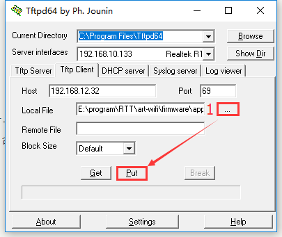
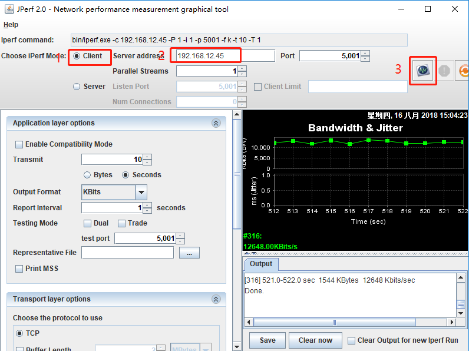
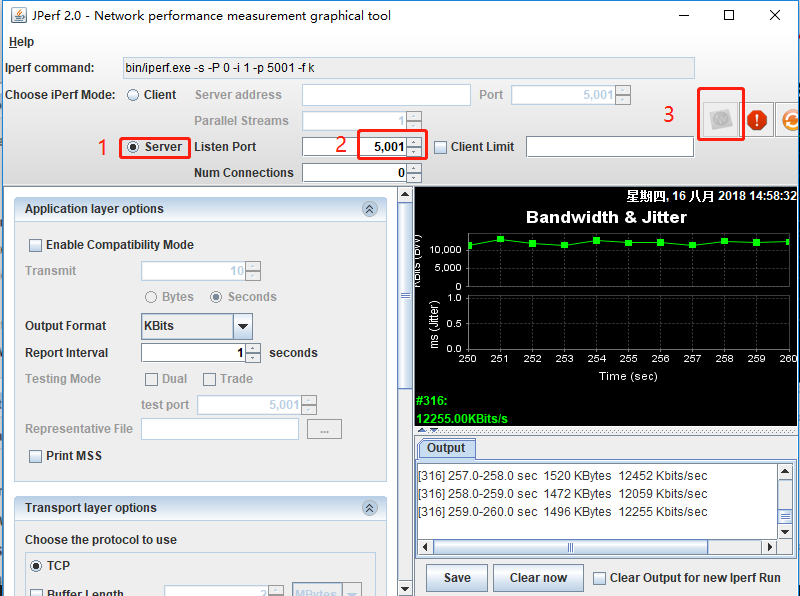

# 网络小工具集使用例程

## 简介

netutils 是一个包含众多简洁好用网络工具的软件包，利用该软件包，可以给开发者在调试网络功能时带来很多便利。当需要使用一些调试网络的小工具时，只需要拥有 netutils 软件包就够了，堪称网络功能调试界的瑞士军刀。

本例程展示如何在 IoT Board 开发板上使用 netutils 软件包的各种功能。

## 硬件说明

本例程需要依赖 IoT Board 板卡上的 WiFi 模块完成网络通信，因此请确保硬件平台上的 WiFi 模组可以正常工作。

## 软件说明

### 主函数代码说明

在主函数中进行了如下操作：

1. 配置 wlan 的自动连接功能并开启自动连接。
2. 文件系统功能的初始化。

```c
int main(void)
{
    /* 配置 wlan 自动连接功能的依赖项 */
    wlan_autoconnect_init();

    /* 开启 wlan 自动连接 */
    rt_wlan_config_autoreconnect(RT_TRUE);

    /* 初始化文件系统 */
    fs_init();

    return 0;
}
```

### netutils 软件包文件结构说明

下面是 RT-Thread netutils 软件包功能的分类和简介：

|名称|分类|功能简介|
|:--|:---:|:--|
| Ping |调试测试|利用“ping”命令可以检查网络是否连通，可以很好地帮助我们分析和判定网络故障|
| NTP |时间同步|网络时间协议|
| TFTP |文件传输|TFTP是一个传输文件的简单协议，比 FTP 还要轻量级|
| Iperf |性能测试|测试最大 TCP 和 UDP 带宽性能，可以报告带宽、延迟抖动和数据包丢失|
| NetIO |性能测试|测试网络的吞吐量的工具|
| Telnet |远程访问|可以远程登录到 RT-Thread 的 Finsh/MSH Shell|
| tcpdump |网络调试|tcpdump 是 RT-Thread 基于 lwIP 的网络抓包工具|

netutils 软件包文件结构如下所示：

```c
netutils               // netutils 文件夹
    ├──iperf           // iperf 网络性能测试
    ├──netio           // netio 网络吞吐量测试
    ├──ntp             // ntp 时间同步功能
    ├──ping            // ping 功能
    ├──tcpdump         // 网络抓包工具
    ├──telnet          // telnet 服务器
    ├──tftp            // TFTP 功能
    └──tools           // 网络测试工具
```
## 运行

### 编译&下载

- **MDK**：双击 `project.uvprojx` 打开 MDK5 工程，执行编译。
- **IAR**：双击 `project.eww` 打开 IAR 工程，执行编译。

编译完成后，将开发板的 ST-Link USB 口与 PC 机连接，然后将固件下载至开发板。

### 运行效果

#### 准备工作

由于在使用 TFTP 功能向系统内传输文件时需要文件系统的支持，所以系统在初始化时会进行文件系统相关功能的初始化。如果在指定的存储器分区上没有可挂载文件系统，可能会出现文件系统挂载失败的情况。此时需要在 msh 中执行  `mkfs -t elm filesystem` 命令，该命令会在存储设备中名为 “filesystem” 的分区上创建 elm 类型的文件系统。

文件系统正常初始化提示信息如下：

```c
 \ | /
- RT -     Thread Operating System
 / | \     4.0.1 build Mar 27 2019
 2006 - 2019 Copyright by rt-thread team
lwIP-2.0.2 initialized!
[I/SAL_SKT] Socket Abstraction Layer initialize success.
[SFUD] Find a Winbond flash chip. Size is 16777216 bytes.
[SFUD] w25q128 flash device is initialize success.
msh />[I/FAL] RT-Thread Flash Abstraction Layer (V0.2.0) initialize success.
[I/OTA] RT-Thread OTA package(V0.1.3) initialize success.
[I/OTA] Verify 'wifi_image' partition(fw ver: 1.0, timestamp: 1529386280) success.
[I/WICED] wifi initialize done. wiced version 3.3.1
[I/WLAN.dev] wlan init success
[I/WLAN.lwip] eth device init ok name:w0
[Flash] EasyFlash V3.2.1 is initialize success.
[Flash] You can get the latest version on https://github.com/armink/EasyFlash .
[I/FAL] The FAL block device (filesystem) created successfully
# 在 flash 的文件系统分区上创建块设备成功
[D/main] Create a block device on the filesystem partition of flash successful.
# 文件系统初始化成功
[D/main] Filesystem initialized!
```

#### 连接无线网络

程序运行后会进入 MSH 命令行，等待用户配置设备接入网络。使用 MSH 命令 `wifi join ssid key` 配置网络，如下所示：

```c
msh />wifi join ssid_test router_key_xxx
join ssid:ssid_test
[I/WLAN.mgnt] wifi connect success ssid:ssid_test
msh />[I/WLAN.lwip] Got IP address : 152.10.200.224
```

#### Ping工具

[Ping](https://baike.baidu.com/item/ping/6235) 是一种网络诊断工具，用来测试数据包能否通过 IP 协议到达特定主机。估算与主机间的丢失数据包率（丢包率）和数据包往返时间。

Ping 支持访问 `IP 地址` 或 `域名` ，使用 Finsh/MSH 命令进行测试，大致使用效果如下：  

- Ping 域名  

```c
msh />ping rt-thread.org
60 bytes from 116.62.244.242 icmp_seq=0 ttl=49 time=11 ticks
60 bytes from 116.62.244.242 icmp_seq=1 ttl=49 time=10 ticks
60 bytes from 116.62.244.242 icmp_seq=2 ttl=49 time=12 ticks
60 bytes from 116.62.244.242 icmp_seq=3 ttl=49 time=10 ticks
msh />
```
- Ping IP

```c
msh />ping 192.168.10.12
60 bytes from 192.168.10.12 icmp_seq=0 ttl=64 time=5 ticks
60 bytes from 192.168.10.12 icmp_seq=1 ttl=64 time=1 ticks
60 bytes from 192.168.10.12 icmp_seq=2 ttl=64 time=2 ticks
60 bytes from 192.168.10.12 icmp_seq=3 ttl=64 time=3 ticks
msh />
```

#### NTP工具
[NTP](https://baike.baidu.com/item/NTP) 是网络时间协议(Network Time Protocol)，它是用来同步网络中各个计算机时间的协议。在 netutils 软件包实现了 NTP 客户端，连接上网络后，可以获取当前 UTC 时间，并更新至 RTC 中。

开启 RTC 设备后，可以使用下面的命令同步 NTP 的本地时间至 RTC 设备。

Finsh/MSH 命令效果如下：

```c
msh />ntp_sync               # 同步 NTP 网络时间到 RTC 设备
Get local time from NTP server: Fri Sep 21 09:39:15 2018
The system time is updated. Timezone is 8.
msh />date                   # 打印当前时间
Fri Sep 21 09:39:47 2018
```

####  TFTP工具

[TFTP](https://baike.baidu.com/item/TFTP) （Trivial File Transfer Protocol, 简单文件传输协议）是 TCP/IP 协议族中的一个用来在客户机与服务器之间进行简单文件传输的协议，提供不复杂、开销不大的文件传输服务，端口号为 **69** ，比传统的 FTP 协议要轻量级很多，适用于小型的嵌入式产品上。

TFTP 工具的准备工作需要下面两个步骤：

- 安装 TFTP 客户端

安装文件位于 `packages/netutils-v1.0.0/tools/Tftpd64-4.60-setup.exe` ，使用 TFTP 前，请先安装该软件。

- 启动 TFTP 服务器

在传输文件前，需要在 RT-Thread 上使用 Finsh/MSH 命令来启动 TFTP 服务器，大致效果如下：

```c
msh />tftp_server
TFTP server start successfully.
msh />
```

- 连接 RT-Thread 操作系统

打开刚安装的 `Tftpd64` 软件，按如下操作进行配置：

1、选择 `Tftp Client` ；

2、在 `Server interfaces` 下拉框中，务必选择与 RT-Thread 处于同一网段的网卡；

3、填写 TFTP 服务器的 IP 地址。可以在 RT-Thread 的 MSH 下使用 `ifconfig` 命令查看；

4、填写 TFTP 服务器端口号，默认： `69` 


**向 RT-Thread 发送文件**

1、在 `Tftpd64` 软件中，选择好要发送文件；

2、`Remote File` 是服务器端保存文件的路径（包括文件名），选项支持相对路径和绝对路径。由于 RT-Thread 默认开启 `DFS_USING_WORKDIR` 选项，此时相对路径是基于 Finsh/MSH 当前进入的目录。所以，使用相对路径时，务必提前切换好目录； 

3、点击 `Put` 按钮即可。

如下图所示，将文件发送至 Finsh/MSH 当前进入的目录下，这里使用的是 **相对路径** ：



> 注意：如果 `DFS_USING_WORKDIR` 未开启，同时 `Remote File` 为空，文件会将保存至根路径下。

**从 RT-Thread 获取文件**

1、在 `Tftpd64` 软件中，填写好要接收保存的文件路径（包含文件名）；

2、`Remote File` 是服务器端待接收回来的文件路径（包括文件名），选项支持相对路径和绝对路径。由于 RT-Thread 默认开启 `DFS_USING_WORKDIR` 选项，此时相对路径是基于 Finsh/MSH 当前进入的目录。所以，使用相对路径时，务必提前切换好目录；

3、点击 `Get` 按钮即可。

如下所示，将 `/web_root/image.jpg` 保存到本地，这里使用的是 **绝对路径** ：

```c
msh /web_root>ls           # 查看文件是否存在
Directory /web_root:
image.jpg           10559                    
msh /web_root>
```


#### Iperf工具

[Iperf](https://baike.baidu.com/item/iperf) 是一个网络性能测试工具。Iperf 可以测试最大 TCP 和 UDP 带宽性能，具有多种参数和 UDP 特性，可以根据需要调整，可以报告带宽、延迟抖动和数据包丢失。Iperf 使用的是主从式架构，即一端是服务器，另一端是客户端，在软件包中 Iperf 实现了 TCP 服务器模式和客户端模式，暂不支持 UDP 测试吗，下面将具体讲解这两种模式的使用方法。

**Iperf 服务器模式**

1. 获取 IP 地址

在 RT-Thread 上获取 IP 地址需要执行如下命令：

```c
msh />ifconfig
network interface: e0 (Default)
MTU: 1500
MAC: 00 04 9f 05 44 e5 
FLAGS: UP LINK_UP ETHARP
ip address: 192.168.12.71
gw address: 192.168.10.1
net mask  : 255.255.0.0
dns server #0: 192.168.10.1
dns server #1: 223.5.5.5
```
记下获得的 IP 地址 192.168.12.71（按实际情况记录）

2. 启动 Iperf 服务器 

在 RT-Thread 上启动 Iperf 服务器需要执行如下命令： 

```
msh />iperf -s -p 5001
```

参数 -s 的意思是表示作为服务器启动，参数 -p 表示监听 5001 端口。

3. 安装 JPerf 测试软件

安装文件位于 `packages/netutils-v1.0.0/tools/jperf.rar` ，这个是绿色软件，安装实际上是解压的过程，解压到新文件夹即可。 

4. 进行 jperf 测试

打开 `jperf.bat` 软件，按如下操作进行配置： 

1、 选择 `Client` 模式；

2、 输入刚刚获得的 IP 地址 192.168.12.71（按实际地址填写），修改端口号为 5001；

3、 点击 `run Lperf!` 开始测试；

4、 等待测试结束。测试时，测试数据会在 shell 界面和 JPerf 软件上显示。



**Iperf 客户端模式**

1. 获取 PC 的 IP 地址

在 PC 的命令提示符窗口上使用 ipconfig 命令获取 PC 的 IP 地址，记下获得的 PC IP 地址为 192.168.12.45（按实际情况记录）。

2. 安装 JPerf 测试软件

安装文件位于 `netutils/tools/jperf.rar` ，这个是绿色软件，安装实际上是解压的过程，解压到新文件夹即可。 

3. 开启 jperf 服务器

打开 `jperf.bat` 软件，按如下操作进行配置： 

1、选择 `Server` 模式；

2、修改端口号为 5001；

3、点击 `run Lperf!` 开启服务器；

4. 启动 Iperf 客户端

在 RT-Thread 上启动 Iperf 客户端需要执行如下命令： 

```
msh />iperf -c 192.168.12.45 -p 5001
```

参数 -c 表示作为客户端启动，后面需要加运行服务器端的pc的 IP 地址，参数 -p 表示连接 5001 端口。等待测试结束，数据会在 shell 界面和  JPerf 软件上显示。



#### 更多网络调试工具

除了上述常用的网络工具，netutils 软件包也提供一些开发调试中比较实用的网络工具，如 NetIO 工具、Telnet 工具和 tcpdump 工具。 这些工具的使用方法可以参考软件包功能目录下的说明文件。

## 注意事项

准备工作中，执行挂载文件系统操作之前要确保存储设备中有相应类型的文件系统，否则会挂载失败。


## 引用参考

- 《RT-Thread 网络工具集 (NetUtils) 应用笔记》: docs/AN0018-RT-Thread-网络工具集应用笔记.pdf
