# RT-Thread 设备维护云平台接入例程

本例程演示如何使用 RT-Thread 提供的 CloudSDK 库接入 RT-Thread 云平台，实现远程 Shell 控制 、远程 Log 存储 和 OTA 升级功能。初次使用 RT-Thread 云平台的用户请先阅读 《RT-Thread 云平台用户手册》(docs/UM1008-RT-Thread-设备维护云平台用户手册.pdf)。

## 平台简介

[RT-Thread 云平台](http://iot.rt-thread.com) 是由上海睿赛德电子科技有限公司开发的一套物联网设备维护云平台 。其目的是帮助开发者搭建安全有效的数据传输通道，方便设备终端和云端的双向通讯，在云端实现设备的升级、维护与管理功能。

该云平台旨在对接入产品和设备进行安全且高效的管理，可以实现对设备的远程操控、日志存储管理以及对固件的版本管理功能，帮助开发者快速搭建稳定可靠的物联网设备维护云平台。

## 主要功能

- **Web Shell 功能**

  RT-Thread 云平台实现远程 Shell 控制功能，用户无需连接串口设备即可完成对设备的控制、管理，满足用户对设备远程管理的需求。

- **Web Log 功能**

  RT-Thread 云平台实现设备日志的实时显示和存储功能，方便设备数据的采集以及设备状态的查看功能，用户可以通过 Web Log 随时查看设备动态及设备日志历史记录。

- **OTA 升级功能**

  RT-Thread 云平台实现设备远程升级功能，OTA 功能支持加密压缩升级、多固件升级、断点续传，满足用户对多种设备的 OTA 升级需求。

## 硬件说明

本例程需要依赖 IoTBoard 板卡上的 WiFi 模块完成网络通信，因此请确保硬件平台上的 WiFi 模组可以正常工作。

## 软件说明

### 准备工作

在使用本例程前需要先在 [RT-Thread 云平台](http://iot.rt-thread.com) 注册账号，使用该账号在云平台中创建新产品，然后使用设备唯一标识符**SN**（该示例中 **SN** 可以由用户自定义）在云端创建新设备，具体的流程参考《RT-Thread 云平台用户手册》(docs/UM1008-RT-Thread-设备维护云平台用户手册.pdf)。

产品和设备创建完成后，记录下**产品信息**页面的**产品ID（ProductID**）和 **产品密钥（ProductKey，通常需要手动点开查看）**。下图为本次演示使用的 **ProductID** 和 **ProductKey** 位置：

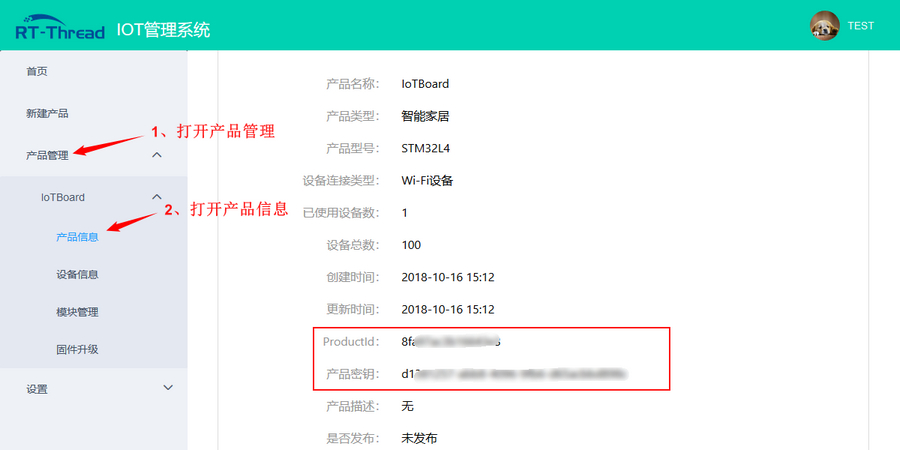

### 例程移植

#### 移植流程

打开 `/examples/25_cloud_rtt/ports/cloudsdk/rt_cld_port.c` 文件，找到 `CLD_SN`，`CLD_PRODUCT_ID`，`CLD_PRODUCT_KEY` 这 三个宏定义，将原来的内容替换成刚刚记录下来的 **ProductIdD** 和 **ProductKey**，**SN** 替换成云端创建设备时使用的 **SN**，保存文件，重新编译烧写程序，完成移植。（OTA 相关移植函数根据用户需求自定义实现，本例程使用默认接口不需要修改）

#### 移植接口介绍

本例程移植主要是对 `/examples/25_cloud_rtt/ports/cloudsdk/rt_cld_port.c` 文件中用户自定义函数的实现。主要移植接口介绍如下：

**SN获取接口实现**

```c
void cld_port_get_device_sn(char *sn);
```

获取 SN（设备唯一标识符），注意与云端新建设备时使用的 SN 一致，格式为不大于32字节长的随机字符串形式，例如：`EF4016D6658466CA3E3610`。

**产品ID获取接口实现**

```c
void cld_port_get_product_id(char *id);
```

获取产品ID（ProductID），产品 ID 可以产品信息页面查询。

**产品密钥获取接口实现**

```c
void cld_port_get_product_key(char *key);
```

获取产品密钥（ProductKey），产品密钥可以产品信息页面查询。

**OTA 启动接口实现**

```c
void cld_port_ota_start(void);
```

用于 OTA 升级任务启动前，配置相关参数或执行相关操作，若不需要可置为空。

**OTA 结束接口实现**

```c
void cld_port_ota_end(enum cld_ota_status status);
```

用于 OTA 升级结束后，根据 OTA 升级状态进行相应处理，例如： OTA 成功后设备复位进入 bootloader。

| OTA 升级状态  | 介绍             |
| ------------- | ---------------- |
| CLD_OTA_OK    | OTA 升级成功     |
| CLD_OTA_ERROR | OTA 升级失败     |
| CLD_OTA_NOMEM | OTA 升级内存不足 |

### 例程说明

本例程主要实现了连接 WiFi 成功后设备自动连接 RT-Thread 云平台。

在 main 函数中，主要完成了以下两个任务：

- 注册 CloudSDK 启动函数为 WiFi 连接成功的回调函数
- 启动 WiFi 自动连接功能

  当 WiFi 连接成功后，会调用 `/libraries/cloudsdk/libs` 目录下库文件中的 `rt_cld_init` 云端初始化函数，完成设备自动连接云端任务。

## 运行

因为本次例程需要演示 OTA 升级，而 OTA 升级需要使用 bootloader 提供的功能，所以在烧录应用代码之前需要先烧录 bootloader。

### 烧录 bootloader.bin

**ST-LINK Utility 烧录**

1. 解压 `/tools/ST-LINK Utility.rar` 到当前目录（解压后有 **/tools/ST-LINK Utility** 目录）

2. 打开 **/tools/ST-LINK Utility** 目录下的 **STM32 ST-LINK Utility.exe** 软件

3. 点击菜单栏的 **Target** --> **Connect** 连接到开发板，如下图所示：

    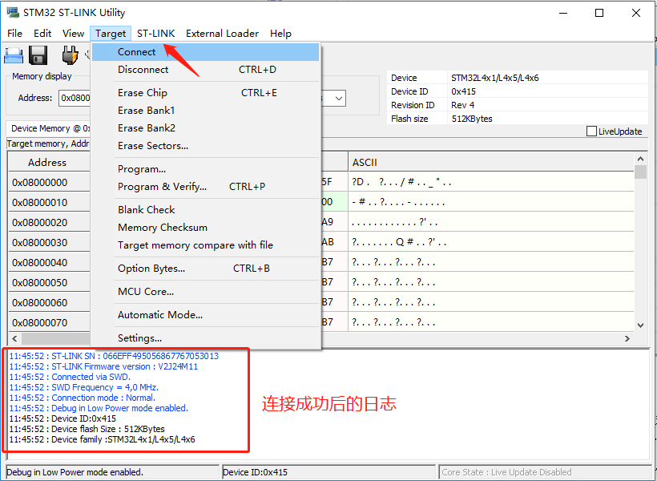

4. 打开 **/examples/25_iot_cloud_rtt/bin/bootloader.bin** 文件

    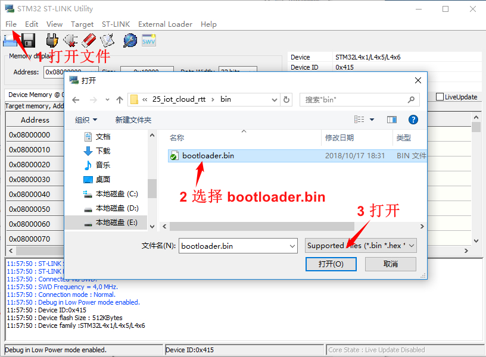

5. 烧录

    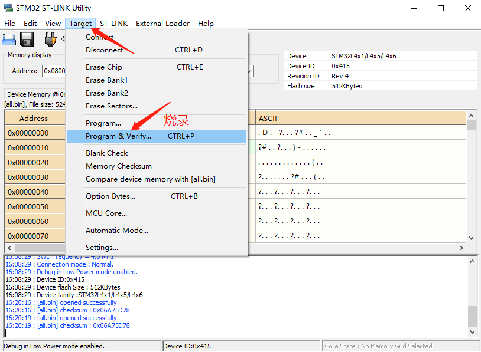

    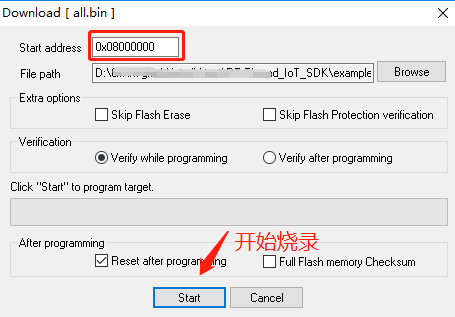

### 编译&下载

- **MDK**：双击 `project.uvprojx` 打开 MDK5 工程，执行编译。
- **IAR**：双击 `project.eww` 打开 IAR 工程，执行编译。

bootloader 烧录完成之后，编译例程代码，将开发板的 ST-Link USB 口与 PC 机连接，然后将固件下载至开发板。

程序运行日志如下所示：

```shell
[SFUD]Find a Winbond W25Q128 flash chip. Size is 16777216 bytes.
[SFUD](..\components\sfud\src\sfud.c:724) Flash device reset success.
[SFUD]norflash0 flash device is initialize success.

RT-Thread Bootloader Starting...
[D/FAL] (fal_flash_init:61) Flash device |             onchip_flash | addr: 0x08000000 | len: 0x00080000 | blk_size: 0x00000800 |initialized finish.
[D/FAL] (fal_flash_init:61) Flash device |                nor_flash | addr: 0x00000000 | len: 0x01000000 | blk_size: 0x00001000 |initialized finish.
[I/FAL] ==================== FAL partition table ====================
[I/FAL] | name         | flash_dev    |   offset   |    length  |
[I/FAL] -------------------------------------------------------------
[I/FAL] | bootloader   | onchip_flash | 0x00000000 | 0x00010000 |
[I/FAL] | app          | onchip_flash | 0x00010000 | 0x00070000 |
[I/FAL] | easyflash    | nor_flash    | 0x00000000 | 0x00080000 |
[I/FAL] | download     | nor_flash    | 0x00080000 | 0x00100000 |
[I/FAL] | wifi_image   | nor_flash    | 0x00180000 | 0x00080000 |
[I/FAL] | font         | nor_flash    | 0x00200000 | 0x00700000 |
[I/FAL] | filesystem   | nor_flash    | 0x00900000 | 0x00700000 |
[I/FAL] =============================================================
[I/FAL] RT-Thread Flash Abstraction Layer (V0.2.0) initialize success.
[I/OTA] RT-Thread OTA package(V0.1.2) initialize success.
[I/OTA] Verify 'bootloader' partition(fw ver: 0.1.0, timestamp: 1535697252) success.
[I/OTA] Verify 'app' partition(fw ver: 1.0.0, timestamp: 1539410981) success.
Find user application success.
The Bootloader will go to user application now.    /* bootloader 跳转到 app */
 \ | /
- RT -     Thread Operating System
 / | \     4.0.1 build Mar 27 2019
 2006 - 2019 Copyright by rt-thread team
lwIP-2.0.2 initialized!
[I/SAL_SKT] Socket Abstraction Layer initialize success.
[SFUD] Find a Winbond flash chip. Size is 16777216 bytes.
[SFUD] w25q128 flash device is initialize success.
msh />[I/FAL] RT-Thread Flash Abstraction Layer (V0.2.0) initialize success.
[I/OTA] RT-Thread OTA package(V0.1.3) initialize success.
[I/OTA] Verify 'wifi_image' partition(fw ver: 1.0, timestamp: 1529386280) success.
[I/WICED] wifi initialize done. wiced version 3.3.1
[I/WLAN.dev] wlan init success
[I/WLAN.lwip] eth device init ok name:w0
[Flash] EasyFlash V3.2.1 is initialize success.
[Flash] You can get the latest version on https://github.com/armink/EasyFlash .
[D/main] The current version of APP firmware is 1.0.0
```

### 连接无线网络

程序运行后会进入 MSH 命令行，等待用户配置设备接入网络。使用 MSH 命令 `wifi join <ssid> <password>` 可以让设备接入网络，如下所示：

```shell
msh />wifi join ssid_test 12345678
join ssid:ssid_test
[I/WLAN.mgnt] wifi connect success ssid:ssid_test
.......
msh />[I/WLAN.lwip] Got IP address : 152.10.200.224    
```

### 设备自动上线

网络连接成功，程序会自动进行RT-Thread 云平台初始化，设备自动上线，如下所示：

```shell
[I/cld] The device has been activated successfully!
[I/cld.mqtt] CloudSDK MQTT server is startup!
[I/cld] RT-Thread CloudSDK package(V2.0.0) initialize success.
[I/WLAN.lwip] Got IP address : 192.168.1.123 
[I/MQTT] MQTT server connect success
[I/MQTT] Subscribe #0 /device/12345678/abcdefgh/# OK!
```

### Web Shell 功能

Web Shell 的实现基于 TCP/IP 协议和 MQTT 协议， 主要作用是实现远程 Shell 控制功能，用户无需连接串口设备即可在云端完成设备的管理和调试，并且实时显示设备打印信息。

设备上线成功，云端点击`设备信息`->（设备)详情`->`shell：连接`，在云端实现 Shell 控制台功能：

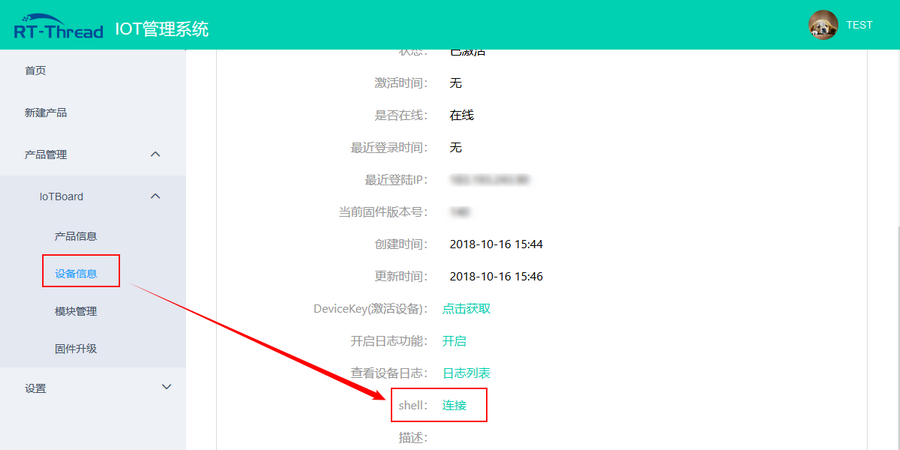

点击连接之后，设备端控制台将切换到云端显示。类似于 Shell 控制台，此时在云端输入命令可以得到相应响应，如下图所示：

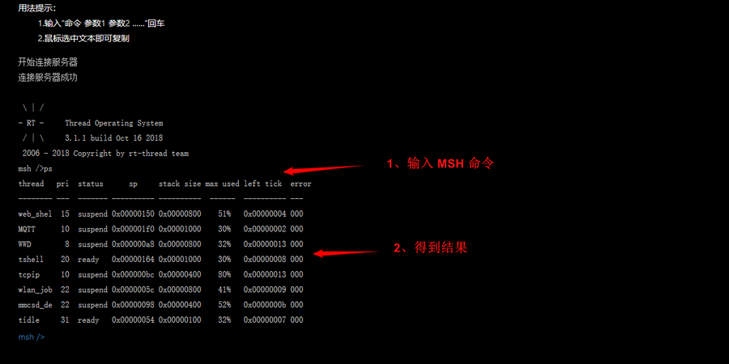

### Web Log 功能

Web Log 与 Web Shell 类似 ，主要作用是实现对 Shell 控制台输入输出日志的存储和查询功能。它与 Web Shell 主要的区别是 Web Shell 功能是对 Shell 控制台输入输出的实时显示与管理控制，Web Log 功能是对 Shell 控制台输入输出的记录存储，方便后期查看。

设备上线成功，云端点击`设备信息`->`设备详情`->`开启日志功能：开启 `，云端开启设备 Web Log 日志记录功能，设备控制台的输入输出日志会发送到云端记录保存， 再次点击`开启日志功能：关闭 `可关闭日志功能。

Web Log 功能自带超时处理机制，开启 Web Log 功能后 5 分钟内无数据传输，服务器会主动关闭 Web Log 功能。


开启 Web Log 功能后，可在本地 MSH 命令行中输入 `ps`  命令查看当前线程状态，显示的日志会发送到云端并存储在`日志列表`中，之后在云端点击`查看设备日志：日志列表`，可以查看历史日志信息 。

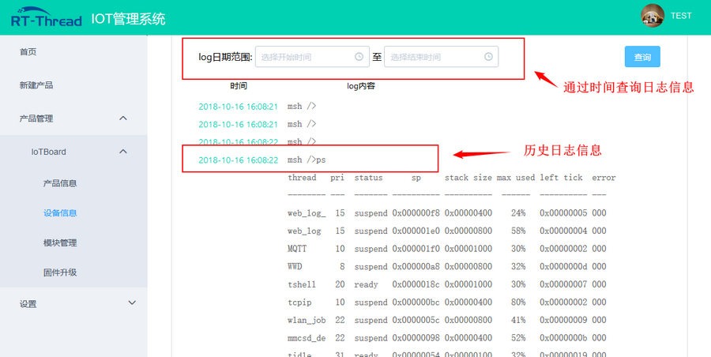

### OTA 升级功能

RT-Thread 云平台 OTA 升级功能可以实现设备远程升级。相比于其他的设备升级方式，RT-Thread 云平台具有以下特点：

- 可适配不同型号的 flash 或文件系统
- 支持云端加密数据传输
- 支持固件加密和压缩功能
- 支持**断点续传**功能
- 支持**多固件升级**功能

#### 制作升级固件 

云端 OTA 升级时所需的固件文件需要特定的格式固件支持，为此我们提供 `RT-Thread OTA 固件打包器`，位于 `/tools/ota_packager/rt_ota_packaging_tool.exe` 。固件打包工具可以将原格式固件文件做加密、压缩处理，生成特定格式 （`.rbl 后缀`）的升级固件文件，用于后期上传至云端及在云端建立升级任务。

以 **25_iot_cloud_rtt** 例程为基础，制作用于 OTA 升级演示所用到的 **app 固件**。

1. **MDK**：双击 `project.uvprojx` 打开 MDK5 工程

2. **IAR**：双击 `project.eww` 打开 IAR 工程

3. 修改 `/examples/25_iot_cloud_rtt/application/main.c` 中的版本号 `#define APP_VERSION  "1.0.0"` 为 `#define APP_VERSION  "2.0.0"`

4. 编译得到 `rt-thread.bin`，文件位置 `/examples/25_iot_cloud_rtt/rt-thread.bin`

5. 使用 OTA 固件打包工具打包生成 `rt-thread.rbl` 文件

OTA 固件打包工具的界面如下图所示：

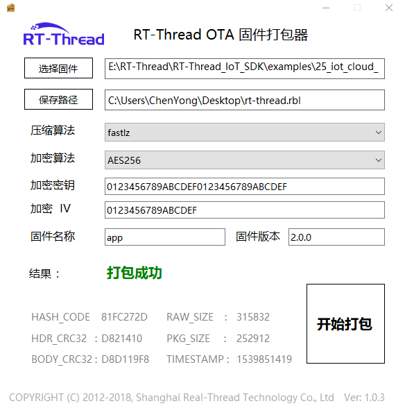

**工具使用方式** 

用户可以根据需求，选择是否对固件进行加密和压缩，工具提供多种压缩和加密算法支持。具体操作步骤如下：

1. 选择待打包的固件（`/examples/25_iot_cloud_rtt/rt-thread.bin`）

2. 选择生成固件的位置

3. 选择压缩算法（本例程使用 **FastLZ**，不压缩则留空）

4. 选择加密算法（本例程使用 **AES256**，不加密则留空）

5. 配置加密密钥（不加密则留空）

6. 配置加密 IV （不加密则留空）

7. 填写固件名称（对应分区名称，这里为 app）

8. 固件版本号（填写 `/examples/25_iot_cloud_rtt/application/main.c` 中的版本号 2.0.0）

9. 开始打包

通过以上步骤制作完成的 `rt-thread.rbl` 文件即可用于后续的升级文件。

**Note：**

- **加密密钥** 和 **加密 IV** 必须与 bootloader 程序中的一致，否则无法正确加解密固件

  默认提供的 bootloader.bin 支持加密压缩，使用的 **加密密钥** 为 `0123456789ABCDEF0123456789ABCDEF`，使用的 **加密 IV** 为 `0123456789ABCDEF`。

- 固件打包过程中有 **`固件名称`** 的填写，这里注意需要填入 Flash 分区表中对应分区的名称，不能有误

  如果要升级 **app** 程序，则填写 `app`，如果升级 **WiFi 固件**，则填写 `wifi_image`。

- 使用 **OTA 打包工具**制作升级固件 `rt-thread.rbl`

  正确填写固件名称为 **app**，版本号填写 `main.c` 中定义的版本号 **2.0.0**。


#### OTA 升级流程

**固件信息：**

`rtthread.rbl`：固件名称为 **app**，固件版本为 **2.0.0**，压缩算法为 **FastLZ**，加密算法为 **AES256**  

**固件上传：**

生成的固件需要上传到云端进行管理，用于在云端新建升级任务。点击`模块管理`->`添加固件`，选择 OTA 打包工具生成的 `rtthread.rbl` 文件，上传到云端，如下图所示方式：

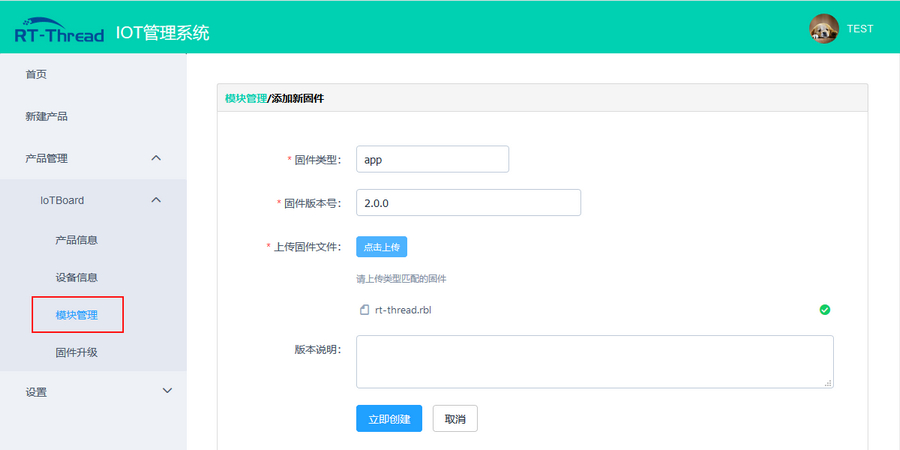

- 固件类型 : 固件分区名称，与**工具生成固件时填入固件名称一致**；
- 固件版本号：需要与**工具生成固件时填入固件版本一致**，且**不同于**云端最新版本号；

**新建OTA任务：**

固件上传成功后，可以通过云端新建 OTA 升级任务（支持多固件升级），云端点击`固件升级`->`新建OTA版本` 选出刚才上传的固件建立 OTA 升级任务，之后云端会向设备推送升级请求，对设备进行升级。

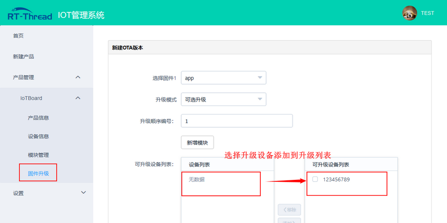

- 升级模式：

        强制升级：下发升级任务，设备立刻执行下载升级
        可选升级：下发升级任务，用户可自定义执行下载升级的条件
        静默升级：下发升级任务，设备无提示执行下载升级

- 升级顺序：多个固件升级时，用户可自定义多个固件的升级顺序，云端下发升级任务，设备会根据固件升级顺序依次来升级固件；
- 可升级列表：用户可自定义添加需要升级的设备到设备列表中，云端将下发本次升级任务到设备列表中的设备上；

**设备OTA升级：**

云端升级任务创建成功之后，云端会通过 MQTT 协议下发固件升级信息，设备获取升级信息后会下载新的固件。若为**多固件升级**，设备每次升级完一个固件会重启一次，直到最后一个固件升级成功。如果升级过程中若出现断电或者下载失败，设备支持**断点续传**功能，避免固件重复下载，减少固件升级时间。下图为固件下载过程：

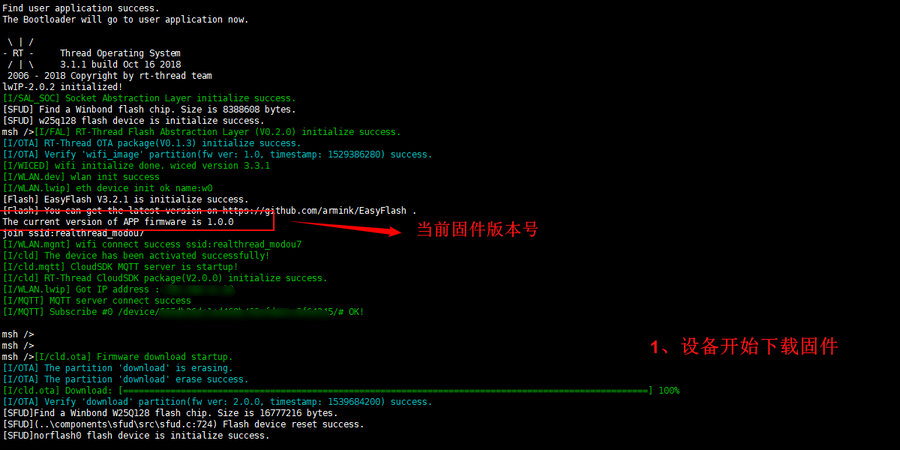

设备固件下载完成之后，程序会自动跳转到 bootloader 中运行，bootloader 会对固件进行解压解密，并将固件拷贝到指定的应用分区（这里是 **app** 分区）。bootloader 中解压解密和升级成功后设备状态如下图所示：

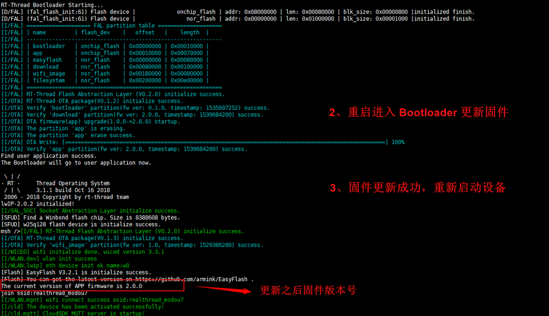

设备升级完成后会自动运行新的固件，从上图中的日志上可以看到，app 固件已经从 **1.0.0 版本**升级到了 **2.0.0 版本**，设备 OTA 升级完成。

更多详细介绍，请阅读《RT-Thread 云平台用户手册》(docs/UM1008-RT-Thread-设备维护云平台用户手册.pdf)。

## 注意事项

- 使用本例程前请先修改 `examples/25_cloud_rtt/ports/cloudsdk/rt_cld_port.c` 里的两个 RT-Thread 云平台宏定义(`CLD_SN`，`CLD_PRODUCT_ID`，`CLD_PRODUCT_KEY`)；
- 设备上电自动激活过程若出现 **400 错误**，检查 port 文件中修改的 SN 是否和云端注册时使用的一致；
- Web Log 功能开启后不能使用 Web Shell 功能；
- OTA 固件打包工具中使用的加密密钥和 IV ，需要使用默认的加密密钥和 IV，不支持自定义设置，如需定制可改动版请与 RT-Thread 官方联系 。

## 引用参考

- 《RT-Thread 云平台用户手册》: docs/UM1008-RT-Thread-设备维护云平台用户手册.pdf

