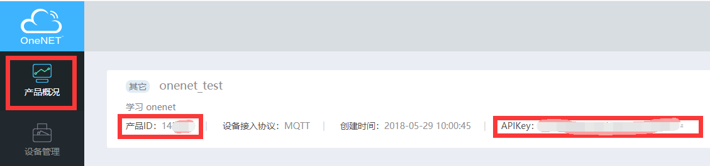
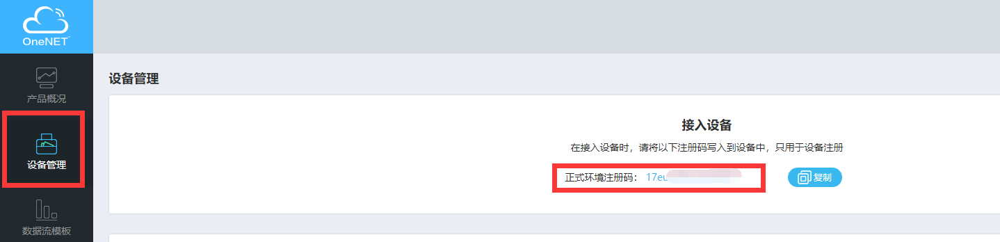
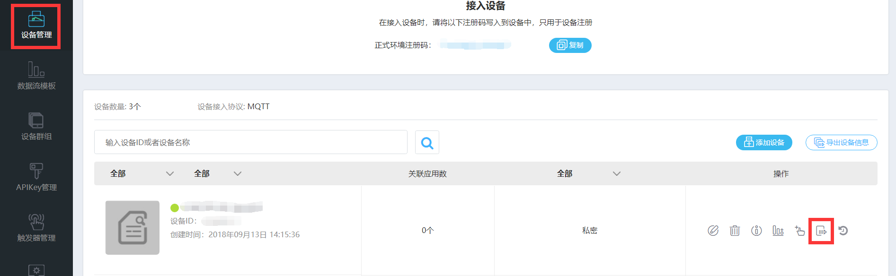
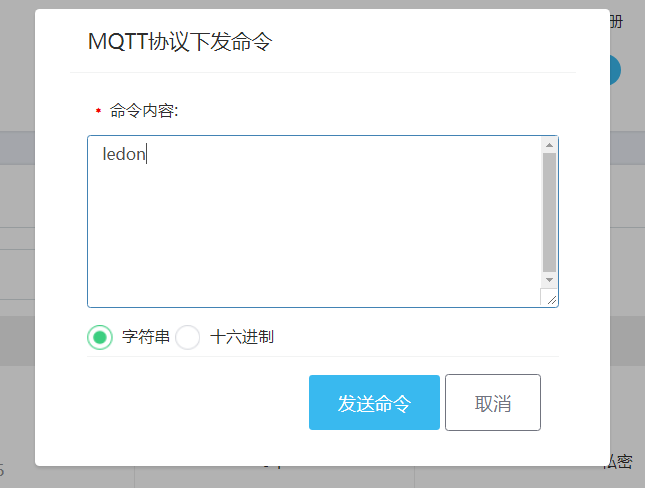

# 中国移动 OneNET 云平台接入例程

本例程演示如何使用 RT-Thread 提供的 onenet 软件包接入中国移动物联网开放平台，介绍如何通过 MQTT 协议接入 OneNET 平台，初次使用 OneNET 平台的用户请先阅读[《OneNET 用户手册》](https://www.rt-thread.org/document/site/submodules/onenet/docs/introduction/)。

## 简介

OneNET 平台是中国移动基于物联网产业打造的生态平台，具有高并发可用、多协议接入、丰富 API 支持、数据安全存储、快速应用孵化等特点。OneNET 平台可以适配各种网络环境和协议类型，现在支持的协议有LWM2M（NB-IOT）、EDP、MQTT、HTTP、MODBUS、JT\T808、TCP透传、RGMP等。用户可以根据不同的应用场景选择不同的接入协议。

onenet 软件包是 RT-Thread 针对 OneNET 平台做的适配，通过这个软件包可以让设备在 RT-Thread 上非常方便的连接 OneNet 平台，完成数据的发送、接收、设备的注册和控制等功能。

## 硬件说明

onenet 例程需要依赖 IoTBoard 板卡上的 WiFi 模块完成网络通信，因此请确保硬件平台上的 WiFi 模组可以正常工作。

## 准备工作

### 创建设备

在使用本例程前需要在 OneNET 平台注册账号，并在帐号里创建产品，具体的流程参考[《OneNET 示例说明》](https://www.rt-thread.org/document/site/submodules/onenet/docs/samples/)。产品创建完成后，记录下产品概况页面的产品 ID 和 APIKey。



切换到设备管理界面，记录下设备注册码。



打开 `/examples/26_cloud_onenet/rtconfig.h`，找到 `ONENET_REGISTRATION_CODE`，`ONENET_INFO_PROID`，`ONENET_MASTER_APIKEY` 这三个宏定义，将原来的内容分别替换成刚刚记录下来的设备注册码、产品 ID 和 APIKey，然后保存文件。

### 代码移植

设备注册，设备上线，需要用到一些需要移植的接口函数，下面将具体介绍需要用到的四个接口函数。IoT Board关于 OneNET 的移植代码位于 `/examples/26_cloud_onenet/applications/main.c` 文件中。

#### 保存设备信息

注册设备成功后，OneNET 平台会返回设备 ID 和 api key，用户需要将这两个信息保存起来，以便在下次开机时能读取这两个信息用于登录 OneNET 平台。除了保存 2 个设备信息外，用户还应该保存个已经注册成功的标志位，用来在开机时判断设备是否已经注册。

```c
rt_err_t onenet_port_save_device_info(char *dev_id, char *api_key)
{
    EfErrCode err=EF_NO_ERR;    

    /* 保存设备 ID */
    err = ef_set_and_save_env("dev_id", dev_id);
    if (err != EF_NO_ERR)
    {
        LOG_E("save device info(dev_id : %s) failed!", dev_id);
        return -RT_ERROR;
    }

    /* 保存设备 api_key */
    err = ef_set_and_save_env("api_key", api_key);
    if (err != EF_NO_ERR)
    {
        LOG_E("save device info(api_key : %s) failed!", api_key);
        return -RT_ERROR;
    }

    /* 保存环境变量：已经注册 */
    err = ef_set_and_save_env("already_register", "1");
    if (err != EF_NO_ERR)
    {
        LOG_E("save already_register failed!");
        return -RT_ERROR;
    } 
    
    return RT_EOK;
}
```

#### 获取注册设备信息

设备注册需要提供设备名字和鉴权信息，这里取 stm32 的 uid 用作设备名字和鉴权信息，除了将 uid 赋值给 2 个入参外，还应该作为鉴权信息保存起来，用于下次开机登录 OneNET 平台。

```c
rt_err_t onenet_port_get_register_info(char *dev_name, char *auth_info)
{
    rt_uint32_t cpuid[2]={0};
    EfErrCode err=EF_NO_ERR;
    
    /* 获取 stm32 uid */
    cpuid[0] = *(volatile rt_uint32_t*)(0x1FFF7590);
    cpuid[1] = *(volatile rt_uint32_t*)(0x1FFF7590+4);
    
    /* 设置设备名和鉴权信息 */
    rt_snprintf(dev_name,ONENET_INFO_AUTH_LEN,"%d%d",cpuid[0],cpuid[1]);
    rt_snprintf(auth_info,ONENET_INFO_AUTH_LEN,"%d%d",cpuid[0],cpuid[1]);
    
    /* 保存设备鉴权信息 */
    err = ef_set_and_save_env("auth_info",auth_info);
    if(err != EF_NO_ERR)
    {
        LOG_E("save auth_info failed!");
        return -RT_ERROR;
    }
    
    return RT_EOK;
}
```

#### 获取设备信息

获取用于登录的设备信息功能的代码如下所示：

```c
rt_err_t onenet_port_get_device_info(char *dev_id, char *api_key, char *auth_info)
{
	char *info = RT_NULL;

    /* 获取设备 ID */
    info = ef_get_env("dev_id");
    if (info == RT_NULL)
    {
        LOG_E("read dev_id failed!");
        return -RT_ERROR;
    }
    else
    {
        rt_snprintf(dev_id, ONENET_INFO_AUTH_LEN, "%s", info);
    }

    /* 获取 api_key */
    info = ef_get_env("api_key");
    if (info == RT_NULL)
    {
        LOG_E("read api_key failed!");
        return -RT_ERROR;
    }
    else
    {
        rt_snprintf(api_key, ONENET_INFO_AUTH_LEN, "%s", info);
    }

    /* 获取设备鉴权信息 */
    info = ef_get_env("auth_info");
    if (info == RT_NULL)
    {
        LOG_E("read auth_info failed!");
        return -RT_ERROR;
    }
    else
    {
        rt_snprintf(auth_info, ONENET_INFO_AUTH_LEN, "%s", info);
    }

    return RT_EOK;
}
```

#### 查询设备注册状态

检查设备是否已经注册的代码如下所示：

```c
rt_bool_t onenet_port_is_registed(void)
{
    char *already_register = RT_NULL;

    /* 检查设备是否已经注册 */
    already_register = ef_get_env("already_register");
    if (already_register == RT_NULL)
    {
        return RT_FALSE;
    }

    return already_register[0] == '1' ? RT_TRUE : RT_FALSE;
}
```

## 软件说明

本例程主要实现了每隔 5s 往 OneNET 平台上传一次环境光强度，并可以执行 OneNET 下发命令的功能，程序代码位于 `/examples/26_cloud_onenet/applications/main.c` 文件中。

在 main 函数中，主要完成了以下几个任务：

- 初始化 LED 管脚
- 初始化 ap3216c 传感器
- 注册 OneNET 启动函数为 WiFi 连接成功的回调函数
- 启动 WiFi 自动连接功能

当 WiFi 连接成功后，会调用 `/examples/26_cloud_onenet/packages/onenet-1.0.0/src/onenet_mqtt.c` 文件中的 onenet_mqtt_init() 函数，该函数会获取设备信息完成设备上线的任务。如果设备未注册，会自动调用注册函数完成注册。

OneNET 设备上线后，会自动执行 `/examples/26_cloud_onenet/applications/main.c`中的onenet_upload_cycle() 函数，函数会设置命令响应的回调函数，并启动一个 onenet_send 的线程，线程会每隔 5 秒获取一次 ap3216c 传感器的环境光强度数据，并将这个数据上传到 OneNET 的 light 数据流中，发送 100 次后线程自动结束。上传数据的代码如下所示：

```c
static void onenet_upload_entry(void *parameter)
{
    int value = 0;
    int i = 0;

    /* 往 light 数据流上传环境光数据 */
    for (i = 0; i < 100; i++)
    {
        value = (int)ap3216c_read_ambient_light(dev);

        if (onenet_mqtt_upload_digit("light", value) < 0)
        {
            LOG_E("upload has an error, stop uploading\n");
            break;
        }
        else
        {
            LOG_D("buffer : {\"light\":%d}\n", value);
        }

        rt_thread_mdelay(5 * 1000);
    }
}
```

命令响应回调函数里主要完成的是命令打印，命令匹配的任务。当匹配到 ledon 和 ledoff 这两个命令时，会执行打开 led 和关闭 led 的动作，并向云端发送响应。具体代码如下所示：

```c
static void onenet_cmd_rsp_cb(uint8_t *recv_data, size_t recv_size, uint8_t **resp_data, size_t *resp_size)
{
    char res_buf[20] = { 0 };

    LOG_D("recv data is %.*s\n", recv_size, recv_data);

    /* 命令匹配 */
    if (rt_strncmp(recv_data, "ledon", 5) == 0)
    {
        /* 开灯 */
        rt_pin_write(LED_PIN, PIN_LOW);

        rt_snprintf(res_buf, sizeof(res_buf), "led is on");

        LOG_D("led is on\n");
    }
    else if (rt_strncmp(recv_data, "ledoff", 6) == 0)
    {
        /* 关灯 */
        rt_pin_write(LED_PIN, PIN_HIGH);

        rt_snprintf(res_buf, sizeof(res_buf), "led is off");

        LOG_D("led is off\n");
    }

      /* 开发者必须使用 ONENET_MALLOC 为响应数据申请内存 */
    *resp_data = (uint8_t *) ONENET_MALLOC(strlen(res_buf) + 1);

    strncpy(*resp_data, res_buf, strlen(res_buf));

    *resp_size = strlen(res_buf);
}
```


## 运行

### 编译&下载

- **MDK**：双击 `project.uvprojx` 打开 MDK5 工程，执行编译。
- **IAR**：双击 `project.eww` 打开 IAR 工程，执行编译。

编译完成后，将开发板的 ST-Link USB 口与 PC 机连接，然后将固件下载至开发板。

程序运行日志如下所示：

```shell
 \ | /
- RT -     Thread Operating System
 / | \     4.0.1 build Mar 28 2019
 2006 - 2019 Copyright by rt-thread team
lwIP-2.0.2 initialized!
[SFUD] Find a Winbond flash chip. Size is 16777216 bytes.
[SFUD] w25q128 flash device is initialize success.
msh />[I/FAL] RT-Thread Flash Abstraction Layer (V0.2.0) initialize success.
[I/OTA] RT-Thread OTA package(V0.1.3) initialize success.
[I/OTA] Verify 'wifi_image' partition(fw ver: 1.0, timestamp: 1529386280) success.
[I/WICED] wifi initialize done. wiced version 3.3.1
[Flash] EasyFlash V3.2.1 is initialize success.
[Flash] You can get the latest version on https://github.com/armink/EasyFlash .
```

### 清零注册标志

注册标志存储在 flash 中，连接之后，会保存注册信息与注册标志。第一次初始化下面的 OneNET mqtt 客户端，返回注册的设备信息，flash 对设备信息进行保存，并且将注册标志置为 1。如果需要重新注册设备，则需要将这个标志位清零。使用命令如下：

```shell
msh />setenv already_register 0    # 清零注册标志
msh />saveenv                      # 保存设置的变量    
```

- 注：第一次初始化 OneNET mqtt 客户端建议清零，避免 already_register 为 1

### 连接无线网络

程序运行后会进行 MSH 命令行，等待用户配置设备接入网络。使用 MSH 命令 `wifi join ssid password` 配置网络，如下所示：

```shell
msh />wifi join ssid password
join ssid:ssid
[I/WLAN.mgnt] wifi connect success ssid:ssid_test
.......
msh />[I/WLAN.lwip] Got IP address : 152.10.200.224    
```

### 初始化 OneNET mqtt 客户端

在 WiFi 连接成功后，输入命令 `onenet_mqtt_init` 对 OneNET mqtt 客户端进行初始化，日志如下：

```shell
msh />onenet_mqtt_init                  
[D/ONENET] (response_register_handlers:266) response is {"errno":0,"data":{"device_id":"532439787","key":"XGfOT4oeMZ0wzDsg2Y=ugQaUgD
M="},"error":"succ"}          #注册返回的设备信息            
[D/ONENET] (mqtt_connect_callback:85) Enter mqtt_connect_callback! 
[D/MQTT] ipv4 address port: 6002          
[D/MQTT] HOST = '183.230.40.39'         
[I/ONENET] RT-Thread OneNET package(V1.0.0) initialize success.
msh />[I/MQTT] MQTT server connect success 
[D/ONENET] (mqtt_online_callback:90) Enter mqtt_online_callback!   # 链接成功 
```
- 注：建立 WiFi 连接后才可能初始化成功

### 数据上传

成功建立连接之后，输入命令 `onenet_upload_cycle`，完成数据发送

```shell
msh /> onenet_upload_cycle
[D/ONENET] (onenet_upload_entry:82) buffer : {"light":20}    #上传的数据
[D/ONENET] (onenet_upload_entry:82) buffer : {"light":28}
```

打开 OneNET 平台，在**设备列表**页面，选择**数据流展示**，点击展开 **light** 数据流，可以看到刚刚上传的数据信息。

 

利用物体盖住传感器或利用 led 照射传感器，可以在 FinSH 控制台和 OneNET 的数据流页面看到 light 数据会有一个大的波动。

### 命令控制

(TODO：onenet 改版暂未确定具体使用方式)

在**设备列表**界面，选择**下发命令**，点击蓝色的**下发命令**按纽，会弹出一个命令窗口，我们可以下发命令给开发板。例程支持 ledon 和 ledoff 两个命令，板子收到这两个命令后会打开和关闭开发板上的红色 led。示例效果如下所示：





```shell
[D/ONENET] (mqtt_callback:62) topic $creq/1798e855-c334-5f03-a81a-5d8f587a0bc9 receive a message
[D/ONENET] (mqtt_callback:64) message length is 5
[D/ONENET] (onenet_cmd_rsp_cb:212) recv data is ledon
[D/ONENET] (onenet_cmd_rsp_cb:248) led is on
```

- 如果退出了数据流展示，无法直接使用**下发命令**按钮，按照下面操作：设备列表 -> 操作栏下 ->更多操作 -> 拉框中使用**下发命令**。

## 注意事项

- 使用本例程前请先阅读[《OneNET 用户手册》](https://www.rt-thread.org/document/site/submodules/onenet/docs/introduction/)。
- 使用本例程前请先修改 `rtconfig.h` 里的三个 OneNET 平台宏定义(`ONENET_REGISTRATION_CODE`,`ONENET_INFO_PROID`,`ONENET_MASTER_APIKEY`)。

## 引用参考

- 《GPIO 设备应用笔记》: docs/AN0002-RT-Thread-通用 GPIO 设备应用笔记.pdf
- 《OneNET 用户手册》: docs/UM1003-RT-Thread-OneNET 用户手册.pdf
- 《RT-Thread 编程指南 》: docs/RT-Thread 编程指南.pdf