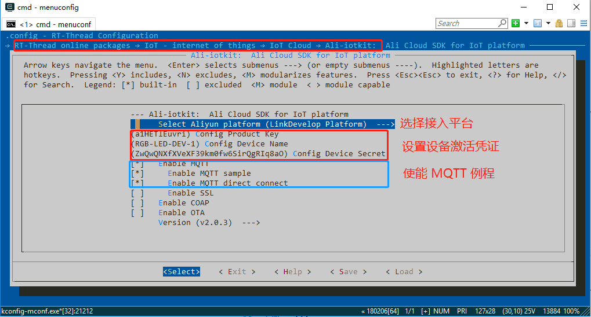
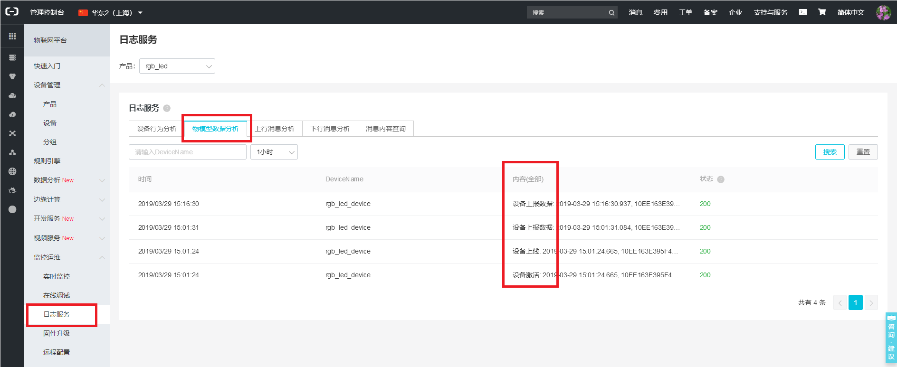
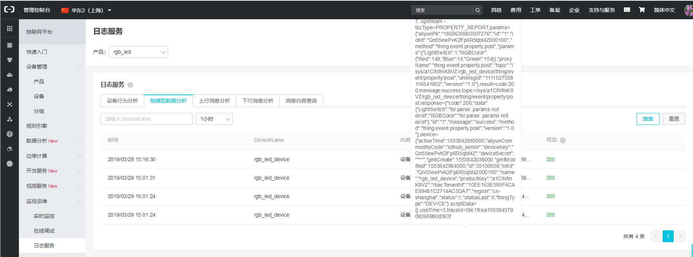
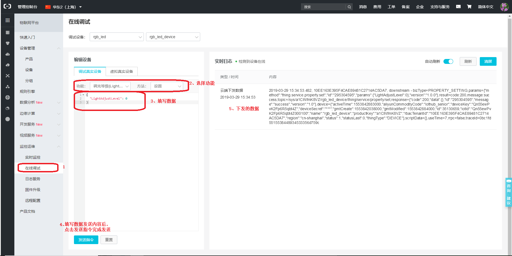

# 阿里云物联网平台接入例程

本例程演示如何使用 RT-Thread 提供的 ali-iotkit 软件包接入阿里云物联网平台（LinkPlatform 和 LinkDevelop），以 LinkDevelop 平台为例，介绍如何通过 MQTT 协议接入 LinkDevelop 平台。初次使用阿里云物联网平台或者想了解更多使用例程，请阅读[《ali-iotkit 用户手册》](https://www.rt-thread.org/document/site/submodules/ali-iotkit/docs/introduction/)。

## 简介

**ali-iotkit** 是 RT-Thread 移植的用于连接阿里云 IoT 平台的软件包。基础 SDK 是阿里提供的 [**iotkit-embedded C-SDK**](https://github.com/aliyun/iotkit-embedded)。

**ali-iotkit** 为了方便设备上云封装了丰富的连接协议，如 MQTT、CoAP、HTTP、TLS，并且对硬件平台进行了抽象，使其不受具体的硬件平台限制而更加灵活。

相对传统的云端接入 SDK，RT-Thread 提供的 **ali-iotkit** 具有如下优势：

- 快速接入能力
- 嵌入式设备调优
- 多编译器支持（GCC、IAR、MDK）
- 多连接协议支持（HTTP、MQTT、CoAP）
- 强大而丰富的 RT-Thread 生态支持
- 跨硬件、跨 OS 平台支持
- 设备固件 OTA 升级
- TLS/DTLS 安全连接
- 高可移植的应用端程序
- 高可复用的功能组件

## 硬件说明

ali-iotkit 例程需要依赖 IoT Board 板卡上的 WiFi 模块完成网络通信，因此请确保硬件平台上的 WiFi 模组可以正常工作。

## 软件说明

ali-iotkit 例程位于 `/examples/27_iot_cloud_ali_iotkit` 目录下，重要文件摘要说明如下所示：

| 文件                         | 说明   |
| :-----                       | :-----    |
| applications/main.c     | app 入口 |
| ports                   | 移植文件 |
| packages/ali-iotkit-v2.0.3   | 阿里云物联网平台接入软件包|
| packages/ali-iotkit-v2.0.3/samples | 阿里云物联网平台接入示例 |

### 例程使用说明

该 ali-iotkit 演示例程程序代码位于 `/examples/27_iot_cloud_ali_iotkit/packages/ali-iotkit-v2.0.3/samples/mqtt/mqtt-example.c` 文件中，核心代码说明如下：

**1. 设置激活凭证**

使用 menuconfig 设置设备激活凭证（从阿里云—— [LinkDevelop](https://linkdevelop.aliyun.com) 平台获取），如下图所示：



通过 menuconfig 工具完成配置的保存后，工具会将相关的配置项写入到 `27_iot_cloud_ali_iotkit/rtconfig.h` 文件中，如果用户无 ENV 工具，不能使用 menuconfig 进行配置，也可以直接修改 rtconfig.h 文件，如下所示：

```c
/* 使用阿里 LinkDevelop 平台 */
#define PKG_USING_ALI_IOTKIT_IS_LINKDEVELOP
/* 配置产品ID */
#define PKG_USING_ALI_IOTKIT_PRODUCT_KEY "a1HETlEuvri"
/* 配置设备名字 */
#define PKG_USING_ALI_IOTKIT_DEVICE_NAME "RGB-LED-DEV-1"
/* 配置设备密钥 */
#define PKG_USING_ALI_IOTKIT_DEVICE_SECRET "ZwQwQNXfXVeXF39km0fw6SirQgRIq8aO"
```

**2. 注册 MQTT 事件回调**

MQTT 事件回调函数 `event_handle` 用于处理 MQTT 状态事件（如上线、下线、重连等），在 MQTT 客户端创建的时候被注册，代码如下所示：

```c
static void event_handle(void *pcontext, void *pclient, iotx_mqtt_event_msg_pt msg)
{
    iotx_mqtt_topic_info_pt topic_info = (iotx_mqtt_topic_info_pt)msg->msg;
    if (topic_info == NULL)
    {
        rt_kprintf("Topic info is null! Exit.");
        return;
    }
    uintptr_t packet_id = (uintptr_t)topic_info->packet_id;

    switch (msg->event_type) {
        case IOTX_MQTT_EVENT_UNDEF:
            EXAMPLE_TRACE("undefined event occur.");
            break;

        case IOTX_MQTT_EVENT_DISCONNECT:
            EXAMPLE_TRACE("MQTT disconnect.");
            break;

        case IOTX_MQTT_EVENT_RECONNECT:
            EXAMPLE_TRACE("MQTT reconnect.");
            break;
    /* 省略部分代码 */
    }
}
```

**3. 注册 MQTT 消息接收回调**

每当 MQTT 客户端收到服务器发来的消息就会调用 `_demo_message_arrive` 函数，将收到的消息交由用户自定义处理，代码如下所示：

```c
static void _demo_message_arrive(void *pcontext, void *pclient, iotx_mqtt_event_msg_pt msg)
{
    iotx_mqtt_topic_info_pt ptopic_info = (iotx_mqtt_topic_info_pt) msg->msg;

    /* 打印收到的消息的 Topic 主题和收到的消息内容 */
    EXAMPLE_TRACE("----");
    EXAMPLE_TRACE("packetId: %d", ptopic_info->packet_id);
    EXAMPLE_TRACE("Topic: '%.*s' (Length: %d)",
                  ptopic_info->topic_len,
                  ptopic_info->ptopic,
                  ptopic_info->topic_len);
    EXAMPLE_TRACE("Payload: '%.*s' (Length: %d)",
                  ptopic_info->payload_len,
                  ptopic_info->payload,
                  ptopic_info->payload_len);
    EXAMPLE_TRACE("----");
}
```

**4. 启动 MQTT 客户端**

**4.1 初始化 iotkit 连接信息**

使用用户配置的设备激活凭证（PRODUCT_KEY、DEVICE_NAME 和 DEVICE_SECRET）初始化 iotkit 连接信息（pconn_info），代码如下所示：

```c
iotx_conn_info_pt pconn_info;
/* 设备鉴权 */
if (0 != IOT_SetupConnInfo(__product_key, __device_name, __device_secret, (void **)&pconn_info))
{
    EXAMPLE_TRACE("AUTH request failed!");
    rc = -1;
    goto do_exit;
}
```

**4.2 配置 MQTT 客户端参数**

初始化 MQTT 客户端所必须的用户名、密码、服务器主机名及端口号等配置，代码如下所示：

```c
iotx_mqtt_param_t mqtt_params;

/* 初始化 MQTT 数据结构 */
memset(&mqtt_params, 0x0, sizeof(mqtt_params));
mqtt_params.port = pconn_info->port;
mqtt_params.host = pconn_info->host_name;
mqtt_params.client_id = pconn_info->client_id;
mqtt_params.username = pconn_info->username;
mqtt_params.password = pconn_info->password;
mqtt_params.pub_key = pconn_info->pub_key;
mqtt_params.request_timeout_ms = 2000;
mqtt_params.clean_session = 0;
mqtt_params.keepalive_interval_ms = 60000;
mqtt_params.pread_buf = msg_readbuf;
mqtt_params.read_buf_size = MQTT_MSGLEN;
mqtt_params.pwrite_buf = msg_buf;
mqtt_params.write_buf_size = MQTT_MSGLEN;
mqtt_params.handle_event.h_fp = event_handle;
mqtt_params.handle_event.pcontext = NULL;
```

**4.3 创建 MQTT 客户端**

使用 `IOT_MQTT_Construct` 函数构建一个 MQTT 客户端，代码如下所示：

```c
/* 使用指定的 MQTT 参数构建 MQTT 客户端数据结构 */
pclient = IOT_MQTT_Construct(&mqtt_params);
if (NULL == pclient) {
    EXAMPLE_TRACE("MQTT construct failed");
    rc = -1;
    goto do_exit;
}
```

**4.4 订阅指定的 Topic**

使用 `IOT_MQTT_Subscribe` 函数订阅指定的 Topic（ALINK_SERVICE_SET_SUB），代码如下所示：

```c
/* 订阅指定的 Topic */
rc = IOT_MQTT_Subscribe(pclient, ALINK_SERVICE_SET_SUB, IOTX_MQTT_QOS1, _demo_message_arrive, NULL);
if (rc < 0) {
    IOT_MQTT_Destroy(&pclient);
    EXAMPLE_TRACE("IOT_MQTT_Subscribe() failed, rc = %d", rc);
    rc = -1;
    goto do_exit;
}
```

ALINK_SERVICE_SET_SUB 消息主题为：`#define ALINK_SERVICE_SET_SUB            "/sys/"PRODUCT_KEY"/"DEVICE_NAME"/thing/service/property/set"`，用于设置设备属性。

**4.5 循环等待 MQTT 消息通知**

使用 `IOT_MQTT_Yield` 函数接收来自云端的消息。

```c
do {
    /* handle the MQTT packet received from TCP or SSL connection */
    IOT_MQTT_Yield(pclient, 200);
    HAL_SleepMs(2000);
} while (is_running);
```

**5. 关闭 MQTT 客户端**

关闭 MQTT 客户端需要取消已经存在的订阅，并销毁 MQTT 客户端连接，以释放资源。

**5.1 取消订阅指定的 Topic**

使用 `IOT_MQTT_Unsubscribe` 取消已经存在的订阅。

```c
IOT_MQTT_Unsubscribe(pclient, ALINK_SERVICE_SET_SUB);
```

**5.2 销毁 MQTT 客户端**

使用 `IOT_MQTT_Destroy` 销毁已经存在的 MQTT 客户端，以释放资源占用。

```c
IOT_MQTT_Destroy(&pclient);
```

**6. 发布测试消息**

**6.1 构建 Alink 协议格式数据**

本例程中构建一个 RGB 灯设备需要的 Alink 协议格式的数据包，如下所示：

```c
/* 初始化要发送给 Topic 的消息内容 */
memset(msg_pub, 0x0, sizeof(msg_pub));
snprintf(msg_pub, sizeof(msg_pub), 
        "{\"id\" : \"%d\",\"version\":\"1.0\",\"params\" : "
        "{\"RGBColor\" : {\"Red\":%d,\"Green\":%d,\"Blue\":%d},"
        "\"LightSwitch\" : %d},"
        "\"method\":\"thing.event.property.post\"}",
        ++pub_msg_cnt, rand_num_r, rand_num_g, rand_num_b, rgb_switch);
```

**6.2 发布消息**

使用 `IOT_MQTT_Publish` 接口向 MQTT 通道发送 Alink 协议格式的消息。

```c
memset(&topic_msg, 0x0, sizeof(iotx_mqtt_topic_info_t));
topic_msg.qos = IOTX_MQTT_QOS1;
topic_msg.retain = 0;
topic_msg.dup = 0;
topic_msg.payload = (void *)msg_pub;
topic_msg.payload_len = strlen(msg_pub);
rc = IOT_MQTT_Publish(pclient, ALINK_PROPERTY_POST_PUB, &topic_msg);
if (rc < 0) {
    IOT_MQTT_Destroy(&pclient);
    EXAMPLE_TRACE("error occur when publish");
    rc = -1;
    return rc;
}
```

## 运行

### 编译&下载

- **MDK**：双击 `project.uvprojx` 打开 MDK5 工程，执行编译。
- **IAR**：双击 `project.eww` 打开 IAR 工程，执行编译。

编译完成后，将开发板的 ST-Link USB 口与 PC 机连接，然后将固件下载至开发板。

程序运行日志如下所示：

```text
 \ | /
- RT -     Thread Operating System
 / | \     4.0.1 build Mar 28 2019
 2006 - 2019 Copyright by rt-thread team
lwIP-2.0.2 initialized!
[I/SAL_SOC] Socket Abstraction Layer initialize success.
[SFUD] Find a Winbond flash chip. Size is 16777216 bytes.
[SFUD] w25q128 flash device is initialize success.
msh />[I/FAL] RT-Thread Flash Abstraction Layer (V0.2.0) initialize success.
[I/OTA] RT-Thread OTA package(V0.1.3) initialize success.
[I/OTA] Verify 'wifi_image' partition(fw ver: 1.0, timestamp: 1529386280) success.
[I/WICED] wifi initialize done!
[I/WLAN.dev] wlan init success
[I/WLAN.lwip] eth device init ok name:w0
[Flash] EasyFlash V3.2.1 is initialize success.
[Flash] You can get the latest version on https://github.com/armink/EasyFlash .
msh />
```

### 连接无线网络

程序运行后会进入 MSH 命令行，等待用户配置设备接入网络。使用 MSH 命令 `wifi join <ssid> <password>` 配置网络（ssid 和 password 分别为设备连接的 WIFI 用户名和密码），如下所示：

```shell
msh />wifi join ssid_test router_key_xxx
join ssid:ssid_test
[I/WLAN.mgnt] wifi connect success ssid:ssid_test
msh />[I/WLAN.lwip] Got IP address : 152.10.200.224
```

### SHELL 命令

ali-iotkit 例程使用 MSH 命令演示与阿里云物联网平台的数据交互。例程使用了阿里云 LinkDevelop RGB 灯的示例，如果用户的 LinkDevelop 账户尚未创建 RGB 灯设备，请参阅[《ali-iotkit 用户手册》](https://www.rt-thread.org/document/site/submodules/ali-iotkit/docs/introduction/)例程使用章节完成 RGB 灯设备的创建。

**命令列表**

|命令|说明|
|----|----|
| ali_mqtt_test start     | 启动 MQTT 示例 |
| ali_mqtt_test pub open  | 开灯，并向云端同步开灯状态 |
| ali_mqtt_test pub close | 关灯，并向云端同步关灯状态 |
| ali_mqtt_test stop      | 停止 MQTT 示例 |

**1. 启动 MQTT**

使用 **`ali_mqtt_test start`** 命令启动 MQTT 示例，成功后设备 log 显示订阅成功。

设备 log 如下所示：

```shell
msh />ali_mqtt_test start
ali_mqtt_main|645 :: iotkit-embedded sdk version: V2.10
[inf] iotx_device_info_init(40): device_info created successfully!
[dbg] iotx_device_info_set(50): start to set device info!
[dbg] iotx_device_info_set(64): device_info set successfully!
···
[inf] iotx_mc_init(1703): MQTT init success!
[inf] _ssl_client_init(175): Loading the CA root certificate ...
···
[inf] _TLSConnectNetwork(420):   . Verifying peer X.509 certificate..
[inf] _real_confirm(92): certificate verification result: 0x200
[inf] iotx_mc_connect(2035): mqtt connect success!
···
[inf] iotx_mc_subscribe(1388): mqtt subscribe success,topic = /sys/a1HETlEuvri/RGB-LED-DEV-1/thing/service/property/set!
[inf] iotx_mc_subscribe(1388): mqtt subscribe success,topic = /sys/a1HETlEuvri/RGB-LED-DEV-1/thing/event/property/post_reply!
[dbg] iotx_mc_cycle(1269): SUBACK
event_handle|139 :: subscribe success, packet-id=191
[dbg] iotx_mc_cycle(1269): SUBACK
event_handle|139 :: subscribe success, packet-id=8192
[inf] iotx_mc_keepalive_sub(2226): send MQTT ping...
[inf] iotx_mc_cycle(1295): receive ping response!
```

**2. 设备发布消息**

使用 **`ali_mqtt_test pub open`** 命令发送 LED 状态到云端。

设备 log 如下所示：

```shell
msh />ali_mqtt_test pub open
···
[dbg] iotx_mc_cycle(1277): PUBLISH
[dbg] iotx_mc_handle_recv_PUBLISH(1091):         Packet Ident : 00000000
[dbg] iotx_mc_handle_recv_PUBLISH(1092):         Topic Length : 59
[dbg] iotx_mc_handle_recv_PUBLISH(1093):           Topic Name : /sys/a1ItC9HaCH6/l475Device/thing/event/property/post_reply
[dbg] iotx_mc_handle_recv_PUBLISH(1097):     Payload Len/Room : 188 / 960
[dbg] iotx_mc_handle_recv_PUBLISH(1100):       Receive Buflen : 1024
[dbg] iotx_mc_handle_recv_PUBLISH(1111): delivering msg ...
[dbg] iotx_mc_deliver_message(866): topic be matched
_demo_message_arrive|197 :: ----
_demo_message_arrive|198 :: packetId: 0
_demo_message_arrive|199 :: Topic: '/sys/a1ItC9HaCH6/l475Device/thing/event/property/post_reply' (Length: 59)
_demo_message_arrive|203 :: Payload: '{"code":200,"data":{"LightSwitch":"tsl parse: params not exist","RGBColor":"tsl parse: params not exist"},"id":"1","message":"success","method":"thing.event.property.post","version":"1.0"}' (Length: 188)
_demo_message_arrive|207 :: ----
```

**3. 云端查看发布的消息**

在设备详情里的**运行状态**里可以查看设备的上报到云端的消息内容，一次有设备激活、设备上线与设备数据上报。



鼠标移动至数据内容中，在数据上报中自动显示上报的数据内容。



**4. 云端推送消息到设备**

使用云端的在线调试给设备推送消息，如下图所示



**5. 查看设备订阅日志**

使用调试控制台发送命令后，设备可以接受到命令，log 如下所示：

```shell
[dbg] iotx_mc_handle_recv_PUBLISH(1091):         Packet Ident : 00000000
[dbg] iotx_mc_handle_recv_PUBLISH(1092):         Topic Length : 52
[dbg] iotx_mc_handle_recv_PUBLISH(1096):           Topic Name : /sys/a1Ayv8xhoIl/RGB-DEV1/thing/service/property/set
[dbg] iotx_mc_handle_recv_PUBLISH(1099):     Payload Len/Room : 100 / 967
[dbg] iotx_mc_handle_recv_PUBLISH(1100):       Receive Buflen : 1024
[dbg] iotx_mc_handle_recv_PUBLISH(1111): delivering msg ...
[dbg] iotx_mc_deliver_message(866): topic be matched
_demo_message_arrive|178 :: ----
_demo_message_arrive|179 :: packetId: 0
_demo_message_arrive|183 :: Topic: '/sys/a1Ayv8xhoIl/RGB-DEV1/thing/service/property/set' (Length: 52)
_demo_message_arrive|187 :: Payload: 
'{"method":"thing.service.property.set","id":"35974024","params":{"LightSwitch":0},"version":"1.0.0"}' (Length: 100)
_demo_message_arrive|188 :: ----
```

**6. 退出 MQTT 示例**

使用 **`ali_mqtt_test stop`** 命令退出 MQTT 示例，设备 log 如下所示：

```
msh />ali_mqtt_test stop
[inf] iotx_mc_unsubscribe(1423): mqtt unsubscribe success,topic = /sys/a1HETlEuvri/RGB-LED-DEV-1/thing/event/property/post_reply!
[inf] iotx_mc_unsubscribe(1423): mqtt unsubscribe success,topic = /sys/a1HETlEuvri/RGB-LED-DEV-1/thing/service/property/set!
event_handle|136 :: unsubscribe success, packet-id=0
event_handle|136 :: unsubscribe success, packet-id=0
[dbg] iotx_mc_disconnect(2121): rc = MQTTDisconnect() = 0
[inf] _network_ssl_disconnect(514): ssl_disconnect
[inf] iotx_mc_disconnect(2129): mqtt disconnect!
[inf] iotx_mc_release(2175): mqtt release!
[err] LITE_dump_malloc_free_stats(594): WITH_MEM_STATS = 0
mqtt_client|329 :: out of sample!
```

## 注意事项

- 使用本例程前请先阅读[《ali-iotkit 用户手册》](https://www.rt-thread.org/document/site/submodules/ali-iotkit/docs/introduction/)
- 使用前请在 `menuconfig` 里配置自己的设备激活凭证（PRODUCT_KEY、DEVICE_NAME 和 DEVICE_SECRET）
- 使用 `menuconfig` 配置选择要接入的平台（**LinkDevelop** 或者 **LinkPlatform**）

## 引用参考

- 《RT-Thread 编程指南 》: docs/RT-Thread 编程指南.pdf
- 《ali-iotkit 用户手册》: docs/UM1002-RT-Thread-ali-iotkit 用户手册.pdf
