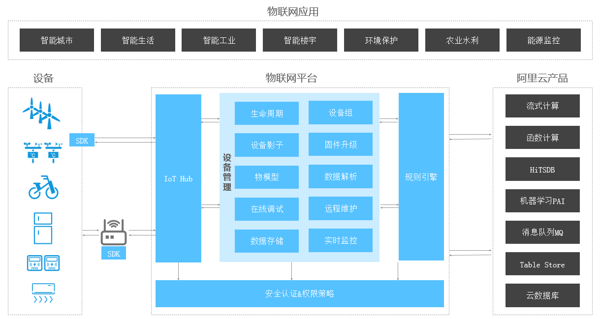
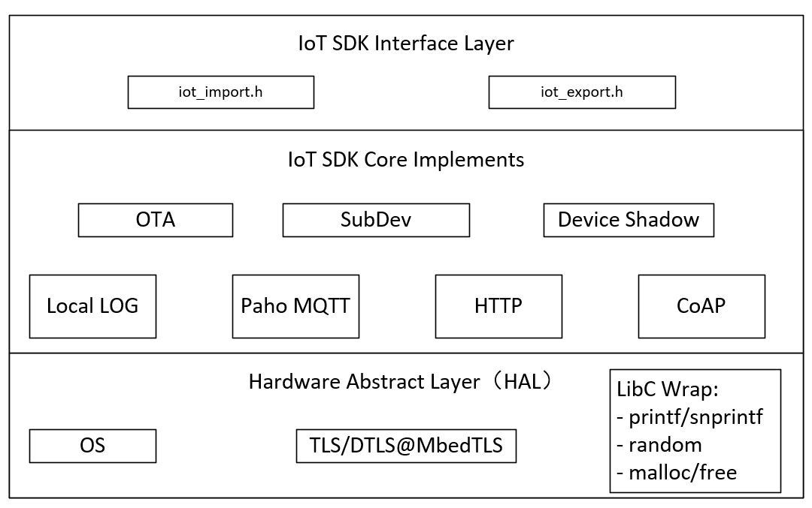

# 软件包介绍

**`ali-iotkit`** 是 RT-Thread 移植的用于连接阿里云 IoT 平台的软件包。基础 SDK 是阿里提供的 [iotkit-embedded C-SDK](https://github.com/aliyun/iotkit-embedded)。

物联网套件提供了如下的能力:

- 嵌入式设备快速接入(设备端SDK)
- 设备管理
- 设备和数据信息安全
- 桥接到阿里云其他产品, 对设备数据存储/计算



在物联网平台场景架构图中，左边物联网设备端 SDK 就是将嵌入式设备连接到阿里云的部分。

## 软件框架图

iotkit SDK 为了方便设备上云封装了丰富的连接协议，如 MQTT、CoAP、HTTP、TLS，并且对硬件平台进行了抽象，使其不受具体的硬件平台限制而更加灵活。在代码架构方面，iotkit SDK 分为三层，如下图所示：



- 最底层称为硬件平台抽象层, 也简称HAL层（Hardware Abstract Layer）
  
    抽象不同的嵌入式目标板上，操作系统对SDK的支撑函数，包括网络收发、 TLS/DTLS 通道建立和读写, 内存申请是否和互斥量加锁解锁等。

- 中间层称为SDK内核实现层（IoT SDK Core Implements）

    物联网平台 C-SDK 的核心实现部分, 它基于 HAL 层接口完成了 MQTT/CoAP 通道等的功能封装， 包括 MQTT 的连接建立、 报文收发、CoAP 的连接建立、报文收发、 OTA 的固件状态查询和 OTA 的固件下载等。

    中间层的封装，使得用户无需关心内部实现逻辑，可以不经修改地应用。

- 最上层称为SDK接口声明层（IoT SDK Interface Layer）

    最上层是为应用提供 API 的，用户使用该层的 API 完成具体的业务逻辑。

## 软件包目录结构

**ports** 目录是 RT-Thread 移植 iotkit-embedded 软件包时所涉及到的移植文件，使用 scons 进行重新构建。 

**iotkit-embedded** 软件包是阿里物联网平台 C-SDK 源码，包含连接阿里云所必须的软件包。

```shell
ali-iotkit
|   README.md                       // 软件包使用说明
|   SConscript                      // RT-Thread 默认的构建脚本
+---docs
|   +---figures                     // 文档使用图片
|   |   api.md                      // API 使用说明
|   |   introduction.md             // 软件包详细介绍
|   |   LICENSE                     // 许可证文件
|   |   principle.md                // 实现原理
|   |   README.md                   // 文档结构说明
|   |   samples.md                  // 软件包示例
|   |   user-guide.md               // 使用说明
|   +---version.md                  // 版本说明
+---ports                           // 移植文件
|   +---rtthread                    // OS 相关移植文件
|   +---ssl                         // MbedTLS 相关的移植文件
+---samples
|   +---mqtt                        // MQTT 通道接入阿里云的示例程序
|   +---ota                         // 阿里云 OTA 功能演示例程
+---iotkit-embedded                 // iotkit 源码
```

### iotkit-embedded 软件包目录结构

iotkit-embedded 软件包是阿里物联网平台 C-SDK 源码，未经修改，包含里了连接阿里云 IoT 所必须的软件包。 RT-Thread 移植后，没有使用 iotkit-embedded 中默认的 Makefile 构建脚本，而是使用 scons 重新进行的构建。

iotkit-embedded 软件包目录结构如下所示：

```shell
+-- LICENSE           : 软件许可证, Apache-2.0 版本软件许可证
+-- make.settings     : 功能裁剪配置, 如 MQTT|CoAP, 或裁剪如 OTA|Shadow
+-- README.md         : 快速开始导引
+-- sample            : 例程目录, 演示通信模块和服务模块的使用
|   +-- mqtt          :     演示如何使用通信模块 MQTT 的 API
|   +-- coap          :     演示如何使用通信模块 CoAP 的 API
|   +-- device-shadow :     演示如何使用服务模块 DeviceShadow 的 API
|   +-- http          :     演示如何使用通信模块 HTTP 的 API
|   +-- ota           :     演示如何使用服务模块 OTA 的 API
+-- src
    +-- sdk-impl      : SDK 的接口层, 提供总体的头文件, 和一些 API 的接口封装
    +-- sdk-tests     : SDK 的单元测试
    +-- mqtt          : 通信模块, 实现以 MQTT 协议接入
    +-- coap          : 通信模块, 实现以 CoAP 协议接入
    +-- http          : 通信模块, 实现以 HTTP 协议接入
    +-- ota           : 服务模块, 实现基于 MQTT|CoAP+HTTP+TLS 的固件下载通道
    +-- shadow        : 服务模块, 实现设备影子
    +-- platform      : 硬件平台抽象层, 需要移植适配
    +-- import        : 外部输入目录, 存放芯片/模组厂商提供的头文件/二进制库
    +-- configs       : 硬件平台编译配置, 如交叉编译工具链设置, 功能模块裁剪等
    +-- scripts       : 编译过程将要外部引用的脚本, 用户不必关注
    +-- packages      : SDK 引用的外部软件模块, 用户不必关注
    +-- log           : 基础模块, 实现运行日志
    +-- system        : 基础模块, 保存全局信息, 如 TLS 根证书, 设备标识 ID 等
    +-- tls           : 基础模块, 实现 TLS/DTLS, 来自裁剪过的开源软件 mbedtls
    +-- utils         : 基础模块, 实现工具函数, 如 SHA1 摘要计算、NTP 对时等
```

## 功能特点

- 不同网络接入

    提供不同网络的设备接入方案，例如 2/3/4G、NB-IoT、LoRa 等，解决企业异构网络设备接入管理的痛点。

- 不同协议接入
    
    提供多种协议的设备 SDK，例如 MQTT、CoAP、HTTP 等，这样既能满足设备需要长连接保证实时性的需求，也能满足设备需要短连接降低功耗的需求。

- 双向通信

    提供设备与云端的上下行通道，能够稳定可靠的支撑设备上报与指令下发设备的场景。

- 设备影子
    
    提供设备影子缓存机制，将设备与应用解耦，解决在无线网络不稳定情况下的通信不可靠痛点。

- 设备认证
    
    提供一机一密的设备认证机制，降低设备被攻破的安全风险。

- 安全传输
    
    提供 TLS 标准的数据传输通道，保证数据的机密性和完整性。
