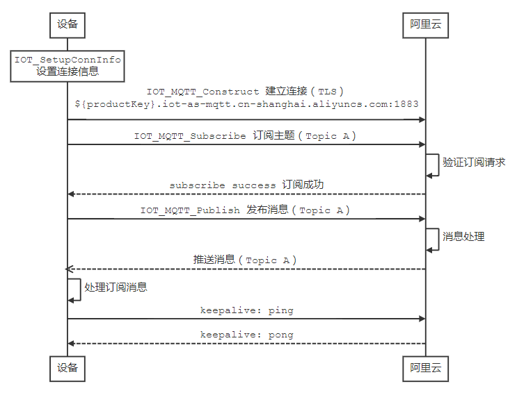
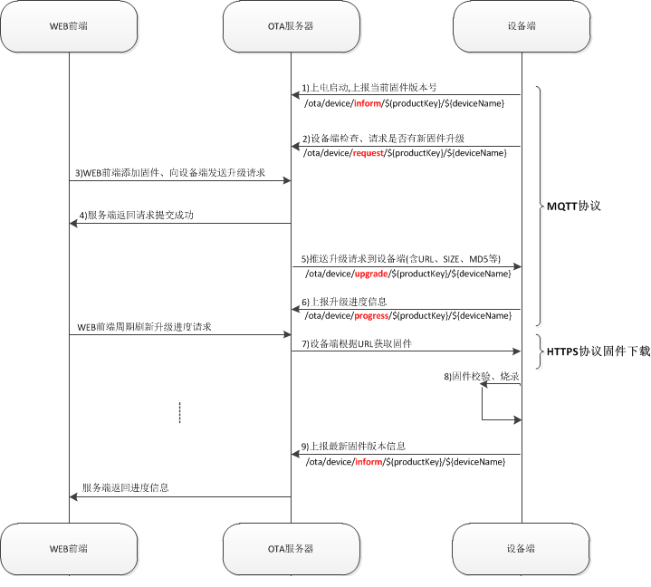

# 工作原理

iotkit SDK 为了方便设备上云封装了丰富的连接协议，如 MQTT、CoAP、HTTP、TLS，并且对硬件平台进行了抽象，使其不收具体的硬件平台限制而更加灵活。

通常用户并不需要关心 SDK 底层的实现机制，而只需要了解设备如何通过 SDK 与云端进行数据交互即可，方便用户理解如何使用应用层 API 接口进行业务逻辑编写。这里举例展示了 MQTT 和 OTA 应用的数据交互流程。

## MQTT 数据交互流程

## OTA 数据交互流程

以 MQTT 通道为例，固件升级流程如下图所示：

