# 示例程序

**ali-iotkit** 软件包同时支持阿里现有的 **[LinkDevelop](https://iot.aliyun.com/products/linkdevelop?spm=5176.8142029.loT.11.a7236d3eYH8ef9)** 和 **[LinkPlatform](https://www.aliyun.com/product/iot?spm=5176.8142029.loT.1.a7236d3eYH8ef9)** 平台。

本文针对这两个平台分别进行示例程序的演示，用户可以根据自己的需求选择使用其中的一个。

## LinkDevelop 平台

LinkDevelop 平台以 RGB_LED 为例，介绍设备与云端如何进行双向通讯。

### 准备工作

- 注册 [LinkDevelop 平台](https://iot.aliyun.com/products/linkdevelop?spm=5176.8142029.loT.11.a7236d3eYH8ef9)

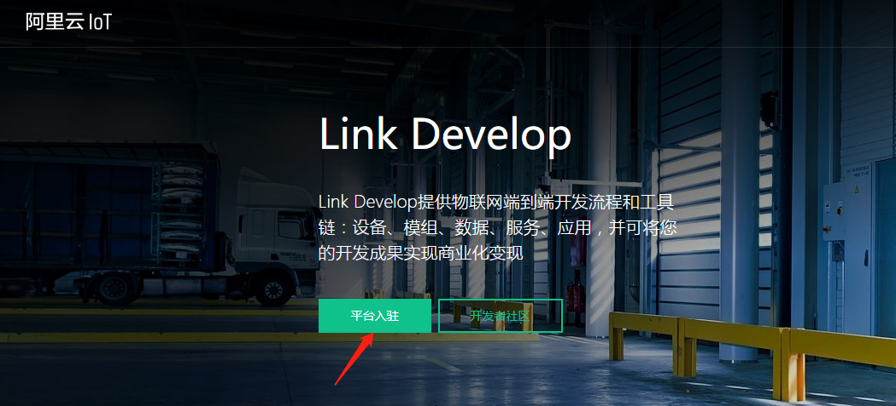

- 新建项目

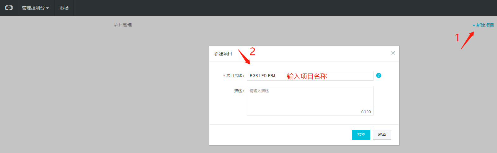

- 新增产品

  新增产品的时候，根据需要选择数据格式，这里使用 **Alink** 数据格式演示，并选择 WiFi 通信方式。

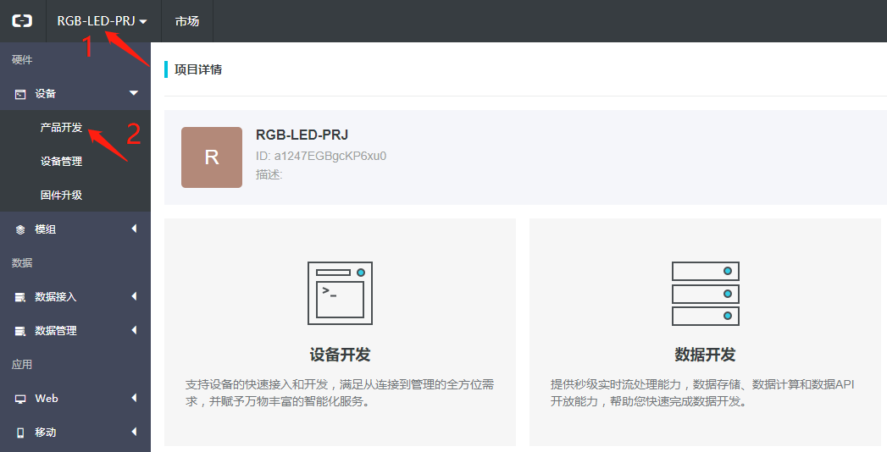

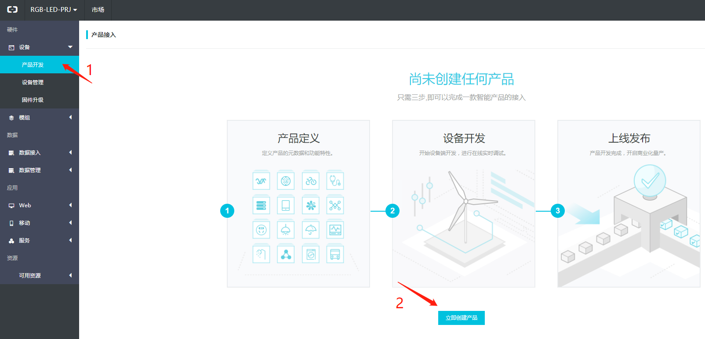

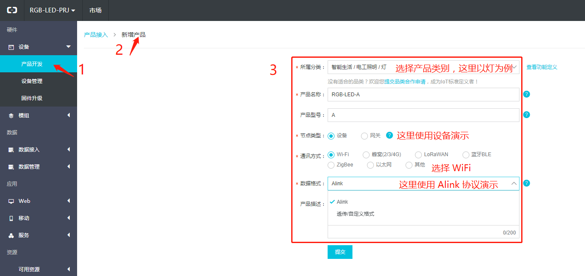

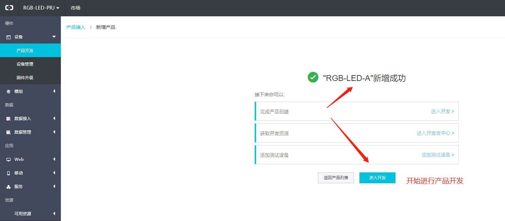

- 增加功能

  为 RGB LED 演示产品添加 RGB 调色功能，如下图所示：

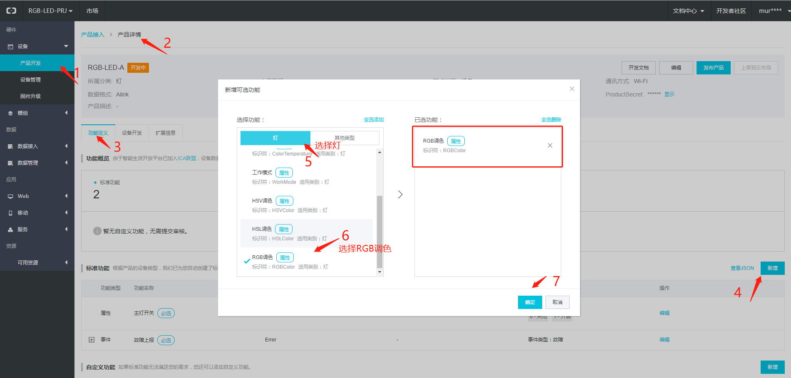

- 添加设备

  创建产品后，点击查看进入产品详情页面，点击设备开发，新增一个调试设备。

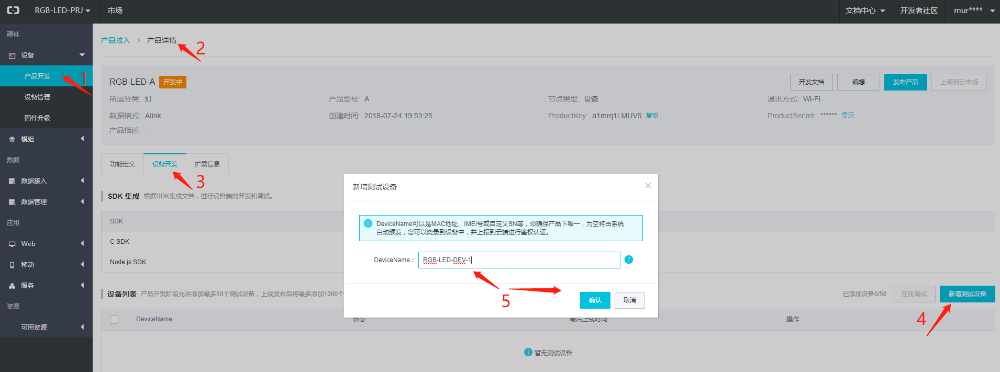

成功创建设备后，可以获取到设备激活需要的三元组（**ProductKey、DeviceName、DeviceSecret**），后面需要使用 **menuconfig** 配置到设备 SDK 中。


- **获取软件包**

    打开 RT-Thread 提供的 ENV 工具，使用 **menuconfig** 配置软件包。
  
    - 配置 iotkit 软件包
  
      配置使能 iotkit 软件包并**填写设备激活凭证**。

      `menuconfig` 中选择阿里云平台为 **LinkDevelop**，`OTA channel` 选择 **MQTT**（以 MQTT 为例），详细的配置如下所示：

    ```shell
    RT-Thread online packages  --->
        IoT - internet of things  --->
            IoT Cloud  --->
              [*] Ali-iotkit:  Ali Cloud SDK for IoT platform  --->
                    Select Aliyun platform (LinkDevelop Platform)  --->
              (a1dSQSGZ77X) Config Product Key
              (RGB-LED-DEV-1) Config Device Name
              (Ghuiyd9nmGowdZzjPqFtxhm3WUHEbIlI) Config Device Secret
              -*-   Enable MQTT
              [*]     Enable MQTT sample
              [*]     Enable MQTT direct connect
              [*]     Enable SSL
              [ ]   Enable COAP
              [*]   Enable OTA
                          Select OTA channel (Use MQTT OTA channel)  --->
                        version (latest)  --->
    ```
  
    - 增加 `mbedTLS` 帧大小

      阿里 TLS 认证过程中数据包较大，这里需要增加 TLS 帧大小，OTA 的时候**至少需要 8K** 大小。

      打开 RT-Thread 提供的 ENV 工具，使用 **menuconfig** 配置 **TLS** 帧大小。

    ```shell
    RT-Thread online packages  --->
        security packages  --->
          -*- mbedtls:An open source, portable, easy to use, 
                      readable and flexible SSL library  --->
          (8192) Maxium fragment length in bytes
    ```

    - 使用 `pkgs --update` 命令下载软件包

### MQTT 示例

该 MQTT 示例程序以 RGB-LED 为例，演示了如何在设备上使用 MQTT + TLS/SSL 通道与阿里云平台建立双向通信。

**示例文件**

| 示例程序路径                   | 验证平台      | 说明 |
| ----                          | ---          | ---- |
| samples/mqtt/mqtt-example.c   | LinkDevelop, LinkPlatform | 基于 MQTT 通道的设备和云双向通信例程 |

**命令列表**

例程中，使用 MSH 命令启动 MQTT 例程，命令如下所示：

|命令|说明|
|----|----|
| ali_mqtt_test start     | 启动 MQTT 示例 |
| ali_mqtt_test pub open  | 开灯，并向云端同步开灯状态 |
| ali_mqtt_test pub close | 关灯，并向云端同步关灯状态 |
| ali_mqtt_test stop      | 停止 MQTT 示例 |

**启动 MQTT**

使用 **`ali_mqtt_test start`** 命令启动 MQTT 示例，成功后设备 log 显示订阅成功。

设备 log 如下所示：

```shell
msh />ali_mqtt_test start
ali_mqtt_main|645 :: iotkit-embedded sdk version: V2.10
[inf] iotx_device_info_init(40): device_info created successfully!
[dbg] iotx_device_info_set(50): start to set device info!
[dbg] iotx_device_info_set(64): device_info set successfully!
···
[inf] iotx_mc_init(1703): MQTT init success!
[inf] _ssl_client_init(175): Loading the CA root certificate ...
···
[inf] _TLSConnectNetwork(420):   . Verifying peer X.509 certificate..
[inf] _real_confirm(92): certificate verification result: 0x200
[inf] iotx_mc_connect(2035): mqtt connect success!
···
[inf] iotx_mc_subscribe(1388): mqtt subscribe success,topic = /sys/a1HETlEuvri/RGB-LED-DEV-1/thing/service/property/set!
[inf] iotx_mc_subscribe(1388): mqtt subscribe success,topic = /sys/a1HETlEuvri/RGB-LED-DEV-1/thing/event/property/post_reply!
[dbg] iotx_mc_cycle(1269): SUBACK
event_handle|124 :: subscribe success, packet-id=0
[dbg] iotx_mc_cycle(1269): SUBACK
event_handle|124 :: subscribe success, packet-id=0
[inf] iotx_mc_keepalive_sub(2226): send MQTT ping...
[inf] iotx_mc_cycle(1295): receive ping response!
```

**设备发布消息**

使用 **`ali_mqtt_test pub open`** 命令发送 LED 状态到云端，成功后设备 log 显示**成功码 200**。

设备 log 如下所示：

```shell
msh />ali_mqtt_test pub open
···
[dbg] iotx_mc_cycle(1277): PUBLISH
[dbg] iotx_mc_handle_recv_PUBLISH(1091):         Packet Ident : 00000000
[dbg] iotx_mc_handle_recv_PUBLISH(1092):         Topic Length : 57
[dbg] iotx_mc_handle_recv_PUBLISH(1096):           Topic Name : /sys/a1HETlEuvri/RGB-LED-DEV-1/thing/service/property/set
[dbg] iotx_mc_handle_recv_PUBLISH(1099):     Payload Len/Room : 100 / 962
[dbg] iotx_mc_handle_recv_PUBLISH(1100):       Receive Buflen : 1024
[dbg] iotx_mc_handle_recv_PUBLISH(1111): delivering msg ...
[dbg] iotx_mc_deliver_message(866): topic be matched
_demo_message_arrive|182 :: ----
_demo_message_arrive|183 :: packetId: 0
_demo_message_arrive|187 :: Topic: '/sys/a1HETlEuvri/RGB-LED-DEV-1/thing/service/property/set' (Length: 57)
_demo_message_arrive|191 :: Payload: 
'{"method": "thing.service.property.set","id": "36195462","params":{"LightSwitch":1},"version":"1.0.0"}' (Length: 100)
_demo_message_arrive|192 :: ----
```

**云端查看发布的消息**

在设备详情里的**运行状态**里可以查看设备的上报到云端的消息内容。

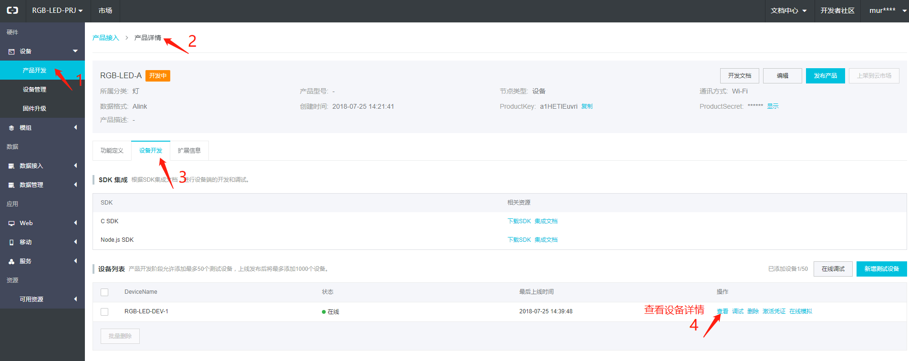


**云端推送消息到设备**

使用云端的调试控制台给设备推送消息。

- 打开调试控制台


- 发送调试命令

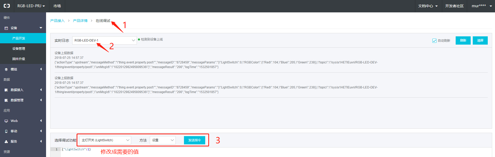

**查看设备订阅日志**

使用调试控制台发送命令后，设备可以接受到命令，log 如下所示：

```shell
[dbg] iotx_mc_handle_recv_PUBLISH(1091):         Packet Ident : 00000000
[dbg] iotx_mc_handle_recv_PUBLISH(1092):         Topic Length : 52
[dbg] iotx_mc_handle_recv_PUBLISH(1096):           Topic Name : /sys/a1Ayv8xhoIl/RGB-DEV1/thing/service/property/set
[dbg] iotx_mc_handle_recv_PUBLISH(1099):     Payload Len/Room : 100 / 967
[dbg] iotx_mc_handle_recv_PUBLISH(1100):       Receive Buflen : 1024
[dbg] iotx_mc_handle_recv_PUBLISH(1111): delivering msg ...
[dbg] iotx_mc_deliver_message(866): topic be matched
_demo_message_arrive|178 :: ----
_demo_message_arrive|179 :: packetId: 0
_demo_message_arrive|183 :: Topic: '/sys/a1Ayv8xhoIl/RGB-DEV1/thing/service/property/set' (Length: 52)
_demo_message_arrive|187 :: Payload: 
'{"method":"thing.service.property.set","id":"35974024","params":{"LightSwitch":0},"version":"1.0.0"}' (Length: 100)
_demo_message_arrive|188 :: ----
```

**退出 MQTT 示例**

使用 **`ali_mqtt_test stop`** 命令退出 MQTT 示例，设备 log 如下所示：

```
msh />ali_mqtt_test stop
[inf] iotx_mc_unsubscribe(1423): mqtt unsubscribe success,topic = /sys/a1HETlEuvri/RGB-LED-DEV-1/thing/event/property/post_reply!
[inf] iotx_mc_unsubscribe(1423): mqtt unsubscribe success,topic = /sys/a1HETlEuvri/RGB-LED-DEV-1/thing/service/property/set!
event_handle|136 :: unsubscribe success, packet-id=0
event_handle|136 :: unsubscribe success, packet-id=0
[dbg] iotx_mc_disconnect(2121): rc = MQTTDisconnect() = 0
[inf] _network_ssl_disconnect(514): ssl_disconnect
[inf] iotx_mc_disconnect(2129): mqtt disconnect!
[inf] iotx_mc_release(2175): mqtt release!
[err] LITE_dump_malloc_free_stats(594): WITH_MEM_STATS = 0
mqtt_client|329 :: out of sample!
```

### OTA 示例

固件升级支持对设备的固件进行远程空中升级（Over-The-Air），实现对设备的远程维护、功能升级、问题修复等场景的使用。您可以指定产品新增一个固件，对固件进行验证，验证通过后开始批量升级，并在固件详情中查看升级结果。

**示例文件**

| 示例程序路径                                    | 验证平台      | 说明 |
| ----                                           | ---          | ---- |
| samples/ota/ota_mqtt-example.c     | LinkDevelop, LinkPlatform  | 基于 MQTT 通道的设备 OTA 例程 |

**命令列表**

例程中，使用 MSH 命令启动 OTA 例程，命令如下所示：

|命令|说明|
|----|----|
| ali_ota_test start | 启动 OTA 示例 |
| ali_ota_test stop  | 手动退出 OTA 示例 |

**运行 OTA 示例**

使用 **`ali_ota_test start`** 命令启动 OTA 例程，然后等待云端发送 OTA 指令。

设备 log 如下所示：

```shell
msh />ali_ota_test start
ali_ota_main|372 :: iotkit-embedded sdk version: V2.10
[inf] iotx_device_info_init(40): device_info created successfully!
[dbg] iotx_device_info_set(50): start to set device info!
[dbg] iotx_device_info_set(64): device_info set successfully!
···
[inf] iotx_mc_init(1703): MQTT init success!
[inf] _ssl_client_init(175): Loading the CA root certificate ...
···
[inf] _TLSConnectNetwork(420):   . Verifying peer X.509 certificate..
[inf] _real_confirm(92): certificate verification result: 0x200
[inf] iotx_mc_connect(2035): mqtt connect success!
···
[inf] iotx_mc_subscribe(1388): mqtt subscribe success,topic = /ota/device/upgrade/a1HETlEuvri/RGB-LED-DEV-1!
mqtt_client|241 :: wait ota upgrade command....
[dbg] iotx_mc_cycle(1260): PUBACK
event_handle|130 :: publish success, packet-id=2
[dbg] iotx_mc_cycle(1269): SUBACK
event_handle|106 :: subscribe success, packet-id=1
mqtt_client|241 :: wait ota upgrade command....
mqtt_client|241 :: wait ota upgrade command....
```

**新增固件**

这里需要用户上传一个 bin 类型的测试固件，随意一个 bin 固件即可，演示例程只进行固件下载及校验，不会写入 Flash，所以也不会真正进行固件搬运升级。


**验证固件**

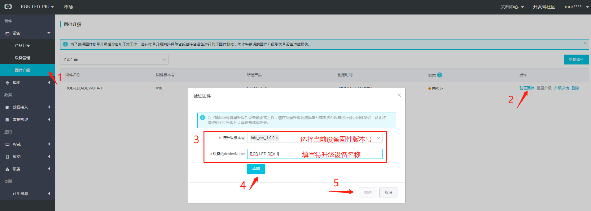

**设备日志**

推送成功后，设备开始下载固件，下载完成后自动进行固件完整性校验，设备端测试日志如下所示：

```shell
···
mqtt_client|254 :: Here write OTA data to file....
[dbg] IOT_OTA_Ioctl(457): 
origin=e4e54df52a3b530c7e0544b2872f1305, now=e4e54df52a3b530c7e0544b2872f1305
mqtt_client|280 :: The firmware is valid!  Download firmware successfully.
mqtt_client|294 :: OTA FW version: v10
```

**云端升级进度展示**

设备升级过程中云端会显示设备下载固件的进度，固件下载完成并校验固件成功，设备 SDK 上报新的版本号到云端，云端会显示升级成功，如下图所示：

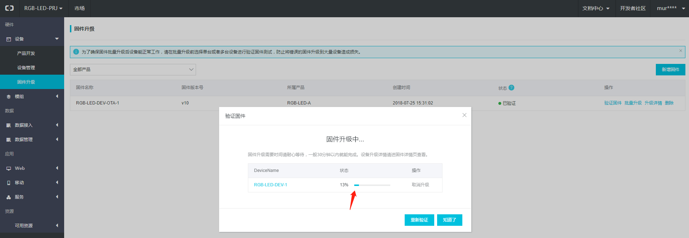

升级进度 100% 后，再次运行 **`ali_ota_test start`** 命令，将最新的版本号上传到云端，版本号匹配成功后，云端显示升级成功，如下图所示：

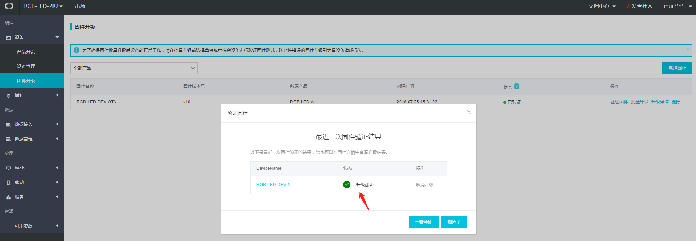

**退出 OTA 例程**

升级成功或者升级失败会自动退出 OTA 例程，如果需要手动退出 OTA 例程，请使用 **`ali_ota_test stop`** 命令。

```shell
msh />ali_ota_test stop
msh />[dbg] iotx_mc_disconnect(2121): rc = MQTTDisconnect() = 0
[inf] _network_ssl_disconnect(514): ssl_disconnect
[inf] iotx_mc_disconnect(2129): mqtt disconnect!
[inf] iotx_mc_release(2175): mqtt release!
[err] LITE_dump_malloc_free_stats(594): WITH_MEM_STATS = 0
mqtt_client|340 :: out of sample!
```

## LinkPlatform 平台

### 准备工作

- 注册 [LinkPlatform 平台](https://www.aliyun.com/product/iot?spm=5176.8142029.loT.1.a7236d3eYH8ef9)

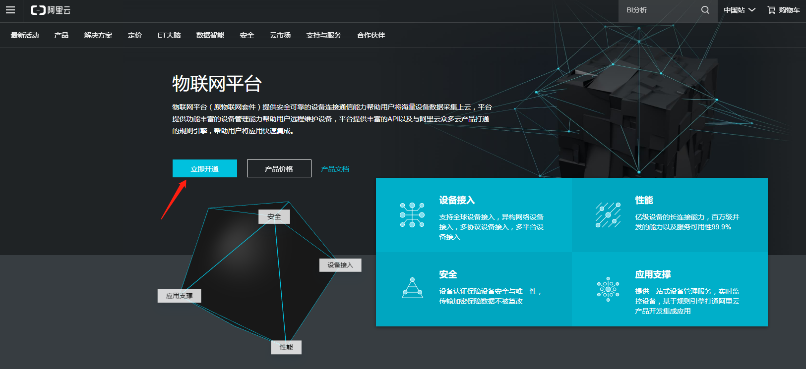

- 创建产品

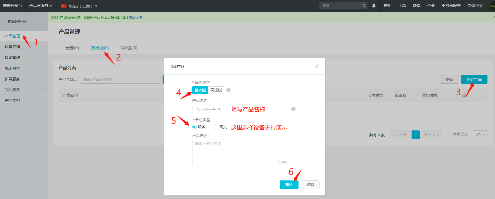

- 添加设备

  在设备管理菜单下，新增一个测试设备，点击查看进入设备详情页面。

  成功创建设备后，可以获取到设备激活需要的三元组（**ProductKey、DeviceName、DeviceSecret**），后面需要使用 **menuconfig** 配置到设备 SDK 中。

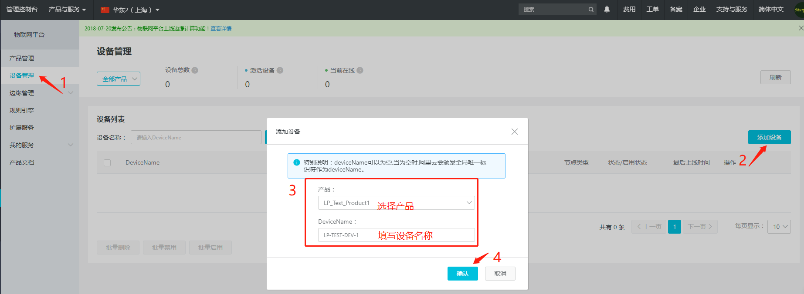

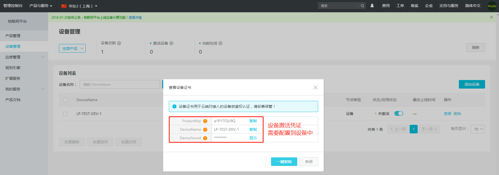

- 查看消息 Topic 列表

  进入设备详情页面，然后在 **Topic 列表** 选项查看创建设备默认分配的 Topic 列表，以及 Topic 权限。

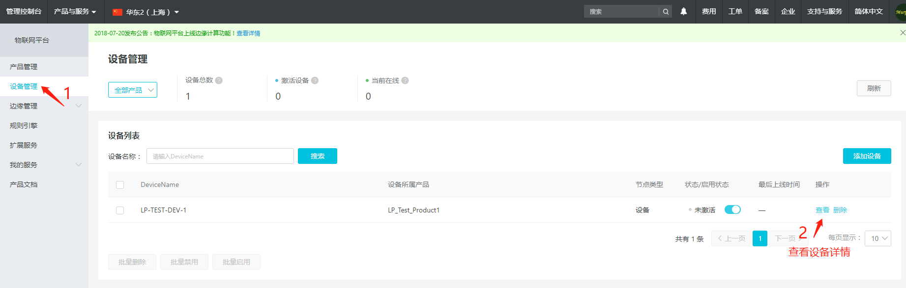

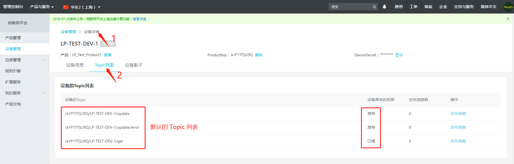

- **自定义 Topic**

  MQTT 示例程序中会用到名为 **data** 的 Topic，Topic 权限为**发布和订阅**，因此这里必须自定义一个 **data** Topic，如下图所示：

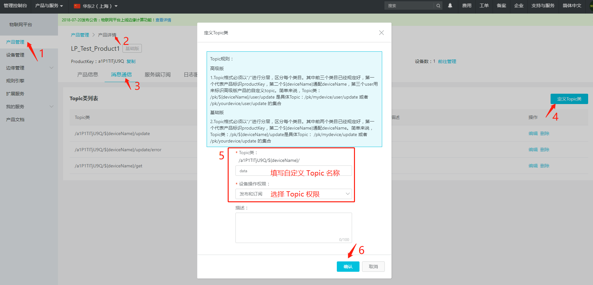

- **开通固件升级服务**

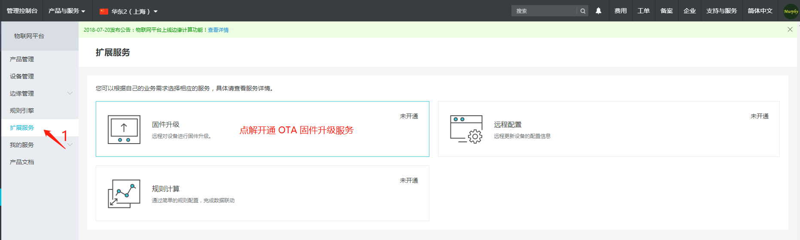

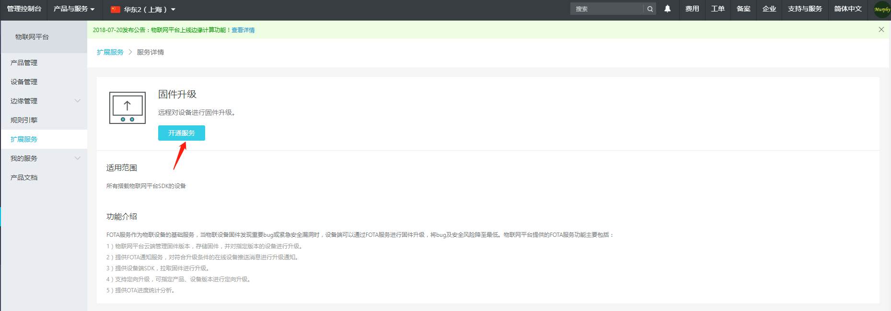

* **获取软件包**

    打开 RT-Thread 提供的 ENV 工具，使用 **menuconfig** 配置软件包。
  
    + 配置 iotkit 软件包
  
      配置使能 iotkit 软件包并**填写设备激活凭证**。

      `menuconfig` 中选择阿里云平台为 **LinkPlatform**，`OTA channel` 选择 **MQTT**（以 MQTT 为例），详细的配置如下所示：

    ```shell
    RT-Thread online packages  --->
        IoT - internet of things  --->
            IoT Cloud  --->
              [*] Ali-iotkit:  Ali Cloud SDK for IoT platform  --->
                    Select Aliyun platform (LinkPlatform Platform)  --->
              (a1dSQSGZ77X) Config Product Key
              (RGB-LED-DEV-1) Config Device Name
              (Ghuiyd9nmGowdZzjPqFtxhm3WUHEbIlI) Config Device Secret
              -*-   Enable MQTT
              [*]     Enable MQTT sample
              [*]     Enable MQTT direct connect
              [*]     Enable SSL
              [ ]   Enable COAP
              [*]   Enable OTA
                          Select OTA channel (Use MQTT OTA channel)  --->
                        version (latest)  --->
    ```
  
    + 增加 `mbedTLS` 帧大小

      阿里 TLS 认证过程中数据包较大，这里需要增加 TLS 帧大小，OTA 的时候**至少需要 8K** 大小。

      打开 RT-Thread 提供的 ENV 工具，使用 **menuconfig** 配置 **TLS** 帧大小。

    ```{.c}
    RT-Thread online packages  --->
        security packages  --->
          -*- mbedtls:An open source, portable, easy to use, 
                      readable and flexible SSL library  --->
          (8192) Maxium fragment length in bytes
    ```

    + 使用 `pkgs --update` 命令下载软件包


### MQTT 示例

该 MQTT 示例程序以**`data` Topic** 为例，演示了如何在设备上使用 MQTT + TLS/SSL 通道与阿里云平台建立双向通信。

**示例文件**

| 示例程序路径                   | 验证平台      | 说明 |
| ----                          | ---          | ---- |
| samples/mqtt/mqtt-example.c   | LinkDevelop, LinkPlatform | 基于 MQTT 通道的设备和云双向通信例程 |

**命令列表**

例程中，使用 MSH 命令启动 MQTT 例程，命令如下所示：

|命令|说明|
|----|----|
| ali_mqtt_test start     | 启动 MQTT 示例 |
| ali_mqtt_test pub open  | 开灯，并向云端同步开灯状态 |
| ali_mqtt_test pub close | 关灯，并向云端同步关灯状态 |
| ali_mqtt_test stop      | 停止 MQTT 示例 |

**启动 MQTT**

使用 **`ali_mqtt_test start`** 命令启动 MQTT 示例，成功后设备 log 显示订阅成功。

设备 log 如下所示：

```shell
msh />ali_mqtt_test start
ali_mqtt_main|645 :: iotkit-embedded sdk version: V2.10
[inf] iotx_device_info_init(40): device_info created successfully!
[dbg] iotx_device_info_set(50): start to set device info!
[dbg] iotx_device_info_set(64): device_info set successfully!
···
[inf] iotx_mc_init(1703): MQTT init success!
[inf] _ssl_client_init(175): Loading the CA root certificate ...
···
[inf] _TLSConnectNetwork(420):   . Verifying peer X.509 certificate..
[inf] _real_confirm(92): certificate verification result: 0x200
[inf] iotx_mc_connect(2035): mqtt connect success!
···
[inf] iotx_mc_subscribe(1388): mqtt subscribe success,topic = /a1P1TlTjU9Q/LP-TEST-DEV-1/data!
[dbg] iotx_mc_cycle(1269): SUBACK
event_handle|124 :: subscribe success, packet-id=0
[inf] iotx_mc_keepalive_sub(2226): send MQTT ping...
[inf] iotx_mc_cycle(1295): receive ping response!
```

**设备发布消息**

使用 **`ali_mqtt_test pub open`** 命令发送消息 **`data`** Topic。

设备 log 如下所示：

```shell
msh />ali_mqtt_test pub open
ali_mqtt_test_pub|583 ::
 publish message:
 topic: /a1P1TlTjU9Q/LP-TEST-DEV-1/data
 payload: {"id" : "1","version":"1.0","params" : {"RGBColor" : {"Red":247,"Green":60,"Blue":74},"LightSwitch" : 1},"method":"thing.event.property.post"}
 rc = 3
msh />[dbg] iotx_mc_cycle(1260): PUBACK
event_handle|148 :: publish success, packet-id=0
[dbg] iotx_mc_cycle(1260): PUBACK
event_handle|148 :: publish success, packet-id=0
[dbg] iotx_mc_cycle(1277): PUBLISH
···
[dbg] iotx_mc_handle_recv_PUBLISH(1100):       Receive Buflen : 1024
[dbg] iotx_mc_handle_recv_PUBLISH(1111): delivering msg ...
[dbg] iotx_mc_deliver_message(866): topic be matched
_demo_message_arrive|182 :: ----
_demo_message_arrive|183 :: packetId: 19324
_demo_message_arrive|187 :: Topic: '/a1P1TlTjU9Q/LP-TEST-DEV-1/data' (Length: 31)
_demo_message_arrive|191 :: Payload: 
'{"id" : "1","version":"1.0","params" : {"RGBColor" : {"Red":247,"Green":60,"Blue":74},"LightSwitch" : 1},
"method":"thing.event.property.post"}' (Length: 142)
_demo_message_arrive|192 :: ----
```

**查看云端日志**

在设备详情里的**运行状态**里可以查看设备的上报到云端的消息内容。

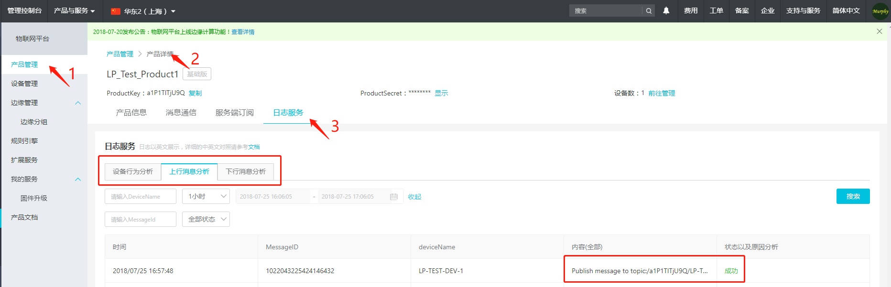

**云端推送消息到设备**

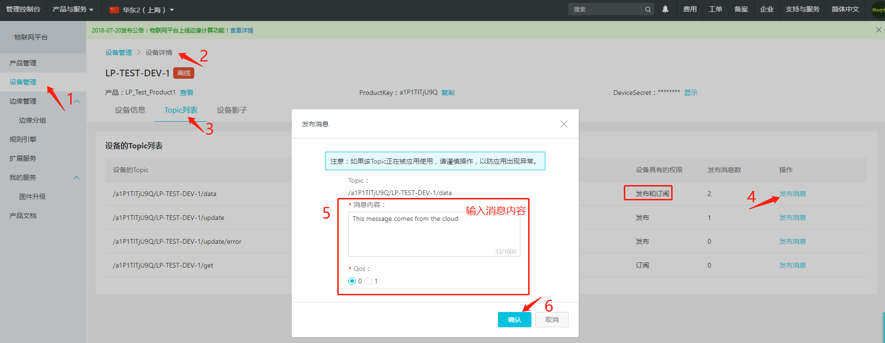

**查看设备订阅日志**

使用调试控制台发送命令后，设备可以接受到命令，log 如下所示：

```shell
msh />[dbg] iotx_mc_cycle(1277): PUBLISH
[dbg] iotx_mc_handle_recv_PUBLISH(1091):         Packet Ident : 00000000
[dbg] iotx_mc_handle_recv_PUBLISH(1092):         Topic Length : 31
[dbg] iotx_mc_handle_recv_PUBLISH(1096):           Topic Name : /a1P1TlTjU9Q/LP-TEST-DEV-1/data
[dbg] iotx_mc_handle_recv_PUBLISH(1099):     Payload Len/Room : 33 / 989
[dbg] iotx_mc_handle_recv_PUBLISH(1100):       Receive Buflen : 1024
[dbg] iotx_mc_handle_recv_PUBLISH(1111): delivering msg ...
[dbg] iotx_mc_deliver_message(866): topic be matched
_demo_message_arrive|182 :: ----
_demo_message_arrive|183 :: packetId: 0
_demo_message_arrive|187 :: Topic: '/a1P1TlTjU9Q/LP-TEST-DEV-1/data' (Length: 31)
_demo_message_arrive|191 :: Payload: 'This message comes from the cloud' (Length: 33)
_demo_message_arrive|192 :: ----
```

**退出 MQTT 示例**

使用 **`ali_mqtt_test stop`** 命令退出 MQTT 示例，设备 log 如下所示：

```
msh />ali_mqtt_test stop
msh />[inf] iotx_mc_unsubscribe(1423): mqtt unsubscribe success,topic = /a1P1TlTjU9Q/LP-TEST-DEV-1/data!
event_handle|136 :: unsubscribe success, packet-id=0
[dbg] iotx_mc_disconnect(2121): rc = MQTTDisconnect() = 0
[inf] _network_ssl_disconnect(514): ssl_disconnect
[inf] iotx_mc_disconnect(2129): mqtt disconnect!
[inf] iotx_mc_release(2175): mqtt release!
[err] LITE_dump_malloc_free_stats(594): WITH_MEM_STATS = 0
mqtt_client|329 :: out of sample!
```

### OTA 示例

固件升级支持对设备的固件进行远程空中升级（Over-The-Air），实现对设备的远程维护、功能升级、问题修复等场景的使用。您可以指定产品新增一个固件，对固件进行验证，验证通过后开始批量升级，并在固件详情中查看升级结果。

**示例文件**

| 示例程序路径                                    | 验证平台      | 说明 |
| ----                                           | ---          | ---- |
| samples/ota/ota_mqtt-example.c     | LinkDevelop, LinkPlatform  | 基于 MQTT 通道的设备 OTA 例程 |

**命令列表**

例程中，使用 MSH 命令启动 OTA 例程，命令如下所示：

|命令|说明|
|----|----|
| ali_ota_test start | 启动 OTA 示例 |
| ali_ota_test stop  | 手动退出 OTA 示例 |

**运行 OTA 示例**

使用 **`ali_ota_test start`** 命令启动 OTA 例程，然后等待云端发送 OTA 指令。

设备 log 如下所示：

```shell
msh />ali_ota_test start
ali_ota_main|372 :: iotkit-embedded sdk version: V2.10
[inf] iotx_device_info_init(40): device_info created successfully!
[dbg] iotx_device_info_set(50): start to set device info!
[dbg] iotx_device_info_set(64): device_info set successfully!
···
[inf] iotx_mc_init(1703): MQTT init success!
[inf] _ssl_client_init(175): Loading the CA root certificate ...
···
[inf] _TLSConnectNetwork(420):   . Verifying peer X.509 certificate..
[inf] _real_confirm(92): certificate verification result: 0x200
[inf] iotx_mc_connect(2035): mqtt connect success!
···
[dbg] iotx_mc_report_mid(2292): MID Report: topic name = '/sys/a1P1TlTjU9Q/LP-TEST-DEV-1/thing/status/update'
[dbg] iotx_mc_report_mid(2309): MID Report: finished, IOT_MQTT_Publish() = 0
[inf] iotx_mc_subscribe(1388): mqtt subscribe success,topic = /ota/device/upgrade/a1P1TlTjU9Q/LP-TEST-DEV-1!
mqtt_client|241 :: wait ota upgrade command....
mqtt_client|241 :: wait ota upgrade command....
```

**新增固件**

这里需要用户上传一个 bin 类型的测试固件，随意一个 bin 固件即可，演示例程只进行固件下载及校验，不会写入 Flash，所以也不会真正进行固件搬运升级。

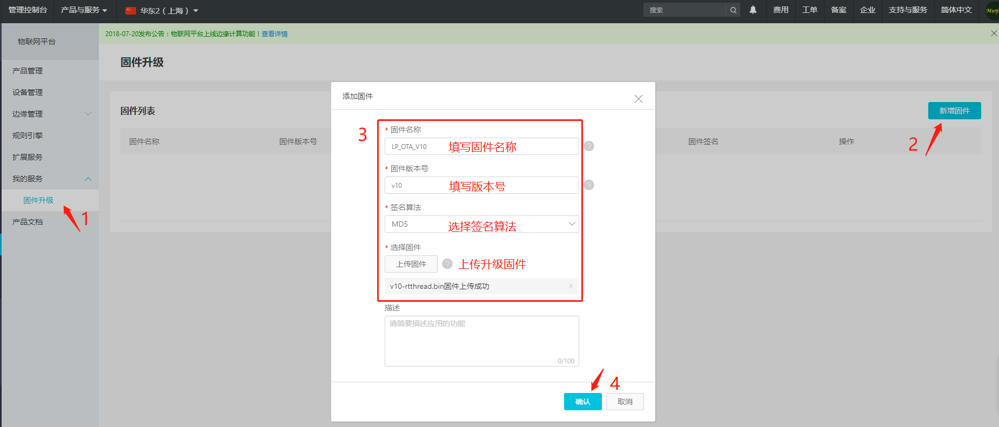

**验证固件**


**设备日志**

推送成功后，设备开始下载固件，下载完成后自动进行固件完整性校验，设备端测试日志如下所示：

```shell
···
mqtt_client|254 :: Here write OTA data to file....
[dbg] IOT_OTA_Ioctl(457): 
origin=e4e54df52a3b530c7e0544b2872f1305, now=e4e54df52a3b530c7e0544b2872f1305
mqtt_client|280 :: The firmware is valid!  Download firmware successfully.
mqtt_client|294 :: OTA FW version: v10
```

**云端升级进度展示**

设备升级过程中云端会显示设备下载固件的进度，固件下载完成并校验固件成功，设备 SDK 上报新的版本号到云端，云端会显示升级成功，如下图所示：

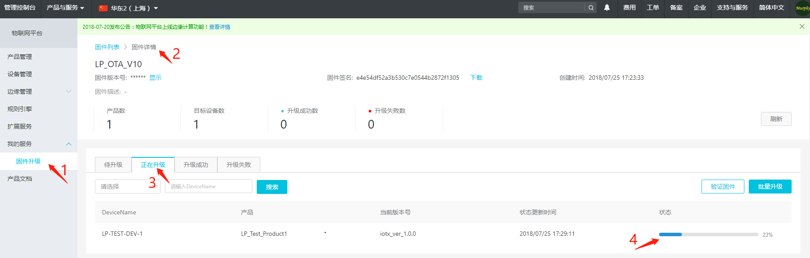

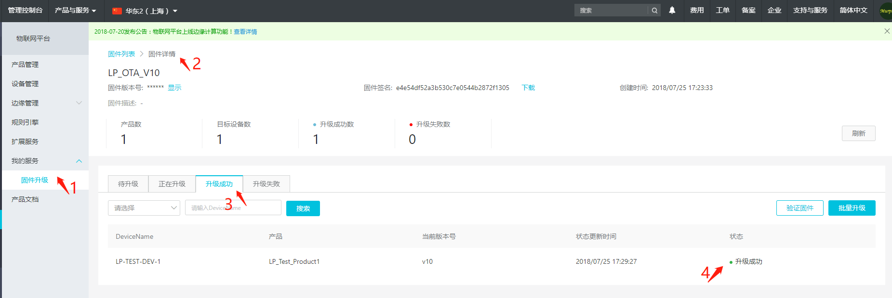

**退出 OTA 例程**

升级成功或者升级失败会自动退出 OTA 例程，如果需要手动退出 OTA 例程，请使用 **`ali_ota_test stop`** 命令。

```shell
msh />ali_ota_test stop
msh />[dbg] iotx_mc_disconnect(2121): rc = MQTTDisconnect() = 0
[inf] _network_ssl_disconnect(514): ssl_disconnect
[inf] iotx_mc_disconnect(2129): mqtt disconnect!
[inf] iotx_mc_release(2175): mqtt release!
[err] LITE_dump_malloc_free_stats(594): WITH_MEM_STATS = 0
mqtt_client|340 :: out of sample!
```

## 注意事项

- 使用前请在 `menuconfig` 里配置自己的设备激活凭证（PRODUCT_KEY、DEVICE_NAME 和 DEVICE_SECRET）
- 使用 `menuconfig` 配置选择要接入的平台（**LinkDevelop** 或者 **LinkPlatform**）
- 开启 OTA 功能必须使能加密连接，默认选择（因为 OTA 升级**必须使用 HTTPS** 下载固件）

## 常见问题

- MbedTLS 返回 0x7200 错误

    通常是由于 MbedTLS 帧长度过小，请增加 MbedTLS 帧长度（**至少需要 8K 大小**）。
