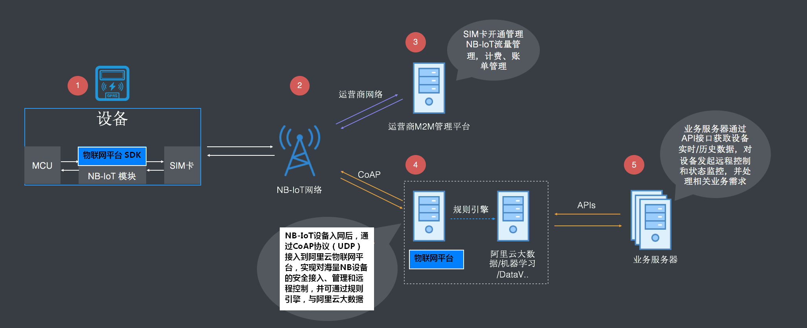

# 使用指南

**ali-iotkit** 软件包封装了 HTTP、MQTT、CoAP 和 OTA 等应用层协议，方便了用户设备接入云平台，这里摘取部分做简要介绍。

## MQTT 连接

目前阿里云支持 MQTT 标准协议接入，兼容 3.1.1 和 3.1 版本协议，具体的协议请参考 [MQTT 3.1.1](http://mqtt.org/?spm=a2c4g.11186623.2.1.5CR1rL) 和 [MQTT 3.1](http://public.dhe.ibm.com/software/dw/webservices/ws-mqtt/mqtt-v3r1.html?spm=a2c4g.11186623.2.2.5CR1rL) 协议文档。

### 特征

- 支持 MQTT 的 PUB、SUB、PING、PONG、CONNECT、DISCONNECT 和 UNSUB 等报文
- 支持 cleanSession
- 不支持 will、retain msg
- 不支持 QOS2
- 基于原生的 MQTT topic 上支持 RRPC 同步模式，服务器可以同步调用设备并获取设备回执结果

### 安全等级

支持 TLSV1、 TLSV1.1 和 TLSV1.2 版本的协议建立安全连接。

- TCP 通道基础＋芯片级加密（ID2硬件集成）： 安全级别高
- TCP 通道基础＋对称加密（使用设备私钥做对称加密）：安全级别中
- TCP 方式（数据不加密）： 安全级别低

### 连接域名

- 华东2节点：***productKey***.iot-as-mqtt.cn-shanghai.aliyuncs.com:1883
- 美西节点：***productKey***.iot-as-mqtt.us-west-1.aliyuncs.com:1883
- 新加坡节点：***productKey***.iot-as-mqtt.ap-southeast-1.aliyuncs.com:1883

### Topic 规范

默认情况下创建一个产品后，产品下的所有设备都拥有以下 Topic 类的权限：

- /***productKey***/***deviceName***/update pub
- /***productKey***/***deviceName***/update/error pub
- /***productKey***/***deviceName***/get sub
- /sys/***productKey***/***deviceName***/thing/# pub&sub
- /sys/***productKey***/***deviceName***/rrpc/# pub&sub
- /broadcast/***productKey***/# pub&sub

每个 Topic 规则称为 topic 类，topic 类实行设备维度隔离。每个设备发送消息时，将 deviceName 替换为自己设备的 deviceName ，防止 topic 被跨设备越权，topic 说明如下：

- pub：表示数据上报到 topic 的权限
- sub：表示订阅 topic 的权限
- /***productKey***/***deviceName***/xxx 类型的 topic 类：可以在物联网平台的控制台扩展和自定义
- /sys 开头的 topic 类：属于系统约定的应用协议通信标准，不允许用户自定义的，约定的 topic 需要符合阿里云 ALink 数据标准
- /sys/***productKey***/***deviceName***/thing/xxx 类型的 topic 类：网关主子设备使用的 topic 类，用于网关场景
- /broadcast 开头的 topic 类：广播类特定 topic
- /sys/***productKey***/***deviceName***/rrpc/request/${messageId}：用于同步请求，服务器会对消息 Id 动态生成 topic， 设备端可以订阅通配符
- /sys/***productKey***/***deviceName***/rrpc/request/+：收到消息后，发送 pub 消息到 /sys/***productKey***/***deviceName***/rrpc/response/${messageId}，服务器可以在发送请求时，同步收到结果

### 建立 MQTT 连接

使用 IOT_MQTT_Construct 接口与云端建立 MQTT 连接。

如果要实现设备长期在线，需要程序代码中去掉 IOT_MQTT_Unregister 和 IOT_MQTT_Destroy 部分，使用 while 保持长连接状态。

示例代码如下：

```{.c}
while(1)
{
    IOT_MQTT_Yield(pclient, 200); 
    HAL_SleepMs(100);
}
```

### 订阅 Topic 主题

使用 IOT_MQTT_Subscribe 接口订阅某个 Topic。

代码如下：

```{.c}
/* Subscribe the specific topic */
rc = IOT_MQTT_Subscribe(pclient, TOPIC_DATA, IOTX_MQTT_QOS1, 
                        _demo_message_arrive, NULL);
if (rc < 0) {
    IOT_MQTT_Destroy(&pclient);
    EXAMPLE_TRACE("IOT_MQTT_Subscribe() failed, rc = %d", rc);
    rc = -1;
    goto do_exit;
}
```

### 发布消息

使用 IOT_MQTT_Publish 接口发布信息到云端。

代码如下：

```{.c}
/* Initialize topic information */
memset(&topic_msg, 0x0, sizeof(iotx_mqtt_topic_info_t));
strcpy(msg_pub, "message: hello! start!");
topic_msg.qos = IOTX_MQTT_QOS1;
topic_msg.retain = 0;
topic_msg.dup = 0;
topic_msg.payload = (void *)msg_pub;
topic_msg.payload_len = strlen(msg_pub);
rc = IOT_MQTT_Publish(pclient, TOPIC_DATA, &topic_msg);
EXAMPLE_TRACE("rc = IOT_MQTT_Publish() = %d", rc);
```

### 取消订阅

使用 IOT_MQTT_Unsubscribe 接口取消订阅云端消息

### 下行数据接收

使用 IOT_MQTT_Yield 数据接收函数接收来自云端的消息。

请在任何需要接收数据的地方调用这个 API。如果系统允许，请起一个单独的线程，执行该接口。

代码如下：

```{.c}
/* handle the MQTT packet received from TCP or SSL connection */
IOT_MQTT_Yield(pclient, 200);
```

### 销毁 MQTT 连接

使用 IOT_MQTT_Destroy 接口销毁 MQTT 连接，释放内存。

代码如下：

```{.c}
IOT_MQTT_Destroy(&pclient);
```

### 检查连接状态

使用 IOT_MQTT_CheckStateNormal 接口查看当前的连接状态。

该接口用于查询MQTT的连接状态。但是，该接口并不能立刻检测到设备断网，只会在有数据发送或是 keepalive 时才能侦测到 disconnect。

### MQTT 保持连接

设备端在 keepalive_interval_ms 时间间隔内，至少需要发送一次报文，包括 ping 请求。

如果服务端在 keepalive_interval_ms 时间内无法收到任何报文，物联网平台会断开连接，设备端需要进行重连。

在 IOT_MQTT_Construct 函数可以设置 keepalive_interval_ms 的取值，物联网平台通过该取值作为心跳间隔时间。keepalive_interval_ms 的取值范围是60000~300000。

示例代码：

```{.c}
iotx_mqtt_param_t mqtt_params;

memset(&mqtt_params, 0x0, sizeof(mqtt_params));
mqtt_params.keepalive_interval_ms = 60000;
mqtt_params.request_timeout_ms = 2000;

/* Construct a MQTT client with specify parameter */
pclient = IOT_MQTT_Construct(&mqtt_params);
```

## CoAP 连接

- 支持 RFC 7252 Constrained Application Protocol协议，具体请参考：[RFC 7252](https://tools.ietf.org/html/rfc7252?spm=a2c4g.11186623.2.1.rjevKV)
- 使用 DTLS v1.2 保证通道安全，具体请参考：[DTLS v1.2](https://tools.ietf.org/html/rfc6347?spm=a2c4g.11186623.2.2.rjevKV)
- 服务器地址 endpoint = ***productKey***.iot-as-coap.cn-shanghai.aliyuncs.com:5684

  其中 productKey 请替换为您申请的产品 Key

### CoAP 约定

- 不支持？号形式传参数
- 暂时不支持资源发现
- 仅支持 UDP 协议，并且目前必须通过 DTLS
- URI 规范，CoAP 的 URI 资源和 MQTT TOPIC 保持一致，参考 [MQTT规范](https://help.aliyun.com/document_detail/30540.html?spm=a2c4g.11186623.2.4.rjevKV)

### 应用场景

CoAP 协议适用在资源受限的低功耗设备上，尤其是 NB-IoT 的设备使用，基于 CoAP 协议将 NB-IoT 设备接入物联网平台的流程如下图所示：



### 建立连接

使用 IOT_CoAP_Init 和 IOT_CoAP_DeviceNameAuth 接口与云端建立 CoAP 认证连接。

示例代码：

```{.c}
iotx_coap_context_t *p_ctx = NULL;
p_ctx = IOT_CoAP_Init(&config);
if (NULL != p_ctx) {
    IOT_CoAP_DeviceNameAuth(p_ctx);
    do {
        count ++;
        if (count == 11) {
            count = 1;
        }
    IOT_CoAP_Yield(p_ctx);
    } while (m_coap_client_running);
    IOT_CoAP_Deinit(&p_ctx);
} else {
    HAL_Printf("IoTx CoAP init failed\r\n");
}
```

### 收发数据

SDK 使用接口 IOT_CoAP_SendMessage 发送数据，使用 IOT_CoAP_GetMessagePayload 和IOT_CoAP_GetMessageCode 接收数据。

示例代码：

```{.c}
/* send data */
static void iotx_post_data_to_server(void *param)
{
    char path[IOTX_URI_MAX_LEN + 1] = {0};
    iotx_message_t message;
    iotx_deviceinfo_t devinfo;
    message.p_payload = (unsigned char *)"{\"name\":\"hello world\"}";
    message.payload_len = strlen("{\"name\":\"hello world\"}");
    message.resp_callback = iotx_response_handler;
    message.msg_type = IOTX_MESSAGE_CON;
    message.content_type = IOTX_CONTENT_TYPE_JSON;
    iotx_coap_context_t *p_ctx = (iotx_coap_context_t *)param;
    iotx_set_devinfo(&devinfo);
    snprintf(path, IOTX_URI_MAX_LEN, "/topic/%s/%s/update/", 
             (char *)devinfo.product_key,
             (char *)devinfo.device_name);
    IOT_CoAP_SendMessage(p_ctx, path, &message);
}

/* receive data */
static void iotx_response_handler(void *arg, void *p_response)
{
    int len = 0;
    unsigned char *p_payload = NULL;
    iotx_coap_resp_code_t resp_code;
    IOT_CoAP_GetMessageCode(p_response, &resp_code);
    IOT_CoAP_GetMessagePayload(p_response, &p_payload, &len);
    HAL_Printf("[APPL]: Message response code: 0x%x\r\n", resp_code);
    HAL_Printf("[APPL]: Len: %d, Payload: %s, \r\n", len, p_payload);
}
```

### 下行数据接收

使用 IOT_CoAP_Yield 接口接收来自云端的下行数据。

请在任何需要接收数据的地方调用这个API，如果系统允许，请起一个单独的线程，执行该接口。

### 销毁 CoAP 连接

使用 IOT_CoAP_Deinit 接口销毁 CoAP 连接并释放内存。

## OTA 升级

### 固件升级 Topic

- 设备端上报固件版本给云端

> /ota/device/inform/***productKey***/***deviceName***

- 设备端订阅该topic接收云端固件升级通知

> /ota/device/upgrade/***productKey***/***deviceName***

- 设备端上报固件升级进度

> /ota/device/progress/***productKey***/***deviceName***

- 设备端请求是否固件升级

> /ota/device/request/***productKey***/***deviceName***

### 固件升级说明

- 设备固件版本号只需要在系统启动过程中上报一次即可，不需要周期循环上报
- 根据版本号来判断设备端OTA是否升级成功
- 从OTA服务端控制台发起批量升级，设备升级操作记录状态是待升级
  
    实际升级以OTA系统接收到设备上报的升级进度开始，设备升级操作记录状态是升级中。

- 设备离线时，接收不到服务端推送的升级消息

    当设备上线后，主动通知服务端上线消息，OTA 服务端收到设备上线消息，验证该设备是否需要升级，如果需要，再次推送升级消息给设备， 否则，不推送消息。

### OTA 代码说明

**初始化**

OTA 模块的初始化依赖于 MQTT 连接，即先获得的 MQTT 客户端句柄 pclient。

```{.c}
h_ota = IOT_OTA_Init(PRODUCT_KEY, DEVICE_NAME, pclient);
if (NULL == h_ota) {
    rc = -1;
    printf("initialize OTA failed\n");
}
```

**上报版本号**

在 OTA 模块初始化之后，调用 IOT_OTA_ReportVersion 接口上报当前固件的版本号，升级成功后重启运行新固件，并使用该接口上报新固件版本号，云端与 OTA 升级任务的版本号对比成功后，提示 OTA 升级成功。

示例代码如下:

```{.c}
if (0 != IOT_OTA_ReportVersion(h_ota, "version2.0")) {
    rc = -1;
    printf("report OTA version failed\n");
}
```

**下载固件**

MQTT 通道获取到 OTA 固件下载的 URL 后，使用 HTTPS 下载固件，边下载边存储到 Flash OTA 分区。

- IOT_OTA_IsFetching() 接口：用于判断是否有固件可下载
- IOT_OTA_FetchYield() 接口：用于下载一个固件块
- IOT_OTA_IsFetchFinish() 接口：用于判断是否已下载完成

示例代码：

```{.c}
// 判断是否有固件可下载
if (IOT_OTA_IsFetching(h_ota)) {
    unsigned char buf_ota[OTA_BUF_LEN];
    uint32_t len, size_downloaded, size_file;
    do {
        // 循环下载固件
        len = IOT_OTA_FetchYield(h_ota, buf_ota, OTA_BUF_LEN, 1); 
        if (len > 0) {
            // 写入到Flash等存储器中（边下载边存储）
        }
    } while (!IOT_OTA_IsFetchFinish(h_ota)); // 判断固件是否下载完毕
}
```

**上报下载状态**

使用 IOT_OTA_ReportProgress 接口上报固件下载进度。

```{.c}
if (percent - last_percent > 0) {
    IOT_OTA_ReportProgress(h_ota, percent, NULL);
}
IOT_MQTT_Yield(pclient, 100);
```

**判断下载固件是否完整**

固件下载完成后，使用 IOT_OTA_Ioctl 接口校验固件的完整性。

```{.c}
int32_t firmware_valid;
IOT_OTA_Ioctl(h_ota, IOT_OTAG_CHECK_FIRMWARE, &firmware_valid, 4);
if (0 == firmware_valid) {
    printf("The firmware is invalid\n");
} else {
    printf("The firmware is valid\n");
}
```

**销毁 OTA 连接**

使用 IOT_OTA_Deinit 销毁 OTA 连接并释放内存。

## 参考

- 以上内容引自阿里云物联网平台使用文档，详细内容请访问[阿里云物联网平台文档中心](https://help.aliyun.com/document_detail/30522.html?spm=a2c4g.11186623.6.539.8UAzmn)进行查阅
- 更多的 API 使用说明请参考 API 使用文档
- 更多的示例代码请参考示例程序及示例使用说明
