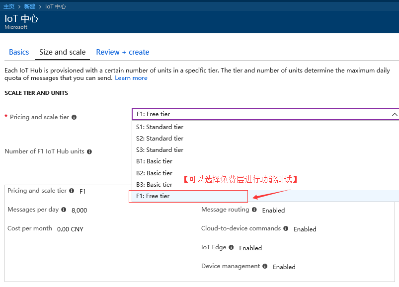
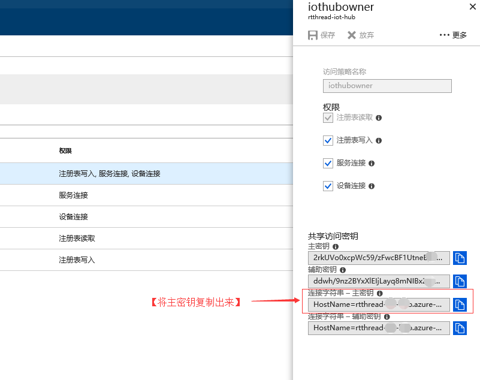
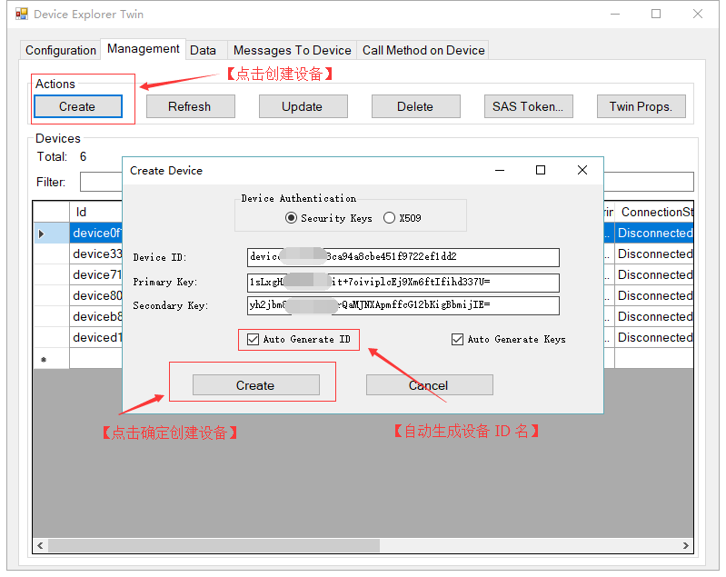
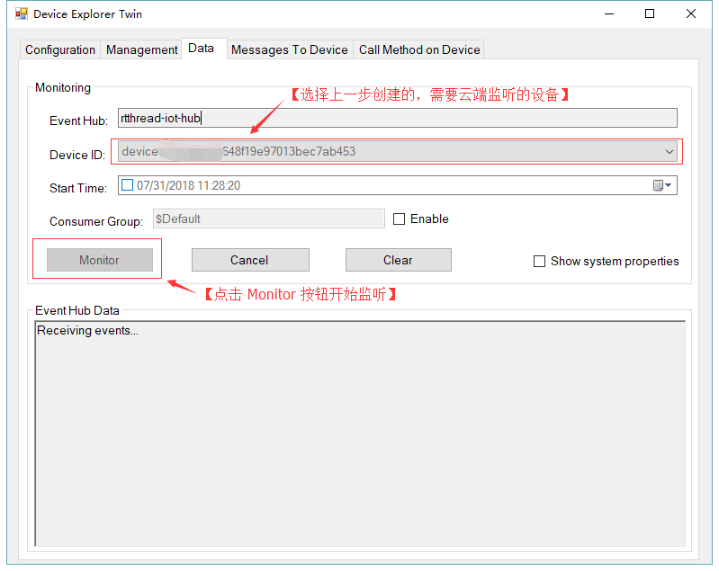
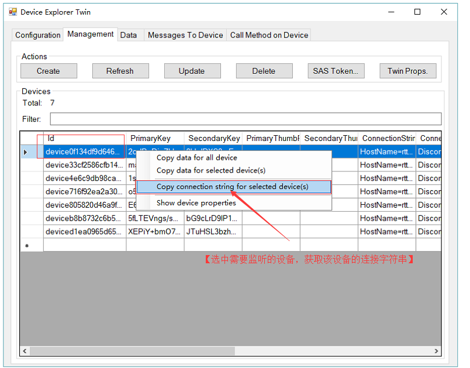

# 示例程序

## 简介

IoT 中心是一项 Azure 服务，用于将大量遥测数据从 IoT 设备引入云中进行存储或处理。 本次示例程序将展示设备与 IoT 中心之间进行数据交换的功能。

接下来我们会运行 Azure 软件包提供的两个功能示例，一个示例用于展示设备向云端发送遥测数据功能，另一个示例用于展示接收物联网中心下发数据的功能。 运行这两个示例程序之前，需要先创建 IoT 中心并在 IoT 中心上注册设备。

## 准备工作

在运行本次示例程序之前需要准备工作如下：

1、注册微软 Azure 账户，如果没有 Azure 订阅，请在开始前创建一个[试用帐户](https://www.azure.cn/pricing/1rmb-trial)。 

2、安装 DeviceExplorer 工具，这是一个 windows 平台下测试 Azure 软件包功能必不可少的工具。该工具的安装包为 tools 目录下的 SetupDeviceExplorer.msi，按照提示安装即可，成功运行后的界面如下图。


## 获取 Azure 软件包

- 将软件包加入工程，并将系统运行在拥有足够资源的开发板上

打开 RT-Thread 提供的 env 工具，在 bsp 目录下使用 menuconfig 命令打开配置选项，选中 `Azure: Microsoft azure cloud SDK for RT-Thread` 软件包，开启需要使用的功能示例。接下来使用 `pkgs --update` 命令即可将 azure 软件包加入到系统中，env 工具会自动添加该软件包的相关依赖。

```c
RT-Thread online packages  --->
    IoT - internet of things  --->
        IoT Cloud  --->
          [*] Azure: Microsoft azure cloud SDK for RT-Thread  --->       
          Choose Protocol (Using MQTT Protocol)  --->  #选择通信协议
          [*]   Enable Azure iothub telemetry example  #设备发送遥测数据示例
          [*]   Enable Azure iothub cloud to device example #云端下发数据示例       
          Version (latest)  --->                            #选择软件包版本
```

## 通信协议介绍

目前 RT-Thread Azure 软件包提供的示例代码支持 MQTT 和 HTTP 的通信协议，想要使用哪种协议，只需要在上面选项中选择相应的协议即可。在选择设备端通信协议时，需要注意以下几点：

1、当进行云到设备数据发送时，由于HTTPS 没有用于实现服务器推送的有效方法。 因此，使用 HTTPS 协议时，设备会在 IoT 中心轮询从云到设备的消息。 此方法对于设备和 IoT 中心而言是低效的。 根据当前 HTTPS 准则，每台设备应每 25 分钟或更长时间轮询一次消息。MQTT 支持在收到云到设备的消息时进行服务器推送。 它们会启用从 IoT 中心到设备的直接消息推送。 如果传送延迟是考虑因素，最好使用 MQTT协议。 对于很少连接的设备，HTTPS 也适用。

2、使用 HTTPS 时，每台设备应每 25 分钟或更长时间轮询一次从云到设备的消息。 但在开发期间，可按低于 25 分钟的更高频率进行轮询。 

3、更详细的协议选择文档请参考 Azure 官方文档[《选择通信协议》](https://docs.azure.cn/zh-cn/iot-hub/iot-hub-devguide-protocols)。

## 创建 IoT 中心

首先要做的是使用 Azure 门户在订阅中创建 IoT 中心。 IoT 中心用于将大量遥测数据从许多设备引入到云中。 然后，该中心会允许一个或多个在云中运行的后端服务读取和处理该遥测数据。 

1、登录到 [Azure 门户](http://portal.azure.cn/)。
2、选择“创建资源” > “物联网” > “IoT 中心”。


3、在 “IoT 中心” 窗格中，输入 IoT 中心的以下信息：

   - **Subscription（订阅）**：选择需要将其用于创建此 IoT 中心的订阅。
   - **Resource Group（资源组）**：创建用于托管 IoT 中心的资源组，或使用现有的资源组，在这个栏目中填入一个合适的名字就可以了。 有关详细信息，请参阅[使用资源组管理 Azure 资源](https://docs.azure.cn/zh-cn/azure-resource-manager/resource-group-portal)。
   - **Region（区域）**：选择最近的位置。
   - **IoT Hub Name（物联网中心名称）**：创建 IoT 中心的名称，这个名称需要是唯一的。 如果输入的名称可用，会显示一个绿色复选标记。

     

4、选择“下一步: **Size and scale（大小和规模）**”，以便继续创建 IoT 中心。

5、选择“**Pricing and scale tier（定价和缩放层）**”。 就测试用途来说，请选择“**F1:Free tier（F1 - 免费）**”层（前提是此层在订阅上仍然可用）。 有关详细信息，请参阅[定价和缩放层](https://www.azure.cn/pricing/details/iot-hub/)。

   

6、选择“**Review + create（查看 + 创建）**”。

7、查看 IoT 中心信息，然后单击“创建”即可。 创建 IoT 中心可能需要数分钟的时间。 可在“**通知**”窗格中监视进度，创建成功后就可以进行下一步注册设备的操作了。

8、为了后续方便查找，可以手动将创建成功后的资源添加到**仪表盘**。

## 注册设备

要想运行设备端相关的示例，需要先将设备信息注册到 IoT 中心里，然后该设备才能连接到 IoT 中心。 在本次示例中，可以使用 DeviceExplorer 工具来注册设备。

- 获得 IoT 中心的**共享访问密钥**（即IoT 中心连接字符串）

1、IoT 中心创建完毕后，在设置栏目中，点击共享访问策略选项，可以打开 IoT 中心的访问权限设置。打开 iothubowner，在右侧弹出的属性框中获得 IoT 中心的共享访问密钥。

   

2、在右侧弹出的属性框中获取 IoT 中心连接字符串：

   

- 创建设备

1、有了连接字符串后，我们便可以使用 DeviceExplorer 工具来创建设备，并测试 IoT 中心的功能了。打开测试工具，在配置选项中填入的连接字符串。点击 `update` 按钮更新本地连接  IoT 中心的配置，为下一步创建测试设备做准备。

   

2、打开 Management 选项栏，按照下图所示的步骤来创建测试设备。设备创建成功后，就可以运行设备的功能示例了。

   

   


## 功能示例一：设备发送遥测数据到物联网中心

### 示例文件

| 示例程序路径                   | 说明      |
| ----                          | ---          |
| samples/iothub_ll_telemetry_sample.c | 从设备端发送遥测数据到 Azure IoT 中心 |

### 云端监听设备数据

- 打开测试工具的 Data 选项栏，选择需要监听的设备，开始监听：



### 修改示例代码中的设备连接字符串

1、在运行测试示例前需要获取设备的连接字符串。

  

2、将连接字符串填入测试示例中的 connectionString 字符串中，重新编译程序，下载到开发板中。

  

### 运行示例程序

1、在 msh 中运行 azure_telemetry_sample 示例程序：

```c
msh />azure_telemetry_sample
msh />
ntp init
Creating IoTHub Device handle
Sending message 1 to IoTHub
-> 11:46:58 CONNECT | VER: 4 | KEEPALIVE: 240 | FLAGS: 192 | 
USERNAME:
xxxxxxxxxx.azuredevices.cn/devicexxxxxxx9d64648f19e97013bec7ab453
/?api-version=2017-xx-xx-preview&
DeviceClientType=iothubclient%2f1.2.8%20
(native%3b%20xxxxxxxx%3b%20xxxxxx) | PWD: XXXX | CLEAN: 0
<- 11:46:59 CONNACK | SESSION_PRESENT: true | RETURN_CODE: 0x0
The device client is connected to iothub
Sending message 2 to IoTHub
Sending message 3 to IoTHub
-> 11:47:03 PUBLISH | IS_DUP: false | RETAIN: 0 | QOS: DELIVER_AT_LEAST_ONCE |
    TOPIC_NAME: devices/device0f134df9d64648f19e97013bec7ab453/messages/events
    /hello=RT-Thread | PACKET_ID: 2 | PAYLOAD_LEN: 12
-> 11:47:03 PUBLISH | IS_DUP: false | RETAIN: 0 | QOS: DELIVER_AT_LEAST_ONCE | 
    TOPIC_NAME: devices/device0f134df9d64648f19e97013bec7ab453/messages/events
    /hello=RT-Thread | PACKET_ID: 3 | PAYLOAD_LEN: 12
-> 11:47:03 PUBLISH | IS_DUP: false | RETAIN: 0 | QOS: DELIVER_AT_LEAST_ONCE |
    TOPIC_NAME: devices/device0f134df9d64648f19e97013bec7ab453/messages/events
    /hello=RT-Thread | PACKET_ID: 4 | PAYLOAD_LEN: 12
<- 11:47:04 PUBACK | PACKET_ID: 2
Confirmation callback received for message 1 with result IOTHUB_CLIENT_CONFIRMATION_OK
<- 11:47:04 PUBACK | PACKET_ID: 3
Confirmation callback received for message 2 with result IOTHUB_CLIENT_CONFIRMATION_OK
<- 11:47:04 PUBACK | PACKET_ID: 4
Confirmation callback received for message 3 with result IOTHUB_CLIENT_CONFIRMATION_OK
Sending message 4 to IoTHub
-> 11:47:06 PUBLISH | IS_DUP: false | RETAIN: 0 | QOS: DELIVER_AT_LEAST_ONCE | 
    TOPIC_NAME: devices/device0f134df9d64648f19e97013bec7ab453/messages/events
    /hello=RT-Thread | PACKET_ID: 5 | PAYLOAD_LEN: 12
<- 11:47:07 PUBACK | PACKET_ID: 5
Confirmation callback received for message 4 with result IOTHUB_CLIENT_CONFIRMATION_OK
Sending message 5 to IoTHub
-> 11:47:09 PUBLISH | IS_DUP: false | RETAIN: 0 | QOS: DELIVER_AT_LEAST_ONCE | 
    TOPIC_NAME: devices/device0f134df9d64648f19e97013bec7ab453/messages/events
    /hello=RT-Thread | PACKET_ID: 6 | PAYLOAD_LEN: 12
<- 11:47:10 PUBACK | PACKET_ID: 6
Confirmation callback received for message 5 with result IOTHUB_CLIENT_CONFIRMATION_OK
-> 11:47:14 DISCONNECT
Error: Time:Tue Jul 31 11:47:14 2018 File:packages\azure\azure-port\pal\src\
socketio_berkeley.c Func:socketio_send Line:853 
Failure: socket state is not opened.
The device client has been disconnected
Azure Sample Exit
```

2、此时可在 DeviceExplorer 工具的 Data 栏查看设备发到云端的遥测数据：

  

示例运行成功，在 DeviceExplorer 工具中看到了设备发送到物联网中心的 5 条遥测数据。

## 功能示例二：设备监听云端下发的数据

### 示例文件

| 示例程序路径                   | 说明      |
| ----                          | ---          |
| samples/iothub_ll_c2d_sample.c | 在设备端监听 Azure IoT 中心下发的数据 |

### 修改示例代码中的设备连接字符串
- 与上面的示例相同，本示例程序也需要填写正确的设备连接字符串，修改完毕后重新编译程序，下载到开发板中即可。修改内容如下所示：

  

### 设备端运行示例程序

- 在 msh 中运行 azure_c2d_sample 示例程序 ，示例程序运行后设备将会等待并接收云端下发的数据：

```c
msh />azure_c2d_sample
msh />
ntp init
Creating IoTHub Device handle          # 等待 IoT 中心的下发数据
Waiting for message to be sent to device (will quit after 3 messages)
```

### 服务器下发数据给设备

1、打开 DeviceExplorer 工具的 Messages To Device 栏向指定设备发送数据：

  

2、此时在设备端查看从 IoT 中心下发给设备的数据：

```c
msh />azure_c2d_sample
msh />
ntp init
Creating IoTHub Device handle
Waiting for message to be sent to device (will quit after 3 messages)
Received Binary message                            # 收到二进制数据
Message ID: ea02902d-d6d2-4b7f-9f71-0873ca90b7a3
 Correlation ID: <unavailable>
 Data: <<<hello rt-thread>>> & Size=15
Received Binary message
Message ID: 9b2a9693-ddaf-4222-86b6-4ef8e0fc98d7
 Correlation ID: <unavailable>
 Data: <<<hello rt-thread>>> & Size=15
Received Binary message
Message ID: 48f6a50d-d20a-4483-8e06-41aa75b80aa8
 Correlation ID: <unavailable>
 Data: <<<hello rt-thread>>> & Size=15
Received Binary message
Message ID: 3f15a3ba-5d74-45c8-a714-259d64016515
 Correlation ID: <unavailable>
 Data: <<<hello rt-thread>>> & Size=15
Received Binary message
Message ID: 4313021c-1215-4e77-bb8a-c215c9f0ca38
 Correlation ID: <unavailable>
 Data: <<<hello rt-thread>>> & Size=15
Received Binary message
Message ID: 9be87f25-2a6f-46b5-a413-0fb2f93f85d6
 Correlation ID: <unavailable>
 Data: <<<hello rt-thread>>> & Size=15
Error: Time:Tue Jul 31 13:54:14 2018 
File:packages\azure\azure-port\pal\src\socketio_berkeley.c 
Func:socketio_send Line:853 Failure: socket state is not opened.
Azure Sample Exit     #收到一定数量的下发数据，功能示例自动退出
```

