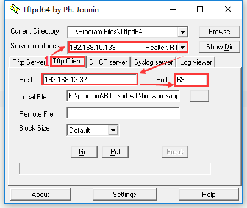

# TFTP：简单文件传输协议

## 1、介绍

[TFTP](https://baike.baidu.com/item/TFTP) （Trivial File Transfer Protocol, 简单文件传输协议）是 TCP/IP 协议族中的一个用来在客户机与服务器之间进行简单文件传输的协议，提供不复杂、开销不大的文件传输服务，端口号为 **69** ，比传统的 FTP 协议要轻量级很多，适用于小型的嵌入式产品上。

RT-Thread 目前支持的是 TFTP 服务器。

## 2、使用

### 2.1 安装 TFTP 客户端

安装文件位于 `/tools/Tftpd64-4.60-setup.exe` ，使用 TFTP 前，请先安装该软件。

### 2.2 启动 TFTP 服务器

在传输文件前，需要在 RT-Thread 上使用 Finsh/MSH 命令来启动 TFTP 服务器，大致效果如下：

```
msh />tftp_server
TFTP server start successfully.
msh />
```

### 2.3 传输文件

打开刚安装的 `Tftpd64` 软件，按如下操作进行配置：

- 1、选择 `Tftp Client` ；
- 2、在 `Server interfaces` 下拉框中，务必选择好与 RT-Thread 处于同一网段的网卡；
- 3、填写 TFTP 服务器的 IP 地址。可以在 RT-Thread 的 MSH 下使用 `ifconfig` 命令查看；
- 4、填写 TFTP 服务器端口号，默认： `69` 



#### 2.3.1 发送文件到 RT-Thread

- 1、在 `Tftpd64` 软件中，选择好要发送文件；
- 2、`Remote File` 是服务器端保存文件的路径（包括文件名），选项支持相对路径和绝对路径。由于 RT-Thread 默认开启 `DFS_USING_WORKDIR` 选项，此时相对路径是基于 Finsh/MSH 当前进入的目录。所以，使用相对路径时，务必提前切换好目录；
- 3、点击 `Put` 按钮即可。

如下图所示，将文件发送至 Finsh/MSH 当前进入的目录下，这里使用的是 **相对路径** ：


> 注意：如果 `DFS_USING_WORKDIR` 未开启，同时 `Remote File` 为空，文件会将保存至根路径下。

#### 2.3.2 从 RT-Thread 接收文件

- 1、在 `Tftpd64` 软件中，填写好要接收保存的文件路径（包含文件名）；
- 2、`Remote File` 是服务器端待接收回来的文件路径（包括文件名），选项支持相对路径和绝对路径。由于 RT-Thread 默认开启 `DFS_USING_WORKDIR` 选项，此时相对路径是基于 Finsh/MSH 当前进入的目录。所以，使用相对路径时，务必提前切换好目录；
- 3、点击 `Get` 按钮即可。

如下所示，将 `/web_root/image.jpg` 保存到本地，这里使用的是 **绝对路径** ：

```
msh /web_root>ls           ##查看文件是否存在
Directory /web_root:
image.jpg           10559                    
msh /web_root>
```


## 3、常见问题

### 3.1 Put 文件到单片机时，程序会进入 hardfault ：

hardfault 时日志类似如下：

```
msh />psr: 0x61000000
 pc: 0x08009030
 lr: 0x08009031
r12: 0x00000000
r03: 0x20000208
r02: 0x20000208
r01: 0x2000fa44
r00: 0x00000000
hard fault on thread: tcpip
thread pri  status      sp     stack size max used left tick  error
------ ---  ------- ---------- ----------  ------  ---------- ---
tshell  20  suspend 0x00000140 0x00001000    07%   0x00000006 000
tcpip   10  close   0xfffffd0f 0x0000004b    100%   0x2000f9bf 000
etx     12  ready   0x00000098 0x00000400    14%   0x00000010 000
erx     12  ready   0x000000e0 0x00000400    53%   0x00000010 000
tidle   31  ready   0x00000048 0x00000100    34%   0x0000001c 000
```

可以看出 tcpip 线程的 max used 指标为 100%，说明其堆栈已经溢出。还有种可能，此时的 tcpip 线程那行信息出现了乱码，同样也是其线程堆栈溢出所致。

在 lwIP 的 tcpip 默认配置位于：

`RT-Thread Components` → `Network stack` → `light weight TCP/IP stack` → ` (1024) the stack size of lwIP thread`

该选项默认为 `1024` ，建议调整至 `2048` 即可