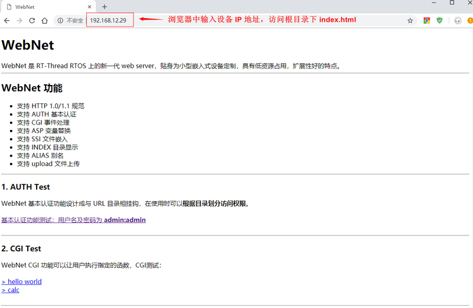
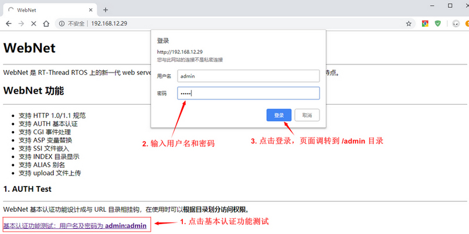
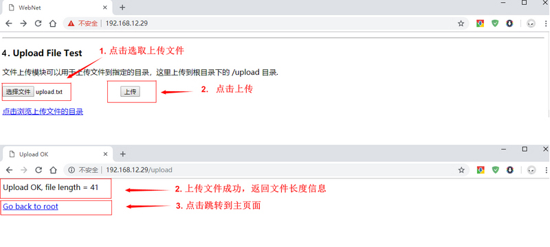
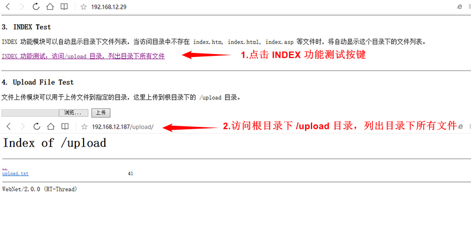
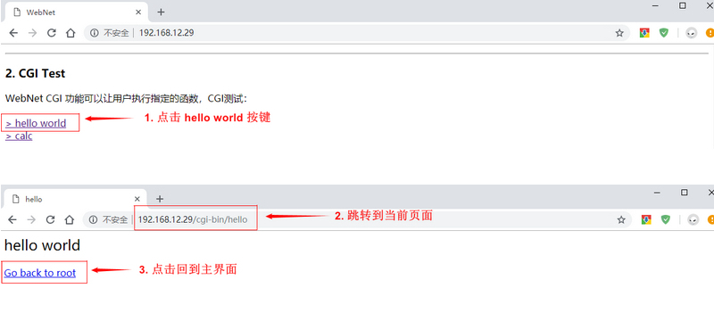

# 使用 Web 服务器组件：WebNet

## 简介

本例程使用 WebNet 软件包创建一个 Web 服务器，并展示 Web 服务器静态页面、CGI（事件处理）、AUTH（基本认证）、Upload（文件上传） 等部分功能。

## 硬件说明

本例程需要依赖 IoT Board 板卡上的 WiFi 模块和 TF 卡模块，因此请确保硬件平台上的 WiFi 模块和 TF 卡模块可以正常工作。

## 准备工作

1. 在 TF 卡根目录下创建 webnet 文件夹。
2. 在 webnet 文件夹里创建 admin 和 upload 两个文件夹。
3. 将 `/examples/29_iot_web_server/ports/webnet/index.html` 复制到 TF 卡的 webnet 文件夹里。

index.html 文件是访问 web 服务器时默认展示的页面，我们提供的 html 文件是用来测试本例程的相关功能的。熟悉 HTML 语言的开发者可以自己编写 index.html 页面，并放入 webnet 文件夹里。

## 软件说明

**WebNet** 位于 `/examples/29_iot_web_server` 目录下，重要文件摘要说明如下表所示：

| 文件                           | 说明            |
| :----------------------------- | :-------------- |
| applications/main.c            | app 入口        |
| ports/webnet                   | 示例网页        |
| ../../drivers/drv_spi_tfcard.c | TF 卡驱动       |
| ../../libraries/wifi           | WiFi 模组库文件 |

本例程主要展示了 WebNet 的几个常用功能，程序代码位于 `/examples/29_iot_web_server/applications/main.c` 文件中。

在 main 函数中，主要完成了以下几个任务：

- 挂载 SD 卡
- 初始化 WIFI，等待 WIFI 自动连接成功
- 启动 WebNet 

main函数代码如下所示：

```c

int main(void)
{
    int result = RT_EOK;

    /* 等待 WIFI 初始化完成 */
    rt_hw_wlan_wait_init_done(500);

    /* 挂载文件系统 */
    if (dfs_mount("sd0", "/", "elm", 0, 0) == 0)
    {
        LOG_I("Filesystem initialized!");
    }
    else
    {
        LOG_E("Failed to initialize filesystem!");
    }

    /* 创建信号量 */
    rt_sem_init(&net_ready, "net_ready", 0, RT_IPC_FLAG_FIFO);

    /* 注册 WIFI 连接成功回调函数 */
    rt_wlan_register_event_handler(RT_WLAN_EVT_READY, wlan_ready_handler, RT_NULL);

    /* 配置 WIFI 自动连接 */
    wlan_autoconnect_init();

    /* 使能 WIFI 自动连接 */
    rt_wlan_config_autoreconnect(RT_TRUE);

    /* 等待连接成功 */
    result = rt_sem_take(&net_ready, RT_WAITING_FOREVER);
    if (result != RT_EOK)
    {
        LOG_E("Wait net ready failed!");
        return -RT_ERROR;
    }

    /* 启动 webnet demo */
    webnet_demo();

    return 0;
}
```

当 WiFi 连接成功后，会调用 webnet_test() 函数，该函数会开启 CGI，AUTH 验证和上传功能，然后启动 WebNet。webnet_test() 函数代码如下所示：

```c
void webnet_demo(void)
{
    /* 注册 CGI 处理函数 */
    webnet_cgi_register("hello", cgi_hello_handler);
    webnet_cgi_register("calc", cgi_calc_handler);
	
    /* 设置 AUTH 验证 */
    webnet_auth_set("/admin", "admin:admin");

    /* 添加上传入口 */
    webnet_upload_add(&upload_entry_upload);

    /* 启动 WebNet */
    webnet_init();
}
```

## 运行

### 编译&下载

- **MDK**：双击 `project.uvprojx` 打开 MDK5 工程，执行编译。
- **IAR**：双击 `project.eww` 打开 IAR 工程，执行编译。

编译完成后，将开发板的 ST-Link USB 口与 PC 机连接，然后将固件下载至开发板。

### 运行效果

按下复位按键重启开发板，正常运行后，终端输出信息如下：

```shell
 \ | /                                                                                                                              
- RT -     Thread Operating System                                                                                                  
 / | \     4.0.1 build Mar 27 2019                                                                                                  
 2006 - 2019 Copyright by rt-thread team                                                                                            
lwIP-2.0.2 initialized!                                                                                                             
[I/SAL_SKT] Socket Abstraction Layer initialize success.                                                                            
[SFUD] Find a Winbond flash chip. Size is 16777216 bytes.                                                                           
[SFUD] w25q128 flash device is initialize success.                                                                                  
msh />[I/FAL] RT-Thread Flash Abstraction Layer (V0.2.0) initialize success.                                                        
[I/OTA] RT-Thread OTA package(V0.1.3) initialize success.                                                                           
[I/OTA] Verify 'wifi_image' partition(fw ver: 1.0, timestamp: 1529386280) success.                                                  
[I/WICED] wifi initialize done. wiced version 3.3.1                                                                                 
[I/WLAN.dev] wlan init success                                                                                                      
[I/WLAN.lwip] eth device init ok name:w0                                                                                            
[I/main] Filesystem initialized!                            #文件系统挂载成功                                                                        
[Flash] EasyFlash V3.2.1 is initialize success.                                                                                     
[Flash] You can get the latest version on https://github.com/armink/EasyFlash .                                                     
join ssid:aptest                                                                                                                    
[I/WLAN.mgnt] wifi connect success ssid:aptest                                                                                      
[I/wn] RT-Thread webnet package (V2.0.0) initialize success.                                                                        
[I/WLAN.lwip] Got IP address : 192.168.12.29                 #网络连接成功
```

### 静态页面展示

访问 web 服务器根目录时，web 服务器会默认展示根目录下的 **index.html** 或者 **index.htm** 文件。如果没找到文件，就会列出根目录下的所有文件。根目录可以通过修改 `/examples/29_iot_web_server/rtconfig.h` 中的 WEBNET_ROOT 宏定义来修改，默认为 /webnet。

在浏览器（这里使用谷歌浏览器）中输入刚刚打印的设备 IP 地址，将访问我们之前放入根目录（/webnet）的 **index.html** 文件，如下图所示，页面文件正常显示：



该页面上显示了 WebNet 软件包的基本功能介绍，并在下方给出相应的测试示例。

开发者如果想要访问别的页面，可以将要展示的网页放在 TF 卡根目录下任意路径，然后在浏览器里输入服务器的 IP 地址加网页相对于根目录的相对路径，即可访问对应的网页。例如，根目录为 /webnet，想要访问在 TF 卡里的 /webnet/product/a.html 网页，在浏览器里输入：开发板的 IP 地址/product/a.html，即可打开 a.html网页。

### AUTH 基本认证例程

在例程主页（ /index.html）AUTH Test   模块下点击 `基本认证功能测试：用户名及密码为 admin:admin` 按键，弹出基本认证对话框，输入用户名 **admin**，密码 **admin**。成功输入用户名和密码后，会进入根目录下 /admin 目录，如下图所示流程：



### Upload 文件上传例程

Upload 例程实现上传文件到 WebNet 服务器固定目录功能。在例程主页上 Upload File Test 模块下点击 `选择文件` 按键，选取需要上传的文件（本例程是用 upload.txt 文件），点击 `上传`，可以将文件上传到根目录下的 /upload 目录，如下图所示：



### INDEX 目录显示例程

INDEX 例程演示页面文件列表功能。

然后在例程主页 INDEX Test 模块下点击 `INDEX 功能测试：访问/upload 目录` 按键，会跳转到根目录下 /upload 目录，并且列出该目录下所有文件名和文件长度，如下图所示：



### CGI 事件处理例程

本例程提供两个 CGI 示例：**hello world 例程** 和 **calc 例程** ，用于演示 CGI 事件处理的基本功能。

- **hello world 例程**

hello world 例程演示了在页面演示文本内容功能，在例程主页 CGI Test  模块下点击 `> hello world` 按键，会跳转到新页面显示日志信息，新页面显示了 hello world 说明 CGI 事件处理成功，然后在新页面点击 `Go back to root`  按键回到例程主页面，如下图所示：



- **calc 例程**

calc 例程中使用 CGI 功能在页面上展示了简单的加法计算器功能，在例程主页 CGI Test  模块下点击 `> calc`  按键，会跳转到新的页面，输入两个数字点击 `计算` 按键，页面会显示两数字相加的结果。在新页面点击 `Go back to root`  按键可以回到例程主页面，如下图所示：


## 注意事项

- 首次运行例程，需要使用 `wifi join ssid password` 来连接 WIFI。
- 如果初始化文件系统失败，需要使用 `mkfs -t elm sd0` 命令来在 TF 卡上建立一个文件系统，然后重启系统。
- TF 卡里需要有 webnet，webnet/admin 和 webnet/upload 三个文件夹，否则例程访问会出错。
- 想要了解更多的 WebNet 软件包的功能，可以查阅 WEBNET 用户手册。

## 引用参考

- 《文件系统应用笔记》: docs/AN0012-RT-Thread-文件系统应用笔记.pdf
- 《WLAN 框架应用笔记》: docs/AN0026-RT-Thread-WLAN 框架应用笔记.pdf
- 《WEBNET 用户手册》: docs/UM1010-RT-Thread-Web 服务器(WebNet)用户手册.pdf
- 《RT-Thread 编程指南》: docs/RT-Thread 编程指南.pdf
