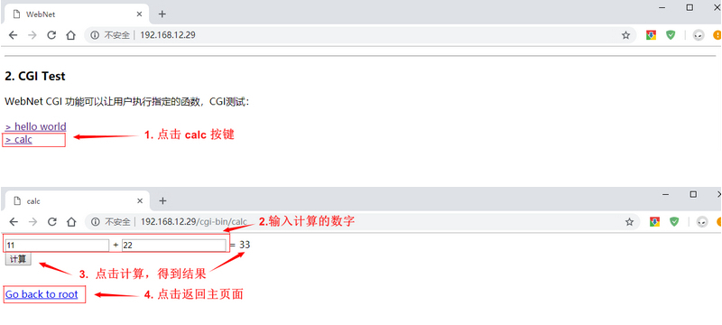
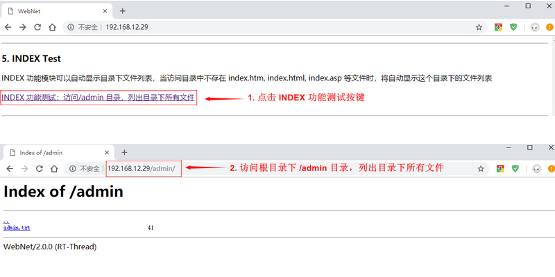
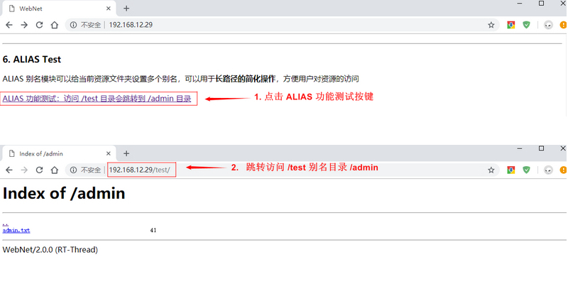

# 示例程序

WebNet 软件包提供了一个综合的示例页面用于展示软件包的多项功能，包括：AUTH、CGI、ASP、SSI、INDEX、ALIAS、Upload 等功能。本章节主要介绍 WebNet 软件包中各个功能模块示例的使用方式。

**示例文件**

| 示例程序路径                         | 说明  |
| ----                                | ---- |
| samples/wn_sample.c      | 综合示例代码 |
| samples/wn_sample_upload.c | 上传文件示例代码 |
| samples/index.html | 综合示例页面 |
| samples/index.shtml | SSI 功能示例页面 |
| samples/version.asp | ASP 功能示例页面 |

## 准备工作

### 软件包获取

- menuconfig 配置获取软件包和示例代码

    打开 RT-Thread 提供的 ENV 工具，使用 **menuconfig** 配置软件包。

    启用 WebNet 软件包，并配置使能测试例程配置（**Enable webnet samples**），如下所示：

```shell
RT-Thread online packages
    IoT - internet of things  --->
    	[*] WebNet: A HTTP Server for RT-Thread
            (80)  Server listen port                   ## 服务器监听套接字端口号
            (16)  Maximum number of server connections ## 服务器最大支持的连接数
            (/webnet)   Server root directory          ## 服务器根目录
                  Select supported modules  --->       ## 默认开启使用的功能模块
                 	 [ ] LOG: Enanle output log support
                  	 -*- AUTH: Enanle basic HTTP authentication support
                  	 -*- CGI: Enanle Common Gateway Interface support
                     -*- ASP: Enanle Active Server Pages support
                     -*- SSI: Enanle Server Side Includes support
                     -*- INDEX: Enanle list all the file in the directory support
                     -*- ALIAS: Enanle alias support
                     [ ] DAV: Enanle Web-based Distributed Authoring and Versioning support
                     -*- UPLOAD: Enanle upload file support                  
                     [ ] GZIP: Enable compressed file support by GZIP
                     (0) CACHE: Configure cache level
            [*]   Enable webnet samples  			    ## 开启测试例程
            	  Version (latest)  --->
```

- 使用 `pkgs --update` 命令下载软件包

- 编译下载

### 页面文件准备

WebNet 软件包示例中需要获取本地静态页面，需要文件系统的支持（FAT 文件系统，ROMFS 文件系统等，只需要支持 RT-Thread 的设备虚拟文件系统）。

静态页面需要上传到文件系统中服务器根目录下（示例中使用根目录为 /webnet）。设备挂载文件系统成功，需要依次执行下面操作：

1. 使用 `mkdir webnet` 命令创建 WebNet 软件包根目录 **/webnet**，并使用 `cd webnet` 命令进入该目录；

2. 使用 `mkdir admin` 和 `mkdir upload` 命令创建 **/webnet/admin** 和 **/webnet/upload** ，用于 AUTH 功能和 Upload 功能测试；

3. 将 WebNet 软件包 /sample 目录下的：**index.html**、**index.shtml**、**version.asp** 三个文件依次上传到设备 **/webnet** 目录（WebNet 根目录）中。（可以使用 TFTP 工具上传文件，具体操作方式参考 [TFTP 使用说明](https://github.com/RT-Thread-packages/netutils/blob/master/tftp/README.md))

创建目录和上传文件成功之后，就可以启动例程，测试 WebNet 软件功能。

## 启动例程 

本例程参数和环境配置如下：

- 监听端口号：80

- 根目录地址：/webnet

- 文件系统：FAT 文件系统

设备启动，连接网络成功之后，在 Shell 命令行输入 `webnet_test` 命令启动 WebNet 服务器。查看 Shell 命令行，显示如下日志信息，说明 WebNet 服务器初始化成功：

```shell
msh />webnet_test
[I/wn] RT-Thread webnet package (V2.0.0) initialize success.
```

然后在 Shell 命令行中使用 `ifconfig` 命令获取本设备 IP地址为 **192.168.12.29**。

```shell
msh />ifconfig
network interface: w0 (Default)
MTU: 1500
MAC: 44 32 c4 75 e0 59 
FLAGS: UP LINK_UP ETHARP BROADCAST IGMP
ip address: 192.168.12.29
gw address: 192.168.10.1
net mask  : 255.255.0.0
dns server #0: 192.168.10.1
dns server #1: 223.5.5.5
```

接着在浏览器（这里使用谷歌浏览器）中输入设备 IP 地址，将默认访问设备根目录下 **/index.html** 文件，如下图所示，页面文件正常显示：


该页面上显示了 WebNet 软件包的基本功能介绍，并根据不同的功能给出相应的演示示例，下面将按顺序介绍如下几个例程：

- AUTH 基本认证例程
- CGI 事件处理例程
- ASP 变量替换例程
- SSI 文件嵌套例程
- INDEX 目录显示例程
- ALIAS 别名访问例程
- Upload 文件上传例程

###  AUTH 基本认证例程

在例程主页（ /index.html）AUTH Test   模块下点击 `基本认证功能测试：用户名及密码为 admin:admin` 按键，弹出基本认证对话框，输入用户名 **admin**，密码 **admin**。成功输入用户名和密码后，会进入根目录下 /admin 目录，如下图所示流程：


### CGI 事件处理例程

本例程提供两个 CGI 示例：**hello world 例程** 和 **calc 例程** ，用于演示 CGI 事件处理的基本功能。

- **hello world 例程**

hello world 例程演示了在页面演示文本内容功能，在例程主页 CGI Test  模块下点击 `> hello world` 按键，会跳转到新页面显示日志信息，新页面显示了 hello world 说明 CGI 事件处理成功，然后在新页面点击 `Go back to root`  按键回到例程主页面，如下图所示：


- **calc 例程**

calc 例程中使用 CGI 功能在页面上展示了简单的加法计算器功能，在例程主页 CGI Test  模块下点击 `> calc`  按键，会跳转到新的页面，输入两个数字点击 `计算` 按键，页面会显示两数字相加的结果。在新页面点击 `Go back to root`  按键可以回到例程主页面，如下图所示：



### ASP 变量替换例程

ASP 例程演示了页面变量替换的功能。在例程主页 ASP Test  模块下点击 `ASP 功能测试：访问 version.asp 文件` 按键，会跳转到根目录下 version.asp 页面，该页面显示当前使用 RT-Thread 系统的版本号。在新页面点击 `Go back to root`  按键回到例程主页面，如下图所示：


### SSI 文件嵌套例程

SSI 例程演示在一个页面中嵌套另一个页面的功能。在例程主页 SSI Test  模块下点击 `SSI 功能测试：访问 /version.shtml 页面` 按键，会跳转到根目录下 index.shtml 页面，该页面中嵌套显示了主页面 index.html 内容。在新页面点击 `Go back to root`  按键回到例程主页面。


### INDEX 目录显示例程

INDEX 例程演示页面文件列表功能。

首先需要任意上传一个文件到根目录的 /admin 目录中，例程中已上传了 admin.txt 文件到该目录中。

然后在例程主页 INDEX Test 模块下点击 `INDEX 功能测试：访问/admin 目录` 按键，会跳转到根目录下 /admin 目录，并且列出该目录下所有文件名和文件长度，如下图所示：



### ALIAS 别名访问例程

ALIAS 例程演示了使用目录别名访问该目录的功能。该例程代码中已经将 /test 目录设置别名为 /admin， 在例程主页 ALIAS Test 模块下点击 `ALIAS 功能测试：访问 /test 目录会跳转到 /admin 目录 ` 按键，实际我们访问的是 /test  目录，但会跳转访问 /admin 目录，并列出该目录下所有文件信息，如下图所示：



### Upload 文件上传例程

Upload 例程实现上传文件到 WebNet 服务器固定目录功能。在例程主页上 Upload File Test 模块下点击 `选择文件` 按键，选取需要上传的文件（本例程是用 upload.txt 文件），点击 `上传`，可以将文件上传到根目录下的 /upload 目录，如下图所示：


文件上传成功之后，返回例程主页，点击 `浏览上传文件的目录` 按键，可以访问 /upload 文件，查看刚才上传的文件信息。

