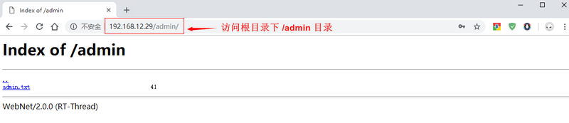
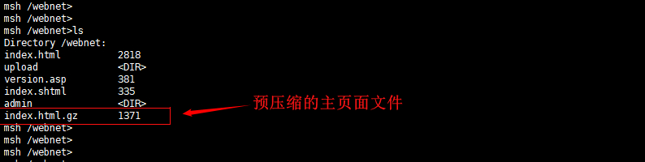

# 使用指南

本节主要介绍 WebNet 软包的基本使用流程， 并针对使用过程中经常涉及到的结构体和重要 API 进行简要说明。

## 准备工作

### ENV 配置说明

首先需要下载 WebNet 软件包，并将软件包加入到项目中。在 BSP 目录下使用 menuconfig 命令打开 ENV 配置界面，在 `RT-Thread online packages → IoT - internet of things` 中选择 WebNet软件包，具体路径如下：

```shell
RT-Thread online packages
    IoT - internet of things  --->
    	[*] WebNet: A HTTP Server for RT-Thread
            (80)  Server listen port
            (16)  Maximum number of server connections
            (/webnet)   Server root directory
                  Select supported modules  --->
                     [*] LOG: Enanle output log support
                     [*] AUTH: Enanle basic HTTP authentication support
                     [*] CGI: Enanle Common Gateway Interface support
                     [*] ASP: Enanle Active Server Pages support
                     [*] SSI: Enanle Server Side Includes support
                     [*] INDEX: Enanle list all the file in the directory support
                     [*] ALIAS: Enanle alias support  
                     [*] DAV: Enanle Web-based Distributed Authoring and Versioning support
                     [*] UPLOAD: Enanle upload file support
                     [*] GZIP: Enable compressed file support by GZIP
                     (2) CACHE: Configure cache level
                     	(1800) Cache-Control time in seconds   
            [*]   Enable webnet samples
            	  Version (latest)  --->
```

**Server listen port**：配置服务器监听端口号；

**Maximum number of server connections**：配置服务器最大支持连接数量；

**Server root directory**：配置服务器根目录路径；

**Select supported modules**：选择服务器支持的功能模块，默认开启全部功能模块支持；

- **LOG**：配置开启 WebNet 软件包日志功能支持；
- **AUTH**：配置开启 Basic Authentication 基本认证功能支持；
- **CGI**：配置开启 CGI 事件处理功能支持；
- **ASP**：配置开启 ASP 变量替换功能支持；
- **SSI**：配置开启文件嵌入功能支持；
- **INDEX**：配置开启显示当前页面文件列表功能支持；
- **ALIAS**：配置开启别名访问功能支持；
- **DAV**：配置开启基于 Web 的分布式创作和版本控制支持； 
- **Upload**：配置开启文件上传功能支持；
- **GZIP**：配置开启服务器压缩文件访问支持；
- **CHCHE**：配置开启缓存功能支持（可选级别 0,1,2）；
- **Cache-Control time**：配置缓存功能有效时间，需要缓存功能等级为 2；

**Enable webnet samples** ：配置添加服务器示例文件；

**Version**：配置软件包版本。

这里我们默认开启 WebNet 软件包**全部功能支持**，版本号选择 **latest** 最新版本。选择合适的配置项和版本后，使用 `pkgs --update` 命令下载软件包并更新用户配置。

## 文件系统使用说明

WebNet 软件包使用，需要文件系统的支持（FAT 文件系统，ROMFS 文件系统等，支持 RT-Thread 的设备虚拟文件系统），用于 WebNet 软件包中访问的静态页面的存储、上传下载文件的存储等功能。

## 工作流程

使用 WebNet 软件包之前，可以先了解 WebNet 软件包基本工作流程，如下所示：

- 初始化 WebNet 软件包，启动监听连接请求；

- 接收连接请求，创建连接会话；

- 接收 HTTP 请求数据，解析请求信息；

- 判断请求的功能模块，执行对应的功能；

- 返回 HTTP 响应数据 ；

- 关闭连接会话。

WebNet 软件包可以实现**在浏览器访问设备端保存的页面，并且上传和下载设备端文件** 。WebNet 软件包使用流程基于 HTTP 协议的请求和响应过程，通过解析 HTTP 请求的类型和参数进行判断，执行相应的功能模块，并且正确返回 HTTP 响应数据，完成整个流程。

下面以浏览器访问 WebNet 服务器根目录下主页面为例，介绍 WebNet 基本工作流程：

1. **初始化 WebNet 软件包**

```c
int webnet_init(void);
```

WebNet 软件包使用之前需要先初始化，初始化函数中创建了 webnet 线程。该线程用于初始化开启的功能模块，完成创建服务器监听套接字，并使用监听套接字等待客户端连接和数据交互。 如下图为线程函数主要操作：

```c
/* WebNet 服务器线程处理函数 */
static void webnet_thread(void *parameter)
{
    ....
    /* 创建监听套接字 */
    listenfd = socket(AF_INET, SOCK_STREAM, IPPROTO_TCP);
    ...
    /* 初始化开启的功能模块 */
    webnet_module_handle_event(RT_NULL, WEBNET_EVENT_INIT);

    /* 等待连接请求，等待接收数据 */
    for (;;)
    {
        ...
        sock_fd = select(maxfdp1, &tempfds, &tempwrtfds, 0, 0);
        if (sock_fd == 0)
            continue;

        if (FD_ISSET(listenfd, &tempfds))
        {
            /* 处理新的连接请求 */
        }
        
        /* 处理接收或发送的数据 */
        webnet_sessions_handle_fds(&tempfds, &writeset);
    }
	...
}
```

2. **接收连接请求，创建连接会话**

   WebNet 初始化线程创建成功之后，当有新的连接请求产生时，会创建一个连接会话结构体，结构体定义如下：

```c
struct webnet_session
{
    struct webnet_session *next;          		  // 会话结构体链表

    int socket;
    struct sockaddr_in cliaddr;
    struct webnet_request* request;				  // 会话的请求相关信息		

    rt_uint16_t buffer_length;				    
    rt_uint16_t buffer_offset;
    rt_uint8_t  buffer[WEBNET_SESSION_BUFSZ];     // 会话缓冲区数据，用于接收请求数据
    rt_uint32_t  session_phase;					  // 当前会话状态
    rt_uint32_t  session_event_mask;
    const struct webnet_session_ops* session_ops; // 会话事件执行函数 read、write、close等
    rt_uint32_t user_data;
};
```

   `webnet_session` 结构体用于存放当前建立的连接会话的部分信息，可用与当前会话连接的整个流程。在进行 HTTP 数据交互之前，需要先创建并初始化该结构体，**新会话的创建已经在 webnet 线程中完成**，如下所示：

```c
struct webnet_session* accept_session;
accept_session = webnet_session_create(listenfd);
if (accept_session == RT_NULL)
{
    /* 创建失败，关闭连接 */
}
```

3. **接收 HTTP 请求数据，解析请求信息**
    创建会话结构体成功之后，当连接会话接收到 HTTP 请求后，会对接收的 HTTP 请求进行处理，顺序地解析请求的类型、头部信息及附加参数。大致解析请求信息的流程如下所示：

```c
/* 该函数用于解析当前会话连接的请求模式、头部信息和参数 */
static void _webnet_session_handle_read(struct webnet_session* session)
{
    /* 读取当前会话 HTTP 连接会话数据 */
    ....

    if (session->buffer_offset)
    {
        /* 解析 HTTP 请求模式（GET、POST 等）*/
        if (session->session_phase == WEB_PHASE_METHOD)
        {
            webnet_request_parse_method(...);
        }

        /* 解析 HTTP 请求头部信息 */
        if (session->session_phase == WEB_PHASE_HEADER)
        {
            webnet_request_parse_header(...);
        }

        /* 解析 HTTP URL 中附带请求参数 */
        if (session->session_phase == WEB_PHASE_QUERY)
        {
            webnet_request_parse_post(...);
        }
    }
}
```

4. **判断请求的功能模块，执行对应的功能**

通过对请求模式和头部信息的解析，得到当前连接会话请求的基本信息，然后继续判断使用的功能模块的类型，并且执行对应的模块，判断的大致流程如下：

```c
/* 该函数为 WebNet 中用于判断和执行当前会话请求的功能，如日志功能、CGI 事件处理功能等 */
static int _webnet_module_system_uri_physical(struct webnet_session* session, int event)
{
    /* 如果开启 LOG 功能模块，使用 LOG 日志输出功能 */
#ifdef WEBNET_USING_LOG
    webnet_module_log(session, event);
#endif

     /* 如果开启 ALIAS 功能模块，判断当前请求是否是别名请求 */
#ifdef WEBNET_USING_ALIAS
    result = webnet_module_alias(session, event);
    if (result == WEBNET_MODULE_FINISHED) return result;
#endif

     /* 如果开启 AUTH 功能模块，判断当前请求是否需要执行基本认证操作 */
#ifdef WEBNET_USING_AUTH
    result = webnet_module_auth(session, event);
    if (result == WEBNET_MODULE_FINISHED) return result;
#endif

    /* 如果开启 CGI 功能模块，判断当前请求是否需要执行 CGI 操作 */
#ifdef WEBNET_USING_CGI
    result = webnet_module_cgi(session, event);
    if (result == WEBNET_MODULE_FINISHED) return result;
#endif
     ...
}
```

5. **返回 HTTP 响应数据**

判断功能模块类型成功，并且正确执对应功能之后，WebNet 服务器会对当前会话连接的请求给予响应，如 CGI 功能执行之后，在 CGI 执行函数中可以使用 `webnet_session_printf` 或 `webnet_session_write` 函数发送响应数据到客户端。

```c
/* 该函数 CGI 功能执行函数，当浏览器访问当前 CGI 事件时，执行该函数返回响应头部信息和数据 */
static void cgi_hello_handler(struct webnet_session* session)
{
     /* 拼接需要发送的页面数据 */
     ....
     
    /* 发送响应头部信息 */
    webnet_session_set_header(session, mime_get_type(".html"), 200, "Ok", strlen(status));

    /* 发送响应数据 */
    webnet_session_write(session, (const rt_uint8_t*)status, rt_strlen(status));
}
```

6. **关闭连接会话**

当前会话连接请求解析成功、功能模块执行完成、响应数据发送完成之后，会关闭当前连接会话，释放会话结构体，完成整个 HTTP 数据数据交互过程，实现在浏览器上访问设备端提供的网页文件，或者完成上传、下载服务器上文件的操作。

## 使用方式

对于 WebNet 服务器的多种功能模块，有些功能模块在使用之前需要先设置对应配置参数，部分功能模块需要配合页面代码实现功能， 接下来将介绍 WebNet 服务器不同功能模块的使用方式。

- **LOG 日志显示功能**

开启之后可以显示会话请求的基本信息，比如连接设置的 IP 地址和端口号，HTTP 请求类型、访问地址等信息，建议调试代码时开启。

- **AUTH 基本认证功能**

Basic Authentication 基础认证功能可以按目录划分访问权限。需要在WebNet 服务器初始化之前调用 `webnet_auth_set` 函数设置目录的用户名和密码（设置的格式为 **用户名：密码**），浏览器中访问该目录时需要输入正确的用户名和密码才能访问目录。相关函数定义如下：

```c
/* 设置目录基本认证信息 */
void webnet_auth_set(const char* path, const char* username_password);
```

AUTH 基本认证功能示例代码如下：

```c
void webnet_test(void)
{
    /* 设置 /admin 目录用户名为 admin 密码为 admin */
     webnet_auth_set("/admin", "admin:admin");
     webnet_init();
}
```

/admin 目录设置基本认证功能之后，在浏览器中访问 /admin 目录时，需要输入设置的用户名和密码才能访问，如图所示：


- **CGI 功能**

CGI 功能可以自定义事件的执行函数，当浏览器发送对应该事件的请求时，WebNet 服务器可以执行相应的操作。需要在WebNet 服务器初始化之前调用 `webnet_cgi_register` 函数注册 CGI 执行函数，相关函数定义如下：

```c
/* 设置 CGI 事件根目录 */
void webnet_cgi_set_root(const char* root);
/* 设置 CGI 事件执行函数 */
void webnet_cgi_register(const char* name, void (*handler)(struct webnet_session* session));

/* 发送头部信息到 WebNet 连接的客户端，用于 CGI 事件执行函数中 */
void webnet_session_set_header(struct webnet_session *session, const char* mimetype, int code, const char* status, int length);
/* 发送固定格式数据到 WebNet 连接的客户端，用于 CGI 事件执行函数中 */
void webnet_session_printf(struct webnet_session *session, const char* fmt, ...);
/* 发送数据到 WebNet 连接的客户端，用于 CGI 事件执行函数中 */
int  webnet_session_write(struct webnet_session *session, const rt_uint8_t* data, rt_size_t size);
```

CGI 功能使用的示例代码如下：

```c
static void cgi_hello_handler(struct webnet_session* session)
{
     const char* hello = "Hello World\n";
     webnet_session_set_header(session, mime_get_type(".html"), 200, "Ok", strlen(status));
     webnet_session_write(session, hello, rt_strlen(hello));
     webnet_session_printf(session, "%s", hello);
}
void webnet_test(void)
{
    /* 设置 CGI 事件执行函数*/
   webnet_cgi_register("hello", cgi_hello_handler);
    webnet_init();
}
```

对应的页面代码如下，浏览器上点击 **hello world** 按键将发送对应 CGI 请求给服务器。

```c
<html>
  <body>
    <hr>
    <h3> CGI Test</h3>
    WebNet CGI 功能可以让用户执行指定的函数，CGI测试：
    <br/><br/>
    <a href="/cgi-bin/hello">> hello world</a>
    <br/>
  </body>
</html>
```

- **ASP 变量替换功能**

ASP 变量替换功能，可以匹配网页代码中 **<% %>** 标记中包含的变量，替换成代码中注册的执行函数。所以在 WebNet 初始化之前需要调用 `webnet_asp_add_var` 设置 ASP 变量替换函数，相关函数定义如下：

```
/* 设置 ASP 变量执行函数 */
void webnet_asp_add_var(const char* name, void (*handler)(struct webnet_session* session));
```

ASP 功能示例代码如下：

```c
static void asp_var_version(struct webnet_session* session)
{
    webnet_session_printf(session, "RT-Thread: %d.%d.%d\n", RT_VERSION, RT_SUBVERSION, RT_REVISION);
}

void webnet_test(void)
{
    /* 设置 ASP 变量执行函数*/
    webnet_asp_add_var("version", asp_var_version);
    webnet_init();
}
```

对应的页面代码如下（文件名为 version.asp），访问该页面代码将 ASP 替换显示 RT-Thread 最新版本信息：

```c
<html>
  <head>
    <title> ASP Test </title>
  </head>
  <body>
    <% version %>               /* ASP 变量替换成 RT_Thread 版本号显示 */
  </body>
</html>
```

- **SSI 文件嵌套功能**

WebNet 中支持嵌入文本文件到网页中，页面中需要有 **<!--#include virtual="/xxx"-->** 或者 **<!--#include file="/xxx"-->** 标记存在将替换成对应的文件内容，SSI 功能页面一般以 **.shtml**、**.stm** 结尾，如下为示例页面代码（文件名为 index.shtml）：

```c
<html>
  <head>
    <title> SSI Test </title>
  </head>
  <body>
    <h1> SSI Test</h1>
    <font size=\"+2\">The index.html page embedded in the following page</font>
    <hr>
    <!--#include virtual="/index.html" -->   /* 该页面这嵌入index.html 文件内容 */
  </body>
</html>
```

- **INDEX 目录文件显示功能**

WebNet 服务器初始化成功之后，直接在浏览器中输入设置 IP 地址和要访问的目录，可以列出当前目录下所有的文件，如下图所示，访问服务器 /admin 目录，列出该目录下所有文件：



- **ALIAS 别名访问功能 **

ALIAS 别名访问功能可以给文件夹设置别名访问。需要在 WebNet 服务器初始化之前设置该文件夹的别名，如下代码所示，调用 `webnet_alias_set` 函数设置 /test 目录的别名为 /admin，浏览器访问 /test 时会跳转访问到 /admin 目录：
```c
void webnet_test(void)
{
    /* 设置 /test 目录的别名为 /admin */
    webnet_alias_set("/test", "/admin");
    webnet_init();
}
```


- **Upload 文件上传功能**

Upload 文件上传功能用于上传本地文件到 WebNet 服务器指定目录中，上传文件之前需要创建并实现上传文件结构体，如下所示：

```c
struct webnet_module_upload_entry
{
    const char* url;                                         /* 文件上传的目录名 */

    int (*upload_open) (struct webnet_session* session);     /* 打开文件 */
    int (*upload_close)(struct webnet_session* session);     /* 关闭文件 */
    int (*upload_write)(struct webnet_session* session, const void* data, rt_size_t length);    /* 写数据到文件 */
    int (*upload_done) (struct webnet_session* session);     /* 下载完成 */
};
```

该结构体定义上传文件的目录文件和需要使用的事件回调函数，如：打开文件、关闭文件、写数据到文件等。

用户需要根据实际情况完成回调函数的实现，各回调函数中大致操作如下：

- upload_open : 通过解析的文件名称，在指定的目录创建和打开文件；
- upload_close：关闭文件；
- upload_write：写数据到打开为文件中；
- upload_done：文件上传成功之后，对浏览器返回响应数据。

在回调函数实现的过程中，可能用到的获取当前上传文件会话信息的函数定义如下：

```c
/* 获取当前上传文件名称 */
const char* webnet_upload_get_filename(struct webnet_session* session);
/* 获取当前上传文件类型 */
const char* webnet_upload_get_content_type(struct webnet_session* session);
/* 获取当前上传文件打开之后的文件描述符 */
const void* webnet_upload_get_userdata(struct webnet_session* session);
```

具体实现方式可以参考软件包 /samples/wn_sample_upload.c 中各个函数的实现方式。

最后，在 WebNet 初始化之前需要调用 `webnet_upload_add` 函数设置上传文件的信息，如下代码所示：

```c
static int upload_open (struct webnet_session* session)
{
    /* 打开或新建文件 */
}
static int upload_close (struct webnet_session* session)
{
    /* 关闭文件 */
}
static int upload_write (struct webnet_session* session)
{
    /* 写数据到文件 */
}
static int upload_done (struct webnet_session* session)
{
    /* 下载完成，返回响应数据 */
}
const struct webnet_module_upload_entry upload_entry_upload =
{
    "/upload",
    upload_open,
    upload_close,
    upload_write,
    upload_done
};

void webnet_test(void)
{
    /* 注册文件上传执行函数 */
     webnet_upload_add(&upload_entry_upload);
     webnet_init();
}
```

对应页面上传文件的代码如下：

 ```c
<html>
  <body>
    <h3>Upload File Test</h3>
    文件上传模块可以用于上传文件到指定的目录，这里上传到根目录下的 /upload 目录。
    <br/><br/>
    <form name="upload" method="POST" enctype="multipart/form-data" action="/upload">
      <input type="file" name="file1" >
      <input type="submit" name="submit" value="上传">
    </form>
    <br/>
    <a href="/upload/">点击浏览上传文件的目录</a>
    <br/><br/>
  </body>
</html>
 ```

- **预压缩功能**

WebNet 服务器预压缩功能，需要在服务器端提前压缩页面资源文件，生成以 .gz 后缀的压缩文件。以根目录下 index.html 页面为例，浏览器访问该页面文件时，如果存在名称为 **index.html.gz** 的压缩文件，将发送该压缩文件内容到浏览器，浏览器自动解析后显示原页面文件。

使用预压缩功能时，需要先将压缩后的 **index.html.gz** 文件上传到文件系统中，如下图所示：




## 常见问题

**1. 浏览器访问设备 IP 地址不显示页面信息**

- 原因：设置的根目录地址错误；

- 解决方法：确定设置的根目录地址和设备文件系统上创建的目录地址一致，确定根目录下有页面文件。

**2. 设备出现 `out of pbuf` 错误情况**

- 原因：设备内存不足；
- 解决方式： WebNet 软件包上传文件等功能需要额外占用资源空间，建议在资源空间充足的设备上运行，或者在 qemu 上使用。
