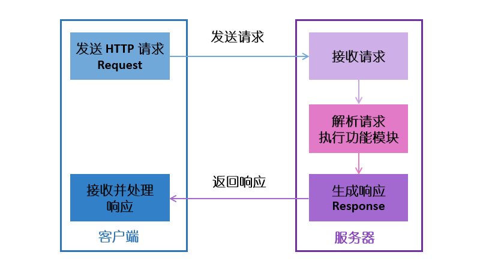

# 工作原理

 WebNet 软件包主要用于在嵌入式设备上实现 HTTP 服务器，软件包的主要工作原理基于 HTTP 协议实现。

HTTP 协议定义了客户端如何从服务器请求数据，以及服务器如何把数据传送给客户端的方式。HTTP 协议采用了`请求/响应模型`。 客户端向服务器发送一个请求报文，请求报文包含请求的方法、URL、协议版本、请求头部和请求数据。服务器通过解析请求头部信息，执行相应的功能模块，并且给客户端发送响应数据，响应数据的内容包括协议的版本、成功或者错误代码、服务器信息、响应头部和响应数据。

在 HTTP 协议的实际使用过程中，一般遵循以下流程：

1. 客户端连接到服务器

    通常是通过 TCP 三次握手建立 TCP 连接，WebNet 中默认的连接端口号为 80。

2. 客户端发送 HTTP 请求

    通过 TCP 套接字，客户端向 WebNet 发送一个请求报文，一个请求报文由请求行、请求头部、空行和请求数据四部分组成

3. 服务器接收请求并解析数据信息

    服务器接收到客户端的请求后，开启解析请求信息，定位服务器上请求的资源文件，然后向客户端发送响应数据，由客户端读取。一个响应数据由状态行、响应头部、空行和响应数据四部分组成。

4. 客户端和服务器断开连接

    若客户端和服务器之间连接模式为普通模式，则服务器主动关闭 TCP 连接，客户端被动关闭连接，释放 TCP 连接。若连接模式为 keepalive 模式，则该连接保持一段时间，在该时间内可以继续接收数据。

