# 综合演示例程

本例程作为综合例程，在 IoT Board 上演示了 RT-Thread 传感器驱动、文件系统、网络、配网、低功耗等功能，并通过 LCD 显示、按键输入与用户交互，在每个 LCD 界面展示不同的功能。

下面表格是每个界面的功能概览：

| 界面序号 | 界面标题 | 功能 | 说明 |
| ------   | -----    | --- |   ---|
| 0  | startup        | 启动界面 | RT-Thread 与 正点原子的 logo |
| 1  | IoT Board      | 主界面 | 显示 IoT Board 相关软硬件的版本信息 |
| 2  | sensor         | 温湿度与光感传感器数据显示界面 | 显示温度、湿度、光感、接近感应的数据 |
| 3  | 6-axis sensor  | 六轴传感器数据展示界面 | 显示六轴传感器的数据 |
| 4  | BEEP/MOTOR/RGB | 蜂鸣器/电机/RGB 控制界面 | 按键控制蜂鸣器/电机/ RGB 灯 |
| 5  | SD card        | SD 卡数据展示界面 | 扫描 sd 卡的内容，显示文件目录 |
| 6  | Infrared       | 红外数据展示界面 | 展示红外自发自收数据 |
| 7  | Music          | wav 音频播放控制界面 | 控制播放 wav 音频 |
| 8  | WiFi Scan      | WiFi 扫描界面 | 显示扫描到的 wifi ssid  |
| 9  | WeChat Scan    | 微信扫面二维码配网界面 | 用户可使用微信扫二维码，为 IoT Board 配置网络 |
| 10 | WiFi Config    | WiFi 配置等待界面 | 等待 wifi 连接成功 |
| 11 | NetInfo        | 网络信息展示界面 | IoT Board 联网成功后展示公网 IP 和 网络时间 |
| 12 | RT-Thread Cloud Scan & Config | RT-Thread Cloud 云平台扫码配置界面 | 需要设备先接入网络才会展示，通过微信扫码配置 |
| 13 | Low Power      | 低功耗演示界面 | 20s 倒计时进入低功耗模式，熄屏后只能按 wk_up 按键才能唤醒 |

## 硬件说明

IoT Board 的原理图位于： `RT-Thread_IoT_SDK/docs/board/Pandora_STM32L4_Board_V2.4_SCH.pdf`。

## 软件说明

iot_board_demo 综合例程位于 `/examples/30_iot_board_demo` 目录下，重要文件摘要说明如下所示：

| 文件                       | 说明 |
| -----                      | ----- |
| **applications**           | 应用 |
| applications/main.c        | 应用程序入口 |
| **packages**               | 依赖的 RT-Thread 软件包 |
| packages/aht10-v1.0.0      | 温湿度传感器软件包 |
| packages/ap3216c-v1.0.0    | 光强度传感器软件包 |
| packages/EasyFlash-v3.2.1  | 轻量级 Flash 适配软件包 |
| packages/fal-v0.2.0        | Flash 抽象层软件包 |
| packages/icm20608-v1.0.0   | 六轴传感器软件包 |
| packages/netutils-v1.0.0   | 网络小工具集合软件包 |
| packages/stm32_sdio-v1.0.0 | STM32 平台 SDIO 控制器驱动软件包 |
| **ports**                  | 移植文件 |
| ports/cloudsdk             | RT-Thread Cloud 云平台相关的软件移植 |
| ports/easyflash            | EasyFlash 软件包相关软件的移植 |
| ports/fal                  | fal 软件包必要的软件移植 |
| ports/wifi                 | wifi 功能组件必要的软件移植 |
| **modules**                | IoT Board 综合例程核心的软件模块 |
| modules/event              | 综合例程事件分发处理模块 |
| modules/infrared           | 综合例程红外自发自收处理模块 |
| modules/iotb_workqueue     | 综合例程工作队列模块 |
| modules/key                | 综合例程按键处理模块 |
| modules/lcd                | 综合例程 LCD 显示屏模块 |
| modules/player             | 综合例程 wav 音频播放模块 |
| modules/sensor             | 综合例程传感器处理模块 |
| modules/ymodem             | 综合例程 ymodem OTA 升级模块 |

**程序入口：**

```c
int main(void)
{
    /* 显示启动页 */
    iotb_lcd_show_startup_page();

    /* 在 SD 卡上挂载文件系统 */
    if (iotb_sensor_sdcard_fs_init() != RT_EOK)
    {
        LOG_E("Init sdcard fs failed!");
    }

    /* 初始化 WIFI */
    if (iotb_sensor_wifi_init() != RT_EOK)
    {
        if (iotb_sdcard_wifi_image_upgrade() != RT_EOK)
        {
            /* 使用 'ymodem start' 命令升级 WIFI 固件 */
            LOG_E("sdcard upgrad 'wifi image' failed!");
            LOG_E("Input 'ymodem_start' cmd to try to upgrade!");
            lcd_set_color(BLACK, WHITE);
            lcd_clear(BLACK);
            lcd_show_string(0, 120 - 26 - 26, 24,  "SDCard upgrade wifi");
            lcd_show_string(0, 120 - 26, 24,  " image failed!");
            lcd_show_string(0, 120, 24,  "Input 'ymodem_start'");
            lcd_show_string(0, 120 + 26, 24,  "cmd to upgrade");
            return 0;
        }
    }

    /* 检测是否存在字库 */
    if (iotb_partition_fontlib_check() != RT_EOK)
    {
        if (iotb_sdcard_font_upgrade() == (-RT_EEMPTY))
        {
            lcd_set_color(BLACK, WHITE);
            lcd_clear(BLACK);
            lcd_show_string(0, 100, 24, "No font partition  ");
            lcd_show_string(0, 100 + 26, 24, "Using ST-Utility  ");
            lcd_show_string(0, 100 + 26 + 26, 24, "Flash new bootloader");
            rt_thread_mdelay(2000);
            return 0;
        }
        else if (iotb_sdcard_font_upgrade() == (-RT_ERROR))
        {
            LOG_E("sdcard upgrad 'font library' failed!");
            LOG_E("Input 'ymodem_start' cmd to try to upgrade!");
            lcd_set_color(BLACK, WHITE);
            lcd_clear(BLACK);
            lcd_show_string(0, 120 - 26 - 26, 24, "SDCard upgrade font");
            lcd_show_string(0, 120 - 26, 24, "library failed!");
            lcd_show_string(0, 120, 24, "Input 'ymodem_start'");
            lcd_show_string(0, 120 + 26, 24, "cmd to upgrade");
            rt_thread_mdelay(2000);
            return 0;
        }
    }

    /* 启动工作队列，异步处理耗时任务 */
    if (iotb_workqueue_start() != RT_EOK)
    {
        return -RT_ERROR;
    }
    iotb_workqueue_dowork(iotb_init, RT_NULL);

    /* 启动 LCD 线程，用于接收处理 menu 事件 */
    iotb_lcd_start();
    /* 启动事件处理器 */
    iotb_event_start();
    /* 启动按键处理线程 */
    iotb_key_process_start();

    return 0;
}
```

**示意图：**

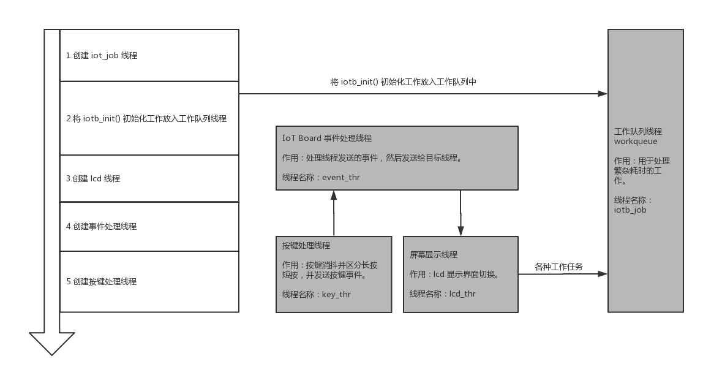

## IoT Board 综合例程使用说明

### 编译&下载

综合例程需要配合 bootloader 一起使用，因此初次使用的时候，需要用户使用 `ST-LINK Utility` 工具将 `30_iot_board_demo/bin/all.bin` 烧录到设备。

**ST-LINK Utility 烧录**

1. 解压 `/tools/ST-LINK Utility.rar` 到当前目录（解压后有 **/tools/ST-LINK Utility** 目录）
2. 打开 **/tools/ST-LINK Utility** 目录下的 **STM32 ST-LINK Utility.exe** 软件
3. 点击菜单栏的 **Target** --> **Connect** 连接到开发板，如下图所示：

    

4. 打开 **/examples/30_iot_board_demo/bin/all.bin** 文件

    

5. 烧录

    

    

烧录了 all.bin 的设备已经具备了 bootloader 功能，后面更新综合例程程序可以使用 MDK 或 IAR 直接下载的方式。

综合例程中提供的 MDK 和 IAR 工程将固件链接首地址修改到了 bootloader 之后，所以下载的程序无法直接运行，需要通过 bootloader 跳转。

- **MDK**：双击`project.uvprojx`打开 MDK5 工程，执行编译。
- **IAR**：双击`project.eww`打开 IAR 工程，执行编译。

编译完成后，将开发板的 ST-Link USB 口与 PC 机连接，然后将固件下载至开发板。

### 按键使用说明

**两个系统级按键：**

- WK_UP 按键

    在任意页面长按 WK_UP 按键，进入微信扫码配网界面。在设备进入低功耗后，单击该按键用于唤醒设备。

- KEY0 按键

    在任意页面（进入低功耗后除外）单击 KEY0 按键，进入下一页。

**其他功能按键：**

- KEY1 按键

    根据具体界面提示使用，未提示此按键功能的页面不会响应该按键事件

- KEY2 按键

    根据具体界面提示使用，未提示此按键功能的页面不会响应该按键事件

### SD 卡文件说明

综合例程在 SD 卡中需要一个必要的 `SYSTEM` 文件夹，综合例程在启动的时候会检查该目录，必要的时候进行相关固件的升级。目录结构如下：

| 目录         | 说明 |
| ---          | --- |
| SYSTEM       | 综合例程系统级目录 |
| SYSTEM/FONT  | 存放字库文件 |
| SYSTEM/MUSIC | 存放 wav 音频文件，英文命名 |
| SYSTEM/WIFI  | 存放 WiFi 固件 |

### LCD 界面说明

#### 界面0 启动界面

展示 RT-Thread 和正点原子的 LOGO。


#### 界面1 主界面

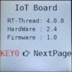

该页面用于展示综合例程使用的软硬件版本及系统信息，并提示使用 **KEY0** 按键切换到下一页。

该界面对应的函数为 `static void iotb_lcd_show_index_page(iotb_lcd_menu_t *lcd_menu);`。

#### 界面2 温湿度与光感

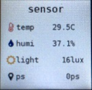

展示从温湿度传感器 aht10 ，光照强度传感器 ap3216c 接收到的数据，按下 **KEY0** 按键可以切换到下一页。

这个界面功能用到了 RT-Thread package 提供的 **aht10-v1.0.0** 与 **ap3216c-v1.0.0** 这两个软件包。软件包的详细使用说明可参考 `/examples/07_driver_temp_humi` 与 `/examples/08_driver_als_ps` 中的例程。

该界面对应的函数为 `static void iotb_lcd_show_sensor(iotb_lcd_menu_t *lcd_menu);`。

#### 界面3 六轴传感器

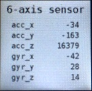

展示从六轴传感器 icm20608 接收到的数据，按下 **KEY0** 按键可以切换到下一页。

这个界面功能用到了 RT-Thread package 提供的 **icm20608-v1.0.0** 软件包。软件包的详细使用说明可参考 `/examples/09_driver_axis` 中的例程。

该界面对应的函数 `static void iotb_lcd_show_axis(iotb_lcd_menu_t *lcd_menu);`。

#### 界面4 蜂鸣器/电机/RGB

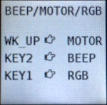

控制板载蜂鸣器、电机、 RGB 灯，按下 **KEY0** 按键可以切换到下一页。

- WK_UP 按键控制电机
- KEY0 按键控制蜂鸣器
- KEY1 按键控制 RGB 灯调色

该界面对应的函数 `static void iotb_lcd_show_beep_motor_rgb(iotb_lcd_menu_t *lcd_menu);`。

#### 界面5 SD card

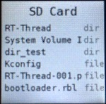

该界面首先检测 SD 是否已经插入，然后展示 SD 卡文件系统内的文件，如果 IoT Board 未插入 SD 卡，将在屏幕中央一直显示 `Insert SD card before power-on` ，综合例程不支持热拔插，请在上电前插入 SD 卡。按下 **KEY0** 按键可以切换到下一页。

更多详细的文件系统使用说明可参考例程： `/examples/11_component_fs_tf_card`

该界面对应的函数 `static void iotb_lcd_show_sdcard(iotb_lcd_menu_t *lcd_menu);`。

#### 界面6 红外收发

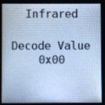

使用 NEC 协议格式编码红外数据发送出去，然后再接收编码数据解码显示。

按下 **KEY0** 按键可以切换到下一页。

该界面对应的函数 `static void iotb_lcd_show_infrared(iotb_lcd_menu_t *lcd_menu);`。相关的处理业务逻辑请参考 `/30_iot_board_demo/modules/infrared` 中的程序以及 `/example/05_basic_ir` 例程。

#### 界面7 音乐播放

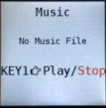

该界面用于控制播放 SD 卡 `SYSTEM/MUSIC` 目录下的 wav 音频文件，只播放扫描到的最多三首歌曲，不支持中文命名的音频文件。

按下 **KEY1** 按键可以控制播放和停止。

按下 **KEY0** 按键可以切换到下一页。

该界面对应的函数 `static void iotb_lcd_show_music(iotb_lcd_menu_t *lcd_menu);`。音频相关的处理业务逻辑请参考 `/30_iot_board_demo/modules/player` 中的程序

#### 界面8 WiFi 扫描

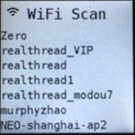

使用设备上的 WiFi 模块扫描附近的 WiFi 热点，并在 LCD 上展示扫描到的 WiFi SSID。

按下 **KEY0** 按键可以切换到下一页。

该界面对应的函数 `static void iotb_lcd_show_wifiscan(iotb_lcd_menu_t *lcd_menu);`。

#### 界面9 微信扫码配网


只有在设备没有成功接入过网络的情况下会展示该页面，等待用户使用微信扫描二维码进行网络配置。设备成功接入网络后，不再显示该页面。

手机扫描二维码前，请设置手机接入 2.4G 频段的路由器热点。然后使用微信扫一扫扫描二维码，在微信中输入当前手机连入 wifi 的密码，点击 `连接`即可。IoT Board 会接收到 wifi 的广播信息自动连接到这个 WiFi 网络。

**注意：** 如果希望重新配置网络，请在任意页面下长按 WK_UP 按键约 6 秒。

按下 **KEY0** 按键可以切换到下一页。

手机配置步骤：

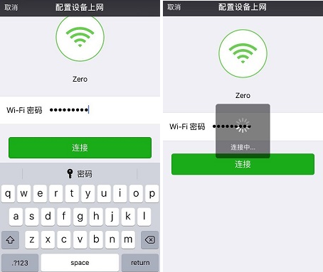

该界面对应的函数 `static void iotb_lcd_show_wechatscan(iotb_lcd_menu_t *lcd_menu);`。

#### 界面10 等待 WiFi 连接成功


当 IoT Board 接收到 wifi 路由器的配网信息后，将会自动接入 wifi，接入成功后会保存 wifi 账号（以便下次开机自动连接此 wifi）并自动退出该界面。

该界面对应的函数 `static void iotb_lcd_show_wificonfig(iotb_lcd_menu_t *lcd_menu);`。

#### 界面11 网络信息展示界面

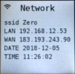

| 名称 | 说明 |
|---|---|
| ssid | 当前连接的 wifi 名称 |
| LAN | 设备 ip 地址 |
| WAN | 公网 ip 地址 |
| DATE | 年月日 |
| TIME | 时分秒 |

这里展示了 SSID、LAN、WAN、DATE、TIME 信息。按下 **KEY0** 按键可以切换到下一页。

该界面对应的函数 `static void iotb_lcd_show_network(iotb_lcd_menu_t *lcd_menu);`。

#### 界面12 扫描绑定设备到 RT-Thread 云平台

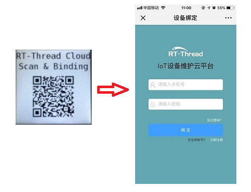

如果设备已经正确接入网络，且没有被绑定过，则会在 LCD 菜单中展示该页面。用户需要使用手机扫描二维码（可以使用微信扫码）进入设备绑定页面，正确填写在 RT-Thread Cloud 平台注册的账户和密码既可以完成设备绑定。

设备成功被绑定后，会展示 `device online`，请在 `iot.rt-thread.com` 网站查看设备详细信息，如下图所示：


#### 界面13 低功耗演示界面


20s 倒计时结束后进入低功耗模式，或者在未进入低功耗模式前按下 **KEY0** 按键可以切换到界面1，如果已经进入低功耗模式，只能使用 wk_up 按键唤醒，无法进行其他操作。

该界面对应的函数 `static void iotb_lcd_show_lowpower(iotb_lcd_menu_t *lcd_menu);`。

## 注意事项

**低功耗模式下，无法烧录程序，可以按 WK_UP 按键唤醒 IoT Board 之后再烧录程序，或者按住复位键下载，才能成功。如果希望重新配置网络，请在任意页面下长按 WK_UP 按键。**

## 引用参考

- 《RT-Thread 编程指南》: docs/RT-Thread 编程指南.pdf
