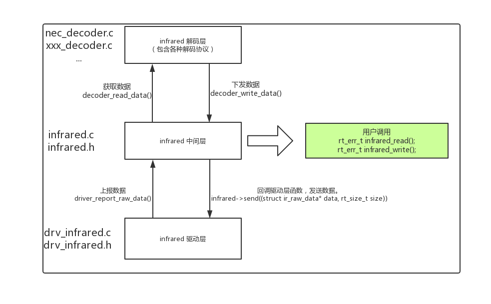

# 红外框架

## 简介

红外框架，基于 `rt-thread` 的 `pin` , `hwtimer` 和 `pwm` 驱动实现的红外框架。

## 驱动框架

 

### 目录结构

infrared 软件包目录结构如下所示：

```c 
infrared
├───docs                            // 文档
├───inc                             // 头文件
├───src                             // 源文件				
│───LICENSE                         // 软件包许可证
│───README.md                       // 软件包使用说明
└───SConscript                      // RT-Thread 默认的构建脚本
```

###  许可证

infrared 软件包遵循 Apache-2.0 许可，详见 LICENSE 文件。

### 获取软件包

使用 infrared 软件包需要在 RT-Thread 的包管理中选中它，具体路径如下：

```c
RT-Thread online packages
    peripheral libraries and drivers  --->
         [*] infrared : infrared is base on rt-thread pin,hwtimer and pwm.  --->
             Select infrared decoder  --->
             [ ] infrared send enable
             [ ] infrared receive enable
                 Version (latest)  --->
```

### 使用示例

```c
    /* 选择解码器 */
    ir_select_decoder("nec");
    while (1)
    {
        /* 读取数据 */
        if(user_read_api("nec",&infrared_data) == RT_EOK)
        {
            if(infrared_data.data.nec.repeat)
            {
                rt_printf("repeat%d\n",infrared_data.data.nec.repeat);
            }
            else
            {
                rt_printf("APP addr:0x%02X key:0x%02X\n",infrared_data.data.nec.addr,infrared_data.data.nec.key);
                /* 发送数据 */
                user_write_api("nec",&infrared_data);
            }
        }

        rt_thread_mdelay(10);

    }
```

### 联系方式 & 感谢

- 维护：RT-Thread 开发团队
- 主页：https://github.com/RT-Thread-packages/infrared_framework
