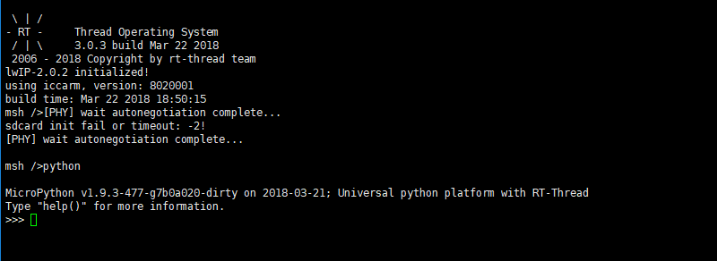
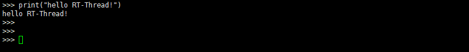
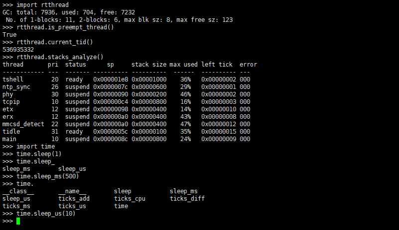

# RT-Thread MicroPython 快速上手

## 开始使用 MicroPython

> **注意**：RT-Thread MicroPython 需要运行在 **RT-Thread 3.0** 版本以上。

### 选择合适的 BSP 平台

RT-Thread MicroPython mini 版本占用资源最大不超过：

- 1、ROM : 190KB
- 2、RAM :  8KB

常见的许多开发板都可以运行 MicroPython，如 `stm32f10x` 、`stm32f40x` 、`stm32f429-apollo`、`imxrt1052-evk`  、`iot-camera` 等。 

### MicroPython 软件包的安装

- MicroPython 软件包可以通过 env 工具在线下载获得。在下载 MicroPython 软件包前，建议使用 `pkgs --upgrade` 命令更新软件包列表，并且在配置版本时勾选 `latest` 版本，如图：


- 使用 env 下载 MicroPython 软件包的方法请参考: [`RT-Thread env 工具使用手册`](https://www.rt-thread.org/document/site/rtthread-development-guide/rtthread-tool-manual/env/env-user-manual/)

### 选择开发环境

- 目前 MicroPython 支持三种开发环境，分别为 `MDK / IAR / GCC`，选择合适的开发环境，使用 env 工具将 MicroPython 软件包开启后，需重新生成工程，再进行编译、下载。

### 运行 MicroPython

- 在 Finsh/MSH 命令行内输入 `python` 即可进入 MicroPython 的交互命令行 REPL(Read-Evaluate-Print-Loop)，可在终端看到如下界面：



使用 `Ctrl-D` 或输入 `quit()` 以及 `exit()`  即可退出 REPL ，回到 RT-Thread Finsh/MSH。

## MicroPython 基本功能 
### Python 语法与内建函数 

#### 使用 python 交互命令行 

- MicroPython 是 Python 3 编程语言的一种精简而高效的实现，语法和 Python 3 相同，并带有丰富的内建函数，使用 MicroPython 交互命令行即可运行 Python 代码：



#### 交互命令行的粘贴模式

- `MicroPython`  比一般的 python 交互环境多了一个特别的**粘贴模式**，可以一次粘贴输入多行 python 代码。
- 在命令行提示符状态下，按下 `Ctrl-E` 组合键，就会出现提示：`paste mode; Ctrl-C to cancel, Ctrl-D to finish` 。粘贴需要运行的代码后，按下 `Ctlr-D` 即可退出粘贴模式，同时输入的代码也会自动执行。
- 程序正在执行时，如果想取消，可以使用 `Ctrl-C`。

输入代码：

```python
for i in range(1,10):
    print(i)
```

执行效果如下：


### MicroPython 内建模块

- MicroPython 提供丰富的内建模块用来完成相关的程序功能。同时 RT-Thread  也提供了 `rtthread` 模块用来返回系统运行相关的信息。
- 以 `rtthread` 和 `time` 模块为例，调用方式如下：



!!! tip "提示"
     默认下载的 MicroPython  软件包为 mini 版本，为 RT-Thread 推出的最小版本的 MicroPython ，如果想使用更多的 MicroPython 模块，可以在 menuconfig 配置项中打开更多的模块选项。

## MicroPython 例程

通过 MicroPython 可以用非常简单的方式来控制开发板的硬件资源，下面用两个例子来说明：

以下例程运行在 `i.MX RT1050 开发板 `上，运行之前需要开启 RT-Thread  `Pin 设备`功能。

### 闪烁灯

- i.MX RT1050 开发板中: [第 52 号 pin](https://github.com/RT-Thread/rt-thread/blob/8ed3470d2a485c49ec4f5d4a5ec53e94edf7a2c8/bsp/imxrt1052-evk/drivers/drv_pin.c#L105) 为 LED D18，与 phy 复位引脚共用

```python
import time
from machine import Pin

LED = Pin(("LED1", 52), Pin.OUT_PP)          #将第52号 Pin 设备设置为输出模式
while True:
    LED.value(1)
    time.sleep_ms(500)
    LED.value(0)
    time.sleep_ms(500)
```

针对自己的开发板修改引脚号，将以上脚本使用 3.1.2 章节介绍的**粘贴模式**输入，即可看到 LED 灯按照指定的频率闪烁。使用 `Ctrl-C` 可以取消当前正在运行程序。

### 按键灯

- i.MX RT1050 开发板中: [第 125 号 pin](https://github.com/RT-Thread/rt-thread/blob/8ed3470d2a485c49ec4f5d4a5ec53e94edf7a2c8/bsp/imxrt1052-evk/drivers/drv_pin.c#L184) 为 SW8

```python
from machine import Pin

led = Pin(("LED1", 52), Pin.OUT_PP)
key = Pin(("KEY", 125), Pin.IN, Pin.PULL_UP) #将第125号 Pin 设备设置为上拉输入模式
while True:
    if key.value():
        led.value(0)
    else:
        led.value(1)
```

针对自己的开发板修改引脚号，使用**粘贴模式**输入以上脚本，即可通过按键 KEY 控制 LED 灯的亮灭。
