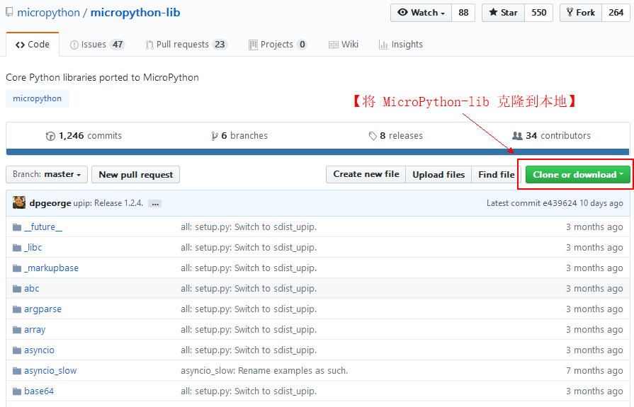
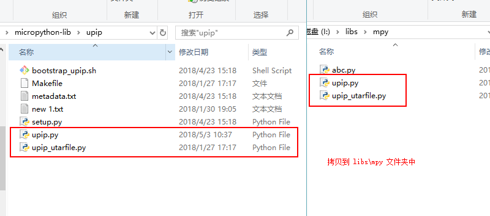

# RT-Thread MicroPython 包管理

MicroPython 自身不像 CPython 那样拥有广泛的标准库。但是 MicroPython 有一个相关且独立的项目 micropython-lib，它提供了来自 CPython 标准库的许多模块的实现。由于 RT-Thread 操作系统提供了很好的 `POSIX` 标准支持，所以 micropython-lib 中很多模块可以在 RT-Thread MicroPython 上直接运行。这篇文章将介绍如何利用这些扩展模块来增强 MicroPython 的功能。

## 1. 使用 micropython-lib 源代码 

### 1.1 从 GitHub 上克隆/下载 [micropython-lib](https://github.com/micropython/micropython-lib) 的源代码到本地

### 1.2 使用扩展包

如使用 abc 扩展包，就可以将 abc 文件夹中除了 metadata.txt 和 setup.py 的内容(不同模块有所不同，如果想避免出错，可以直接将 abc 文件夹中的内容全部复制过去即可)复制到 SD 卡（文件系统）的 /libs/mpy  目录下：

现在就可以在 MicroPython 交互命令行中导入 abc 模块了。

!!! note "注意"  
    当安装的模块依赖于其他模块的功能时，需要先安装依赖的模块。这时候就需要搞清楚依赖的模块有哪些，然后依次安装依赖的模块。

## 2. upip 包管理器的使用 

upip 是 MicroPython 的包管理程序，由于 RT-Thread 操作系统提供了很好的 `POSIX` 标准支持，所以 `upip` 可以很好地运行在 RT-Thread MicroPython 上。使用 `upip` 工具可以在线下载 MicroPython 的扩展模块，并且自动下载其依赖的模块，为用户扩展 MicroPython 功能提供了很大的便利。 

upip 包管理器对系统资源的占用较大，推荐在有较多系统资源的开发板上使用 upip。使用 upip 可以按照下面的步骤来进行配置：

- 将 micropython-lib 中 upip 文件夹下的所需内容拷贝到 SD 卡（文件系统）的 /libs/mpy 目录下：

- 在 env 中 开启 MicroPython  网络模块中的 ussl 模块。

- 修改软件包中安全类的 mbedtls 软件包 Maxium fragmenty length in bytes 参数为 5120。

- 更新软件包并重新生成工程，重新编译并下载固件到开发板然后再运行。 至此，模块就被成功下载到 /libs/mpy  文件夹下，可以直接使用了。  

除了 micropython-lib 中提供的之外，更多 MicroPython 模块可以到 [pypi 搜索](https://pypi.org/search/?q=micropython-) 中查找。

!!! note "注意"  
    下载指定模块时，需要在模块前加上 `micropython-` 前缀。如想要安装 json 模块，使用 `upip.install("micropython-json")` 命令。
