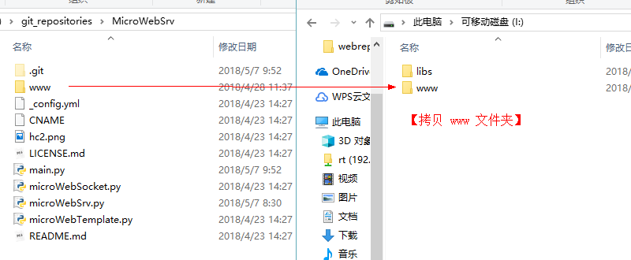
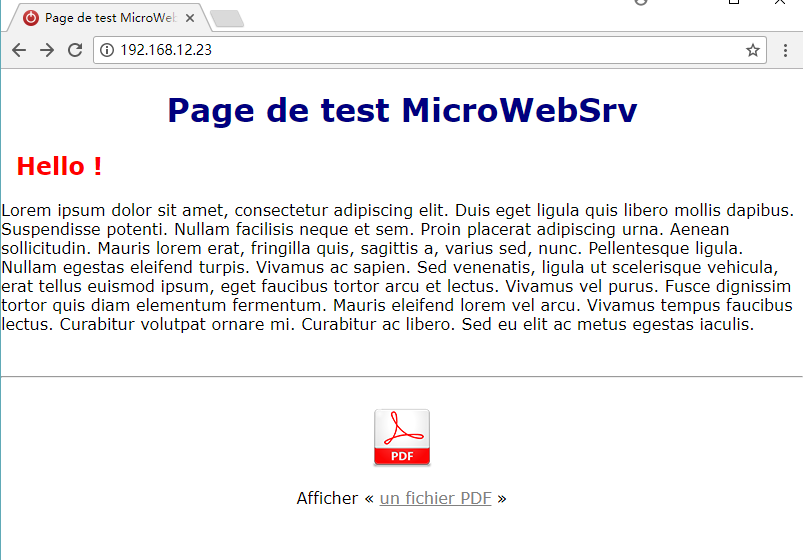
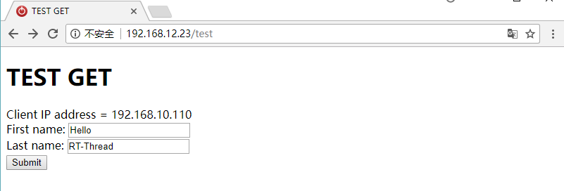
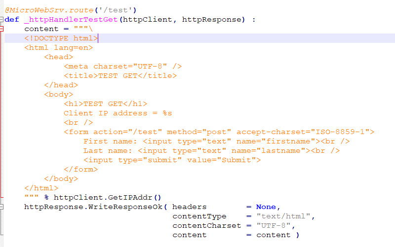

## HttpServer

本章介绍如何使用 RT-Thread MicroPython 搭建一个 Web 服务器，需要使用到的模块为 MicroWebSrv 模块。

### 获取并安装 MicroWebSrv 模块

- 首先从 `https://github.com/jczic/MicroWebSrv.git` 将相关文件克隆到本地。

- 将 `www` 文件夹拷贝到文件系统的根目录(这里将 SD 卡作为开发板文件系统的根目录)。

- 把其他文件拷贝到 /libs/mpy/ 文件夹中。

- 这样 MicroWebSrv 模块就安装好了，可以在 MicroPython 交互命令行中直接使用 `import` 命令导入了。

### MicroWebSrv 模块的使用

- 在 MSH 中，使用 ifconfig 命令查看开发板 IP 地址。

- 输入 python 命令，进入 MicroPython 交互命令行。

- 使用 import main 命令，启动 Web 服务器。

- 打开浏览器，在地址栏输入开发板 IP 地址并回车，即可看到 Web 页面。

- 输入网址 ip/test 使用表格填写示例。

如下代码完成了这个表格的获取功能：

- 点击 Submit，服务器返回你填写的信息。

如下代码完成了数据的推送功能：

### 服务器功能的修改

- 如果想过要通过服务器实现自己所需的功能，可以修改 main.py 文件，导入更多模块，使用 Python 语言来添加更多功能。

- 在网页中展示加速度计和磁力计的例程中，下面的代码完成了这些数据的返回功能，可以参考 WebServer 的例子来对 main.py 进行修改，以达到自己想要完成的功能。

