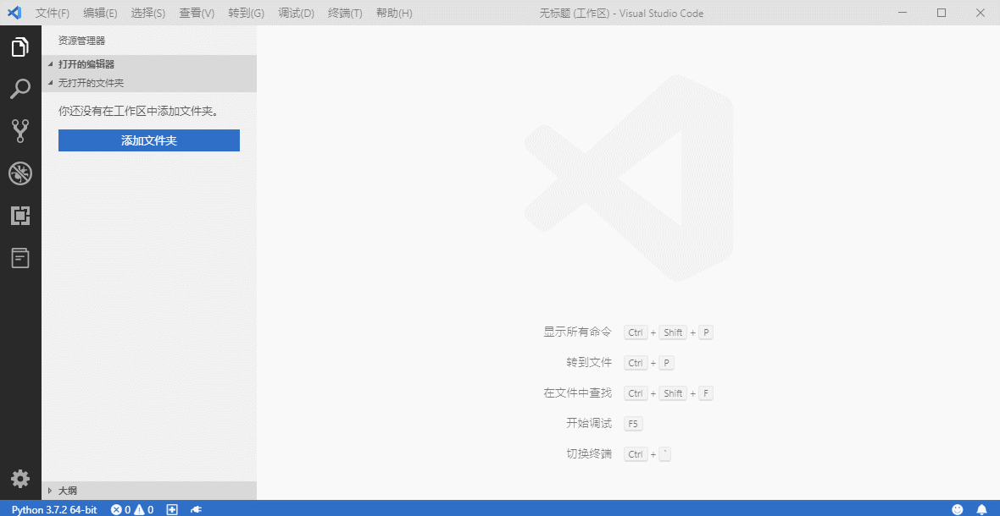
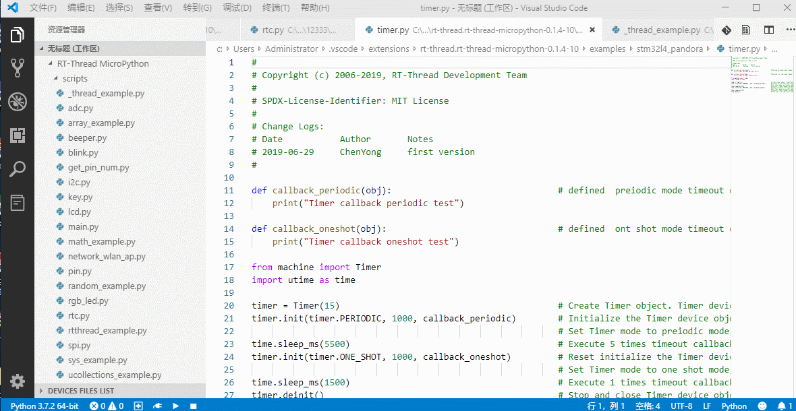
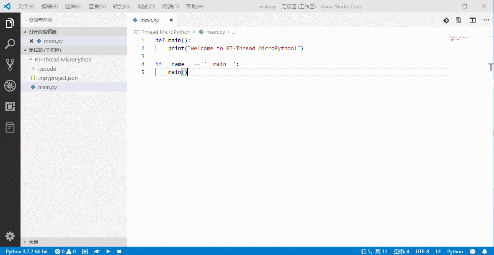
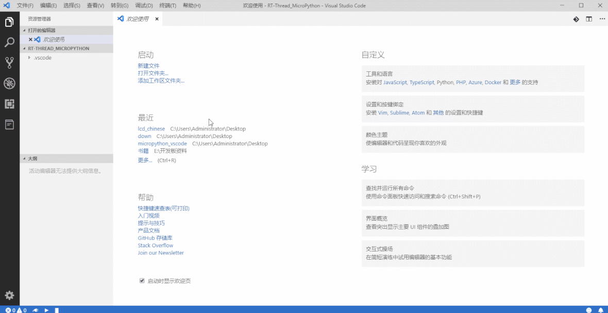
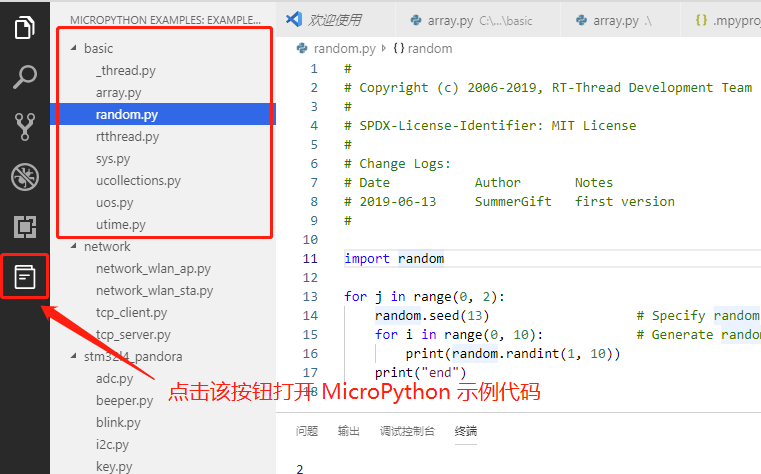
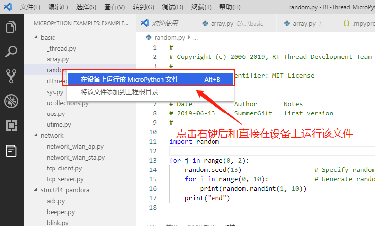
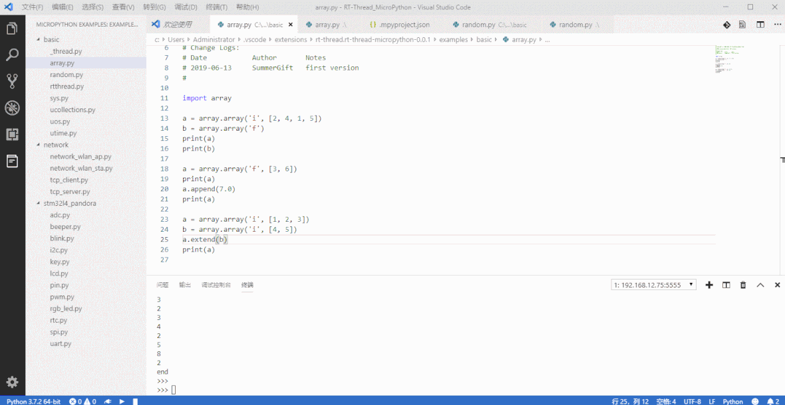
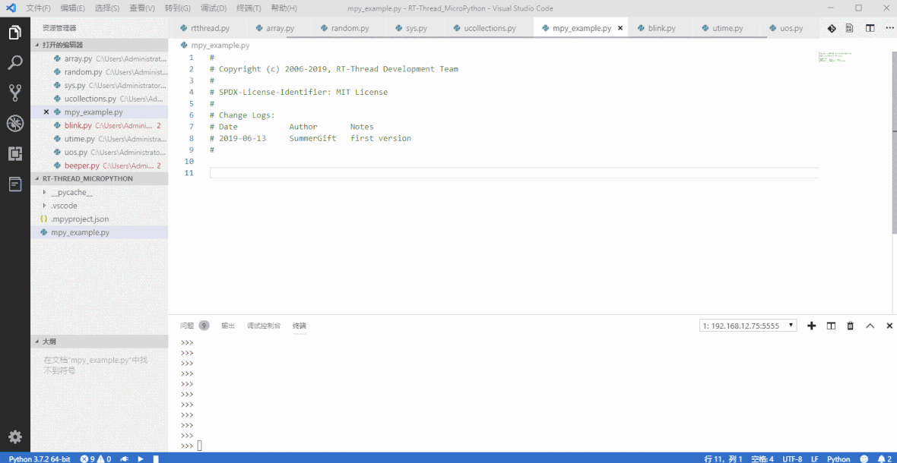

# VSCode 最好用的 MicroPython 插件

VSCode 最好用的 MicroPython 插件，为 MicroPython 开发提供了强大的开发环境，主要特性如下：

- 支持通过网络连接远程调试
- 支持网络、USB 或串口的方式连接开发板
- 支持基于 MicroPython 的代码智能补全
- 支持 MicroPython REPL 交互环境
- 提供丰富的代码示例
- 支持自动同步工程代码
- 支持在设备上运行示例代码
- 支持运行选中的代码片段
- 支持多款 MicroPython 开发板

## 准备工作

本插件依赖 Microsoft Python 插件，并且使用 Python 脚本，因此需要做如下准备：

1. 安装 Microsoft Python 插件

2. 按照 Python 插件的提示在 PC 上安装 Python3 并加入到系统环境变量中

如果在 PC 上已经安装过上述插件和程序，可以跳过此准备步骤。

## 快速入门

### 创建一个 MicroPython 工程

### 连接开发板

可以通过多种方式与开发板建立连接，现支持 USB 和网络连接方式。

- 串口连接方式

- USB 连接方式

直接将开发板通过 USB 连接到 PC 机，将会自动通过 USB 连接设备，如下图所示：

- 网络连接方式

点击连接按钮，然后选择想要连接的设备名称，如下图所示：

注意：第一次连接网络时请先用 USB 或者串口连接电脑，然后参考 network 例程进行网络连接。

### 运行示例代码

和开发板建立连接后，可以直接运行示例代码，并观察代码在开发板上的运行效果，如下图所示：

## 功能介绍

- 通过网络、USB 或串口的方式连接开发板

- 提供丰富的 MicroPython 代码示例程序

- 支持在设备上直接运行示例代码

- 支持运行代码片段

- 支持 STM32L4 Pandora IoT Board 、W601 IoT Board 等多款开发板
- 优秀的代码编辑环境
- 基于 MicroPython 的代码智能补全

## 注意事项

- 请选择 PowerShell 作为默认终端

在 PowerShell 终端中输入 `Set-ItemProperty HKCU:\Console VirtualTerminalLevel -Type DWORD 1` 可以解决退格键等显示乱码的问题。

- 不要删除工程目录下的 `.mpyproject.json` 文件

该文件是 MicroPython 工程的配置文件，删除后将无法正常运行 MicroPython 代码程序。

  