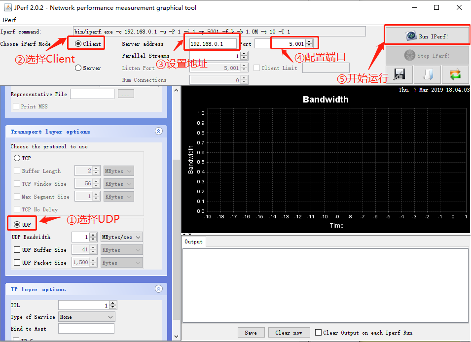
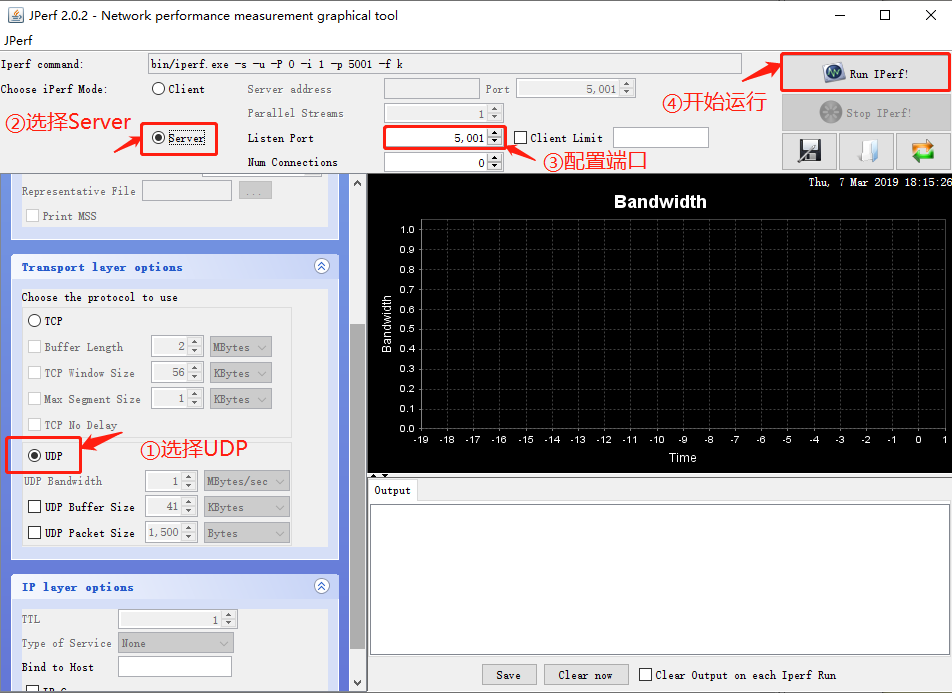

# iperf：网络带宽测试工具 

## 1、介绍

[iperf](https://baike.baidu.com/item/iperf) 是一个网络性能测试工具。iperf 可以测试最大 TCP 和 UDP 带宽性能，具有多种参数和 UDP 特性，可以根据需要调整，可以报告带宽、延迟抖动和数据包丢失。 

## 2、使用

iperf 使用的是主从式架构，即一端是服务器，另一端是客户端，我们提供的 iperf 组件包实现了 TCP 服务器模式和客户端模式，暂不支持 UDP 测试。下面将具体讲解 2 种模式的使用方法。

### 2.1 iperf 服务器模式

#### 2.1.1 获取 IP 地址

需要在 RT-Thread 上使用 Finsh/MSH 命令来获取 IP 地址，大致效果如下：

```
msh />ifconfig
network interface: e0 (Default)
MTU: 1500
MAC: 00 04 9f 05 44 e5 
FLAGS: UP LINK_UP ETHARP
ip address: 192.168.12.71
gw address: 192.168.10.1
net mask  : 255.255.0.0
dns server #0: 192.168.10.1
dns server #1: 223.5.5.5
```

- 记下获得的 IP 地址 192.168.12.71（按实际情况记录）

#### 2.1.2 启动 iperf 服务器 

需要在 RT-Thread 上使用 Finsh/MSH 命令来启动 iperf 服务器，大致效果如下： 

tcp 模式

```
msh />iperf -s -p 5001
```

udp 模式

```
msh />iperf -u -s -p 5001
```

- -s 表示作为服务器启动
- -p 表示监听 5001 端口

#### 2.1.3 安装 JPerf 测试软件

安装文件位于 `/tools/jperf.rar` ，这个是绿色软件，安装实际上是解压的过程，解压到新文件夹即可。 

#### 2.1.4 进行 jperf 测试

打开 `jperf.bat`软件，按如下操作进行配置： 

- 选择 `Client` 模式
- 输入刚刚获得的 IP 地址 192.168.12.71（按实际地址填写）
- 修改端口号为 5001
- 点击 `run Lperf!` 开始测试 
- 等待测试结束。测试时，测试数据会在 shell 界面和 JPerf 软件上显示。

tcp 模式软件设置


udp 模式软件设置



### 2.2 iperf 客户端模式

#### 2.2.1 获取 PC 的 IP 地址

在 PC 的命令提示符窗口上使用 ipconfig 命令获取 PC 的 IP 地址，记下获得的 PC IP 地址为 192.168.12.45（按实际情况记录）。

#### 2.2.2 安装 JPerf 测试软件

安装文件位于 `/tools/jperf.rar` ，这个是绿色软件，安装实际上是解压的过程，解压到新文件夹即可。 

#### 2.2.3 开启 jperf 服务器

打开 `jperf.bat`软件，按如下操作进行配置： 

- 选择 `Server` 模式
- 修改端口号为 5001
- 点击 `run Lperf!` 开启服务器

#### 2.2.4 启动 iperf 客户端

需要在 RT-Thread 上使用 Finsh/MSH 命令来启动 iperf 客户端，大致效果如下： 

tcp 模式

```
msh />iperf -c 192.168.12.45 -p 5001
```

udp 模式

```
msh />iperf -u -c 192.168.12.45 -p 5001
```

- -c 表示作为客户端启动，后面需要加运行服务器端的pc的 IP 地址
- -p 表示连接 5001 端口
- 等待测试结束。测试时，测试数据会在 shell 界面和 JPerf 软件上显示。

tcp 模式软件设置


udp 模式软件设置


