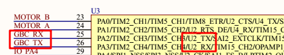
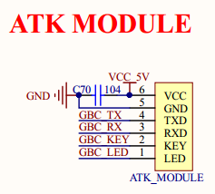
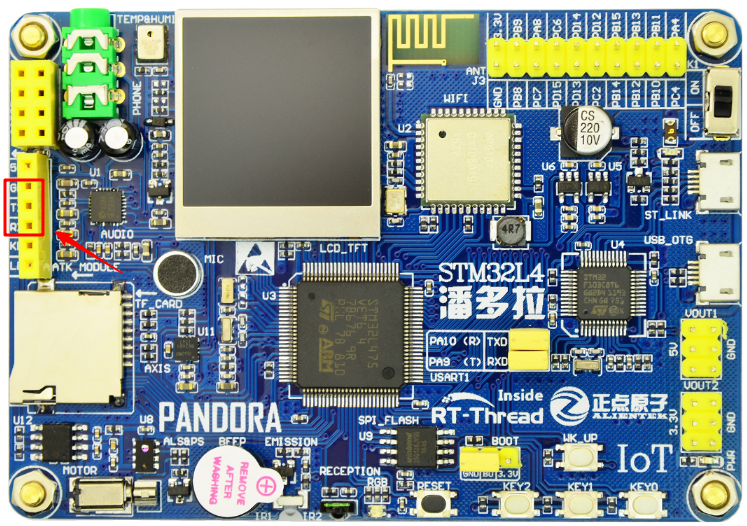
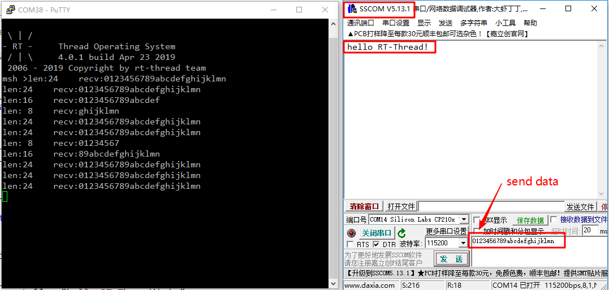

# 串口 DMA 接收例程

## 简介

本例程的主要功能是串口使用 DMA 接收及轮询发送的方式收发数据。

## 硬件说明





如上图所示，串口 2 的 RX 和 TX 引脚分别连接了 ATK MODULE 的 TX 和 RX，可以使用 USB 转串口模块连接此串口和 PC。

ATK MODULE 的 RX 和 TX 在开发板中的位置如下图所示：



## 软件说明

示例代码位于 `/examples/32_driver_uart_dma/applications/main.c` 中。

代码首先定义了串口名称宏，然后定义了接收回调函数，当数据接收完成触发中断时会运行此回调函数。回调函数会通过串口设备 serial 读取接收到的数据，数据大小为 size，然后通过控制台打印数据。

```c
/* 串口设备名称 */
#define UART_NAME       "uart2"

/* 接收数据回调函数 */
static rt_err_t uart_input(rt_device_t dev, rt_size_t size)
{
    rt_uint32_t rx_length;
    char rx_buffer[RT_SERIAL_RB_BUFSZ + 1];
    
    /* 从串口读取数据*/
    rx_length = rt_device_read(dev, 0, rx_buffer, size);
    rx_buffer[rx_length] = '\0';

    /* 通过控制台打印数据 */
    rt_kprintf("len:%2d    recv:%s\n",size,rx_buffer);

    return RT_EOK;
}
```

下面代码是 main 函数中是串口设备启动代码，代码首先查找串口设备，如果查找到串口设置 则以 DMA 接收及轮询发送方式打开串口设备，并设置串口接收回调函数，然后使用串口设备发送一串字符“hello RT-Thread!”。

```c
int main(void)
{
    rt_device_t serial;
    char str[] = "hello RT-Thread!\r\n";

    /* 查找串口设备 */
    serial = rt_device_find(UART_NAME);
    if (!serial)
    {
        LOG_E("find uart device failed!\n");
    }
    else
    {
        /* 以 DMA 接收及轮询发送方式打开串口设备 */
        rt_device_open(serial, RT_DEVICE_FLAG_DMA_RX);
        /* 设置接收回调函数 */
        rt_device_set_rx_indicate(serial, uart_input);
        /* 发送字符串 */
        rt_device_write(serial, 0, str, (sizeof(str) - 1));
    }

    return 0;
}
```

## 运行

### 编译 & 下载

- **MDK**：双击 `project.uvprojx` 打开 MDK5 工程，执行编译。
- **IAR**：双击 `project.eww` 打开 IAR 工程，执行编译。

编译完成后，将开发板的 ST-Link USB 口与 PC 机连接，USB 转串口模块连接 ATK MODULE 的 GND、RX、TX 引脚，并连接 PC 机，然后将固件下载至开发板。

### 运行效果

在 PC 端使用终端工具打开开发板的 ST-Link 提供的虚拟串口，设置参数为 115200 8 1 N 。按下复位按键重启开发板，正常运行后开发板的运行日志信息会在虚拟串口输出。

使用终端工具打开 USB 转串口，设置参数为 115200 8 1 N，推荐使用可以一次性发送一批数据的终端软件，如 SSCOM 等，方便观察实验现象。程序开始运行后在 USB 转串口的终端可以看到输出的字符串 “hello RT-Thread!”，通过终端工具发送字符串 “0123456789abcdefghijklmn”，控制台会打印每次接收到的数据和数据长度，实验现象如下所示：



串口使用中断接收模式时每接收到一个字符都会触发中断并调用回调函数，而串口使用 DMA 接收模式时会在一批数据接收完成后才触发中断，此时可以一次性读取一批数据。

## 注意事项

ST-Link 提供的虚拟串口连接的是串口 1，并用于控制台输出，所以需要使用另外一个串口用于示例代码运行方便观察现象。

## 引用参考

- 《RT-Thread 编程指南》: docs/RT-Thread 编程指南. pdf
- [《RT-Thread 文档中心：UART 设备》](https://www.rt-thread.org/document/site/programming-manual/device/uart/uart/)